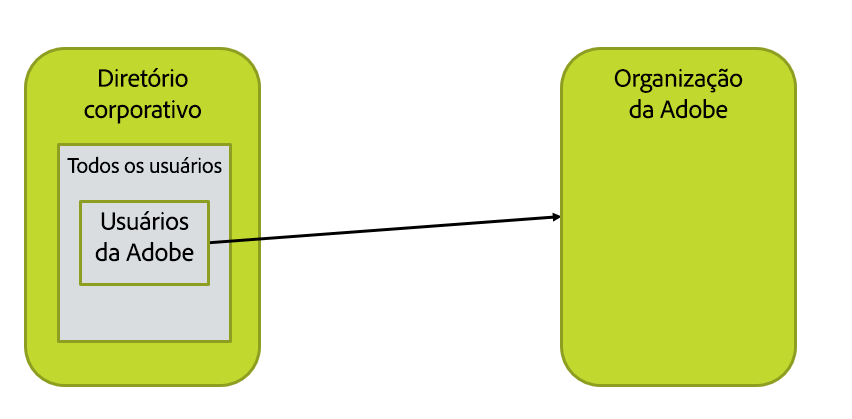
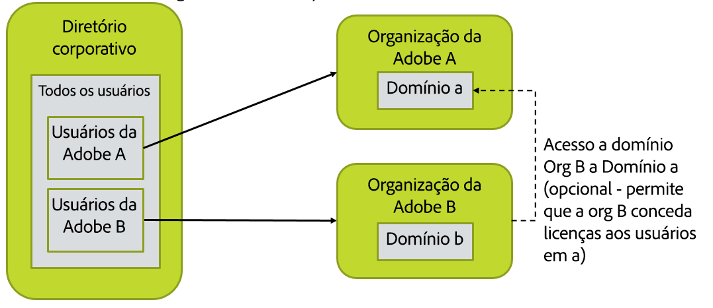
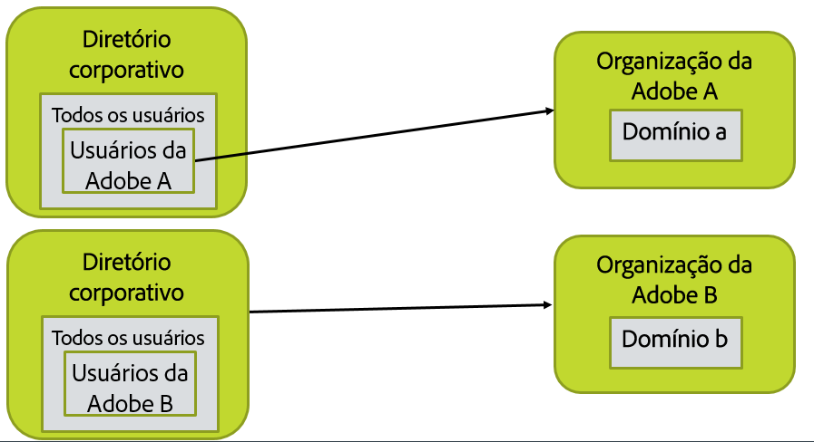
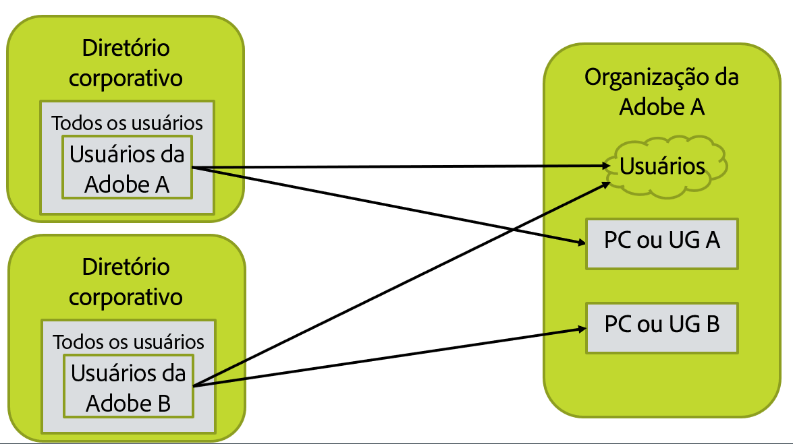

# Layout da organização, dos grupos e dos diretórios

[Seção anterior](before_you_start.md) \| [Voltar ao sumário](index.md) \| [Próxima seção](layout_products.md)

Nesta etapa, você precisará criar uma imagem do seu diretório, da organização da Adobe e da configuração do usuário.  Isso deve incluir a consulta LDAP para a seleção dos usuários e a lista de domínios em que os usuários estão baseados.  (Se um usuário tiver um email n@d.com, d.com será o domínio do usuário.)

&#9744; Nesta seção, várias configurações alternativas são exibidas.  Você seguirá as etapas para apenas uma delas.

## Caso mais simples e comum

A maioria das configurações tem essa aparência.  Há um único diretório e uma única organização da Adobe. Todos os usuários podem ser selecionados como usuários para entrar na Adobe ou apenas um subconjunto como membros de um grupo específico de diretórios.  Você deverá decidir como isso deve ser configurado para a sua organização e ter a consulta LDAP com os usuários corretos selecionados.

&#9744; Você precisará da consulta LDAP que seleciona o conjunto de usuários a serem sincronizados com a Adobe.  Isso será inserido em um dos arquivos de configuração do User Sync em uma etapa posterior.

&#9744; Você precisa reivindicar cada domínio no Adobe Admin Console para a organização da Adobe na qual eles serão gerenciados.

&#9744; Reúna as informações de credenciais necessárias para acessar o diretório.  Recomendamos a criação de uma conta de acesso de diretório somente-leitura e o uso dela para acessar AD ou LDAP, ou outro sistema de diretórios.

## Várias organizações da Adobe

Você precisará executar duas instâncias do User Sync, uma para cada organização.  Isso significa que, basicamente, o User Sync será instalado duas vezes, em dois diretórios de arquivos diferentes.

Se as licenças em uma organização precisarem ser usadas por usuários em outra organização, a configuração será mais complexa.  Você precisará de credenciais de acesso da organização da Adobe para cada organização da qual as licenças serão atribuídas a usuários.

Você precisará:

- &#9744; De acesso de Admin para cada uma das organizações da Adobe

- &#9744; Da consulta LDAP para cada conjunto de usuários

-  Esteja preparado para configurar várias instalações do User Sync nas etapas posteriores.

-  &#9744; Reúna as informações de credenciais que precisará para acessar o diretório.  Recomendamos a criação de uma conta de acesso de diretório somente-leitura e o uso dela para acessar AD ou LDAP, ou outro sistema de diretórios.

## Vários-diretórios e várias-organizações

Basicamente, isso significa duas instâncias de tudo; você precisará executar duas configurações do User Sync; uma para cada diretório e organização

Se as licenças em uma organização precisarem ser usadas por usuários em outra organização, a configuração será mais complexa.

Você precisará:

- &#9744; De acesso de Admin para cada uma das organizações da Adobe

- &#9744; Da consulta LDAP para cada conjunto de usuários

-  Esteja preparado para configurar várias instalações do User Sync nas etapas posteriores.

-  &#9744; Reúna as informações de credenciais necessárias para acessar o diretório.  Recomendamos a criação de uma conta de acesso de diretório somente-leitura e o uso dela para acessar AD ou LDAP, ou outro sistema de diretórios.
 Note que você pode precisar de credenciais diferentes para acessar cada instância do diretório.

## Vários-diretórios e uma única organização

Você precisará executar duas configurações do User Sync, uma para cada diretório.

Grupos de usuários (UG) e Configurações do produto (PC) mapeados e gerenciados por dois trabalhos do User Sync não podem se sobrepor.  Ou seja, cada grupo de usuários e configuração do produto (PC) deve ser gerenciado por apenas uma única instância do User Sync.

O User Sync não pode excluir usuários nessa configuração,  visto que uma instância do User Sync tentaria excluir os usuários da outra e vice-versa.

Você precisará:

- &#9744; De acesso de Admin para a organização da Adobe

- &#9744; Da consulta LDAP para cada conjunto de usuários

-  Esteja preparado para configurar várias instalações do User Sync nas etapas posteriores.

-  &#9744; Reúna as informações de credenciais necessárias para acessar o diretório.  Recomendamos a criação de uma conta de acesso de diretório somente-leitura e o uso dela para acessar AD ou LDAP, ou outro sistema de diretórios.
 Note que você pode precisar de credenciais diferentes para acessar cada instância do diretório.

[Seção anterior](before_you_start.md) \| [Voltar ao sumário](index.md) \| [Próxima seção](layout_products.md)
