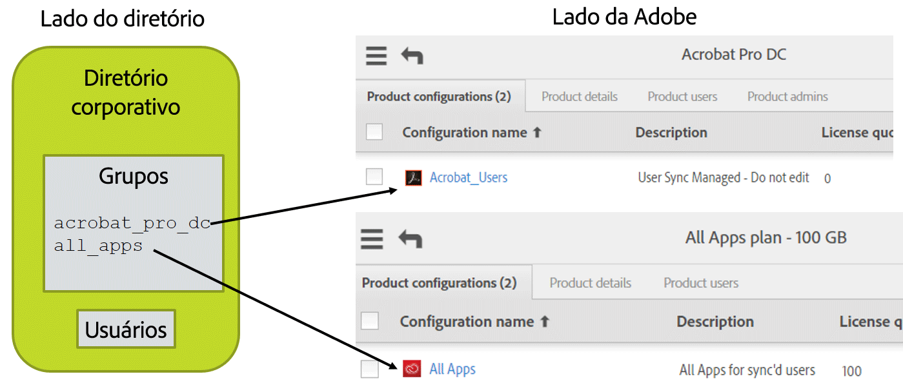

# Layout dos produtos da Adobe, das configurações de produtos e dos grupos de usuários

[Seção anterior](layout_orgs.md) \| [Voltar ao sumário](index.md) \| [Próxima seção](decide_deletion_policy.md)

As configurações de produtos (PCs) são grupos,-como estruturas no sistema de gerenciamento de usuários da Adobe.  Cada PC é associada a um produto que você comprou.  Os usuários adicionados à PC recebem o acesso e obtêm a licença para usar o produto correspondente.  (Neste processo, o usuário recebe apenas uma notificação opcional de que o acesso foi concedido.  Todo o gerenciamento de licenças é feito por sistemas de back-end).

Quando você cria uma PC (o que é feito no Adobe Admin Console), pode adicionar opções personalizadas que controlam como os usuários usarão o produto específico da Adobe.

Você pode adicionar usuários diretamente às PCs para conceder acesso aos produtos.  Esse é o modo de gestão mais comum das licenças dos produtos da Adobe.

Os grupos de usuários da Adobe podem ser usados para agrupar usuários de uma maneira lógica e que corresponda à sua noção de organização.  O uso dos grupos de usuários é opcional.  Os grupos de usuários podem ser adicionados às PCs para conceder licenças aos usuários.  A adição de usuários a um grupos de usuários não concede licenças a menos que esse grupo seja adicionado a uma PC, o que faz com que seus membros sejam implicitamente membros da PC.

Grupos de usuários e PCs só podem ser gerenciados por uma instância do User Sync.  Se vários diretórios ou departamentos distribuídos estiverem passando informações de usuários para a Adobe por meio do User Sync, cada um deverá corresponder a um único grupo de usuários ou a uma única PC.  Caso contrário, o User Sync não poderá distinguir entre usuários que devem ser removidos e usuários adicionados por outra instância do User Sync.

Você pode usar o User Sync para gerenciar a associação à PC e a alocação de licenças.  No entanto, isso é opcional.  Você também pode gerenciar isso manualmente no Adobe Admin Console ou outro aplicativo.

O User Sync o ajuda a gerenciar as licenças de produtos da Adobe permitindo que você coloque usuários em grupos de diretórios usando a interface de sistema de diretórios ou outras ferramentas.  Esses grupos são então mapeados para grupos de usuários ou PCs da Adobe.  O mapeamento faz parte do arquivo de configuração do User Sync.  Quando o User Sync detecta que os usuários do diretório estão em um desses grupos mapeados, eles são adicionados ao grupo de usuários ou PC da Adobe correspondente.  Do mesmo modo, usuários no grupo de usuários ou na PC que não estão no grupo de diretórios correspondente são removidos do grupo de usuários ou da PC.

&#9744; Decida se você gerenciará a alocação de licenças usando o User Sync.  Caso não for usá-lo, você poderá ignorar as etapas restantes. No entanto, para que os usuários criados possam acessar os produtos da Adobe, você precisará adicioná-los manualmente às configurações de produtos usando o Adobe Admin Console. 

&#9744; Crie as PCs no Adobe Admin Console para as configurações de produtos e os grupos de usuários que você gerenciará.  Adicione o comentário “Gerenciado pelo User Sync - não edite” ao campo de descrição da PC.

&#9744; Se você for usar os grupos de usuários para gerenciar o acesso a produtos, precisará primeiro criar os grupos de usuários e as configurações do produto, depois poderá gerenciar o acesso ao produto adicionando cada grupo de usuários às configurações de produtos apropriadas. Adicione o comentário “Gerenciado pelo User Sync - não edite” ao campo de descrição do grupo de usuários.

&#9744; Desenhe um diagrama das suas organizações da Adobe e dos respectivos produtos e PCs.  Adicione o diretório e os grupos de diretórios à imagem e mostre o mapeamento.  Por exemplo:

[Seção anterior](layout_orgs.md) \| [Voltar ao sumário](index.md) \| [Próxima seção](decide_deletion_policy.md)

