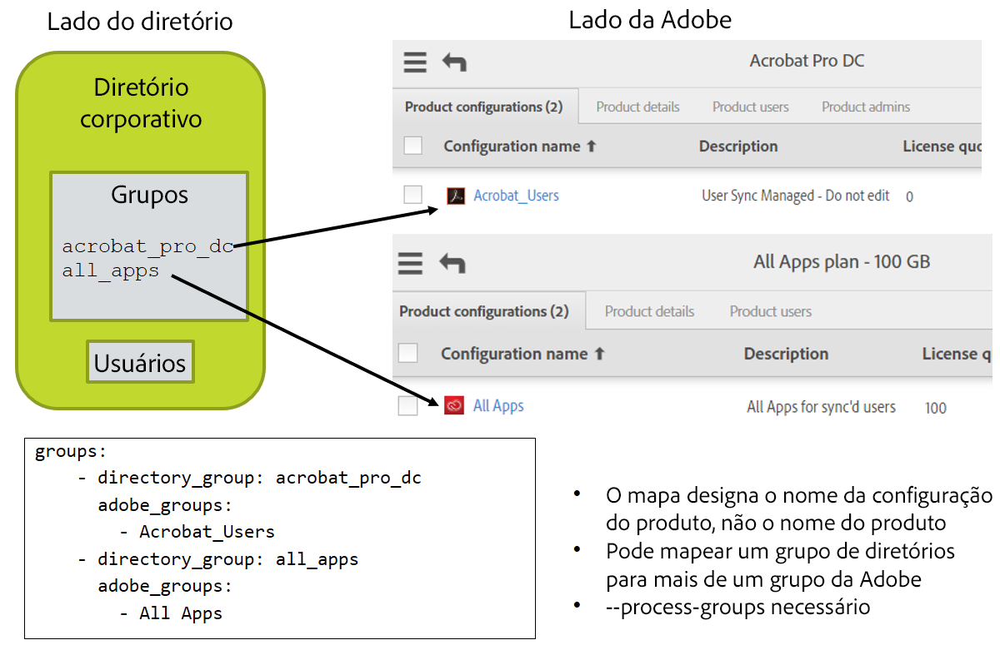

# Instalação e configuração

## Nesta seção
{:."no_toc"}

* Marcador TOC
{:toc}

---

[Seção anterior](index.md)  \| [Próxima seção](configuring_user_sync_tool.md)

---

O uso da ferramenta User Sync varia em função da definição das
configurações de produtos da sua empresa no Adobe Admin
Console. Para obter mais informações sobre como fazer isso, consulte a página de ajuda
[Configurar serviços](https://helpx.adobe.com/enterprise/help/configure-services.html#configure_services_for_group)
.

## Configuração de uma integração da API de gestão de usuários no Adobe I/O

A ferramenta User Sync é um cliente da API de gerenciamento de usuários. Antes
de instalar a ferramenta, registre-a como um cliente da API
adicionando uma *integração* no
[Portal do desenvolvedor](https://www.adobe.io/console/) do Adobe I/O. Será necessário
adicionar uma integração de Chave de empresa para obter as
credenciais que a ferramenta precisa para acessar o sistema de gestão de usuários
da Adobe.

As etapas necessárias para a criação de uma integração estão descritas
detalhadamente na seção
[Visão geral de autenticação do Adobe I/O](https://www.adobe.io/apis/cloudplatform/console/authentication/gettingstarted.html)
do site do Adobe I/O.  Procure pelas seções 
sobre Autenticação de contas de serviço.  O
processo requer a criação de um certificado-específico
para integração, que pode ser auto-assinado.  Quando o processo for
concluído, você receberá uma **Chave de API**, uma **ID da conta
técnica**, uma **ID da organização**e um **Segredo do cliente**
que a ferramenta utilizará, junto com as informações do certificado, para
se comunicar de forma segura com o Admin Console. Ao instalar a
ferramenta User Sync, forneça esses dados como valores
de configuração necessários para que a ferramenta acesse as informações de usuário
de sua organização que estão armazenadas na Adobe.

Obtenha mais informações na documentação UMAPI, disponível
[aqui](https://adobe-apiplatform.github.io/umapi-documentation) ou [aqui](https://www.adobe.io/apis/cloudplatform/usermanagement/docs/gettingstarted.html).

## Configuração da sincronização-de acesso aos produtos

Caso pretenda usar a ferramenta User Sync para atualizar o acesso dos usuários aos
produtos da Adobe, você deve criar grupos no seu próprio diretório
corporativo que correspondam aos grupos de usuários e configurações
de produtos definidas no
[Adobe Admin Console](https://www.adobe.io/console/). A associação
em uma configuração de produto concede acesso a um conjunto particular de
produtos da Adobe. É possível conceder ou revogar o acesso para usuários ou para
grupos de usuários definidos, adicionando ou removendo-os de uma configuração
de produto.

A ferramenta User Sync pode conceder acesso ao produto para os usuários por meio da
adição de usuários a grupos e configurações de produtos, baseado nas suas
associações a diretórios corporativos, desde que os nomes dos grupos estejam
mapeados corretamente e a ferramenta seja executada com a opção de processamento
de associações a grupos.

Caso pretenda usar a ferramenta dessa maneira, é necessário mapear
os grupos de diretórios corporativos até os grupos correspondentes da Adobe
no arquivo de configuração principal. Para isso, é necessário garantir que
os grupos existam nos dois lados e conhecer os nomes correspondentes
exatos.

### Verificação dos produtos e das configurações dos produtos

Antes de iniciar a configuração do User Sync, é necessário saber quais
produtos da Adobe são usados pela sua empresa e quais
configurações de produtos e grupos de usuários estão definidas no sistema de gestão
de usuários da Adobe. Para obter mais informações, consulte a página de ajuda
[Configurar serviços corporativos](https://helpx.adobe.com/enterprise/help/configure-services.html#configure_services_for_group).

Caso ainda não possua configurações de produtos, use o
Console para criá-las. É necessário ter algumas e elas devem ter
grupos correspondentes no diretório corporativo para poder
configurar o User Sync para atualizar suas informações de direitos do usuário.

Os nomes das configurações de produtos geralmente identificam
os tipos de acessos aos produtos que os usuários precisarão, por exemplo Acesso
total ou Acesso individual ao produto. Para verificar os nomes exatos, visite
a seção Produtos no
[Adobe Admin Console](https://www.adobe.io/console/) para ver os
produtos habilitados para sua empresa. Clique em um produto para
ver os detalhes das configurações de produto
definidas para o produto em questão.

### Criação de grupos correspondentes no seu diretório corporativo

Após a definição dos grupos de usuários e das configurações de produto no
Adobe Admin Console, é necessário criar e nomear grupos
correspondentes em seu próprio diretório corporativo. Por exemplo, um grupo
de diretórios correspondente a uma configuração de produto “Todos os Apps”
pode ser chamado de “todos_apps”.

Anote os nomes escolhidos para esses grupos e os grupos
da Adobe aos quais eles correspondem. Isso será usado para configurar um
mapeamento no principal arquivo de configuração do User Sync. Consulte os detalhes na
seção [Configurar mapeamento de grupo](configuring_user_sync_tool.md#configure-group-mapping) abaixo
.

Recomenda-se anotar no campo de descrição da Configuração de produto ou do Grupo de usuários que o grupo é gerenciado pelo User Sync e não deve ser editado no Admin Console.

## Instalação da ferramenta User Sync

### Requisitos de sistema

A ferramenta User Sync é implementada usando Python e requer
a versão 2.7.9 ou superior. Para cada ambiente onde pretende-se
instalar, configurar e executar o script, certifique-se
de que o Python foi instalado no sistema operacional
antes de avançar para a próxima etapa. Para obter mais informações, consulte o
[site do Python](https://www.python.org/).

A ferramenta foi desenvolvida usando um pacote LDAP do Python, `pyldap`, que por sua vez
foi desenvolvido com base na biblioteca de clientes OpenLDAP. O Windows Server,
o Apple OSX e muitas versões do Linux possuem um cliente OpenLDAP
instalado de fábrica.  No entanto, alguns sistemas operacionais UNIX,
como OpenBSD e FreeBSD, não o incluem na instalação de
base.

Verifique o seu ambiente para garantir que um cliente OpenLDAP esteja
instalado antes de executar o script. Se não estiver presente no
sistema, instale-o antes de instalar a ferramenta
User Sync.

### Instalação

A ferramenta User Sync está disponível no
[repositório do User Sync no GitHub](https://github.com/adobe-apiplatform/user-sync.py). Para
instalar a ferramenta:

1. Crie uma pasta no servidor onde será instalada a 
ferramenta User Sync e coloque os arquivos de configuração.

1. Clique no link **Releases** (Versões) para localizar a versão mais recente,
que contém as notas da versão, arquivos de exemplos
de configurações e todas as versões de compilações (assim como os
arquivos de origem).

2. Selecione e baixe o pacote compactado para a sua plataforma
(o arquivo `.tar.gz`). Estão disponíveis compilações para Windows, OSX, Centos e
Ubuntu. (Se você estiver compilando desde o código fonte, baixe o
pacote de código fonte correspondente à versão ou use a
fonte mais recente da ramificação principal).  As compilações do Python 3 também podem
estar disponíveis para versões mais recentes do User Sync.

3. Localize o arquivo executável do Python (`user-sync` ou
`user-sync.pex` para Windows) e coloque-o na pasta do
User Sync.

4. Baixe o arquivo `example-configurations.tar.gz` de arquivos de exemplos de
configurações.  Dentro do arquivo, existe uma pasta chamada “config files –
basic”.  Os três primeiros arquivos dessa pasta são necessários. Os outros
arquivos no pacote são opcionais e/ou versões alternativas para
fins específicos. É possível copiá-los para a pasta raiz e, em seguida,
renomeá-los e editá-los para criar os seus próprios arquivos de configuração. (Consulte
a seção a seguir,
[Configuração da ferramenta User Sync](configuring_user_sync_tool.md#configuring-the-user-sync-tool).)

5. **Somente no Windows:**

    Antes de executar o arquivo user-sync.pex no Windows, pode ser necessário
resolver um problema de execução-do Python exclusivo do Windows:

    O sistema operacional Windows impõe um limite de 260 caracteres
para o caminho de arquivo. Ao executar um arquivo PEX do Python, é criado um
local temporário para extrair o conteúdo do pacote. Se o
caminho para o local exceder 260 caracteres, o script não
será executado corretamente.

    Por padrão, o cache temporário fica na pasta base, o que pode
fazer com que os nomes dos caminhos excedam o limite. Para resolver esse problema,
crie uma variável de ambiente no Windows chamada PEX\_Root, e defina
o caminho como C:\\pex. O SO usa essa variável para
o local do cache, impedindo que o caminho exceda o
limite de 260 caracteres.

6. Para rodar a ferramenta User Sync, clique no arquivo executável do Python,
`user-sync` (ou execute `python user-sync.pex` no Windows).

### Considerações de segurança

Como o aplicativo User Sync acessa informações confidenciais
tanto no lado da empresa quanto da Adobe, o seu uso envolve vários
arquivos diferentes que contêm informações confidenciais. Deve-se tomar
muito cuidado para manter esses arquivos protegidos contra acessos não autorizados.

A versão 2.1 (ou posterior) do User Sync permite que você armazene as credenciais no
repositório protegido de credenciais do sistema operacional (eliminando a necessidade
de armazenamento e proteção desses arquivos) ou que armazene
arquivos de configuração umapi e ldap de uma forma segura que você possa
definir.  Consulte a seção [Recomendações de segurança](deployment_best_practices.md#security-recommendations)
para obter mais detalhes.

#### Arquivos de configuração

Os arquivos de configuração devem incluir informações confidenciais, como a
chave da API de gestão de usuários da Adobe, o caminho para a chave
privada do certificado e as credenciais para o diretório corporativo
(caso possua um). Você deve tomar as medidas necessárias para proteger todos
os arquivos de configuração e garantir que somente os usuários autorizados
possam acessá-los. Sobretudo, não permita o acesso a leitura para
arquivos com informações confidenciais, exceto a partir da conta
de usuário que execute o processo de sincronização.

Se decidir utilizar o sistema operacional para armazenar as credenciais,
os mesmos arquivos de configuração são criados mas, em vez de armazenar
as credenciais em si, eles armazenam IDs de chaves usadas para pesquisar
as credenciais.  Obtenha mais detalhes nas
[Recomendações de segurança](deployment_best_practices.md#security-recommendations).

Se o User Sync for acessar o seu diretório corporativo, ele
deverá ser configurado para ler a partir do servidor do diretório usando uma
conta de serviço. Essa conta de serviço só precisa de permissão para leitura e
recomenda-se que ela _não_ receba permissão para gravação (para que
a divulgação não autorizada das credenciais não conceda permissão
para gravação àqueles que a recebam).

#### Arquivos de certificado

Os arquivos que contêm as chaves pública e privada,
especialmente a chave privada, contém informações confidenciais. A chave privada
deve ser mantida em segurança. Ela não pode ser recuperada ou
substituída. Caso ela seja perdida ou comprometida, deve-se excluir
o certificado correspondente da sua conta. Se necessário,
crie um novo certificado e faça upload. Esses arquivos devem
ter no mínimo, o mesmo nível de proteção que o nome e a senha de uma
conta. Recomenda-se armazenar o arquivo de chave privada em um
sistema de gerenciamento de credenciais, no repositório protegido do sistema operacional
ou utilizar a proteção de arquivos do sistema,
de modo que ele possa ser acessado somente por usuários autorizados.

#### Arquivos de registro

O sistema de registro vem ativado por padrão e processa todas as transações
mediante a API de gestão de usuários para o console. Também é possível configurar
a ferramenta para gravar em um arquivo de registro. Os arquivos criados durante
a execução possuem selo de data e são gravados no sistema de arquivos em uma 
pasta especificada no arquivo de configuração.

A API de gestão de usuários trata o endereço de email de um usuário como o
identificador exclusivo. Todas as ações, juntamente com o endereço de email
associado ao usuário, são gravadas no registro. Se você optar por
registrar os dados nos arquivos, esses arquivos conterão essas
informações.

O User Sync não oferece nenhum controle de retenção de registro ou
gerenciamento. Ele inicia um novo arquivo de registro diariamente.  Se você optar por 
registrar os dados nos arquivos, tome as
precauções necessárias para gerenciar o tempo de duração e o acesso a esses arquivos.

Se a política de segurança da sua empresa não permite que nenhuma
informação pessoalmente identificável seja armazenada em disco, configure a
ferramenta para desabilitar o registro em arquivo. A ferramenta continua processando as
transações de registro no console, onde os dados são armazenados
temporariamente na memória durante a execução.

## Suporte para a ferramenta User Sync

Os clientes do Adobe Enterprise podem utilizar os canais de suporte usuais para
obter suporte para o User Sync.

Como esse é um projeto de código aberto, também é possível abrir uma questão no
GitHub.  Para ajudar no processo de depuração, inclua a plataforma, 
as opções da linha de comando e quaisquer arquivos
de registro gerados durante a execução do aplicativo na
solicitação de suporte (desde que não contenham informações
confidenciais).

---

[Seção anterior](index.md)  \| [Próxima seção](configuring_user_sync_tool.md)
