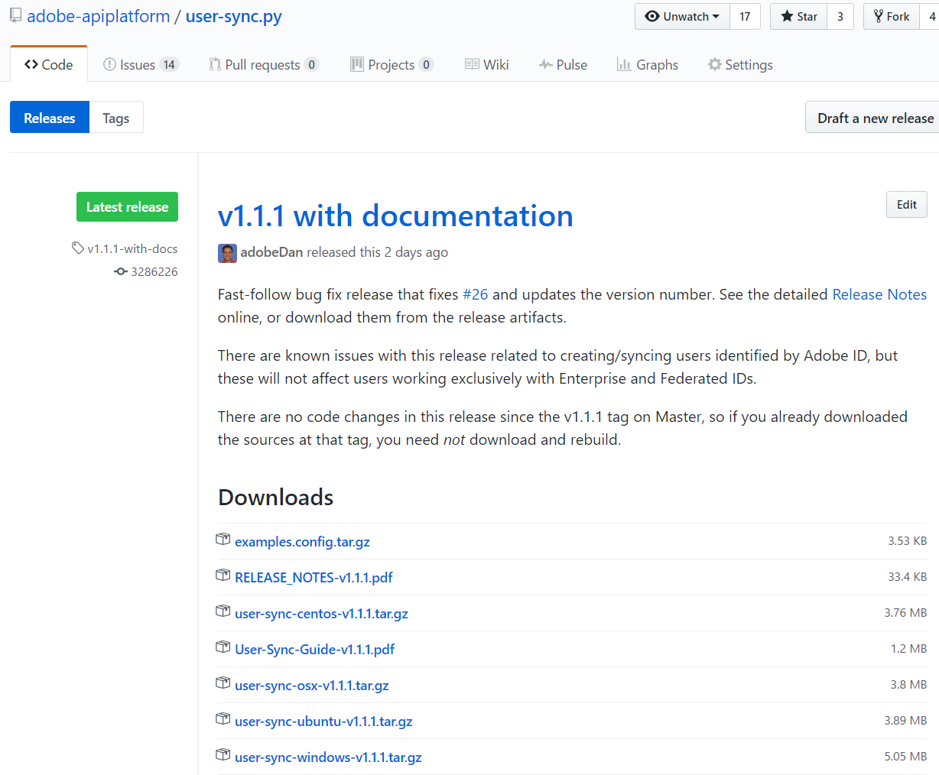

# Installieren des Benutzer-Synchronisationstools

[Voriger Abschnitt](identify_server.md) \| [Zurück zum Inhaltsverzeichnis](index.md) \| [Nächster Abschnitt](setup_config_files.md)

Sobald Sie Zugriff auf den Server haben, auf dem die Benutzersynchronisation ausgeführt werden soll, wählen Sie ein Verzeichnis, in dem Sie das Benutzer-Synchronisationstool installieren und verwenden möchten.

Unter Windows müssen Sie Python installieren.  Zum Zeitpunkt der Veröffentlichung dieses Dokuments wird Version 2.7.13 empfohlen.  Windows und Python müssen in der 64-Bit-Version installiert sein.

Unter Windows müssen Sie höchstwahrscheinlich auch die Umgebungsvariable PEX_ROOT auf „C:\user_sync\.pex“ festlegen.  Dies ist erforderlich, um Einschränkungen bei der Länge von Windows-Pfadnamen zu umgehen.

Erste Schritte:

&#9744; Richten Sie ein Benutzer- und Dateiverzeichnis für die Installation und Ausführung der Synchronisation ein.  In diesem Beispiel erstellen wir den Ordner „/home/user_sync/user_sync_tool“ und den Benutzer „user_sync“.  Unter Windows lautet das Verzeichnis z. B. „C:\Benutzer\user_sync\user_sync_tool“.

&#9744; Nur Windows: Legen Sie die Umgebungsvariable **PEX\_ROOT** auf **C:\user_sync\.pex** fest.

&#9744; Nur Windows: Installieren Sie Python 2.7.13 (oder eine höhere Version der 2.7-Serie), 64-Bit-Version. 

In den nächsten Abschnitten wird der Installationsvorgang erläutert.

Die neueste Version finden Sie hier: 
[https://github.com/adobe-apiplatform/user-sync.py](https://github.com/adobe-apiplatform/user-sync.py "https://github.com/adobe-apiplatform/user-sync.py")

Wählen Sie „release“.

&#9744; Laden Sie die Datei „example-configurations.tar.gz“, das Handbuch für die Benutzersynchronisation und den Build für Ihre Plattform (OS X, Ubuntu, Windows oder CentOS) herunter.

&#9744; Extrahieren Sie die Datei „user-sync“ (oder „user-sync.pex“) aus dem Archiv und verschieben Sie die Datei für Ihr Betriebssystem in den entsprechenden Ordner.  Im Beispiel lautet dieser „/home/user_sync/user_sync_tool/user-sync“ bzw. „C:\Benutzer\user_sync\user_sync_tool\user-sync.pex“.

&#9744; Die Datei „example-configurations.tar.gz“ enthält das Verzeichnis **config files - basic**.  Aus diesem Ordner extrahieren Sie die ersten drei Dateien und kopieren sie in den Ordner „user_sync_tool“.  

&#9744; Als Nächstes benennen Sie die drei Konfigurations-Beispieldateien um, indem Sie die führenden Ziffern „1“, „2“ und „3“ aus dem Namen entfernen.  Diese Dateien werden im Folgenden bearbeitet, um die tatsächlichen Konfigurationsdateien für das Benutzer-Synchronisationstool zu erstellen.

[Voriger Abschnitt](identify_server.md) \| [Zurück zum Inhaltsverzeichnis](index.md) \| [Nächster Abschnitt](setup_config_files.md)
