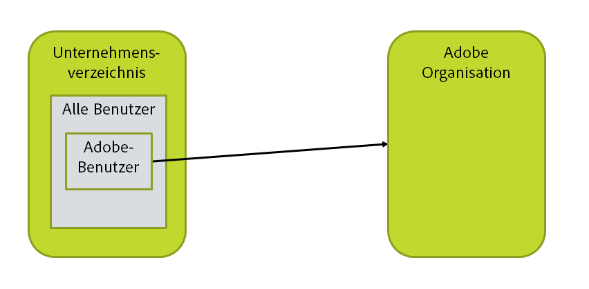
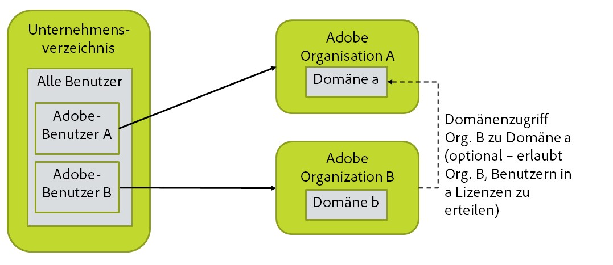
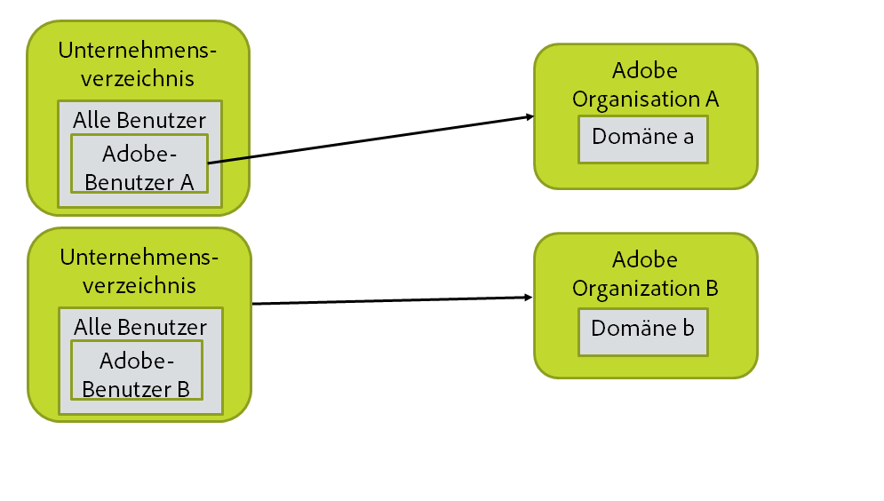
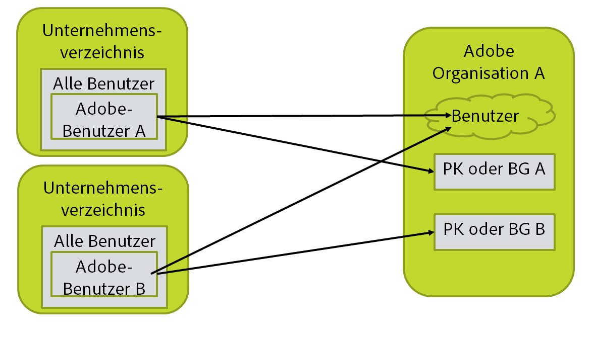

# Layout Ihrer Organisation, Ihrer Gruppen und Verzeichnisse

[Voriger Abschnitt](before_you_start.md) \| [Zurück zum Inhaltsverzeichnis](index.md) \| [Nächster Abschnitt](layout_products.md)

In diesem Schritt müssen Sie ein Diagramm mit Ihrem Verzeichnis, Ihrer Adobe-Organisation und der Benutzerkonfiguration erstellen. Dieses sollte die LDAP-Abfrage für die Auswahl der Benutzer und eine Liste der Domänen enthalten, in denen sich die Benutzer befinden. (Bei einem Benutzer mit der E-Mail-Adresse „n@d.com“ lautet die Domäne „d.com“.)

&#9744; In diesem Abschnitt werden verschiedene alternative Konfigurationen vorgestellt. Sie führen die Schritte nur für eine dieser Konfigurationen aus.

## Einfachstes und häufigstes Szenario

Die meisten Konfigurationen sehen wie folgt aus: Es sind ein einzelnes Verzeichnis und eine einzelne Adobe-Organisation vorhanden. Als Benutzer, die in die Adobe-Organisation übertragen werden, können alle Benutzer oder eine Teilmenge (z. B. die Mitglieder einer bestimmten Gruppe im Verzeichnis) ausgewählt werden. Sie müssen die optimale Konfiguration für Ihre Organisation und die LDAP-Abfrage festlegen, mit der die richtigen Benutzer ausgewählt werden.

&#9744; Sie benötigen eine LDAP-Abfrage, mit der die Gruppe von Benutzern ausgewählt werden, die mit Adobe synchronisiert werden sollen. Diese wird in einem späteren Schritt in eine der Konfigurationsdateien für das Benutzer-Synchronisationstool eingefügt.

&#9744; Sie müssen alle Domänen über die Adobe Admin Console für die Adobe-Organisation beanspruchen, in der sie verwaltet werden.

&#9744; Besorgen Sie sich die Anmeldeinformationen für den Zugriff auf das Verzeichnis. Es wird empfohlen, ein Konto für den schreibgeschützten Zugriff auf das Verzeichnis zu erstellen und mit diesem Konto auf das AD-, LDAP- oder sonstige Verzeichnissystem zuzugreifen.

## Mehrere Adobe-Organisationen

Sie müssen zwei Instanzen des Benutzer-Synchronisationstools ausführen, für jede Organisation eines. Dies bedeutet im einfachsten Fall, das Benutzer-Synchronisationstool zweimal in jeweils unterschiedlichen Dateiverzeichnissen zu installieren.

Wenn die Lizenzen aus einer Organisation für Benutzer in der anderen Organisation verwendet werden sollen, ist die Einrichtung etwas komplizierter. Sie benötigen für jede Organisation mit Lizenzen, die Benutzern zugewiesen werden sollen, Anmeldeinformationen für den Zugriff auf die Adobe-Organisation.

Voraussetzungen:

- &#9744; Administratorzugriff auf die Adobe-Organisationen

- &#9744; Die LDAP-Abfrage für jede Gruppe von Benutzern

-  In späteren Schritten werden Sie mehrere Installationen des Benutzer-Synchronisationstools einrichten.

-  &#9744; Besorgen Sie sich die Anmeldeinformationen für den Zugriff auf das Verzeichnis. Es wird empfohlen, ein Konto für den schreibgeschützten Zugriff auf das Verzeichnis zu erstellen und mit diesem Konto auf das AD-, LDAP- oder sonstige Verzeichnissystem zuzugreifen.

## Mehrere Verzeichnisse und mehrere Organisationen

In diesem Szenario benötigen Sie jeweils zwei Instanzen. Sie müssen zwei Konfigurationen des Benutzer-Synchronisationstools ausführen, eine für jedes Verzeichnis und jede Organisation.

Wenn die Lizenzen aus einer Organisation für Benutzer in der anderen Organisation verwendet werden sollen, ist die Einrichtung etwas komplizierter.

Voraussetzungen:

- &#9744; Administratorzugriff auf die Adobe-Organisationen

- &#9744; Die LDAP-Abfrage für jede Gruppe von Benutzern

-  In späteren Schritten werden Sie mehrere Installationen des Benutzer-Synchronisationstools einrichten.

-  &#9744; Besorgen Sie sich die Anmeldeinformationen für den Zugriff auf das Verzeichnis. Es wird empfohlen, ein Konto für den schreibgeschützten Zugriff auf das Verzeichnis zu erstellen und mit diesem Konto auf das AD-, LDAP- oder sonstige Verzeichnissystem zuzugreifen.
 Denken Sie daran, dass Sie für die einzelnen Verzeichnisinstanzen möglicherweise jeweils eigene Anmeldeinformationen benötigen.

## Mehrere Verzeichnisse und eine Organisation

Sie müssen zwei Instanzen des Benutzer-Synchronisationstools ausführen, für jedes Verzeichnis eines.

Die Benutzergruppen (BG) und Produktkonfigurationen (PK), die den beiden Benutzersynchronisationsprozessen zugeordnet sind, dürfen sich nicht überschneiden. Das heißt, jede Benutzergruppe und jede PK darf jeweils nur von einer Instanz des Benutzer-Synchronisationstools verwaltet werden.

Bei dieser Konfiguration müssen Sie sicherstellen, dass das Benutzer-Synchronisationstool keine Benutzer löscht. Andernfalls würden die beiden Instanzen des Benutzer-Synchronisationstools versuchen, gegenseitig ihre Benutzer zu löschen.

Voraussetzungen:

- &#9744; Administratorzugriff auf die Adobe-Organisation

- &#9744; Die LDAP-Abfrage für jede Gruppe von Benutzern

-  In späteren Schritten werden Sie mehrere Installationen des Benutzer-Synchronisationstools einrichten.

-  &#9744; Besorgen Sie sich die Anmeldeinformationen für den Zugriff auf das Verzeichnis. Es wird empfohlen, ein Konto für den schreibgeschützten Zugriff auf das Verzeichnis zu erstellen und mit diesem Konto auf das AD-, LDAP- oder sonstige Verzeichnissystem zuzugreifen.
 Denken Sie daran, dass Sie für die einzelnen Verzeichnisinstanzen möglicherweise jeweils eigene Anmeldeinformationen benötigen.

[Voriger Abschnitt](before_you_start.md) \| [Zurück zum Inhaltsverzeichnis](index.md) \| [Nächster Abschnitt](layout_products.md)
