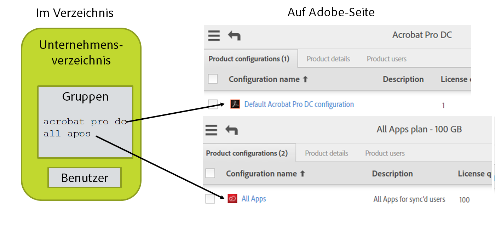

# Layout Ihrer Adobe-Produkte, Produktkonfigurationen und Benutzergruppen

[Voriger Abschnitt](layout_orgs.md) \| [Zurück zum Inhaltsverzeichnis](index.md) \| [Nächster Abschnitt](decide_deletion_policy.md)

Produktkonfigurationen (PKs) sind gruppenähnliche Strukturen im Adobe-Benutzerverwaltungssystem. Jede PK ist einem von Ihnen erworbenen Produkt zugeordnet. Benutzern, die einer PK hinzugefügt wurden, wird der Zugriff auf das Produkt und eine entsprechende Lizenz zu dessen Verwendung gewährt. (Der Benutzer erhält bei diesem Vorgang lediglich optional eine Benachrichtigung, dass der Zugriff gewährt wurde. Die gesamte Lizenzverwaltung erfolgt auf Back-End-Systemen).

Wenn Sie eine PK (über die Adobe Admin Console) erstellen, können Sie benutzerdefinierte Optionen hinzufügen, mit denen gesteuert wird, wie Benutzer das jeweilige Adobe-Produkt verwenden können.

Sie können Benutzer direkt einer PK hinzufügen, um ihnen Zugriff auf Produkte zu gewähren. Dies ist das häufigste Szenario zur Verwaltung von Adobe-Produktlizenzen.

Mit Adobe-Benutzergruppen können Sie Benutzer auf logische Weise so gruppieren, wie es Ihren Vorstellungen entspricht. Die Verwendung von Benutzergruppen ist optional. Benutzergruppen können dann PKs hinzugefügt werden, um den entsprechenden Benutzern Lizenzen zu gewähren. Wenn Sie Benutzer zu Benutzergruppen hinzufügen, werden ihnen nur dann Lizenzen gewährt, wenn die Benutzergruppe einer PK hinzugefügt wird, wodurch die Mitglieder der Benutzergruppe implizit Mitglieder der PK werden.

Benutzergruppen und PKs können nur von einer Instanz des Benutzer-Synchronisationstools verwaltet werden. Wenn die Benutzerinformationen, die über die Benutzersynchronisation an Adobe weitergegeben werden, aus mehreren Verzeichnissen oder getrennten Abteilungen stammen, müssen diese jeweils einer Benutzergruppe oder PK zugeordnet werden. Andernfalls kann das Benutzer-Synchronisationstool nicht zwischen Benutzern, die entfernt werden sollen, und Benutzern, die von einer anderen Instanz des Benutzer-Synchronisationstools hinzugefügt wurden, unterscheiden.

Mit dem Benutzer-Synchronisationstool können Sie die Mitgliedschaft in PKs und die Lizenzzuweisung verwalten. Dies ist allerdings optional. Dies ist auch manuell in der Adobe Admin Console oder mithilfe einer anderen Applikation möglich.

Das Benutzer-Synchronisationstool vereinfacht die Verwaltung von Adobe-Produktlizenzen, indem Sie Benutzer über die Benutzeroberfläche des Verzeichnissystems oder mithilfe anderer Tools in Verzeichnisgruppen einfügen können. Diese Gruppen werden dann Adobe-Benutzergruppen oder -PKs zugeordnet. Die Zuordnung wird in der Konfigurationsdatei des Benutzer-Synchronisationstools festgelegt. Wenn das Benutzer-Synchronisationstool erkennt, dass ein Verzeichnisbenutzer in einer dieser zugeordneten Gruppe vorhanden ist, wird der Benutzer der entsprechenden Adobe Benutzergruppe oder -PK hinzugefügt. Entsprechend werden Benutzer in der Benutzergruppe oder PK, die in der entsprechenden Verzeichnisgruppe nicht vorhanden sind, aus der Benutzergruppe oder PK entfernt.

&#9744; Legen Sie fest, ob Sie die Lizenzzuweisung über die Benutzersynchronisation verwalten möchten. Andernfalls können Sie die restlichen Schritte überspringen. Bevor die erstellten Benutzer auf Adobe-Produkte zugreifen können, müssen Sie sie dann allerdings manuell über die Adobe Admin Console den Produktkonfigurationen hinzufügen. 

&#9744; Erstellen Sie die PKs für die Produktkonfigurationen und Benutzergruppen, die Sie verwalten, in der Adobe Admin Console. Fügen Sie im Beschreibungsfeld der PK den Kommentar „Über Benutzersynchronisation verwaltet – nicht bearbeiten“ ein.

&#9744; Wenn Sie den Produktzugriff mit Benutzergruppen verwalten, müssen Sie zunächst die Benutzergruppen und Produktkonfigurationen erstellen. Anschließend können Sie den Produktzugriff verwalten, indem Sie die einzelnen Benutzergruppen den gewünschten Produktkonfigurationen hinzufügen. Fügen Sie im Beschreibungsfeld der Benutzergruppe den Kommentar „Über Benutzersynchronisation verwaltet – nicht bearbeiten“ ein.

&#9744; Zeichnen Sie ein Diagramm mit den Adobe-Organisationen sowie den Produkten und PKs in den einzelnen Organisationen. Ergänzen Sie das Verzeichnis und die Verzeichnisgruppen sowie die Zuordnung im Diagramm. Beispiel:

[Voriger Abschnitt](layout_orgs.md) \| [Zurück zum Inhaltsverzeichnis](index.md) \| [Nächster Abschnitt](decide_deletion_policy.md)

