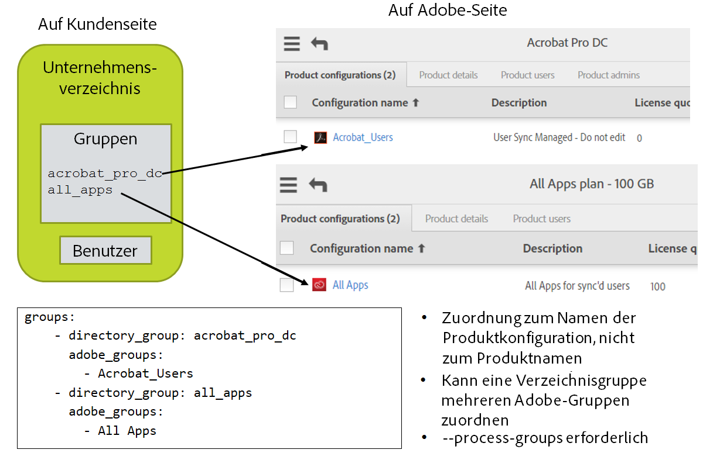

# Einrichten der Konfigurationsdateien


[Voriger Abschnitt](install_sync.md) \| [Zurück zum Inhaltsverzeichnis](index.md) \| [Nächster Abschnitt](test_run.md)


In dem jetzt folgenden Schritt wird alles zusammengeführt. Voraussetzungen:

- Werte für den Zugriff auf die Adobe.io-Integration über die Adobe.io-Konsole
- Datei mit dem privaten Schlüssel
- Anmeldeinformationen für den Zugriff auf das Verzeichnissystem und Informationen über die Organisation der Benutzer
- Die Entscheidung, ob der Produktzugriff über das Benutzer-Synchronisationstool verwaltet wird
  - Die Namen der Produktkonfigurationen und Benutzergruppen für die Organisationen von Lizenzen auf Adobe-Seite
  - Produktkonfigurationen und Benutzergruppen müssen bereits in der Adobe Admin Console erstellt worden sein.

Verwenden Sie einen Texteditor und kein Textverarbeitungsprogramm.

Verwenden Sie in .yml-Dateien Leerzeichen und keine Tabstopps.


## Konfigurationsdateien einrichten

Sie haben in den vorherigen Schritten ein Dateisystemverzeichnis für den Python-Code und die Konfigurationsdateien des Benutzer-Synchronisationstools eingerichtet. Jetzt müssen drei Konfigurationsdateien eingerichtet werden: eine für den Zugriff auf das Verzeichnissystem, eine für den Zugriff auf die Adobe-Organisation und eine definiert die Gruppenzuordnung und konfiguriert weitere Funktionen des Benutzer-Synchronisationstools. 

### Konfigurationsdatei für den Verzeichniszugriff

Wenn Sie das Benutzer-Synchronisationstool über eine Datei ausführen, können Sie das Einrichten von connector-ldap.yml überspringen und stattdessen wie im Beispiel mit der Datei „csv inputs - user and remove lists/users-file.csv“ eine CSV-Datei mit der gesamten Benutzerliste erstellen. Diese Datei befindet sich im Download „example-configurations.tar.gz“ des Release.

&#9744; Bearbeiten Sie die Datei „connector-ldap.yml“. Diese Datei enthält Informationen für den Zugriff auf das Verzeichnissystem. Geben Sie Werte für Benutzername, Kennwort, Host und Basis-DN ein.

&#9744; Überprüfen Sie den Rest der Datei, um zu ermitteln, ob weitere Informationen angegeben werden können, die für Ihre Installation relevant sind. In der Regel ist nichts Weiteres erforderlich.


Möglicherweise benötigen Sie eine vom Standard abweichende LDAP-Abfrage, um den gewünschten Satz von Benutzern auszuwählen. Sie ist in dieser Datei als Teil des Konfigurationsparameters all\_users\_filter eingerichtet.


### Anmeldeinformationen für die Adobe UMAPI 

&#9744; Bearbeiten Sie die Datei „connector-umapi.yml“. Geben Sie die Informationen aus der Adobe.io-Integration ein, die Sie zuvor erstellt haben. Diese lauten org\_id, api\_key, client\_secret und tech\_acct.

&#9744; Speichern Sie die Datei mit dem privaten Schlüssel im Ordner „user_sync_tool“. Das Konfigurationsdateielement „priv\_key\_path“ wird dann auf den Namen dieser Datei festgelegt.


### Hauptkonfigurationsdatei für das Benutzer-Synchronisationstool 

Bearbeiten Sie die Datei „user-sync-config.yml“.

#### Standard-Ländercode

	directory:
	  # (optional) Der Standard-Ländercode, falls das Verzeichnis keinen Ländercode für einen Benutzer enthält [es muss ein Ländercode aus zwei Buchstaben nach ISO-3166 sein – siehe https://en.wikipedia.org/wiki/ISO_3166-1]
	  #
	  # Beispiel:
	  # default_country_code: US


&#9744; Wenn im Verzeichnis nicht für jeden Benutzer ein Land aufgelistet ist, können Sie hier ein Standardland festlegen. Entfernen Sie „# “ aus der Zeile für den Standard-Ländercode, sodass sie folgendermaßen aussieht:

	  default_country_code: US

und legen Sie den Code auf das entsprechende Land fest. Ändern Sie nicht die Einzugsebene der Zeile.

Für Federated IDs ist ein Ländercode **ERFORDERLICH** und für Enterprise IDs wird er empfohlen. Wenn er für Enterprise IDs nicht angegeben ist, wird der Benutzer beim ersten Anmelden aufgefordert, ein Land zu wählen.

### Connectors

	  connectors:
	    # Gibt die Konfigurationen für die verschiedenen Verzeichnis-Connectors an.
	    # Das Format ist „Name : Wert“. Bei dem Wert kann es sich um Folgendes handeln:
	    # Ein Wörterbuch für die tatsächliche Konfiguration oder 
	    # Eine Zeichenfolge für die Datei mit der Konfiguration oder
	    # Eine Liste, die Wörterbücher und Zeichenfolgen enthält
	    #
	    # Beispiele:   
	    # ldap: example.connector-ldap.yml
	    # ldap: 
	    #   - host: hier_URL_des_LDAP-Hosts_einfügen
	    #     base_dn: hier_Basis-DN_einfügen
	    #   - connector-ldap-credentials.yml

Normalerweise müssen Sie hier keine Änderungen vornehmen. Die Zeile „ldap“ wird verwendet, wenn Sie die Konfigurationsdatei für den Zugriff auf das LDAP-Verzeichnis mit einem anderen Namen als dem Standardnamen benennen.

#### Gruppenzuordnung

Wenn Sie Lizenzen nicht über das Benutzer-Synchronisationstool verwalten, können Sie diesen Abschnitt, in dem die Gruppenzuordnung festgelegt wird, überspringen.

Sie können Benutzerkonten bereitstellen, indem Sie sie nicht mit der Adobe Admin Console, sondern mit LDAP/AD-Tools einer Unternehmensverzeichnisgruppe hinzufügen. Anschließend definiert die Konfigurationsdatei eine Zuordnung von Verzeichnisgruppen zu Adobe-PKs. Wenn ein Benutzer Mitglied einer Verzeichnisgruppe ist, wird er vom Benutzer-Synchronisationstool der entsprechenden PK hinzugefügt. Das Gleiche gilt für das Entfernen eines Benutzers.


&#9744; Bearbeiten Sie den Gruppenzuordnungsteil der Datei. Fügen Sie für jede Verzeichnisgruppe „D“, die einer Adobe-PK oder -Benutzergruppe „P“ zugeordnet werden soll, hinter „groups:“ einen Eintrag im folgenden Format hinzu

	    - directory_group: D
	      adobe_groups: 
	        - P

Ein realistischeres Beispiel lautet:

	  groups:
	    - directory_group: acrobat_pro_dc
	      adobe_groups: 
	        - Default Acrobat_Users
	    - directory_group: all_apps
	      adobe_groups:
	        - All Apps




#### Beschränkungen für nicht zugeordnete Benutzer 

Löschungsbeschränkungen verhindern das versehentliche Löschen von Konten im Fall einer falschen Konfiguration oder eines anderen Problems, das bewirkt, dass das Benutzer-Synchronisationstool keine ordnungsgemäßen Daten aus dem Verzeichnissystem abrufen kann.

&#9744; Wenn Sie erwarten, dass sich die Anzahl der Verzeichnisbenutzer zwischen den Ausführungen des Benutzer-Synchronisationstools um mehr als 200 verringert, müssen Sie den Wert von `max_adobe_only_users` erhöhen. Dieser Eintrag in der Konfigurationsdatei verhindert das unkontrollierte Löschen, wenn eine falsche Konfiguration vorliegt oder andere Probleme auftreten.

	limits:
	    max_adobe_only_users: 200      # Aktualisierungen werden abgebrochen, wenn diese Anzahl von Verzeichnisbenutzern nicht mehr vorhanden ist


#### Löschungsschutz

Wenn Konten über das Benutzer-Synchronisationstool erstellt und entfernt werden sollen und Sie einige Konten manuell erstellen möchten, benötigen Sie diese Funktion möglicherweise, damit das Benutzer-Synchronisationstool die manuell erstellten Konten nicht löscht.

&#9744; Wenn Sie diese Funktion verwenden müssen, fügen Sie der Konfigurationsdatei unter „adobe_users“ Zeilen wie im folgenden Beispiel hinzu. Wenn Benutzer in der Admin Console von Aktualisierungen ausgeschlossen werden sollen, erstellen Sie eine Benutzergruppe und fügen Sie dieser die ausgeschlossenen Benutzer hinzu. Geben Sie dann diese Gruppe als von der Verarbeitung durch das Benutzer-Synchronisationstool ausgeschlossene Gruppe an. Sie können auch bestimmte Benutzer auflisten und/oder ein Muster angeben, das mit bestimmten Benutzernamen übereinstimmt, um die betreffenden Benutzer auszuschließen. Sie können Benutzer auch basierend auf ihrem Identitätstyp ausschließen. Beispielsweise wird das Benutzer-Synchronisationstool häufig nur für die Verwaltung von Benutzern vom Typ „federatedID“ oder „enterpriseID“ verwendet und Sie können Benutzer vom Typ „adobeID“ aus der Verwaltung durch das Benutzer-Synchronisationstool ausschließen. Sie müssen lediglich Konfigurationselemente für die Ausschlüsse, die Sie verwenden möchten, angeben.

```YAML
adobe_users:
  exclude_adobe_groups: 
    - administrators   # Gibt eine Adobe-Benutzergruppe oder -Produktkonfiguration an, deren Mitglieder nicht durch das Benutzer-Synchronisationstool geändert oder entfernt werden dürfen
    - contractors      # Eine Liste kann mehrere Gruppen enthalten
  exclude_users:
    - ".*@example.com"
    - important_user@gmail.com
  exclude_identity_types:
    - adobeID          # „adobeID“, „enterpriseID“ und/oder „federatedID“
```


Im obigen Beispiel sind „administrators“ und „contractors“ sowie die Benutzernamen Beispielwerte. Sie verwenden die Namen der Adobe-Benutzergruppen, -Produktkonfigurationen oder Benutzer, die Sie erstellt haben.

`exclude_groups` definiert eine Liste von Adobe-Benutzergruppen und/oder Produktkonfigurationen. Adobe-Benutzer, die Mitglieder der aufgeführten Gruppen sind, werden nicht entfernt und nicht aktualisiert und ihre Gruppenmitgliedschaft wird nicht geändert.

`exclude_users` liefert eine Liste von Mustern. Adobe-Benutzer mit Benutzernamen, die mit einem der angegebenen Muster übereinstimmen (standardmäßig ohne Berücksichtigung der Groß-/Kleinschreibung, es sei denn, das Muster legt die Berücksichtigung der Groß-/Kleinschreibung fest), werden nicht entfernt und nicht aktualisiert und ihre Gruppenmitgliedschaft wird nicht geändert.

`exclude_identity_types` liefert eine Liste von Identitätstypen. Adobe-Benutzer mit einem dieser Identitätstypen werden nicht entfernt und nicht aktualisiert und ihre Gruppenmitgliedschaft wird nicht geändert.

Beachten Sie Folgendes:

- In der Regel verwenden Sie nicht alle drei Ausschlussoptionen.

- Benutzer auf der Verzeichnisseite werden dennoch auf Adobe-Seite erstellt, selbst wenn sie in nachfolgenden Ausführungen aufgrund eines der Ausschlussparameter auf Adobe-Seite von Aktualisierungen ausgeschlossen werden. Das heißt, diese Parameter werden nur auf Adobe-Benutzer angewendet, die vorhanden sind, wenn das Adobe-Verzeichnis mit dem Kundenverzeichnis abgeglichen wird.

- Konten, die ohne Anwendung dieser Funktion entfernt oder aktualisiert worden wären, werden als Protokolleinträge der Ebene „debug“ aufgeführt.

- Verbundkonten, die im Verzeichnis nicht vorhanden oder im Verzeichnis deaktiviert sind, können sich ohnehin nicht anmelden (da die Anmeldung vom ID-Anbieter behandelt wird und der Benutzer bei diesem nicht mehr aufgelistet ist), selbst wenn das Konto noch auf Adobe-Seite vorhanden ist.
- Wahrscheinlich ist es sinnvoll, Identitäten vom Typ „adobeID“ auszuschließen, da sie in der Regel nicht im Unternehmensverzeichnis aufgeführt werden.


#### Protokollierung

Das Benutzer-Synchronisationstool erzeugt Protokolleinträge, die in die Standardausgabe sowie in eine Protokolldatei geschrieben werden. Der Protokollierungsabschnitt der Konfigurationseinstellungen steuert Ziel und Umfang der ausgegebenen Protokollinformationen.

log\_to\_file aktiviert bzw. deaktiviert das Dateiprotokoll. 

Meldungen können eine von fünf Ebenen der Wichtigkeit aufweisen. Sie können die niedrigste Ebene der Wichtigkeit auswählen, die in das Dateiprotokoll oder das Standardausgabeprotokoll der Konsole eingeschlossen wird. In der Standardeinstellung wird das Dateiprotokoll erzeugt und Meldungen der Ebene „info“ oder höher werden eingeschlossen. Dies ist die empfohlene Einstellung.

&#9744; Überprüfen Sie die Einstellungen für die Protokolle und nehmen Sie die gewünschten Änderungen vor. Die empfohlene Protokollebene lautet „info“ (dies ist die Standardeinstellung).

	logging:
	  # Gibt an, ob eine Protokolldatei erzeugt werden soll
	  # „True“ oder „False“
	  log_to_file: True
	  # Ausgabepfad für Protokolle
	  file_log_directory: logs
	  # Ebene der Dateiprotokollierung: kann „debug“, „info“, „warning“, „error“ oder „critical“ lauten. 
	  # Diese Werte sind in aufsteigender Reihenfolge angegeben, d. h. „debug“ < „critical“.
	  file_log_level: debug
	  # Ebene der Protokollierung in der Konsole: kann „debug“, „info“, „warning“, „error“ oder „critical“ lauten. 
	  # Diese Werte sind in aufsteigender Reihenfolge angegeben, d. h. „debug“ < „critical“. Standardwert:
	  # console_log_level: debug


[Voriger Abschnitt](install_sync.md) \| [Zurück zum Inhaltsverzeichnis](index.md) \| [Nächster Abschnitt](test_run.md)
