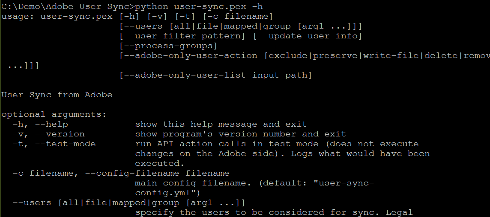

# Ausführen eines Testlaufs zum Überprüfen der Konfiguration

[Voriger Abschnitt](setup_config_files.md) \| [Zurück zum Inhaltsverzeichnis](index.md) \| [Nächster Abschnitt](monitoring.md)

So rufen Sie eine Benutzersynchronisation auf:

Windows:      **python user-sync.pex ….**

Unix, OS X:     **./user-sync ….**

Probieren Sie es aus:

	./user-sync –v            Version ausgeben
	./user-sync –h            Hilfe zu Befehlszeilenargumenten

&#9744; Führen Sie die beiden Befehle oben aus und vergewissern Sie sich, dass sie ordnungsgemäß funktionieren. (Unter Windows lauten die Befehle etwas anders.)

&#9744; Versuchen Sie als Nächstes eine Synchronisation mit einem einzelnen Benutzer, die Sie im Testmodus ausführen. Sie benötigen den Namen eines Benutzers in Ihrem Verzeichnis. Wenn der Benutzer beispielsweise bart@example.com ist, versuchen Sie folgenden Befehl:

	./user-sync -t --users all --user-filter bart@example.com --adobe-only-user-action exclude

	./user-sync -t --users all --user-filter bart@example.com --process-groups --adobe-only-user-action exclude

Mit dem ersten Befehl oben wird nur dieser Benutzer synchronisiert (aufgrund des Benutzerfilters). Dies sollte dazu führen, dass versucht wird, den Benutzer zu erstellen. Aufgrund der Ausführung im Testmodus (-t) wird bei der Ausführung der Benutzersynchronisation lediglich versucht, den Benutzer zu erstellen, ohne ihn tatsächlich zu erstellen. Mit der Option `--adobe-only-user-action exclude` wird verhindert, das bereits in der Adobe-Organisation vorhandene Benutzerkonten aktualisiert werden.

Mit dem zweiten Befehl oben (mit der Option --process-groups) wird versucht, den Benutzer zu erstellen und allen Gruppen hinzuzufügen, die über die entsprechenden Verzeichnisgruppen zugeordnet sind. Auch dieser Vorgang wird im Testmodus ausgeführt, sodass keine tatsächliche Aktion erfolgt. Wenn bereits Benutzer vorhanden sind und den Gruppen Benutzer hinzugefügt wurden, versucht die Benutzersynchronisation möglicherweise, diese zu entfernen. In diesem Fall überspringen Sie den nächsten Test. Wenn Sie den Produktzugriff nicht über Verzeichnisgruppen verwalten, lassen Sie alle Tests mit --process-groups aus.

&#9744; Versuchen Sie als Nächstes eine Synchronisation mit einem einzelnen Benutzer, die nicht im Testmodus ausgeführt wird. Dabei wird der Benutzer tatsächlich erstellt und zu Gruppen hinzugefügt (sofern diese zugeordnet wurden). 

	./user-sync --users all --user-filter bart@example.com --process-groups --adobe-only-user-action exclude

	./user-sync --users all --user-filter bart@example.com --process-groups --adobe-only-user-action exclude

&#9744; Überprüfen Sie als Nächstes in der Adobe Admin Console, ob der Benutzer angezeigt wird und die Gruppenmitgliedschaft hinzugefügt wurde.

&#9744; Führen Sie dann den gleichen Befehl erneut aus. Durch die Benutzersynchronisation sollte nicht versucht werden, den Benutzer nochmals zu erstellen und erneut Gruppen hinzuzufügen. Das Tool sollte erkennen, dass der Benutzer bereits vorhanden und Mitglied der Benutzergruppe oder Produktkonfiguration ist, und keine Aktion ausführen.

Wenn alle diese Befehle ordnungsgemäß ausgeführt werden, können Sie den Vorgang ohne Einschränkungen (ohne den Benutzerfilter) ausführen. Bei einer kleinen Anzahl von Benutzern in Ihrem Verzeichnis können Sie es jetzt gleich ausprobieren. Wenn mehr als einige Hundert Benutzer vorhanden sind, kann der Vorgang lange Zeit in Anspruch nehmen. Führen Sie ihn also erst aus, wenn es möglich ist, einen Befehl auszuführen, der einige Stunden dauert. Lesen Sie außerdem erst die nächsten Abschnitte, in denen möglicherweise weitere relevante Befehlszeilenoptionen behandelt werden.

[Voriger Abschnitt](setup_config_files.md) \| [Zurück zum Inhaltsverzeichnis](index.md) \| [Nächster Abschnitt](monitoring.md)

