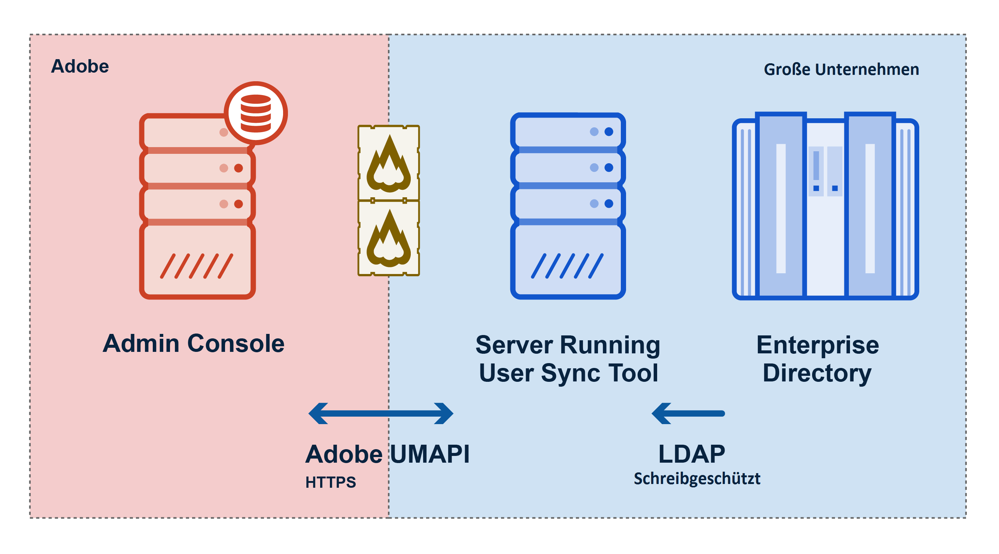

Version 2.1.1, veröffentlicht am 09.06.2017

Dieses Dokument enthält alle Informationen, die Sie zum Arbeiten mit dem Benutzer-Synchronisationstool benötigen. Dabei wird davon ausgegangen, dass Sie mit der Verwendung von Befehlszeilentools in Ihrem lokalen Betriebssystem vertraut sind und die Funktion von Verzeichnissystemen in Unternehmen kennen.

# Einführung

## In diesem Abschnitt
{:."no_toc"}

* TOC Placeholder
{:toc}

---

[Nächster Abschnitt](setup_and_installation.md)

---

Beim Benutzer-Synchronisationstool von Adobe handelt es sich um ein Befehlszeilentool, mit dem Benutzer- und Gruppeninformationen aus dem LDAP-kompatiblen Unternehmensverzeichnissystem Ihrer Organisation (z. B. Active Directory) in das Benutzerverwaltungssystem von Adobe übertragen werden.

Jedes Mal, wenn Sie das Benutzer-Synchronisationstool ausführen, wird nach Unterschieden zwischen den Benutzerinformationen in den beiden Systemen gesucht. Dann wird das Adobe-Verzeichnis aktualisiert, sodass es mit Ihrem Verzeichnis übereinstimmt.

## Voraussetzungen

Sie können das Benutzer-Synchronisationstool über die Befehlszeile oder mit einem Skript auf einem von Ihrem Unternehmen betriebenen Server ausführen, auf dem Python 2.7.9 oder höher installiert sein muss. Über die Mitgliedschaft in diesen Gruppen wird gesteuert, welche Benutzer in Ihrer Organisation auf welche Produkte zugreifen können.

Das Benutzer-Synchronisationstool ist ein Client der User Management API (UMAPI). Damit Sie es verwenden können, müssen Sie es zunächst als API-Client in der [Adobe I/O-Konsole](https://www.adobe.io/console/) registrieren und dann das Tool wie unten beschrieben installieren und konfigurieren.

Die Funktion des Tools wird durch lokale Konfigurationsdateien und Parameter beim Aufruf von Befehlen gesteuert, die verschiedene Konfigurationen unterstützen. Sie können z. B. steuern, welche Benutzer synchronisiert werden sollen, wie Verzeichnisgruppen den Adobe-Gruppen und -Produktkonfigurationen zugeordnet werden sollen usw.

Das Tool geht davon aus, dass Ihr Unternehmen Adobe-Produktlizenzen erworben hat. Sie müssen die [Adobe Admin Console](https://adminconsole.adobe.com/enterprise/) verwenden, um Benutzergruppen und Produktkonfigurationen zu definieren. Die Mitgliedschaft in diesen Gruppen steuert, welche Benutzer in Ihrer Organisation auf welche Produkte zugreifen können.

## Übersicht über die Funktion

Das Benutzer-Synchronisationstool kommuniziert über LDAP-Protokolle mit Ihrem Unternehmensverzeichnis. Die Kommunikation erfolgt dabei mit der Admin Console von Adobe über die Adobe User Management API (UMAPI), um die Daten des Benutzerkontos für Ihre Organisation zu aktualisieren. Die folgende Abbildung zeigt den Datenfluss zwischen den Systemen.

Jedes Mal, wenn Sie das Tool ausführen, geschieht Folgendes:

- Das Benutzer-Synchronisationstool fordert über LDAP Mitarbeiterdatensätze aus einem Unternehmensverzeichnissystem an.
- Das Benutzer-Synchronisationstool ruft über die User Management API aktuelle Benutzer und die zugehörigen Produktkonfigurationen aus der Adobe Admin Console ab.
- Das Benutzer-Synchronisationstool bestimmt, welche Benutzer erstellt, entfernt oder aktualisiert werden müssen und welche Gruppen- und Produktkonfigurationsmitgliedschaften sie haben sollen. Dies erfolgt auf Grundlage von Regeln, die Sie in den Konfigurationsdateien für das Benutzer-Synchronisationstool definiert haben.
- Das Benutzer-Synchronisationstool nimmt über die User Management API die erforderlichen Änderungen in der Adobe Admin Console vor.

## Einsatzmodelle

Das Benutzer-Synchronisationstool kann auf unterschiedliche Weise in Ihr Unternehmensmodell integriert werden, um automatisch nachzuverfolgen und zu steuern, welche Mitarbeiter und Partner Zugriff auf Ihre Adobe-Produkte haben.

Normalerweise führen Unternehmen das Tool als geplante Aufgabe aus, um regelmäßig Benutzerinformationen und Gruppenmitgliedschaften im Adobe-Benutzerverwaltungssystem mit den aktuellen Informationen im LDAP-Verzeichnis des Unternehmens zu aktualisieren.

Das Tool bietet daneben Optionen für verschiedene andere Arbeitsabläufe. Sie können z. B. nur die Benutzerinformationen aktualisieren und die Gruppenmitgliedschaften für den Produktzugriff direkt in der Adobe Admin Console verwalten. Sie können auswählen, dass alle Benutzer aktualisiert werden oder nur bestimmte Teilgruppen der Benutzer. Außerdem können Sie das Hinzufügen und Aktualisieren von Informationen vom Entfernen von Benutzern oder Mitgliedschaften trennen. Für das Entfernen stehen eine Reihe von Optionen zur Verfügung.

Weitere Informationen zu Verwendungsmodellen und deren Implementierung finden Sie weiter unten im Abschnitt [Verwendungsszenarien](usage_scenarios.md#verwendungsszenarien).

---

[Nächster Abschnitt](setup_and_installation.md)
