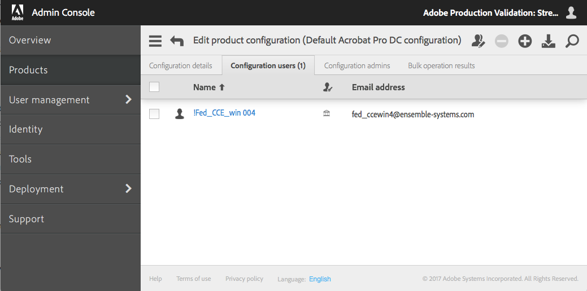

# Verwendungsszenarien

## In diesem Abschnitt
{:."no_toc"}

* TOC Placeholder
{:toc}

---

[Voriger Abschnitt](command_parameters.md)  \| [Nächster Abschnitt](advanced_configuration.md)

---

Es gibt verschiedene Möglichkeiten, das Benutzer-Synchronisationstool in Ihre Unternehmensprozesse zu integrieren. Beispiele:

* **Benutzer und Gruppenmitgliedschaften aktualisieren.** Sie synchronisieren Benutzer und Gruppenmitgliedschaften durch Hinzufügen, Aktualisieren und Entfernen von Benutzern im Adobe User Management-System. Dies ist der gängigste Anwendungsfall.
* **Nur Benutzerinformationen synchronisieren.** Verfolgen Sie diesen Ansatz, wenn der Produktzugriff über die Admin Console behandelt werden soll.
* **Zu synchronisierende Benutzer filtern.** Sie können die Synchronisation von Benutzerinformationen auf Benutzer in bestimmten Gruppen beschränken oder die Synchronisation auf Benutzer beschränken, die einem bestimmten Muster entsprechen. Sie können bei der Synchronisation auch auf eine CSV-Datei anstatt auf ein Verzeichnissystem Bezug nehmen.
* **Benutzer und Gruppenmitgliedschaften aktualisieren, jedoch Entfernungen separat behandeln.** Sie synchronisieren Benutzer und Gruppenmitgliedschaften durch Hinzufügen und Aktualisieren von Benutzern, wobei im ursprünglichen Aufruf jedoch keine Benutzer entfernt werden. Stattdessen pflegen Sie eine Liste von zu entfernenden Benutzern und führen anschließend die Entfernungen in einem separaten Aufruf aus.

Dieser Abschnitt enthält ausführliche Anweisungen für jedes dieser Szenarien.

## Benutzer und Gruppenmitgliedschaften aktualisieren

Dies ist typischste und häufigste Form des Aufrufs. Das Benutzer-Synchronisationstool sucht nach allen Änderungen an Benutzerinformationen und Informationen zu Gruppenmitgliedschaften auf der Unternehmensseite. Die Adobe-Seite wird synchronisiert, indem Benutzer und Benutzergruppen sowie Mitgliedschaften in Produktkonfigurationen hinzugefügt, aktualisiert und entfernt werden.

In der Standardeinstellung werden vom Benutzer-Synchronisationstool ausschließlich Benutzer mit dem Identitätstyp Enterprise ID oder Federated ID erstellt, entfernt und mit ihrer Gruppenmitgliedschaft verwaltet, da Adobe ID-Benutzer generell nicht im Verzeichnis verwaltet werden. Wenn dieser Ansatz in Ihrer Organisation verfolgt wird, finden Sie weitere Informationen in der [Beschreibung weiter unten](advanced_configuration.md#verwalten-von-benutzern-mit-adobe-ids) 
unter [Erweiterte Konfiguration](advanced_configuration.md#erweiterte-konfiguration).


In diesem Beispiel wird davon ausgegangen, dass die Konfigurationsdatei „user-sync-config.yml“ eine Zuordnung einer Verzeichnisgruppe zu einer Adobe-Produktkonfiguration mit dem Namen **Default Acrobat Pro DC configuration** enthält.

### Befehl

In diesem Aufruf werden die Parameter „users“ und „process-groups“ angegeben und das Entfernen von Benutzern wird durch den Parameter `adobe-only-user-action remove` zugelassen.

```sh
./user-sync –c user-sync-config.yml --users all --process-groups --adobe-only-user-action remove
```

### Protokollausgabe während der Ausführung

```text
2017-01-20 16:51:02 6840 INFO main - ========== Start Run ==========
2017-01-20 16:51:04 6840 INFO processor - ---------- Start Load from Directory -----------------------
2017-01-20 16:51:04 6840 INFO connector.ldap - Loading users...
2017-01-20 16:51:04 6840 INFO connector.ldap - Total users loaded: 4
2017-01-20 16:51:04 6840 INFO processor - ---------- End Load from Directory (Total time: 0:00:00) ---
2017-01-20 16:51:04 6840 INFO processor - ---------- Start Sync Dashboard ----------------------------
2017-01-20 16:51:05 6840 INFO processor - Adding user with user key: fed_ccewin4@ensemble-systems.com 2017-01-20 16:51:05 6840 INFO dashboard.owning.action - Added action: {"do": \[{"createFederatedID": {"lastname": "004", "country": "CA", "email": "fed_ccewin4@ensemble-systems.com", "firstname": "!Fed_CCE_win", "option": "ignoreIfAlreadyExists"}}, {"add": {"product": \["default acrobat pro dc configuration"\]}}\], "requestID": "action_5", "user": "fed_ccewin4@ensemble-systems.com"}
2017-01-20 16:51:05 6840 INFO processor - Syncing trustee org1... /v2/usermanagement/action/82C654BDB41957F64243BA308@AdobeOrg HTTP/1.1" 200 77
2017-01-20 16:51:07 6840 INFO processor - ---------- End Sync Dashboard (Total time: 0:00:03) --------
2017-01-20 16:51:07 6840 INFO main - ========== End Run (Total time: 0:00:05) ==========
```

### Ergebnis anzeigen

Bei erfolgreicher Synchronisation wird die Adobe Admin Console aktualisiert. Nach der Ausführung dieses Befehls zeigen Ihre Benutzerliste und die Produktkonfiguration-Benutzerliste in der Admin Console, dass der „Default Acrobat Pro DC configuration“ ein Benutzer mit einer Federated Identity hinzugefügt wurde.



### Nur Benutzerinformationen synchronisieren

Wenn für den Befehl nur der Parameter `users` angegeben wird, sucht die Aktion nach Änderungen der Benutzerinformationen im Unternehmensverzeichnis und aktualisiert die Adobe-Seite mit diesen Änderungen. Sie können Argumente für den Parameter `users` angeben, mit denen gesteuert wird, welche Benutzer auf der Unternehmensseite berücksichtigt werden sollen.

Bei diesem Aufruf wird nicht nach Änderungen der Gruppenmitgliedschaften gesucht und es wird keine Aktualisierung der Gruppenmitgliedschaften vorgenommen. Wenn Sie das Tool auf diese Weise verwenden, wird erwartet, dass Sie den Zugriff auf Adobe-Produkte steuern, indem Sie Informationen zu Mitgliedschaften in Benutzergruppen und Produktkonfigurationen in der Adobe Admin Console aktualisieren.

Außerdem werden Benutzer ignoriert, die sich zwar auf Adobe-Seite befinden, jedoch auf der Verzeichnisseite nicht mehr vorhanden sind, und es wird keine Verwaltung der Produktkonfigurationen oder Benutzergruppen durchgeführt.

```sh
./user-sync –c user-sync-config.yml --users all
```

### Zu synchronisierende Benutzer filtern

Um festzulegen, ob Informationen zu Gruppenmitgliedschaften synchronisiert werden sollen oder nicht, können Sie Argumente für den Parameter „users“ angeben, die filtern, welche Benutzer auf der Unternehmensverzeichnisseite berücksichtigt werden, oder die Benutzerinformationen aus einer CSV-Datei abrufen, anstatt direkt aus dem LDAP-Verzeichnis des Unternehmens.

### Nur Benutzer in bestimmten Gruppen synchronisieren

Bei dieser Aktion wird nur nach Änderungen an Benutzerinformationen gesucht, die Mitglieder der angegebenen Gruppen sind. Es wird nicht nach anderen Benutzern im Unternehmensverzeichnis gesucht und es wird keine Verwaltung von Produktkonfigurationen oder Benutzergruppen ausgeführt.

```sh
./user-sync –c user-sync-config.yml --users groups "group1, group2, group3"
```

### Nur Benutzer in zugeordneten Gruppen synchronisieren

Diese Aktion entspricht der Angabe von `--users groups "..."`, wobei `...` alle Gruppen in der Gruppenzuordnung in der Konfigurationsdatei angibt.

```sh
./user-sync –c user-sync-config.yml --users mapped
```

### Nur übereinstimmende Benutzer synchronisieren

Bei dieser Aktion wird nur nach Änderungen der Benutzerinformationen für Benutzer gesucht, deren Benutzer-ID einem Muster entspricht. Das Muster wird mit einem regulären Python-Ausdruck definiert. In diesem Beispiel werden außerdem Gruppenmitgliedschaften aktualisiert.

```sh
user-sync --users all --user-filter 'bill@forxampl.com' --process-groups
user-sync --users all --user-filter 'b.*@forxampl.com' --process-groups
```

### Synchronisation aus einer Datei

Bei dieser Aktion wird mit Benutzerinformationen aus einer CSV-Datei synchronisiert, anstatt im Unternehmensverzeichnis zu suchen. Ein Beispiel für eine solche Datei, „users-file.csv“, wird im Download mit Beispielkonfigurationsdateien in `examples/csv inputs - user and remove lists/` bereitgestellt.

```sh
./user-sync --users file user_list.csv
```

Das Synchronisieren aus einer Datei kann in zwei Situationen angewendet werden. Erstens können Adobe-Benutzer mithilfe einer Tabelle verwaltet werden. In der Tabelle werden Benutzer, ihre jeweiligen Gruppen sowie Informationen über diese aufgelistet. Zweitens – wenn das Unternehmensverzeichnis Push-Benachrichtigungen für Aktualisierungen übermitteln kann – können diese Benachrichtigungen in einer CSV-Datei platziert und zum Steuern von Aktualisierungen durch das Benutzer-Synchronisationstool verwendet werden. Im untenstehenden Abschnitt finden Sie weitere Einzelheiten zu diesem Verwendungsszenario.

### Benutzer und Gruppenmitgliedschaften aktualisieren, jedoch Entfernungen separat behandeln

Wenn Sie den Parameter `--adobe-only-user-action` nicht angeben, können Sie Benutzer und Gruppenmitgliedschaften synchronisieren, ohne dass Benutzer von der Adobe-Seite entfernt werden.

Wenn Sie Entfernungen separat behandeln möchten, können Sie das Tool anweisen, Benutzer zu kennzeichnen, die nicht mehr im Unternehmensverzeichnis, jedoch immer noch auf Adobe-Seite vorhanden sind. Der Parameter `--adobe-only-user-action write-file exiting-users.csv` schreibt die Liste der zum Entfernen gekennzeichneten Benutzer in eine CSV-Datei.

Um die Entfernungen in einem separaten Aufruf auszuführen, können Sie die durch den Parameter `--adobe-only-user-action write-file` generierte Datei übergeben oder Sie können eine CSV-Datei mit Benutzern übergeben, die auf andere Weise generiert wurde. Ein Beispiel für eine solche Datei, `remove-list.csv`, wird in der Datei „example-configurations.tar.gz“ im Ordner `csv inputs - user and remove lists` bereitgestellt.

#### Benutzer hinzufügen und eine Liste mit zu entfernenden Benutzern generieren

Bei dieser Aktion werden alle Benutzer synchronisiert; zudem wird eine Liste der Benutzer generiert, die nicht mehr im Verzeichnis, jedoch auf Adobe-Seite vorhanden sind.

```sh
./user-sync --users all --adobe-only-user-action write-file users-to-remove.csv
```

#### Benutzer aus einer separaten Liste entfernen

Bei dieser Aktion wird eine CSV-Datei mit einer Liste der zum Entfernen gekennzeichneten Benutzer erfasst und diese Benutzer werden aus der Organisation auf Adobe-Seite entfernt. Diese CSV-Datei ist typischerweise die Datei, die durch einen früheren Aufruf mit dem Parameter `--adobe-only-user-action write-file` generiert wurde.

Sie können eine CSV-Datei mit zu entfernenden Benutzern auch auf andere Weise erstellen. Wenn die Liste jedoch Benutzer enthält, die im Verzeichnis noch vorhanden sind, werden diese Benutzer bei der nächsten Synchronisationsaktion mit Hinzufügen von Benutzern auf Adobe-Seite wieder hinzugefügt.

```sh
./user-sync --adobe-only-user-list users-to-remove.csv --adobe-only-user-action remove
```

### Benutzer löschen, die auf Adobe-Seite, jedoch nicht im Verzeichnis vorhanden sind

In diesem Aufruf werden die Parameter „users“ und „process-groups“ angegeben und das Löschen von Benutzerkonten wird durch den Parameter „adobe-only-user-action delete“ zugelassen.

```sh
./user-sync --users all --process-groups --adobe-only-user-action delete
```

### Benutzer aus einer separaten Liste löschen

Ähnlich wie beim obigen Beispiel zum Entfernen von Benutzern werden in diesem Beispiel Benutzer gelöscht, die lediglich auf Adobe-Seite vorhanden sind. Grundlage ist die Liste, die bei einer früheren Ausführung des Benutzer-Synchronisationstools generiert wurde.

```sh
./user-sync --adobe-only-user-list users-to-delete.csv --adobe-only-user-action delete
```

## Push-Benachrichtigungen behandeln

Wenn Ihr Verzeichnissystem Benachrichtigungen über Aktualisierungen generieren kann, können Sie diese Aktualisierungen mit dem Benutzer-Synchronisationstool inkrementell verarbeiten. Mit der in diesem Abschnitt veranschaulichten Methode können auch sofortige Aktualisierungen verarbeitet werden, wenn ein Administrator einen Benutzer oder eine Gruppe von Benutzern aktualisiert hat und diese Aktualisierungen per Push direkt in das Benutzerverwaltungssystem von Adobe übertragen möchte. Möglicherweise sind einige Skripts erforderlich, um die Informationen aus der Push-Benachrichtigung in ein CSV-Format zu transformieren, das als Eingabe für die Benutzersynchronisation geeignet ist, sowie um Löschvorgänge von anderen Aktualisierungen abzugrenzen, die in der Benutzersynchronisation separat behandelt werden müssen.

Erstellen Sie eine Datei (z. B. `updated_users.csv`) mit dem in der Beispieldatei `users-file.csv` im Ordner `csv inputs - user and remove lists` veranschaulichten Format für Benutzeraktualisierungen. Dies ist die grundlegende CSV-Datei mit den Spalten „firstname“, „lastname“ usw.

    firstname,lastname,email,country,groups,type,username,domain
    John,Smith,jsmith@example.com,US,"AdobeCC-All",enterpriseID
    Jane,Doe,jdoe@example.com,US,"AdobeCC-All",federatedID
 
Diese Datei wird dann für das Benutzer-Synchronisationstool bereitgestellt:

```sh
./user-sync --users file updated-users.csv --process-groups --update-users --adobe-only-user-action exclude
```

„--adobe-only-user-action exclude“ bewirkt, dass die Benutzersynchronisation nur in der Datei „updated-users.csv“ enthaltene Benutzer aktualisiert und alle übrigen ignoriert.

Löschungen werden ebenso behandelt. Erstellen Sie eine Datei `deleted-users.csv` basierend auf dem Format von `remove-list.csv` im gleichen Beispielordner und führen Sie das Benutzer-Synchronisationstool aus:

```sh
./user-sync --adobe-only-user-list deleted-users.csv --adobe-only-user-action remove
```

Dadurch werden Löschungen auf der Grundlage der Benachrichtigung behandelt und es werden keine anderen Aktionen ausgeführt. Beachten Sie, dass Sie `remove`, je nachdem, wie gelöschte Benutzer behandelt werden sollen, durch eine der anderen Aktionen ersetzen können.

## Übersicht über die Aktionen

Bei Abschluss des Aufrufs wird eine Übersicht über die Aktionen im Protokoll ausgegeben (wenn als Ebene INFO oder DEBUG festgelegt ist). 
Die Übersicht bietet während der Ausführung aufgelaufene Statistiken. 
Erfasste Statistiken:

- **Total number of Adobe users:** Gesamtzahl der Adobe-Benutzer in der Admin Console
- **Number of Adobe users excluded:** Anzahl der Adobe-Benutzer, die durch die exclude-Parameter von Vorgängen ausgeschlossen wurden
- **Total number of directory users:** Gesamtzahl der Benutzer, die aus LDAP oder der CSV-Datei ausgelesen wurden
- **Number of directory users selected:** Anzahl der Verzeichnisbenutzer, die über den user-filter-Parameter ausgewählt wurden
- **Number of Adobe users created:** Anzahl der Adobe-Benutzer, die während dieser Ausführung erstellt wurden
- **Number of Adobe users updated:** Anzahl der Adobe-Benutzer, die während dieser Ausführung aktualisiert wurden
- **Number of Adobe users removed:** Anzahl der Adobe-Benutzer, die auf Adobe-Seite aus dem Unternehmen entfernt wurden
- **Number of Adobe users deleted:** Anzahl der Adobe-Benutzer, die aus dem Unternehmen entfernt wurden, und der Enterprise/Federated-Benutzerkonten, die auf Adobe-Seite gelöscht wurden
- **Number of Adobe users with updated groups:** Anzahl der Adobe-Benutzer, die einer oder mehreren Benutzergruppen hinzugefügt wurden
- **Number of Adobe users removed from mapped groups:** Anzahl der Adobe-Benutzer, die aus einer oder mehreren Benutzergruppen entfernt wurden
- **Number of Adobe users with no changes:** Anzahl der Adobe-Benutzer, die während dieser Ausführung nicht geändert wurden

### Beispiel für eine Übersicht der Aktionen, die in das Protokoll ausgegeben wurde
```text
2017-03-22 21:37:44 21787 INFO processor - ------------- Action Summary -------------
2017-03-22 21:37:44 21787 INFO processor -   Total number of Adobe users: 50
2017-03-22 21:37:44 21787 INFO processor -   Number of Adobe users excluded: 0
2017-03-22 21:37:44 21787 INFO processor -   Total number of directory users: 10
2017-03-22 21:37:44 21787 INFO processor -   Number of directory users selected: 10
2017-03-22 21:37:44 21787 INFO processor -   Number of Adobe users created: 7
2017-03-22 21:37:44 21787 INFO processor -   Number of Adobe users updated: 1
2017-03-22 21:37:44 21787 INFO processor -   Number of Adobe users removed: 1
2017-03-22 21:37:44 21787 INFO processor -   Number of Adobe users deleted: 0
2017-03-22 21:37:44 21787 INFO processor -   Number of Adobe users with updated groups: 2
2017-03-22 21:37:44 21787 INFO processor -   Number of Adobe users removed from mapped groups: 5
2017-03-22 21:37:44 21787 INFO processor -   Number of Adobe users with no changes: 48
2017-03-22 21:37:44 21787 INFO processor - ------------------------------------------
```

---

[Voriger Abschnitt](command_parameters.md)  \| [Nächster Abschnitt](advanced_configuration.md)

