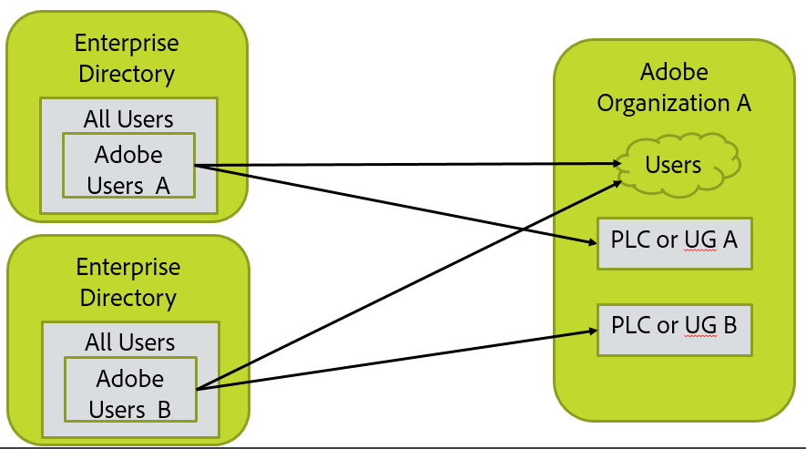

## Layout Your Organization, Groups, and Directories
[Previous Section](before_you_start.md) | [Back to Contents](Contents.md) |  [Next Section](layout_products.md)

In this step, you will need to create a picture of your directory, Adobe organization, and user configuration.  This should include the LDAP query for selecting the users, and list of domains where the users are based.  (If a user has email n@d.com, d.com is the domain of the user.)

### Simplest Case

&#9744; You’ll need the LDAP query that selects the set of users to be sync’d with Adobe.  This will go into one of the user sync configuration files in a later step.

Most configurations look like this.  There is a single directory and a single Adobe organization. All user might be selected as users to go into Adobe, or only a subset such as members of a particular directory group.  You will have to decide how this should be set up for your organization and have the LDAP query that selected the right users.

&#9744; You need to claim each domain on the Adobe Admon Console for the Adobe Organization in which it will be managed.

### Multiple Adobe Organizations

&#9744; You’ll need two LDAP queries that select the sets of users to be sync’d with Adobe

You’ll also need to run two sync configurations; one for each organization.  This basically involves installing user sync twice with each install in a different directory.

If licenses in one org are to be used by users in the other org, setup is more complex.  You'll need to get Adobe organization access credentials for each organization from which licenses will be assigned to users.

You'll need:

- &#9744; Admin access to each of the Adob organizations

- &#9744; The LDAP query for each set of users

-  Be prepared to set up multiple user sync installs in later steps.

### Multi-Directory and Multi-org case

This are basically two instances of everything; You’ll need to run two sync configurations; one for each directory and organization

If licenses in one org are to be used by users in the other org, setup is more complex.

### Multi-Directory and single org case

You’ll need to run two sync configurations; one for each directory.

User Groups (UG) and Product License Configurations (PLC) must not overlap.  That is, each user group and PLC and be managed by only a single instance of user sync.

You cannot have user sync delete users when configured this way.

[Previous Section](before_you_start.md) | [Back to Contents](Contents.md) |  [Next Section](layout_products.md)
