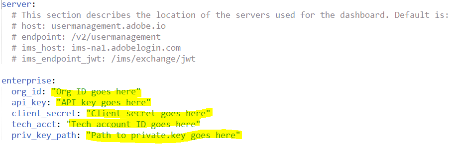

## Setup Configuration Files

[Previous Section](install_sync.md) | [Back to Contents](Contents.md) |  [Next Section](test_run.md)

Now comes the step where we put everything together.  You’ll need:

- Adobe.io integration access values from the adobe.io console
- Private key file
- Directory system access credentials and information about how users are organized
- Decision of whether you are managing product access via user sync
  - Product License Configuration names and user group names for how you want licenses organized on the Adobe side

Be sure to use a text editor, not a word processing editor.

Be sure to use spaces, not tabs in .yml files.

### Let’s setup the configuration files.

In previous steps, you set up a file system directory for the user sync tool Python code and configuration files.  There are three configuration files to set up now.  One is for accessing the directory system, one is for accessing the Adobe organization, and one defines the group mapping and configures other user sync features. 

#### Directory Access Configuration File

If you are driving user sync file a file, you can skip this step.  Setup a csv file with your entire user list following the "csv inputs - user and remove lists/1 users-file.csv" file example.  This file is in the examples.config.tar.gz download from the release.

&#9744; Edit the file connector-ldap.yml.  This file has access information to the directory.  Put in username, password, host, and base_dn values

&#9744; Read through the rest of the file to see what else could be specified which might apply in your installation.  Usually, nothing else is required.

If you need a non-default LDAP query to select the desired set of users, it is setup in this file as part of the all\_users\_filter config parameter.

#### Adobe UMAPI Credentials 

&#9744; Edit the dashboard-config.yml.  Put in the information from the adobe.io integration you created earlier.  This would be the org\_id, api\_key, client\_secret, and tech\_acct.

&#9744; Place the private key file in the user-sync folder The priv\_key\_path config file items is then set to the name of this file.

#### Main User Sync config file 

Edit the user-sync-config.yml file.

##### Default Country Code

	directory:
	  # (optional) Default country code to use if directory doesn't provide one for a user [Must be two-letter ISO-3166 code - see https://en.wikipedia.org/wiki/ISO_3166-1]
	  #
	  # example:
	  # default_country_code: US

If your directory does not list a country for each user, you can set a default country here.  Remove the "# " from the default country code line so it looks like this

	  default_country_code: US

and set the code to the appropriate country.  Don't change the indent level of the line.

A country code is **REQUIRED** for Federated Ids and recommended for Enterprise Ids.  If not supplied for Enterprise Ids, the user will be prompted to choose a country when they first log in.

#### Connectors

	  connectors:
	    # specifies the configurations for the difference directory connectors
	    # The format is name : value, where value can be:
	    # a dictionary for the actual configuration, or 
	    # a string for the file containing the configuration, or
	    # a list containing a mixture of dictionaries and strings
	    #
	    # examples:   
	    # ldap: example.connector-ldap.yml
	    # ldap: 
	    #   - host: LDAP_host_URL_goes_here
	    #     base_dn: base_DN_goes_here
	    #   - connector-ldap-credentials.yml

You shouldn't need to make any changes here.  The ldap line is used if you are using a non-default name for the ldap directory access config file.

##### Group Map

If you are not managing licenses via user-sync, you can skip the group mapping parts.

	dashboard:
	  owning: dashboard-config.yml
	directory:
	  default_country_code: US
	  connectors:
	     ldap: connector-ldap.yml
	  groups:
	    - directory_group: acrobat_pro_dc
	      dashboard_groups: 
	        - Default Acrobat Pro DC configuration
	    - directory_group: all_apps
	      dashboard_groups:
	        - All Apps
	  user_identity_type: enterpriseID
	logging:
	  log_to_file: True
	  file_log_directory: logs
	  file_log_level: info
	# limits and user_removal discussed later

Some customers want to provision user accounts by adding them to an enterprise directory group using LDAP/AD tools rather than the Adobe Admin Console.

To support this, the config file defines a mapping from directory groups to Adobe PLCs.

If a user is a member of a directory group, user-sync will add them to the corresponding PLC.

Same for removal.

##### Delete Limits 

Prevention for accidental account deletion

	limits:
	    max_deletions_per_run: 10   # ceiling on disable/remove/delete
	    max_missing_users: 200      # abort if this many directory users disappear

These config file entries are to prevent runaway deletion in case of misconfiguration or other problems.

Raise these values if you will routinely delete more than 10 users per run, or if the size of the directory routinely fluctuates by more than 200 users.

##### Delete Protection*

If you want to drive account creation and removal through User Sync, and want to manually create a few accounts then you may need this feature to keep User Sync from deleting your manually created accounts

	user_removal:
	    - exclude_group: special_users   
	    - exclude:   ".*@example.com"   
	    - exclude_adobe_id              

These are optional items in the main configuration file
- exclude_group: names a user group.  Any users in this group are not removed
- exclude: a user name or pattern.  Any matching users are not removed
- exclude_adobe_id:  this causes any account of type AdobeId to not be removed
- These apply to the disable/removal/or deletion of accounts by User Sync
- Note that Federated accounts that are not in the directory cannot log in anyway (because login is handled by the ID provider where the user is no longer listed)

##### Logging

	logging:
	  # specifies whether you wish to generate a log file
	  # 'True' or 'False'
	  log_to_file: True
	  # output path for logs
	  file_log_directory: logs
	  # File Logging Level: Can be "debug", "info", "warning", "error", or "critical".  
	  # This is in ascending order, meaning "debug" < "critical".
	  file_log_level: debug
	  # Console Logging Level: Can be "debug", "info", "warning", "error", or "critical".  
	  # This is in ascending order, meaning "debug" < "critical".  Default is:
	  # console_log_level: debug

\*  Future feature

[Previous Section](install_sync.md) | [Back to Contents](Contents.md) |  [Next Section](test_run.md)
