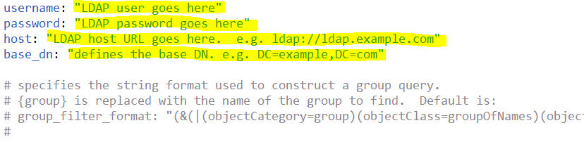
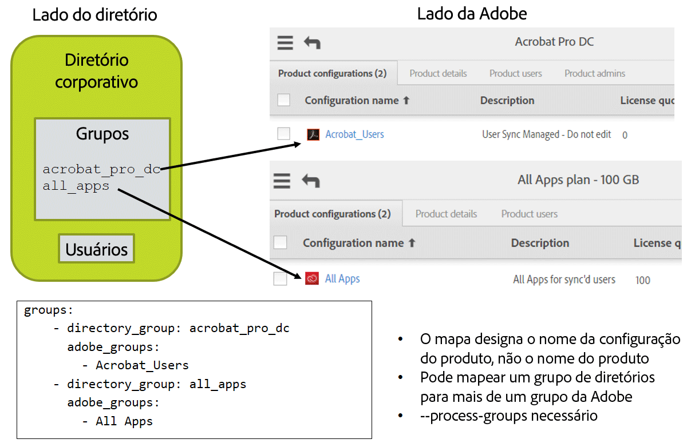

# Definição de arquivos de configuração


[Seção anterior](install_sync.md) \| [Voltar ao sumário](index.md) \| [Próxima seção](test_run.md)


Nesta etapa trabalharemos com as configurações necessárias.  Você precisará do seguinte:

- Valores de acesso da integração do Adobe.io do Adobe.io Console
- Arquivo de chave privada
- Credenciais de acesso do sistema de diretórios e informações sobre como os usuários são organizados
- Decidir se o acesso ao produto será gerenciado por meio do User Sync
  - Nomes de configuração de produtos e nomes de grupos de usuários para o esquema cujas licenças você deseja que sejam organizadas do lado da Adobe
  - As configurações de produtos e os grupos de usuários já devem ter sido criados no Adobe Admin Console.

Certifique-se de usar um editor de texto, não um editor de processamento de palavras.

Certifique-se de usar espaços, não tabulações em arquivos .yml.


## Definição dos arquivos de configuração

Nas etapas anteriores, você configurou um diretório de sistema de arquivos para os arquivos de configuração e código Python da ferramenta User Sync.  Agora, é preciso configurar três arquivos de configuração.  Um para acessar o sistema de diretórios, um para acessar sua organização da Adobe e um que definirá a atribuição do grupo e configurará outros recursos do User Sync. 

### Arquivo de configuração de acesso ao diretório

Se você estiver executando o User Sync de um arquivo, poderá ignorar a configuração de connector-ldap.yml e criar um arquivo csv com toda a sua lista de usuários seguindo o exemplo do arquivo “csv inputs - user and remove lists/users-file.csv”.  Esse arquivo está no download do example-configurations.tar.gz da versão.

&#9744; Edite o arquivo connector-ldap.yml.  Ele tem informações de acesso para o sistema de diretório.  Insira valores de nome de usuário, senha, host e base_dn.

&#9744; Leia o restante do arquivo para verificar se outros itens aplicáveis à sua instalação podem ser especificados.  Geralmente, nada mais é necessário.



Se você precisar de uma consulta LDAP não padrão-para selecionar o conjunto de usuários desejado, ela é configurada neste arquivo como parte do parâmetro de configuração all\_users\_filter.


### Credenciais da Adobe UMAPI 

&#9744; Edite connector-umapi.yml.  Insira as informações da integração do adobe.io que você criou anteriormente.  São elas: org\_id, api\_key, client\_secret e tech\_acct.

&#9744; Coloque o arquivo de chave privada na pasta user_sync_tool. Em seguida, o item de arquivo de configuração priv\_key\_path é definido para o nome desse arquivo.


### Arquivo de configuração principal User Sync 

Edite o arquivo user-sync-config.yml.

#### Código padrão de país

	directory:
	  # (opcional) Código padrão de país a ser usado se o diretório não fornecer um para o usuário [Must be two-letter ISO-3166 code - see https://en.wikipedia.org/wiki/ISO_3166-1]
	  #
	  # exemplo:
	  # default_country_code: US


&#9744; Se o seu diretório não listar um país para cada usuário, você poderá definir um país padrão aqui.  Remova o símbolo “#” da linha de código padrão de país para que fique assim

	  default_country_code: US

e defina o código de país apropriado.  Não mude o nível de recuo da linha.

Um código de país é **OBRIGATÓRIO** para Federated IDs e recomendado para Enterprise IDs.  Caso não receba Enterprise IDs, será solicitado que o usuário escolha um país ao fazer logon pela primeira vez.

### Conectores

	  connectors:
	    # especifica as configurações para os conectores de diretório de divergência
	    # O formato é nome : valor, onde valor pode ser:
	    # um dicionário para a configuração real, ou 
	    # uma cadeia de caracteres para o arquivo que contém a configuração, ou
	    # uma lista contendo uma combinação de dicionários e cadeias de caracteres
	    #
	    # exemplos:   
	    # ldap: example.connector-ldap.yml
	    # ldap: 
	    #   - host: LDAP_host_URL_goes_here
	    #     base_dn: base_DN_goes_here
	    #   - connector-ldap-credentials.yml

Não deve ser necessário que você faça alterações aqui.  A linha ldap será usada se você estiver usando um nome não padrão-para o arquivo de configuração de acesso ao diretório Idap

#### Mapa do grupo

Se você não estiver gerenciando licenças por meio do User Sync, poderá ignorar esta seção em que definimos o mapeamento do grupo.

Você pode provisionar contas de usuários adicionando-as a um grupo de diretórios corporativo usando ferramentas LDAP/AD em vez do Adobe Admin Console.  Depois, o arquivo de configuração define um mapeamento dos grupos de diretórios para PCs da Adobe.  Se um usuário for um membro de um grupo de diretórios, o user-sync o adicionará ao PC correspondente.  O mesmo acontece em caso de remoção.


&#9744; Edite a parte de mapeamento de grupo do arquivo.  Para cada grupo de diretórios D que deve ser mapeado para uma configuração de produtos (PC) da Adobe ou grupo de usuários P, adicione uma entrada depois de “groups:” do formulário

	    - directory_group: D
	      adobe_groups: 
	        - P

Um exemplo mais realista é:

	  groups:
	    - directory_group: acrobat_pro_dc
	      adobe_groups: 
	        - Default Acrobat_Users
	    - directory_group: all_apps
	      adobe_groups:
	        - Todos os Apps




#### Limites de usuários sem correspondência 

Os limites de exclusão impedem a exclusão acidental de contas em caso de uma configuração incorreta ou outro problema que faça que impeça que o User Sync obtenha os dados apropriados do sistema de diretórios.

&#9744; Se você espera uma redução de mais de 200 usuários de diretório entre as execuções do User Sync, precisará aumentar o valor de `max_adobe_only_users`.  Essa entrada do arquivo de configuração impede a exclusão descontrolada no caso de configuração incorreta ou outros problemas.

	limits:
	    max_adobe_only_users: 200      # cancelar atualizações se esses vários usuários de diretório desaparecerem


#### Proteção de exclusão

Se você quiser criar e remover contas pelo User Sync e criar manualmente algumas contas, poderá precisar deste recurso para que o User Sync não exclua suas contas criadas manualmente.

&#9744; Se precisar usar esse recurso, adicione linhas como as abaixo ao arquivo de configuração em adobe_users.   Para proteger os usuários no Admin Console das atualizações, crie um grupo de usuários e coloque os usuários protegidos nesse grupo, depois liste o grupo como excluído do processamento do User Sync.  Você também pode listar usuários específicos e/ou um padrão que corresponda a nomes de usuários específicos para proteger esses usuários.  Você também pode proteger os usuários com base em seus tipos de identidade.  Por exemplo, geralmente o User Sync é usado somente para gerenciar tipos de usuários federatedID ou enterpriseID, e você pode excluir os usuários do tipo adobeID do gerenciamento pelo User Sync.  Só é preciso incluir itens de configuração para exclusões que você desejar usar.

```YAML
adobe_users:
  exclude_adobe_groups: 
    - administrators   # Names an Adobe user group or product configuration whose members are not to be altered or removed by User Sync
    - contractors      # You can have more than one group in a list
  exclude_users:
    - ".*@example.com"
    - important_user@gmail.com
  exclude_identity_types:
    - adobeID          # adobeID, enterpriseID, and/or federatedID
```


Acima, administradores, contratantes e nomes de usuários são valores de exemplo.  Você usaria os nomes dos grupos de usuários da Adobe, configurações de produtos ou usuários que criou.

`exclude_groups` define uma lista de grupos de usuários da Adobe, configurações de produtos, ou ambos. Os usuários da Adobe que são membros de grupos listados não são removidos, atualizados nem têm a associação a grupos alterada.

`exclude_users` fornece uma lista de padrões. Os usuários da Adobe com nomes de usuários que correspondam a (por padrão maiúsculas e minúsculas não são diferenciadas,-a menos que o modelo padrão especifique o contrário)-qualquer um dos modelos padrão especificados não são removidos, atualizados nem têm a associação a grupos alterada.

`exclude_identity_types` fornece uma lista de tipos de identidade. Os usuários da Adobe que têm um desses tipos de identidade não são removidos, atualizados nem têm a associação a grupos alterada.

Note que:

- Geralmente você não usaria todas as três opções de exclusão.

- Os usuários do lado do diretório ainda são criados do lado da Adobe, mesmo que um dos parâmetros de exclusão excluísse o usuário do lado da Adobe das atualizações em execuções sucessivas. Ou seja, esses parâmetros se aplicam somente a usuários da Adobe que existem quando o diretório da Adobe está sendo correspondido ao diretório do cliente.

- As contas que teriam sido removidas ou atualizadas, mas que não foram por causa desse recurso são listadas como entradas de registro de nível `debug`.

- Contas Federated que não estejam no diretório ou que estejam desativadas no diretório não podem fazer logon (pois o logon é feito pelo provedor de ID e o usuário não está mais listado nele), mesmo se a conta ainda existir na Adobe.
- Provavelmente você irá querer excluir as identidades do tipo adobeID, pois elas não estão normalmente listadas no diretório corporativo.


#### Registros

O User Sync produz entradas de registro que são impressas na saída padrão e também gravadas em um arquivo de registro.  O conjunto de registros de definições de configurações controla os detalhes sobre o local e a quantidade de informações de registro produzidas.

log\_to\_file ativa ou desativa o registro do arquivo.  

As mensagens podem ter um de cinco níveis de importância e você pode escolher a menos importante a ser incluída no registro do arquivo ou no registro de saída padrão para o console.  Os padrões servem para produzir o registro do arquivo e incluir as mensagens de nível “info” ou superior.  Essa é a configuração recomendada.

&#9744; Revise as configurações dos registros e faça as alterações desejadas.  O nível de registro recomendado é “info” (padrão).

	logging:
	  # especifica se você quer gerar um arquivo de registro
	  # 'True' ou 'False'
	  log_to_file: True
	  # caminho de saída para os registros
	  file_log_directory: logs
	  # Nível de registro de arquivo: pode ser “debug”, “info”, “warning”, “error” ou “critical”.  
	  # Isso está em ordem crescente, o que significa que “debug” &lt; “critical”.
	  file_log_level: debug
	  # Nível de registro do console: pode ser “debug”, “info”, “warning”, “error” ou “critical”.  
	  # Isso está em ordem crescente, o que significa que “debug” &lt; “critical”.  O padrão é:
	  # console_log_level: debug


[Seção anterior](install_sync.md) \| [Voltar ao sumário](index.md) \| [Próxima seção](test_run.md)
