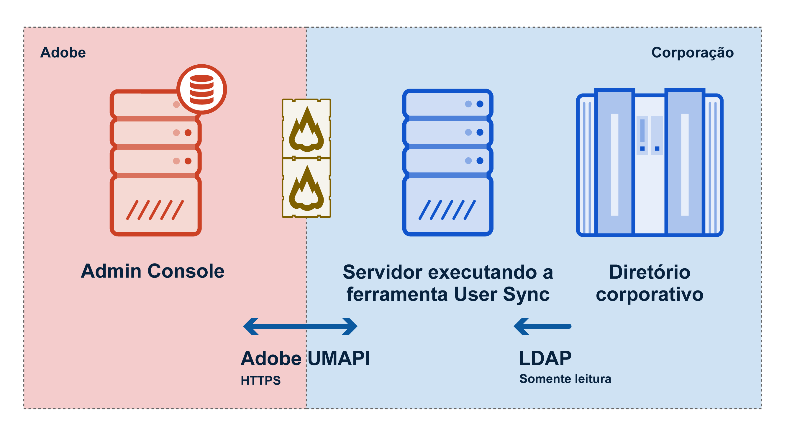

Versão 2.1.1, lançada em 09-06-2017

Este documento contém todas as informações necessárias para você começar a
trabalhar com o User Sync. Ele pressupõe que você esteja familiarizado com o uso de
ferramentas de linha de comando em seu sistema operacional local, bem como tenha uma
compreensão geral da operação de sistemas de diretórios
corporativos.

# Introdução

## Nesta seção
{:.“no_toc”}

* Marcador TOC
{:toc}

---

[Next Section](setup_and_installation.md)

---

O User Sync, da Adobe, é uma ferramenta-de linha de comando que transfere as informações de usuários e
grupos do sistema de diretórios corporativo-compatível com
LDAP (como um Active Directory) para o
sistema de gerenciamento de usuários da Adobe.

Cada vez que você executa o User Sync, ele procura diferenças entre as
informações de usuários nos dois sistemas e atualiza o
diretório Adobe para corresponder ao seu diretório.

## Pré-requisitos

Execute o User Sync na linha de comando ou a partir de um script, em um
servidor que sua empresa opera, o qual deve ter o Python
2.7.9 ou posterior instalado. O servidor deve ter uma conexão à
Internet e poder acessar o sistema de gerenciamento de usuários da Adobe
e seu próprio sistema de diretórios corporativo.

A ferramenta User Sync é um cliente da API de gerenciamento de usuários
(UMAPI). Para usá-la, é necessário primeiro registrá-la como
cliente da API no [console do Adobe I/O](https://www.adobe.io/console/),
e, em seguida, instalar e configurar a ferramenta, conforme descrito a seguir.

A operação da ferramenta é controlada por arquivos de configuração local
e parâmetros de invocação de comando que fornecem suporte para
diversas configurações. Você pode controlar, por exemplo, quais
usuários devem ser sincronizados, como os grupos de diretórios devem ser mapeados para
grupos e configurações de produtos Adobe e diversas outras
opções.

A ferramenta pressupõe que sua empresa comprou licenças
de produtos da Adobe. Use o
[Adobe Admin Console](https://adminconsole.adobe.com/enterprise/) para definir
grupos de usuários e configurações de produtos. A associação a
esses grupos controla quais usuários da sua organização podem acessar
quais produtos.

## Visão geral de operação

O User Sync se comunica com o diretório da sua empresa por meio de
protocolos LDAP. Ele se comunica com o Admin Console da Adobe
por meio da API de gerenciamento de usuários (UMAPI) da Adobe para atualizar
os dados da conta de usuário para sua organização. A figura a seguir
ilustra o fluxo de dados entre sistemas.

Cada vez que você executa a ferramenta:

- O User Sync solicita registros de funcionários de um
sistema de diretórios corporativo por meio do LDAP.
- O User Sync solicita os usuários atuais e as configurações de produtos associadas
do Adobe Admin Console por meio da
API de gerenciamento de usuários.
- O User Sync determina quais usuários precisam ser criados, removidos
ou atualizados e quais grupos de usuários e associações de configurações de produtos
eles devem ter, com base nas regras que você definiu nos
arquivos de configuração do User Sync.
- O User Sync faz as alterações necessárias no Adobe Admin Console
por meio da API de gerenciamento de usuários.

## Modelos de uso

A ferramenta User Sync pode se adequar ao seu modelo de negócio de várias
maneiras, para ajudá-lo a automatizar o processo de monitoramento e
controle de quais de seus funcionários e associados têm acesso aos
produtos da Adobe.

Normalmente, uma empresa executa a ferramenta como uma tarefa agendada, a
fim de atualizar periodicamente as informações de usuários e as
associações a grupos no sistema de gerenciamento de usuários da Adobe com as
informações atuais no diretório LDAP da empresa.

A ferramenta também oferece opções para vários outros fluxos de trabalho. Você
pode escolher atualizar apenas as informações de usuários, por exemplo, e
lidar com associações a grupos para obter acesso ao produto diretamente no Adobe
Admin Console. Também pode atualizar todos os usuários ou apenas
subconjuntos específicos de toda a sua população de usuários.
Além disso, você pode separar as tarefas de adicionar e atualizar
informações da tarefa de remover usuários ou associações. Existem
várias opções para lidar com a tarefa de remoção.

Para obter mais informações sobre modelos de uso e como implementá-los,
consulte a seção [Cenários de uso](usage_scenarios.md#usage-scenarios) a seguir.

---

[Próxima seção](setup_and_installation.md)
