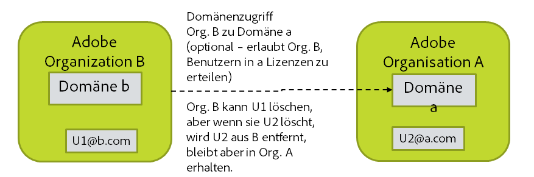

# Gewünschtes Verhalten bei Kontolöschung

[Voriger Abschnitt](layout_products.md) \| [Zurück zum Inhaltsverzeichnis](index.md) \|  [Nächster Abschnitt](setup_adobeio.md)

Wenn Konten deaktiviert oder aus dem Verzeichnis gelöscht werden, soll in der Regel auch das entsprechende Adobe-Konto entfernt werden. Dadurch können allerdings Assets, Einstellungen usw. verloren gehen, die Sie später möglicherweise wieder benötigen. Im Unternehmen vorhandene Adobe ID-Konten können hingegen nicht gelöscht werden, da der Endbenutzer Eigentümer des jeweiligen Kontos ist. Allerdings können Sie die Lizenzen, die Sie dem Adobe ID-Benutzer gewährt haben, freigeben, wenn Sie den Benutzer aus der Organisation entfernen.

Verfahren zum Löschen von Adobe-Konten per Benutzersynchronisation:

  - Keine Aktion ausführen. Die Kontobereinigung muss manuell ausgeführt werden.

  - Liste der zu löschenden Konten generieren, aber zunächst nichts unternehmen. Sie können die Liste bearbeiten und später verwenden, um Konten mithilfe der Benutzersynchronisation zu löschen.

  - Alle Lizenzen freigeben, die dem Konto von der Organisation zugewiesen wurden, aber das Konto aktiv lassen. („remove-adobe-groups“)

  - Alle Lizenzen freigeben und das Konto aus der Organisation entfernen, aber nicht löschen. („remove“)

  - Alle Lizenzen freigeben und das Konto löschen. („delete“)

Hinweise zur Kontolöschung:

  - Durch Entfernen des Adobe-Kontos können Assets, Einstellungen usw. verloren gehen, die Sie später noch benötigen.
 
  - Sie können Konten nur dann löschen („delete“), wenn sie sich in einer Domäne befinden, deren Eigentümer die Organisation ist.
  - Möglicherweise enthält Ihre Organisation Benutzer aus Domänen, die anderen Organisationen gehören. Dieser Fall kann eintreten, wenn Sie den Zugriff auf eine Domäne angefordert haben, deren Eigentümer eine andere Organisation ist. Dann können Sie Benutzer aus dieser Domäne Ihrer eigenen Organisation hinzuzufügen und Lizenzen, die Ihnen gehören, an diese Benutzer vergeben.
    - Sie können Lizenzen freigeben, die Sie solchen Benutzern gewährt haben.
    - Solche Konten können Sie aus Ihrer Organisation entfernen, aber nicht löschen, da sie einer anderen Organisation gehören.
    - Wenn Sie versuchen, ein solches Konto zu löschen, wird der Benutzer lediglich aus Ihrer Organisation entfernt.

&#9744; Legen Sie die Richtlinie für das Löschen von Benutzern auf Adobe-Seite fest und entscheiden Sie, wie vorgegangen werden soll, wenn ein Benutzer aus dem Verzeichnis entfernt wird. Von dieser Entscheidung hängt ab, wie die Benutzersynchronisation in einem späteren Schritt aufgerufen wird.

Hinweis: Benutzer mit Federated ID können sich, sobald sie aus dem Verzeichnis entfernt wurden, nicht mehr anmelden, da Anmeldung und Zugriff durch den Identitätsanbieter des Unternehmens, nicht durch Adobe gesteuert werden. Benutzer mit Enterprise ID können sich, auch wenn sie über keine Produktlizenzen mehr verfügen, weiterhin anmelden, es sei denn, das Konto wurde tatsächlich gelöscht. Benutzer mit Adobe ID können sich immer anmelden, da sie Eigentümer des Kontos sind. Wenn sie aus der Organisation entfernt wurden, verfügen sie allerdings über keine der Lizenzen mehr, die Sie ihnen gewährt haben.

[Voriger Abschnitt](layout_products.md) \| [Zurück zum Inhaltsverzeichnis](index.md) \|  [Nächster Abschnitt](setup_adobeio.md)

