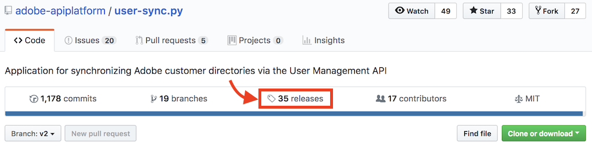
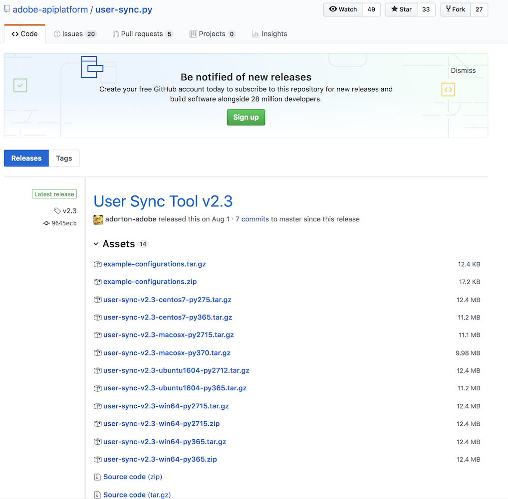

# Install User Sync

[Previous Section](identify_server.md) \| [Back to Contents](index.md) \| [Next Section](setup_config_files.md)

Once you have access to the server where User Sync will run, pick a directory where you will install and operate User Sync.

On Windows, you will need to install Python.  As of this writing, version 2.7.13 is recommended.  Windows and Python need to be 64 bit versions.

On Windows, you also are very likely to need to set an environment variable PEX_ROOT to C:\user_sync\.pex.  This is needed to work around Windows pathname length limits.

Initial steps:

&#9744; Setup a user and file directory for installing and running sync.  For example, we'll create a folder /home/user_sync/user_sync_tool and a user user_sync.  On Windows an example would be C:\Users\user_sync\user_sync_tool.

&#9744; Windows only: set the environment variable **PEX\_ROOT** to **C:\user_sync\.pex**.

&#9744; Windows only: Install python 2.7.13 (or later in the 2.7 series), 64 bit. 

The next few sections show the installation process.

To find the latest release:  Start here: 
[https://github.com/adobe-apiplatform/user-sync.py](https://github.com/adobe-apiplatform/user-sync.py "https://github.com/adobe-apiplatform/user-sync.py")

Select “release”

&#9744; Download the example-configurations.tar.gz, User Sync Guide, and build for your platform, osx, ubuntu, windows, or centos.

&#9744; Extract the user-sync (or user-sync.pex) file from the archive and place the file for your OS in the folder.  In our example, this would be /home/user_sync/user_sync_tool/user-sync or C:\Users\user_sync\user_sync_tool\user-sync.pex.

&#9744; In the example-configurations.tar.gz file there is a directory **config files - basic**.  From this folder extract the first 3 files and place in the user_sync_tool folder.  

&#9744; Next, rename the 3 config example files by removing the leading "1 ", "2 ", and "3 " from the names.  We will edit these files to create the real User Sync configuration files.

[Previous Section](identify_server.md) \| [Back to Contents](index.md) \| [Next Section](setup_config_files.md)
