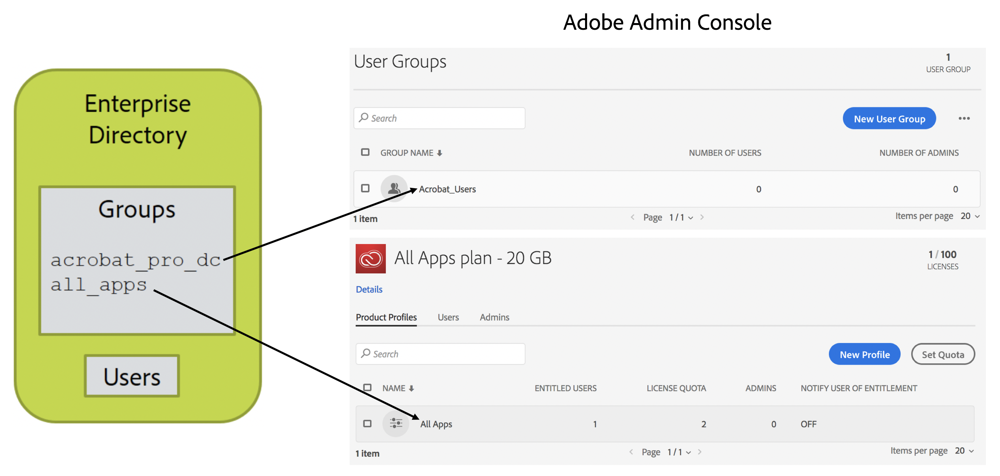

# Layout Your Adobe Products, Product Profiles, and User Groups

[Previous Section](layout_orgs.md) \| [Back to Contents](index.md) \| [Next Section](decide_deletion_policy.md)

Product Profiles (PPs) are group-like structures in the Adobe user management system. Each PP is associated with a product you have purchased. Users added to a PP are granted access to and get a license to use the corresponding product. (The user does not receive anything in this process other than an optional notification that access has been granted. All license management is handled by back-end systems).

When you create a PP (which is done in the Adobe Admin Console), you can add custom options that control how users will use the specific Adobe product.

You can add users directly to PPs to grant them access to products. This is the most common way Adobe product licenses are managed.

Adobe User groups can be used to group users in a logical way that matches your understanding of how they are organized. The use of user groups is optional. User groups can then be added to PPs to grant licenses to users. Adding users to user groups does not grant licenses unless the user group is added to a PP, making members of the user group implicitly members of the PP.

User groups and PPs can only be managed by one User Sync instance. If there are multiple directories or distributed departments feeding user information to Adobe via User Sync, each must be matched to a single user group or PP. Otherwise, User Sync cannot distinguish between users who should be removed and users who were added by another instance of User Sync.

You can use User Sync to manage PP membership and license allocation. This is optional however. You can also do this management manually on the Adobe Admin Console or using another application.

User Sync helps you manage Adobe product licenses by allowing you to place users into directory groups using the directory system interface or other tools. Those groups are then mapped to Adobe user groups or PPs. The mapping is part of the User Sync configuration file. When User Sync detects that directory users are in one of these mapped groups, the user is added to the corresponding Adobe user group or PP. Similarly, users in the user group or PP but not in the corresponding directory group are removed from the user group or PP.

&#9744; Decide if you will manage license allocation using User Sync. If not, you can skip the remaining steps; however, before the users you create can access Adobe products, you will need to manually add them to product profiles using the Adobe Admin Console.

&#9744; Create the PPs in the Adobe Admin console for the product profiles and groups of users you will be managing. Add the comment "Managed by User Sync - do not edit" to the description field of the PP.

&#9744; If you are going to use User Groups to manage product access, you will need to first create the user groups and the product profiles, then you can manage product access by adding each user group to the appropriate product profiles. Add the comment "Managed by User Sync - do not edit" to the description field of the user group.

&#9744; Draw a diagram of your Adobe organizations, and the products and PPs in each. Add the directory and directory groups to the picture and show the mapping. For example:

[Previous Section](layout_orgs.md) \| [Back to Contents](index.md) \| [Next Section](decide_deletion_policy.md)

