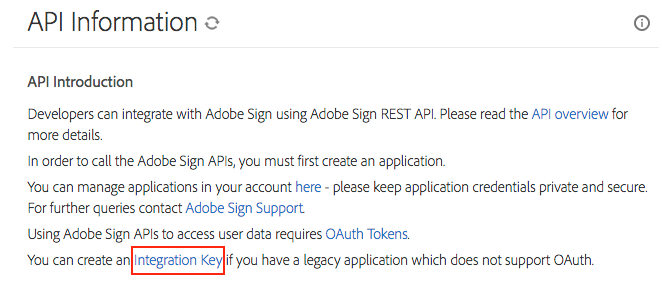

# Adobe Sign Sync Guide
{:."no_toc"}

## In This Section
{:."no_toc"}

* TOC Placeholder
{:toc}

---

[Previous Section](scheduling.md) \| [Back to Contents](index.md)

---

# Getting Started

**NOTE:** The Adobe Sign Sync Connector is not required to provision users to Adobe Sign. It provides optional advanced functionality.
See the [User Manual page](../user-manual/post_sync_connector.html#native-sign---admin-console-connection) for more details.

This guide assumes that the User Sync Tool is set up and configured to sync users from an existing identity source.

## Set Up Sign Integration

The connector talks directly to Adobe Sign using the Sign API.  In order to use the connector, it is necessary to create a Sign API
integration key.

**NOTE:** You must be logged in as an administrator to create a new integration key

1. Log into Adobe Sign
2. Click "Accout" on the top navigation bar
3. On the left-hand menu, click "Adobe Sign API"
4. On the "API Information" page, find the "Integration Key" link

   

   If you don't see this link, please contact Sign support
5. On the "Create Integration Key" page, give the integration a name and select the `user_read` and `user_write` scopes
6. Save the integration
7. On the "Access Tokens" list, select the integration you just created
8. Click "Integration Key" to display the integration key.  This is used in the Sign Sync connector config file.

   

## Generate the Connector Config

Open a command line terminal and change working directory to the directory containing the User Sync Tool.

```sh
$ ./user-sync example-config-sign
# enter filename or press Enter to accept the default (connector-sign-sync.yml)
Sign Sync Config Filename [connector-sign-sync.yml]: connector-sign-sync.yml
Generating file 'connector-sign-sync.yml'
```

This creates a template Sign Sync connector config file in your current working directory.

## Configure Post-Sync

Open `user-sync-config.yml` in a text editor and add the following:

```yaml
# "post_sync" is a root key and should be specified at the top-level of
# the file (alongside directory_users, adobe_users, etc)
post_sync:
  modules:
    - sign_sync
  connectors:
    sign_sync: connector-sign-sync.yml
```

This assumes your Sign Sync connector config file is named `connector-sign-sync.yml`. Change the filename if needed.

Post-sync is now configured. Future post-sync connectors can be enabled here.

## Specify Sign Group Mapping

If your existing User Sync config does not assign Adobe Sign entitlements, it will be necessary to add a group mapping that
targets Adobe Sign.

This example assumes that there is a Sign product profile on the target Admin Console called `Adobe Sign`. Change the target
Adobe group to reflect the name of the desired target product profile. You can also target a user group that is associated with
a Sign product profile.

It also assumes there is a directory group in the identity source called `adobe-sign-enterprise`. Change the directory group name
to reflect the desired group name.

```yaml
directory_users:
  # ... other directory_users settings
  groups:
    # ... other group mappings
    - directory_group: adobe-sign-enterprise
      adobe_groups:
        - Adobe Sign
```

As with any other group mapping, the users belonging to `adobe-sign-enterprise` will be synced to the Admin Console and
assigned to the `Adobe Sign` group. Users assigned to a Sign profile or associated user group will automatically
be synced to Adobe Sign.

Additional group mappings are required to take advantage of Sign group and admin role assignment. Those are covered in
[Managing Group Assignments](#managing-group-assignments) and [Managing Admin Role Assignments](#managing-admin-role-assignments).

## Basic Sign Config

The file `connector-sign-sync.yml` generated previously contains a template for a basic Sign Sync connector config. The next step
is to set up a basic configuration by providing the Sign API connection details and telling the connector which group(s) are
resonsible for entitling Sign users.

Open `connector-sign-sync.yml` config file in a text editor.

### Define the Console Org

The top of the file will specify the Sign org(s) for the connector to sync.

```yaml
sign_orgs:
  - console_org:
    host: api.echosign.com
    key: (integration key)
    admin_email: (email address of account associated with the API key)
```

Edit this section to configure the Sign API connection.

1. `console_org` can be left blank.
2. `host` should be set to api.echosign.com
3. `key` is the API key [generated previously](#set-up-sign-integration)
4. `admin_email` is the email address associated with the API key. This prevents the Sign Sync connector from operating on this user
   and potentially changing its admin role status.

### Define Entitlement Groups

Finally, modify the `entitlement_groups` list to reflect the group or groups that entitle a user to Adobe Sign access. This will be the
same Sign group or groups that you defined in your UST group mapping previously. Following the previous example, we will want to put
`Adobe Sign` as the sole group.

```yaml
entitlement_groups:
  - Adobe Sign
```

This config option helps to define the scope of which users should be processed by the Sign Sync connector. It ensures that users
without Sign access will not be processed.

### (Optional) Define Identity Types

If the UST has been configured to handle Adobe IDs and/or Enterprise IDs, the `identity_types` key should be set to handle the same
identity types.

For example, this is what it would look like if the UST is managing `federatedID` and `enterpriseID` users:

```yaml
identity_types:
  - enterpriseID
  - federatedID
```

This tells the Sign Sync connector to only operate on `federatedID` and `enterpriseID` users and to ignore `adobeID` users.

### Test the Connector

The connector won't really do anything useful at this point, but it is a good idea to test it now to make sure the Sign API
connection works as expected.

**NOTE:** The Sign API does not have a "test mode" like the User Management API has. To prevent unexpected sync behavior,
the Sign Sync connector is disabled when the UST is run in test mode. You may want to temporarily disable non-Sign-related
group mappings in `user-sync-config.yml` to prevent non-Sign users from getting synced during this test.

Open a command-line terminal, change your working directory to where the UST is installed, and run the sync command typical
for your sync setup.

Example:

```sh
$ ./user-sync --process-groups --users mapped
```

After the main UST sync process runs, the Sign Sync connector will kick off. Assuming the connector is configured correctly
and there are no errors connecting to the Sign API, the log output from the connector will be pretty simple:

```
2019-11-22 12:57:53 31976 INFO post-sync - Running module sign_sync
2019-11-22 12:58:00 31976 INFO post-sync - Finished running sign_sync
```

(if the UST config's log level is set to `debug`, there will be some additional log messages related to the calls made to the
Sign API)

Once the basic connector config is set up, it can be configured to manage group assignments and/or admin role assignments.

# Managing Group Assignments

When a new user is provisioned to Adobe Sign, it is assigned to a default group (known as "Default Group"). Users can currently be
assigned to one non-default group at a time.

The Adobe Sign Sync connector can assign users to non-default groups with the `user_groups` connector config key. `user_groups`
specifies a list of Adobe Admin Console groups that should be potentially assigned to a user in Adobe Sign.

In other words, Sign groups assigned by the connector are governed by a user's group membership status in the Admin Console.

## Setting up a Group Mapping

To assign Sign groups to Sign users, the first step is to set up a group mapping in `user-sync-config.yml` for each Sign group
you wish to potentially assign to a user. Sign groups managed by the connector map 1:1 with equivalent groups in the Adobe
Admin Console.

Create a new user group in the Adobe Admin Console (or enable [automatic group creation](../user-manual/advanced_configuration.html#automatic-group-creation) in your UST config).


For this example, we'll call the group `Sign User Group 1`.

Our new group mappings in `user-sync-config.yml`:

```yaml
directory_users:
  # ... other directory_users settings
  groups:
    # ... other group mappings
    - directory_group: adobe-sign-group1
      adobe_groups:
        - Sign User Group 1
```

## Configuring the Connector

Add the group to the `user_groups` list in `connector-sign-sync.yml`.

```yaml
user_groups:
  - Sign User Group 1
```

With `user_groups` configured, the connector will identify any Sign-entitled user (users belonging to any group in `entitlement_groups`)
that belong to any groups specified in `user_groups`. Any such users will be assigned to a Sign group with the same group name as the
related Adobe group. If a group by a given name does not already exist in Sign, the connector will create it automatically.

## Multi-Group Membership

Sign users can belong to only one Sign group at a time. Since users can belong to multiple user groups in the Admin Console, this creates
a conflict.

The Sign Sync connector resolves this conflict by assigning Sign groups according to the order they are specified in the `user_groups`
list. Assignment priority follows the order in which these groups are specified - the first group in the list takes precedence over
the second, second over third, etc.

For example, if there are two groups defined in `user_groups`:

```yaml
user_groups:
  - Sign User Group 1
  - Sign User Group 2
```

A user assigned to both groups in the Adobe Admin Console will be assigned to `Sign User Group 1` in Sign.

However, if the order is reversed:

```yaml
user_groups:
  - Sign User Group 2
  - Sign User Group 1
```

The same user would be assigned to `Sign User Group 2` in Sign.

## Additional Notes

* It isn't necessary to map groups specified in `user_groups` in `user-sync-config.yml`. If users are assigned to these Admin Console
groups manually outside of user sync, the connector will still sync these group assignments to Sign.
* A Sign user's group status will be updated, if needed, according to the current connector config
* If a user is removed from all Admin Console groups specified in `user_groups`, they will be assigned back to the Default Group
* If a product profile is specified in `user_groups`, the connector will create a user group in Sign with the same group name if one does
not already exist
* While it is technically possible to add Console admin role groups to the `user_groups` list (e.g. `_org_admin`), this isn't advisable as
it will create a user group in Sign with the role group name

# Managing Admin Role Assignments

Sign users are given Normal User privileges by default. The Sign Sync connector can assign Account Admin or Group Admin privileges, which
are governed by a user's membership in certain Admin Console groups and/or Console admin role groups.

## Setting up a Group Mapping

The first step is to define one or more group mappings in `user-sync-config.yml`. Each mapping defines a relationship between a
directory group and one or more Adobe Admin Console user groups and/or admin roles. In the Sign Sync connector confic, each Admin
Console group and/or admin role targeted here will be used to target one or more Sign admin roles.

If you want to use a user group to govern Sign admin role status, then create a new user group in the Adobe Admin Console
(or enable [automatic group creation](../user-manual/advanced_configuration.html#automatic-group-creation) in your UST config).


For this example, we'll use a group called `Sign Account Admins` to govern account admins, and the admin roles of each
`Sign User Group X` group to govern group admin status.

Our new group mappings in `user-sync-config.yml`:

```yaml
directory_users:
  # ... other directory_users settings
  groups:
    # ... other group mappings
    - directory_group: adobe-sign-admins
      adobe_groups:
        - Sign Account Admins
    - directory_group: adobe-sign-group1-admins
      adobe_groups:
        - _admin_Sign User Group 1
    - directory_group: adobe-sign-group2-admins
      adobe_groups:
        - _admin_Sign User Group 2
```

## Configuring the Connector

Open `connector-sign-sync.yml` in a text editor and add a rule to `admin_roles` for each mapping.

Valid roles:

* `ACCOUNT_ADMIN` - Make the user an admin of the overall Sign account
* `GROUP_ADMIN` - Make the user an admin of the Sign group assigned to the user

`NORMAL_USER` is technically allowed here, is generally not needed. Users that no longer belong to any `adobe_groups` in
the `admin_roles` rule list will automatically be assigned `NORMAL_USER` privileges.

```yaml
admin_roles:
  - sign_role: ACCOUNT_ADMIN
    adobe_groups:
      - Sign Account Admins
  - sign_role: GROUP_ADMIN
    adobe_groups:
      - _admin_Sign User Group 1
      - _admin_Sign User Group 2
```

Generally, only one rule is required per admin role, since multiple Adobe groups/roles can be associated with a Sign admin role.

As noted above, assigning the `GROUP_ADMIN` privilege will make the user an admin of their currently-assigned Sign group. This means
that if they are assigned to the Default Group in Sign, they will be an admin of that group. See [above](#managing-group-assignments)
to learn how to work with Sign group assignments in the connector.

# Configuring Multiple Sign Targets

The Sign Sync connector can connect to multiple Sign targets. This functionality may be needed if your organization has multiple
Adobe Admin Console instances with a Sign plan on two or more of those consoles.

**NOTE:** This tutorial assumes that your User Sync Tool deployment is configured to targed multiple Admin Consoles.
See [the manual](user-manual/advanced_configuration.html#accessing-users-in-other-organizations) for details on setting up
additional UMAPI targets to the UST config.

**IMPORTANT NOTE:** In Adobe Sign, a user's email address acts as a global identifier, meaning that no two Sign users can have
the same email address. It is your responsibility to ensure that each Sign user is synced to only one Admin Console. Otherwise
the Sign Sync tool will not operate as intended.

## UMAPI Connector Review

Each Sign target configured in the Sign Sync connector must have a corresponding UMAPI target defined in `user-sync-config.yml`.

```yaml
adobe_users:
  # ... other adobe_users settings
  connectors:
    umapi:
      - "connector-umapi.yml"
      - org2: "connector-umapi-org2.yml"
```

In this example, two UMAPI targets are defined: primary, which does not have an `id`, and `org2`, a console that has a directory trusted
from the primary console. We will use this example and assume that `org2` will be targeted by the Sign Sync connector.

## Defining Secondary Sign Connections

Before configuring any additional Sign targets, ensure that you have [generated an integration key](#set-up-sign-integration) for each target.

The `sign_orgs` key in `connector-sign-sync.yml` defines a list of Sign targets that the Sign Sync connector may connect to.
When defining multiple targets, the `console_name` must match the `id` of the corresponding UMAPI target. Since no `id` is defined
for the primary UMAPI target, the `console_name` of the primary Sign target must also be blank.

Example:

```yaml
sign_orgs:
  - console_org:
    host: api.echosign.com
    key: (integration key)
    admin_email: (email address of account associated with the API key)
  - console_org: org2
    host: api.echosign.com
    key: (integration key)
    admin_email: (email address of account associated with the API key)
```

`console_org` can also be omitted for the primary Sign connection.

```yaml
sign_orgs:
  - host: api.echosign.com
    key: (integration key)
    admin_email: (email address of account associated with the API key)
```

## Group Mapping for Secondary Targets

As with the primary Sign target, a group mapping should be defined in `user-sync-config.yml` to assign the Sign entitlement on
the secondary console. Use the `::` syntax to denote that the target group belongs to a secondary connection.

UMAPI groups that relate to Sign groups or admin roles should also be mapped here.

```yaml
directory_users:
  # ... other directory_users settings
  groups:
    # ... other group mappings
    - directory_group: adobe-sign-org2-enterprise
      adobe_groups:
        - org2::Adobe Sign
    - directory_group: adobe-sign-org2-group1
      adobe_groups:
        - org2::Sign User Group 1
    - directory_group: adobe-sign-org2-admin
      adobe_groups:
        - org2::Sign Account Admins
```

`connector-sign-sync.yml` uses the `::` syntax to denote secondary targets in the `user_groups`, `entitlement_groups` and `admin_roles`
options.

```yaml
entitlement_groups:
  - Adobe Sign
  - org2::Adobe Sign
user_groups:
  - Sign User Group 1
  - org2::Sign User Group 1
admin_roles:
  - sign_role: ACCOUNT_ADMIN
    adobe_groups:
      - Sign Account Admins
      - org2::Sign Account Admins
  - sign_role: GROUP_ADMIN
    adobe_groups:
      - _admin_Sign User Group 1
      - _admin_Sign User Group 2
      - org2::_admin_Sign User Group 1
```
