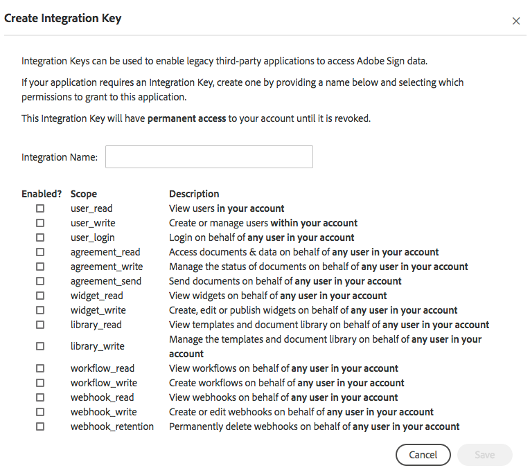
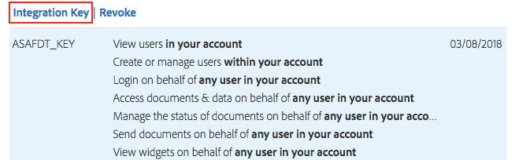
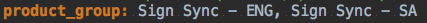
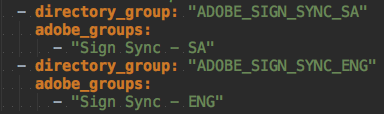

# Overview

Sign Sync allows for an automated process of moving users over from
Admin Console into your Adobe Sign. Sign Sync works as an addition add
on to the Adobe User Sync Tool, which allows you to synchronize entities
within your LDAP over to Adobe Admin Console. Once users are assigned
into Adobe Admin Console with Sign entitlements, Sign Sync will grab
those users and port them over to Adobe Sign placing in their
corresponding groups along with account privileges.

# Disclaimer

Sign Sync works as a one-way sync from Adobe Admin Console to Adobe
Sign. Any changes made in Adobe Sign such as group creation, user
creation, privileges, or moving users to different groups will be
reverted back to the current state in Admin Console. Changes should be
made either from your LDAP or Admin Console depending how you have your
mapping set up.

# Features

The following is a list of automated features currently possible with
Sign Sync.

  |Features                 |Sync users from Admin Console over into Sign Console.|
  |-------------------------|------------------------------------------------------------------------------|
  |Group Creation           |New groups created in Admin Console will be synced over to the Sign Console.|
  |User Privileges          |User privileges set in Admin Console will sync over to Sign Console.|
  |Ignore Groups            |Ability to ignore specific groups defined in a configuration file.|
  |Ignore Admin Privileges  |Ability to ignore specific admin roles to be synced over in Sign.|

# Prerequisites

This is a list of all prerequisites that you should checked off to
verify that you have what is needed to start the deployment process.
Please make sure you have all the prerequisites set up before using Sign
Sync.

  | Prerequisite               | Notes |
  |----------------------------|-----------------------------------------------------------------------------------------------------------------------------------------------------|
  | Python 3.6                 | |
  | Adobe Sign Integration Key | The integration key to your Adobe Sign Console ([link](https://www.adobe.io/apis/documentcloud/sign/docs/overview.html))|
  | Admin Console              | Your Admin Console integration. [Click Me](https://adobe-apiplatform.github.io/umapi-documentation/en/)|
  | Adobe User Sync Tool       | Running version 2.3 of User Sync Tool. [Click Me](https://adobe-apiplatform.github.io/user-sync.py/en/)|
  | Text editor                | This will be required to edit any configuration files.|

# Deployment

Sign Sync works alongside Adobe User Sync Tool. Please make sure that
all dependencies and packages are set up correctly for User Sync Tool.
If so, you should be able to perform a [test
run](https://adobe-apiplatform.github.io/user-sync.py/en/success-guide/test_run.html).
Once a successful run of User Sync Tool is confirmed, you can start
configuring the Sign Sync feature into User Sync Tool.

# Configuration

Sign Sync uses information from User Sync Tool configuration files to
get access to both Admin Console and LDAP. Please make sure that you
follow the instructions on how to set up the configuration files
correctly. Please [click
here](https://adobe-apiplatform.github.io/user-sync.py/en/user-manual/configuring_user_sync_tool.html)
for more details on setting up the UST configuration files.

Sign Sync currently uses one configuration file called
connector-sign-sync.yml.

```yaml
server:
    host:
    endpoint_v5: /api/rest/v5
    endpoint_v6: /api/rest/v6

enterprise:
    integration:
    email:

conditions:
    connector:
    version:

umapi_conditions:
    product_group:
    account_admin_groups:
    ignore_admin_groups:
    ignore_groups:

ldap_conditions:
    attributes:
```

| Key | Type | Parent | Notes |
|---|---|---|---|
| `server` | `dict(str, str)` | (root) | Sign API server/endpoint options |
| `host` | `str` | `server` | Adobe Sign Host URL |
| `endpoint_v5` | `str` | `server` | Adobe Sign API version 5 endpoint (shouldn't be changed) |
| `endpoint_v6` | `str` | `server` | Adobe Sign API version 6 endpoint (shouldn't be changed) |
| `enterprise` | `dict(str, str)` | (root) | Sign API credentials |
| `integration` | `str` | `enterprise` | Integration key for Adobe Sign |
| `email` | `str` | `enterprise` | Account admin email associated with that Adobe Sign |
| `conditions` | `dict(str, str)` | (root) | Connector type options |
| `connector` | `enum("umapi", "ldap")` | `conditions` | Identity source type |
| `version` | `enum("v5", "v6")` | `conditions` | Version of Sign API to use |
| `umapi_conditions` | `dict(str, str)` | (root) | UMAPI connector options |
| `product_group` | `str` | `umapi_conditions` | Comma-separated list of Sign entitlement groups |
| `account_admin_groups` | `str` | `umapi_conditions` | Comma-separated list of admin roles that should also grant Sign admin privileges |
| `ignore_admin_groups` | `str` | `umapi_conditions` | Comma-separated list of admin roles that should be denied Sign admin privileges |
| `ignore_group` | `str` | `umapi_conditions` | Comma-separated list of groups to ignore |
| `ldap_conditions` | `dict(str, str)` | (root) | LDAP connector options |
| `attributes` | `str` | `ldap_conditions` | Additional LDAP attributes to be included in a user record |

# How To -- Create Adobe Sign Integration

This section will show you how to create an Adobe Sign Integration Key.

1.  Log into your Adobe Sign Console.
2.  Click Account
3.  Locate Adobe Sign API tab
4.  Click API Information

    
5.  Click the integration key link.
    1.  If you do not see the integration link, please contact Support
        for assistance

    
6.  Enter a name associated with this integration
7.  Select scopes associated with this integration. For more
    information, please [click
    here](https://secure.echosign.com/public/static/oauthDoc.jsp).
8.  Click save
9.  Go to the personal preferences tab and select access token
10. Find your integration and click it

    
11. Click the integration key link and your integration key should
    display like the image below:

    

# How To -- Synchronization

The following section will explain how to use the Adobe Admin Console &
Active Directory as an LDAP service to start setting up your
synchronization.

**IMPORTANT NOTE:** You will need to configure a basic user sync
prior to configuring the tool to also run Sign sync.  That process is
outside this document's scope - please refer to the [user manual](https://adobe-apiplatform.github.io/user-sync.py/en/user-manual/)
for more information.

## Admin Console

1.  Log into your [Adobe Admin Console](https://adminconsole.adobe.com/).
2.  Click overview
3.  Find your Adobe Sign -- Enterprise account and click it. This will
    take you to the product profile for the account shown below:

    
4.  Locate your target product profile. For the purpose of this
    demonstration, we will be using Sign Sync -- Eng & Sign Sync -- SA
    as the product profile.
5.  Open the connector-sign-sync.yml file located in the following file
    path:
    "location to User Sync Tool folder/user-sync.py/user-sync/sign-sync"
6.  Enter the product profile name in product_profile under
    umapi_conditions as follows:

    
7.  Log into your server where your active directory is hosted on and
    open up Active Directory Users & Computers.

    
8. Create one group for each Sign profile you wish to synchronize.

    **Note**: it may be necessary to create an Organizational Unit to
    contain these groups if an appropriate container doesn't already
    exist.

9. These groups do not need to follow a particular naming convention,
   but should indicate which profile they will provision.

    <br/>

    | Admin Console Product Profile | LDAP Group Name |
    |---|---|
    | Sign Sync - ENG | ADOBE_SIGN_SYNC_ENG |
    | Sign Sync - SA | ADOBE_SIGN_SYNC_SA |

10. Open up the `user-sync-config.yml` located in `path/user-sync.py/user-sync/sign-sync`
11. Locate the groups setting under directory_groups.
12. Here is where you'll map the following directory group to the Admin
    Console product profile.
    1. Directory_group: Name used in LDAP
    2. Adobe_groups: Name in Adobe Admin Console

    
13. This config setting ensures that any users added to any `directory_group` specified in
    the mapping will be synced to the Admin Console.
14. Run the User Sync Tool `--process-groups --users mapped`
15. New users will be created and place into your Users tab in the Admin
    Console and automatically assigned to Adobe groups or product profiles
    as per the group mapping specified in `user-sync-config.yml`
16. During the next synchronization iteration, the users will be placed
    into the corresponding groups in Adobe Sign.

# How To -- Assigning Privileges

This section will explain how to assign privileges so it will sync over
to Adobe Sign. **Privileges must be assigned through the Admin
Console**. Privileges assigned through Sign Console will be
overwritten when an iteration of the sync occurs.

1.  Log into your Adobe Admin Console.
2.  Click the Users tab in the navigation menu.
3.  Select the user you would like to assign privileges to.
4.  On the right panel that pops out from the side, click on the ...
    button and click edit admin rights.

    
5.  There are five account settings that you can enable for the user.
    The application will use these settings to determine if a user is an
    ACCOUNT ADMIN, GROUP ADMIN, or a NORMAL USER in Sign.

    
    1.  ACCOUNT ADMIN (Select one of the following and configure it into
        your connect-sign-sync.yml file)
        1.  System Administrator
        2. Product Administrator (Best option since it doesn't interfere
            with Admin Console Privileges)
        3. Product Profile Administrator
        4. Support Administrator
    2.  GROUP ADMIN
        1.  User Group Administrator
    3.  NORMAL USER
        1. Select None
6.  Click Next on the bottom of the page.
7.  Click Save to save new changes.
