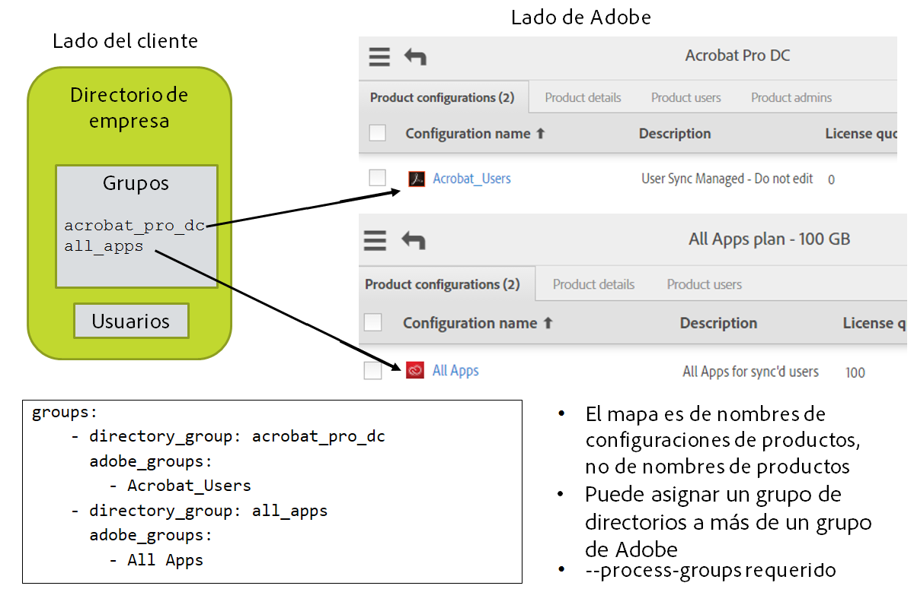

# Instalación y configuración

## En esta sección
{:."no_toc"}

* TOC Placeholder
{:toc}

---

[Sección anterior](index.md)  \| [Sección siguiente](configuring_user_sync_tool.md)

---

El uso de la herramienta User Sync varía en función de si la empresa ha establecido configuraciones de productos en Adobe Admin Console. Para obtener más información sobre cómo llevar a cabo esta operación, consulte la página de la ayuda de [Configuración de los servicios](https://helpx.adobe.com/es/enterprise/help/configure-services.html#configure_services_for_group).

## Configurar una integración de la API de gestión de usuarios en Adobe I/O

La herramienta User Sync es un cliente de la API de gestión de usuarios. Antes de instalar la herramienta, debe registrarla como cliente de la API añadiendo una *integración* en el [Portal del programador](https://www.adobe.io/console/) de Adobe I/O. Deberá añadir una integración de clave de empresa con el fin de obtener las credenciales que la herramienta necesita para tener acceso al sistema de gestión de usuarios de Adobe.

Los pasos necesarios para la creación de una integración se describen con detalle en la sección de [Configuración del acceso](https://www.adobe.io/apis/cloudplatform/usermanagement/docs/setup.html) del sitio web de la API de gestión de usuarios de Adobe I/O. El proceso requiere crear un certificado específico de la integración, que puede ser autofirmado. Cuando el proceso termine, se le asignará un **API key**, un  **Technical account ID**, un  **Organization ID** y un  **client secret** que la herramienta utilizará junto con la información del certificado para comunicarse de forma segura con Admin Console. Al instalar la herramienta User Sync, debe proporcionar estos datos como valores de configuración que la herramienta necesita para acceder al almacén de información de usuarios de la organización en Adobe.

## Configuración de la sincronización de acceso a los productos

Si prevé utilizar la herramienta User Sync para actualizar el acceso de los usuarios a los productos de Adobe, debe crear grupos en su propio directorio de empresa que se correspondan con los grupos de usuarios y configuraciones de producto que ha definido en [Adobe Admin Console](https://www.adobe.io/console/). La pertenencia a una configuración de producto garantiza el acceso a un conjunto concreto de productos de Adobe. Puede conceder o revocar el acceso a los usuarios o a grupos de usuarios definidos añadiéndolos o quitándolos de una configuración de producto.

La herramienta User Sync puede otorgar acceso a los productos a los usuarios añadiendo usuarios a grupos de usuarios y configuraciones de producto en función de sus pertenencias en el directorio de empresa, siempre y cuando los nombres de los grupos estén correctamente asignados y se ejecute la herramienta con la opción de procesar las pertenencias a grupos.

Si prevé utilizar la herramienta de esta manera, debe asignar los grupos del directorio de empresa a sus correspondientes grupos de Adobe en el archivo de configuración principal. Para ello, debe asegurarse de que los grupos existen a ambos lados y que conoce los nombres exactos.

### Consulta de productos y configuraciones de producto

Antes de empezar a configurar User Sync, debe saber qué productos de Adobe utiliza su empresa y qué configuraciones de producto y grupos de usuarios se han definido en el sistema de gestión de usuarios de Adobe. Para obtener más información, consulte la página de ayuda de [configuración de servicios de la empresa](https://helpx.adobe.com/es/enterprise/help/configure-services.html#configure_services_for_group).

Si aún no dispone de configuraciones de producto, puede utilizar la consola para crearlas. Debe disponer de algunas y deben tener los grupos correspondientes en el directorio de empresa para poder configurar User Sync para actualizar la información de derechos de usuario.

Los nombres de configuraciones de producto generalmente identifican los tipos de acceso a productos que los usuarios tendrán, por ejemplo Acceso a todo o a un producto individual. Para comprobar los nombres exactos, vaya a la sección de Productos de [Adobe Admin Console](https://www.adobe.io/console/) para ver los productos tiene activados su empresa. Haga clic en un producto para ver los detalles de las configuraciones de producto que se han definido para ese producto.

### Creación de los grupos correspondientes en el directorio de empresa

Una vez que ha definido grupos de usuarios y configuraciones de producto en Adobe Admin Console, debe crear y nombrar los grupos correspondientes en su propio directorio de empresa. Por ejemplo, un grupo de directorio correspondiente a la configuración de producto de "Todas las aplicaciones" podría llamarse "todas_aplicaciones".

Tome nota de los nombres que elija para estos grupos y los grupos de Adobe a los que corresponden. Le servirán para configurar una asignación en el archivo de configuración principal de User Sync. Consulte los detalles en la sección [Configuración de la asignación de grupos](configuring_user_sync_tool.md#configuración-de-la-asignación-de-grupos) a continuación.

Es una buena práctica anotar en el campo de descripción de la configuración de producto o el grupo de usuarios que el grupo es gestionado por User Sync y no se debe editar en Admin Console.

## Instalación de la herramienta User Sync

### Requisitos del sistema

La herramienta User Sync se implementa con Python y requiere Python versión 2.7.9 o superior. Para cada entorno en el que se va a instalar, configurar y ejecutar el script, debe asegurarse de que Python se ha instalado en el sistema operativo antes de pasar al siguiente paso. Para obtener más información, consulte el [sitio web de Python](https://www.python.org/).

La herramienta se ha creado con un paquete LDAP de Python, `pyldap`, que a su vez se basa en la biblioteca de cliente de OpenLDAP. Windows Server, Apple OSX y muchas partes de Linux llevan instalado un cliente de OpenLDAP en origen. Sin embargo, algunos sistemas operativos UNIX, como OpenBSD y FreeBSD, no lo incluyen en la instalación de base.

Compruebe su entorno para asegurarse de que hay instalado un cliente OpenLDAP antes de ejecutar el script. Si no se encuentra en su sistema, debe instalarlo antes de instalar la herramienta User Sync.

### Error

La herramienta User Sync está disponible en el [repositorio de User Sync en GitHub](https://github.com/adobe-apiplatform/user-sync.py). Para instalar la herramienta:

1. Cree una carpeta en el servidor en la que va a instalar la herramienta User Sync y ponga en ella los archivos de configuración.

1. Haga clic en el vínculo **Releases** para localizar la versión más reciente, que contiene las notas de la versión, esta documentación, archivos de configuración de muestra y todas las versiones (así como los archivos de origen).

2. Seleccione y descargue el paquete comprimido para su plataforma (el archivo `.tar.gz`). Están disponibles versiones para Windows, OSX y Ubuntu. (Si va a crear desde código fuente, puede descargar el paquete de código fuente correspondiente a la versión o utilizar la fuente más reciente de la rama maestra.)

3. Localice el archivo ejecutable de Python (`user-sync` o `user-sync.pex` para Windows) y póngalo en la carpeta de User Sync.

4. Descargue el archivo `example-configurations.tar.gz` de archivos de configuración de muestra. Dentro del archivo hay una carpeta llamada "config files – basic". Los primeros 3 archivos de esta carpeta son necesarios. Los otros archivos del paquete son versiones opcionales o alternativas para fines específicos. Puede copiarlos a la carpeta raíz y luego cambiarles el nombre y editarlos para que sean sus propios archivos de configuración. (Consulte la siguiente sección, [Configuración de la herramienta User Sync](configuring_user_sync_tool./md#configuración-de-la-herramienta-User-Sync).)

5. **Solo en Windows:**

    Antes de ejecutar el ejecutable user-sync.pex en Windows, es posible que tenga que resolver un problema de ejecución de Python solo para Windows:

    El sistema operativo Windows fuerza un límite de longitud de ruta de archivo de 260 caracteres. Al ejecutar un archivo PEX de Python, crea una ubicación temporal para extraer el contenido del paquete. Si la ruta a esa ubicación supera los 260 caracteres, el script no se ejecuta correctamente.

    De forma predeterminada, la caché temporal se encuentra en su carpeta de inicio, que puede hacer que las rutas de acceso excedan el límite. Para solucionar este problema, cree una variable de entorno en Windows llamada PEX\_ROOT, y establezca la ruta como C:\\user-sync\\.pex. El sistema operativo utiliza esta variable para la ubicación de la caché, lo que impide que la ruta supere el límite de 260 caracteres.

6. Para ejecutar la herramienta User Sync, ejecute el archivo ejecutable de Python, `user-sync` (o ejecute `python user-sync.pex` en Windows).

### Consideraciones de seguridad

Debido a que la aplicación User Sync tiene acceso a información confidencial en los lados de Adobe y de la empresa, su uso implica un cierto número de archivos diferentes que contienen información confidencial. Se debe poner el máximo cuidado a proteger estos archivos contra el acceso no autorizado.

La versión 2.1 o posterior de User Sync le permiten almacenar las credenciales en el almacén de credenciales seguras del sistema operativo como alternativa al almacenamiento en archivos y la protección de dichos archivos o al almacenamiento de los archivos de configuración de umapi y ldap de forma segura que puedan definirse. Consulte la sección [Recomendaciones de seguridad](deployment_best_practices.md#recomendaciones-de-seguridad) para obtener más detalles.

#### Archivos de configuración

Los archivos de configuración deben incluir información confidencial, como la clave de la API de gestión de usuarios de Adobe, la ruta de la clave privada del certificado y las credenciales del directorio de empresa (si dispone de uno). Debe tomar las medidas necesarias para proteger todos los archivos de configuración y asegurarse de que solo los usuarios autorizados podrán acceder a ellos. En concreto, no permita el acceso de lectura a ningún archivo que contenga información confidencial salvo desde la cuenta del usuario que ejecuta el proceso de sincronización.

Si decide utilizar el sistema operativo para almacenar credenciales, deberá crear también los archivos de configuración pero estos en lugar de almacenar las credenciales reales almacenan ID de clave que se usan para buscar las credenciales reales. Los detalles se muestran en las [Recomendaciones de seguridad](deployment_best_practices.md#recomendaciones-de-seguridad).

Si configura User Sync para el acceso a su directorio de empresa, debe configurarlo para leer desde el servidor de directorio con una cuenta de servicio. Esta cuenta de servicio solo necesita acceso de lectura y se recomienda que no se le pueda otorgar acceso de escritura (para que la divulgación no autorizada de las credenciales no permita el acceso de escritura a quien las reciba).

#### Archivos de certificado

Los archivos que contienen las claves pública y privada, pero especialmente la clave privada, contienen información confidencial. Debe conservar la clave privada segura. No se puede recuperar o sustituir. Si la pierde o está en riesgo, debe eliminar el certificado correspondiente de su cuenta. Si es necesario, debe crear y cargar un nuevo certificado. Debe proteger estos archivos como mínimo igual que protege un nombre de cuenta y contraseña. La mejor práctica es almacenar los archivos de clave en un sistema de gestión de credenciales o utilizar la protección de archivos del sistema para que solo puedan tener acceso a ellos los usuarios autorizados.

#### Archivos de registro

El registro está activado de forma predeterminada y procesa todas las transacciones hacia la API de gestión de usuarios en la consola. Puede configurar la herramienta para escribir también en un archivo de registro. Los archivos creados durante la ejecución tienen marca de fecha y se escriben en el sistema de archivos en una carpeta especificada en el archivo de configuración.

La API de gestión de usuarios trata la dirección de correo electrónico de un usuario como el identificador único. Cada acción, junto con la dirección de correo electrónico asociada con el usuario, se escribe en el registro. Si opta por registrar datos en archivos, esos archivos contienen esta información.

User Sync no proporciona ningún control de retención o gestión de registros. Inicia un nuevo archivo de registro cada día. Si opta por registrar datos en archivos, tome las precauciones necesarias para gestionar la duración y el acceso a estos archivos.

Si la política de seguridad de su empresa no permite que ninguna información personalmente identificable persista en disco, configure la herramienta para desactivar el registro en archivo. La herramienta sigue procesando las transacciones de registro en la consola, donde se almacenan los datos temporalmente en la memoria durante la ejecución.

## Soporte para la herramienta User Sync

Los clientes de empresa de Adobe pueden utilizar sus canales normales de soporte para obtener soporte para User Sync.

Al tratarse de un proyecto de código abierto, también puede abrir un tema en GitHub. Para ayudar con el proceso de depuración, incluya en su solicitud de soporte la plataforma, opciones de línea de comandos y los archivos de registro que se generan durante la ejecución de la aplicación (siempre que no contengan información confidencial).

---

[Sección anterior](index.md)  \| [Sección siguiente](configuring_user_sync_tool.md)
