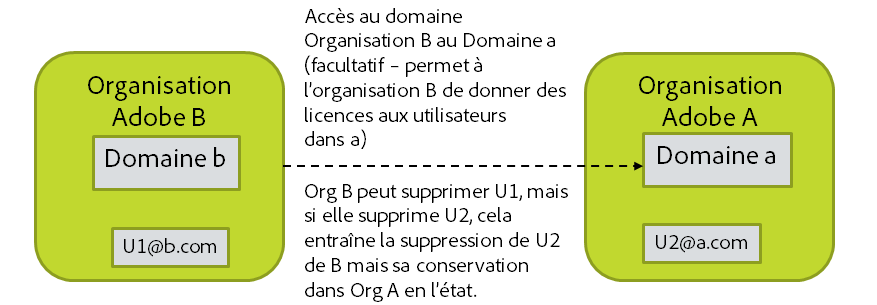

# Mode de traitement des suppressions de comptes

[Section précédente](layout_products.md) \| [Revenir au sommaire](index.md) \|  [Section suivante](setup_adobeio.md)

Lorsqu’un compte est désactivé ou supprimé de l’annuaire, vous voulez souvent que le compte Adobe correspondant soit supprimé. Toutefois, la suppression du compte Adobe peut supprimer des actifs, paramètres et autres, qui pourraient être utiles par la suite. En outre, les comptes Adobe ID éventuellement associés à votre organisation ne peuvent pas être supprimés, car ils appartiennent aux utilisateurs finaux. En revanche, vous pouvez récupérer les licences que vous aviez accordées à l’utilisateur Adobe ID si vous retirez ce dernier de votre organisation.

Options de gestion des suppressions de comptes Adobe par le biais de l’outil User Sync :

  - Aucune action. Le nettoyage des comptes doit être effectué manuellement.

  - Générer la liste des comptes à supprimer sans aucune autre action pour l’instant. Cette liste peut être modifiée et utilisée plus tard pour piloter la suppression des comptes via User Sync.

  - Récupérer toutes les licences attribuées au compte par votre organisation, mais laisser le compte actif. (remove-adobe-groups)

  - Récupérer toutes les licences et retirer le compte de votre organisation, mais sans supprimer le compte. (remove)

  - Récupérer toutes les licences et supprimer le compte. (delete)

À savoir concernant la suppression de compte :

  - La suppression du compte Adobe peut supprimer des actifs, des paramètres et autres qui pourraient être utiles par la suite.
 
  - Vous pouvez « supprimer » des comptes uniquement s’ils sont dans un domaine détenu par votre organisation.
  - Or, certains utilisateurs de votre organisation peuvent se trouver dans des domaines détenus par d’autres organisations. Cela peut se produire suite à une demande d’accès à un autre domaine détenu par une autre organisation, ce qui vous permet d’ajouter des utilisateurs de ce domaine à votre propre organisation et de leur accorder des licences que vous détenez.
    - Vous pouvez récupérer les licences que vous avez accordées à ces utilisateurs.
    - Vous pouvez les retirer de votre organisation, mais vous ne pouvez pas supprimer ces comptes car ils appartiennent à une autre organisation.
    - Si vous essayez de supprimer un compte de ce type, cela aura le même effet que de retirer l’utilisateur de votre organisation.

&#9744; Déterminez quels seront votre politique et votre processus pour supprimer des utilisateurs des systèmes Adobe lorsqu’ils sont retirés de l’annuaire. Cette décision aura un effet sur la façon dont vous appellerez User Sync dans une étape ultérieure.

Notez que les utilisateurs disposant d’un Federated ID ne peuvent pas se connecter une fois qu’ils ont été retirés de l’annuaire, car la connexion et l’accès sont contrôlés par le fournisseur d’identité de votre entreprise, et non par Adobe. Les utilisateurs Enterprise ID peuvent toujours se connecter, à moins que leur compte n’ait été totalement effacé, même s’ils peuvent n’avoir aucune licence accordée pour les produits. Les utilisateurs Adobe ID peuvent toujours se connecter dans la mesure où ils sont propriétaires de leur compte. Si un utilisateur est retiré de votre organisation, il perd l’accès aux licences que vous lui aviez accordées.

[Section précédente](layout_products.md) \| [Revenir au sommaire](index.md) \|  [Section suivante](setup_adobeio.md)

