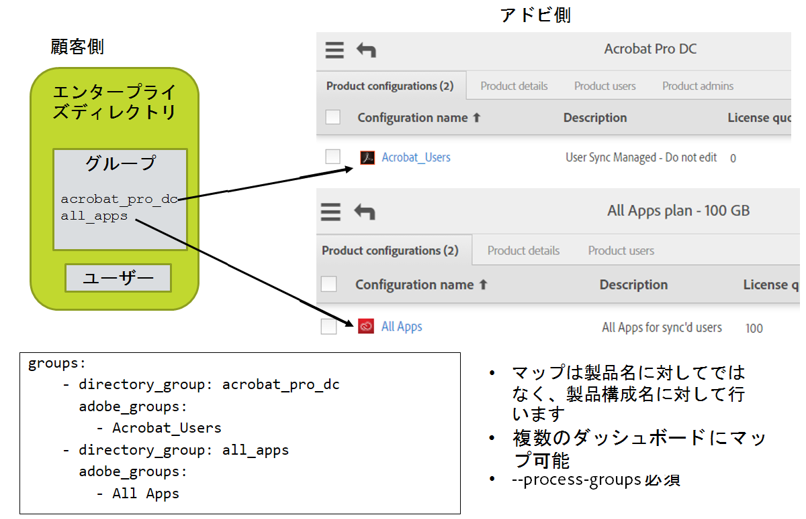

# 構成ファイルのセットアップ


[前の節](install_sync.md) \| [目次に戻る](index.md) \| [次の節](test_run.md)


この手順ですべてを 1 つにまとめます。次が必要になります。

- Adobe.io コンソールに表示される Adobe.io 統合アクセスの値
- 秘密キーファイル
- ディレクトリシステムのアクセス認証情報とユーザーの編成に関する情報
- User Sync を使用して製品のアクセスを管理するかどうかに関する決定
  - 製品プロファイルの名前とユーザーグループの名前（ライセンスのアドビ側での編成方法に対応）
  - 製品プロファイルとユーザーグループは Adobe Admin Console であらかじめ作成しておく必要があります。

ワープロエディターではなく、必ずテキストエディターを使用してください。

.yml ファイルではスペースを使用してください。タブは使用しません。


## 構成ファイルのセットアップ

前の手順で、User Sync ツールの Python コードと構成ファイルのためにファイルシステムディレクトリをセットアップしました。3 つの構成ファイルがセットアップされています。1 つはディレクトリシステムへのアクセス用、1 つはアドビ組織へのアクセス用、最後の 1 つにはグループマッピングの定義と他の User Sync 機能の構成が含まれます。

### ディレクトリアクセスの構成ファイル

ファイルから User Sync を起動する場合は、connector-ldap.yml のセットアップを省略できます。代わりに、「csv inputs - user and remove lists/1 users-file.csv」ファイルの例に従って、ユーザーリストすべてを含む csv ファイルを作成します。このファイルは、リリースの example-configurations.tar.gz ダウンロードに含まれます。

&#9744; ファイル connector-ldap.yml を編集します。このファイルにはディレクトリシステムのアクセス情報が含まれます。username、password、host、base_dn の値を入力します。

&#9744; ファイルの残りの部分に目を通して、自らのインストールに該当する他の項目がないか確認します。通常、他に必要なものはありません。


必要なユーザーのセットを選択するためにデフォルト以外の LDAP クエリが必要な場合には、このファイルで all\_users\_filter 構成パラメーターの一部としてセットアップします。


### Adobe UMAPI 認証情報

&#9744; connector-umapi.yml を編集します。前に作成した adobe.io 統合の情報を入力します。これは、org\_id、api\_key、client\_secret、tech\_acct です。

&#9744; 秘密キーファイルを user_sync_tool フォルダーに配置します。構成ファイルの priv\_key\_path 項目にこのファイルの名前を設定します。


### User Sync のメイン構成ファイル

user-sync-config.yml ファイルを編集します。

#### デフォルトの国コード

	directory:
	  # （オプション）デフォルトの国コード。ディレクトリでユーザーに国コードが提供されない場合に使用されます。(2 文字の ISO-3166 コードを指定する必要があります。https://en.wikipedia.org/wiki/ISO_3166-1 を参照してください。)
	  #
	  # 例：
	  # default_country_code: US


&#9744; ご使用のディレクトリに各ユーザーの国がリストされない場合、デフォルトの国をここで設定できます。デフォルト国コードの行から "# " を削除して次のようにします。

	  default_country_code: US

適切な国をコードに設定します。行のインデントレベルは変更しないでください。

国コードは Federated ID では**必須**、Enterprise ID では推奨です。Enterprise ID について指定しないと、ユーザーが最初にログインするときに国を選択するように求められます。

### コネクタ

	  connectors:
	    # 様々なディレクトリコネクタの構成を指定します。
	    # 形式は「名前 : 値」で、値は次のいずれかです。
	    # 実際の構成のディクショナリ、
	    # 構成を含むファイルの文字列、
	    # ディクショナリと文字列が混在するリスト
	    #
	    # 例：
	    # ldap: example.connector-ldap.yml
	    # ldap: 
	    #   - host: LDAP_host_URL_goes_here
	    #     base_dn: base_DN_goes_here
	    #   - connector-ldap-credentials.yml

ここでは何も変更する必要はありません。ldap 行が使用されるのは、ldap ディレクトリのアクセス構成ファイルでデフォルト以外の名前を使用する場合です。

#### グループのマップ

User Sync を使用してライセンスを管理しない場合は、この節でのグループマッピングの設定を省略できます。

ユーザーアカウントをプロビジョニングするには、Adobe Admin Console ではなく LDAP/AD ツールを使用してユーザーアカウントをエンタープライズディレクトリグループに追加します。次に、構成ファイルで、ディレクトリグループからアドビ PC へのマッピングを定義します。あるユーザーがディレクトリグループのメンバーである場合は、user-sync によって対応する PC に追加されます。削除の場合も同じです。


&#9744; ファイルのグループマッピングの部分を編集します。ディレクトリグループ D を Adobe PC またはユーザーグループ P にマップする場合は、「groups:」の後に次の形式のエントリを追加します。

	    - directory_group: D
	      adobe_groups: 
	        - P

実際の例は次のようになります。

	  groups:
	    - directory_group: acrobat_pro_dc
	      adobe_groups: 
	        - Default Acrobat_Users
	    - directory_group: all_apps
	      adobe_groups:
	        - All Apps




#### 不一致のユーザーに関する制限

間違った構成や他の問題のために、User Sync がディレクトリシステムから適切なデータを取得できない場合に備え、誤ってアカウントを削除できないように削除が制限されています。

&#9744; User Sync の実行と実行の間に 200 を超えるディレクトリユーザーが削除されると予想される場合には、`max_adobe_only_users` 値を増やす必要があります。この構成ファイルエントリにより、構成ミスや他の問題による削除を防ぐことができます。

	limits:
	    max_adobe_only_users: 200      # この数のディレクトリユーザーが消失した場合は更新を中止します。


#### 削除の保護

アカウントの作成と削除を User Sync を使用して処理する場合に、手動でも少数のアカウントの作成のみをおこないたいときには、手動で作成されたアカウントを User Sync が削除しないようにこの機能が必要になることがあります。

&#9744; この機能を使用する必要がある場合は、次のような行を構成ファイルの adobe_users の下に追加します。Admin Console でユーザーの更新を防ぐには、ユーザーグループを作成して、保護するユーザーをそのグループに含め、そのグループを User Sync 処理から除外するように指定します。特定のユーザー、または特定のユーザー名と一致するパターン（あるいは両方）を指定して、それらのユーザーを保護することもできます。ユーザーを ID タイプに基づいて保護することもできます。例えば、多くの場合、User Sync を使用して federatedID または enterpriseID ユーザータイプのみを管理することができます。adobeID タイプユーザーを User Sync による管理から除外できます。使用する除外方法のための構成項目を含める必要があります。

```YAML
adobe_users:
  exclude_adobe_groups: 
    - administrators   # アドビユーザーグループまたは製品構成の名前。含まれるメンバーは User Sync によって変更または削除されません。
    - contractors      # リストには複数のグループを指定できます。
  exclude_users:
    - ".*@example.com"
    - important_user@gmail.com
  exclude_identity_types:
    - adobeID          # adobeID、enterpriseID、federatedID（いずれかまたはすべて）
```


上記で、administrators、contractors、およびユーザー名が例の値です。ユーザーが作成したアドビユーザーグループ、製品構成またはユーザーの名前を使用できます。

`exclude_groups` には、アドビユーザーグループまたは製品構成（あるいは両方）のリストを定義します。リストに指定されたグループのメンバーであるアドビユーザーは、削除または更新されません。グループのメンバーシップが変更されることもありません。

`exclude_users` にはパターンのリストを指定します。指定されたパターンのいずれかとユーザー名が一致する（大文字と小文字の区別が指定されない限りデフォルトでは区別なし）アドビユーザーは、削除または更新されません。グループのメンバーシップが変更されることもありません。

`exclude_identity_types` には ID タイプのリストを指定します。いずれかの ID タイプであるアドビユーザーは、削除または更新されません。グループのメンバーシップが変更されることもありません。

次の点に注意してください。

- 通常は 3 つの除外オプションすべてを使用することはありません。

- その後の実行時に除外パラメーターの 1 つによってアドビ側のユーザーが更新から除外される場合でも、引き続き、ディレクトリ側のユーザーがアドビ側に作成されます。つまり、これらのパラメーターが適用されるのは、アドビディレクトリが顧客のディレクトリと照合されるときに存在しているアドビユーザーのみです。

- 削除または更新される予定だったアカウントが、削除または更新されていないのは、この機能が「debug」レベルのログエントリとして指定されているためです。

- ディレクトリに含まれない、またはディレクトリで無効になっている Federated ID アカウントは、なおもアドビに存在している場合でもログインできません（ログインは ID プロバイダーによって処理され、ユーザーがそこにはリストされなくなったため）。
- ID タイプ adobeID の除外をお勧めします。これらは通常はエンタープライズディレクトリにリストされないためです。


#### ログ記録

User Sync で生成されるログエントリは標準出力に出力され、ログファイルにも書き込まれます。構成設定のログ記録設定によって、ログ情報の出力先や量に関する詳細が制御されます。

log\_to\_file を使用して、ファイルへのログのオンとオフを切り替えます。

メッセージは 5 つの重要度レベルのいずれかになります。選択した重要度以上のメッセージが、ファイルログかコンソールへの標準出力ログのいずれかに出力されます。デフォルトでは、ファイルログが生成され、「info」以上のレベルのメッセージが出力されます。これが推奨設定です。

&#9744; ログの設定を確認し、必要に応じて変更します。推奨されるログレベルは info（デフォルト）です。

	logging:
	  # ログファイルを生成するかどうかを指定します。
	  # 「True」または「False」
	  log_to_file: True
	  # ログの出力パス
	  file_log_directory: logs
	  # ファイルのログレベル：「debug」、「info」、「warning」、「error」、「critical」のいずれかに設定できます。
	  # これは昇順です。つまり「debug」よりも「critical」が上です。
	  file_log_level: debug
	  # コンソールのログレベル：「debug」、「info」、「warning」、「error」、「critical」のいずれかに設定できます。
	  # これは昇順です。つまり「debug」よりも「critical」が上です。デフォルトを次に示します。
	  # console_log_level: debug


[前の節](install_sync.md) \| [目次に戻る](index.md) \| [次の節](test_run.md)
