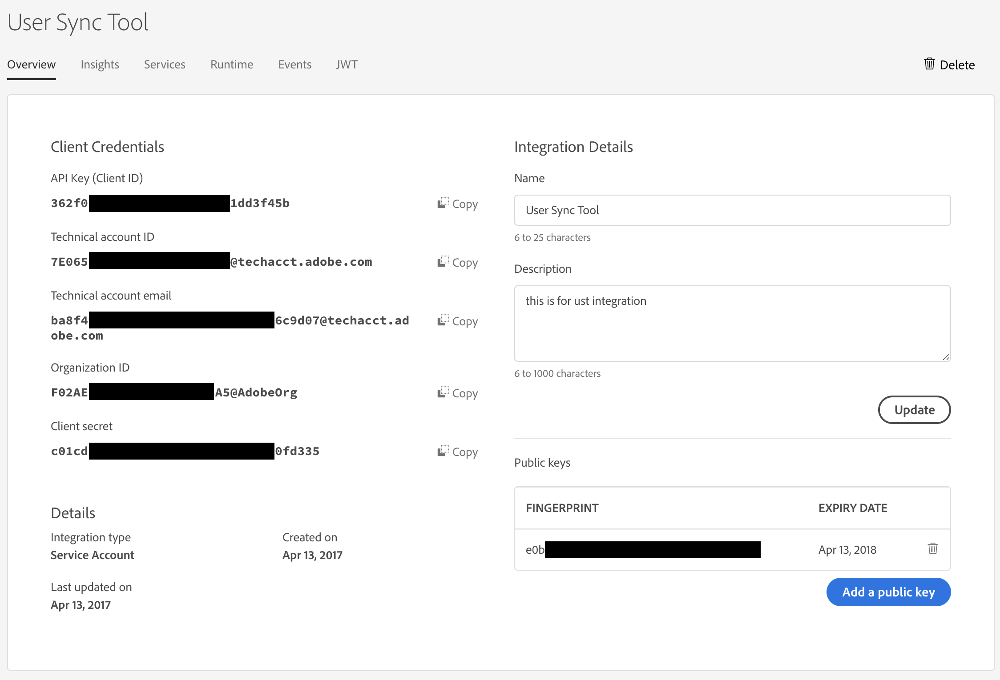

Page header - keep this at the top, but update nav_link

---
layout: default
lang: en
nav_link: Name of Document
nav_level: 2
nav_order: 70
---


# Page title

## In This Section
{:."no_toc"}

* TOC Placeholder
{:toc}

Update previous section to point to the previous page
---

[Previous Section](advanced_configuration.md)

---

## Section Heading
### Sub Heading
#### Sub sub heading

Paragraph:
Lorem ipsum dolor sit amet, `inline code`, sed do 
eiusmod tempor incididunt ut labore et dolore magna aliqua. Ut 
enim ad minim veniam, quis nostrud exercitation ullamco laboris 
nisi ut aliquip ex ea commodo consequat. Duis aute irure dolor in 
reprehenderit in voluptate velit esse cillum dolore eu fugiat nulla pariatur. 
Excepteur sint occaecat cupidatat non proident, sunt in culpa qui officia 
deserunt mollit anim id est laborum.

[A hyperlink](https://adobe.com) <br/>
[A relative link to another doc](advanced_configuration.md)


*Italics*<br/>
**Bold**

A list:
* Bulleted 1
* Bulleted 2


Preformatted - contents will appear exactly as written:
```
I can put code or markdown in here and it will be displayed
without rendering

* List item
* List item

** Heading **

| Col 1 Name | Col 2 Name | Col 3 Name |
|------------|--------------|--------------|
| Entry 1 | Text | Text |
| Entry 2 | Text | Text |
```


Configuration file block:
```YAML	
enterprise:
  org_id: your org id
  secure_api_key_key: umapi_api_key
  secure_client_secret_key: umapi_client_secret
  tech_acct: your tech account@techacct.adobe.com
  secure_priv_key_data_key: umapi_private_key_data
```

A command

```
openssl pkcs8 -in private.key -topk8 -v2 des3 -out private-encrypted.key
```

Syntax highlighting for language
```python
for x in range(20):
    print(x)
```

A table. Include the borderstyle underneath for formatting

| Col 1 Name | Col 2 Name | Col 3 Name |
|------------|--------------|--------------|
| Entry 1 | Text | Text |
| Entry 2 | Text | Text |
{: .bordertablestyle }


An image from URL:<br/>


A locally referenced image:<br/>


A resized image:<br/>


---

Include the navigation links at the end

[Previous Section](index.md)  \| [Next Section](configuring_user_sync_tool.md)
