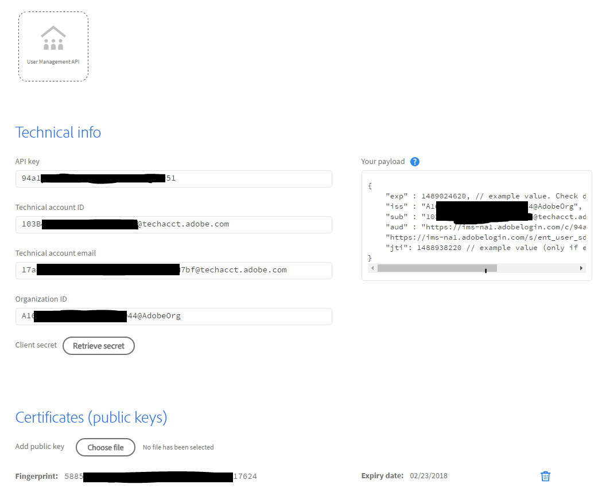

# Setup an Adobe.io Integration

[Previous Section](decide_deletion_policy.md) \| [Back to Contents](index.md) \| [Next Section](identify_server.md)

Adobe has designed a secure protocol for applications to integrate with Adobe Apis and User Sync is such an application.

Setup steps are documented.  For complete information about the integration setup process and certificate requirements, see [here](https://www.adobe.io/products/usermanagement/docs/setup)

- You need to create or obtain a digital certificate to sign initial API calls.
  - The certificate is not used for SSL or any other purpose so trust chains and browser issues do not apply.
  - You can create the certificate yourself using free tools or purchase one (or obtain from your IT department).
  - You will need a public key certificate file and a private key file.
  - You’ll want to protect the private key file as you would a root password.
- Once setup, the Adobe.io console displays all needed values.  You’ll copy these into the user sync configuration file.
- You'll also need to add the private key file to the User Sync configuration.

&#9744; Obtain or create a digital signing certificate.  See [instructions for certificate creation](https://www.adobe.io/apis/cloudplatform/usermanagement/docs/setup/createcert.html).

&#9744; Setup an adobe.io integration for each organization you need to access (usually only one).  See Step 2 and 3 on this [page](https://www.adobe.io/apis/cloudplatform/console/authentication/createcert.html)

&#9744; Note the configuration parameters for your integration (redacted example shown below).  They will be used in a later step.

[Previous Section](decide_deletion_policy.md) \| [Back to Contents](index.md) \| [Next Section](identify_server.md)
