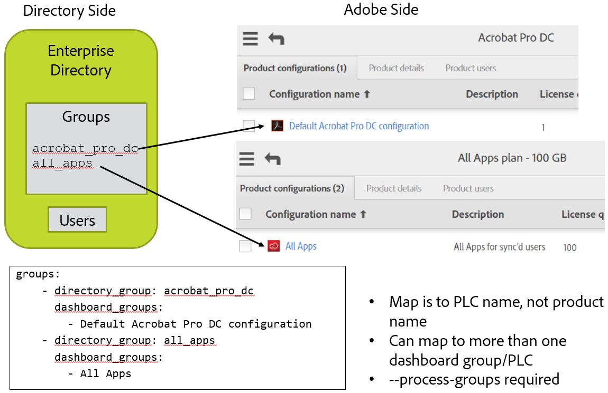

# Setup Configuration Files

[Previous Section](install_sync.md) \| [Back to Contents](index.md) \| [Next Section](test_run.md)

Now comes the step where we put everything together.  You’ll need:

- Adobe.io integration access values from the adobe.io console
- Private key file
- Directory system access credentials and information about how users are organized
- Decision of whether you are managing product access via user sync
  - Product Configuration names and user group names for how you want licenses organized on the Adobe side
  - Product Configurations and user groups need to have been already created on the Adobe Admin Console.

Be sure to use a text editor, not a word processing editor.

Be sure to use spaces, not tabs in .yml files.

## Let’s Setup the Configuration Files

In previous steps, you set up a file system directory for the user sync tool Python code and configuration files.  There are three configuration files to set up now.  One is for accessing the directory system, one is for accessing your Adobe organization, and one defines the group mapping and configures other User Sync features. 

### Directory Access Configuration File

If you are driving User Sync from a file, you can skip this step.  Setup a csv file with your entire user list following the "csv inputs - user and remove lists/1 users-file.csv" file example.  This file is in the examples.config.tar.gz download from the release.

&#9744; Edit the file connector-ldap.yml.  This file has access information to the directory system.  Put in username, password, host, and base_dn values.

&#9744; Read through the rest of the file to see what else could be specified which might apply in your installation.  Usually, nothing else is required.

If you need a non-default LDAP query to select the desired set of users, it is setup in this file as part of the all\_users\_filter config parameter.

### Adobe UMAPI Credentials 

&#9744; Edit the dashboard-config.yml.  Put in the information from the adobe.io integration you created earlier.  This would be the org\_id, api\_key, client\_secret, and tech\_acct.

&#9744; Place the private key file in the user_sync_tool folder The priv\_key\_path config file items is then set to the name of this file.

### Main User Sync config file 

Edit the user-sync-config.yml file.

#### Default Country Code

	directory:
	  # (optional) Default country code to use if directory doesn't provide one for a user [Must be two-letter ISO-3166 code - see https://en.wikipedia.org/wiki/ISO_3166-1]
	  #
	  # example:
	  # default_country_code: US

If your directory does not list a country for each user, you can set a default country here.  Remove the "# " from the default country code line so it looks like this

	  default_country_code: US

and set the code to the appropriate country.  Don't change the indent level of the line.

A country code is **REQUIRED** for Federated Ids and recommended for Enterprise Ids.  If not supplied for Enterprise Ids, the user will be prompted to choose a country when they first log in.

### Connectors

	  connectors:
	    # specifies the configurations for the difference directory connectors
	    # The format is name : value, where value can be:
	    # a dictionary for the actual configuration, or 
	    # a string for the file containing the configuration, or
	    # a list containing a mixture of dictionaries and strings
	    #
	    # examples:   
	    # ldap: example.connector-ldap.yml
	    # ldap: 
	    #   - host: LDAP_host_URL_goes_here
	    #     base_dn: base_DN_goes_here
	    #   - connector-ldap-credentials.yml

You shouldn't need to make any changes here.  The ldap line is used if you are using a non-default name for the ldap directory access config file.

#### Group Map

If you are not managing licenses via User Sync, you can skip this section where we set the group mapping.

You can provision user accounts by adding them to an enterprise directory group using LDAP/AD tools rather than the Adobe Admin Console.  Then, the config file defines a mapping from directory groups to Adobe PCs.  If a user is a member of a directory group, user-sync will add them to the corresponding PC.  Same for removal.

&#9744; Edit the group mapping part of the file.  For each directory groups D that should map to an Adobe PC or user group P, add an entry after "groups:" of the form

	    - directory_group: D
	      dashboard_groups: 
	        - P

A more realistic example is:

	  groups:
	    - directory_group: acrobat_pro_dc
	      dashboard_groups: 
	        - Default Acrobat Pro DC configuration
	    - directory_group: all_apps
	      dashboard_groups:
	        - All Apps

#### Delete Limits 

Limits on deletion prevent accidental account deletion in the event of misconfiguration or some other problem that results in User Sync not getting proper data from the directory system.

&#9744; If you expect higher churn in accounts, you will need to raise the max\_deletions\_per\_run item to a value around your expected number of deletions per run of sync.

&#9744; If you expect the number of directory users to drop by more than 200 between User Sync runs, then you will need to raise the max\_missing\_users value.  These config file entries are to prevent runaway deletion in case of misconfiguration or other problems.

	limits:
	    max_deletions_per_run: 10   # ceiling on disable/remove/delete
	    max_missing_users: 200      # abort if this many directory users disappear

#### Delete Protection

If you want to drive account creation and removal through User Sync, and want to manually create a few accounts then you may need this feature to keep User Sync from deleting your manually created accounts.

&#9744; If you need to use this feature, add the lines such as below to the config file at the top level.  There may be commented out lines for these items already in your config file.  You can create user groups and add users to that user group on the Adobe Admin Console, and then list that user group as excluded from User Sync processing to protect that set of users.  You can list specific users and a pattern that matches specific user names to protect those users.  You can protect users based on their id type as well.  For example, often User Sync is used only to manage federated or enterprise user types and you can exclude Adobe Id type users from management by User Sync.  You only need to include configuration items for exclusions that you wish to use.

	dashboard_user_exclusions:
        exclude_groups: 
            - administrators   # Names an Adobe user group or product configuration whose members are not to be altered or removed by User Sync
            - contractors      # You can have more than one group in a list
        exclude_users:
            - ".*@example.com"
            - important_user@gmail.com
        exclude_identity_types:
            - adobeID              

In the above, administrators, contractors, and the user names are example values.  You would use the names of Adobe user groups, product configurations, or users that you have created.

`exclude_groups` defines a list of Adobe user groups or product configurations. Adobe users who are members of such groups are neither removed, updated, nor have their group membership changed.

`exclude_users` gives a list of patterns. Adobe users with usernames that match (default case-insensitive, unless the pattern specifies case-sensitive) any of the specified patterns (if there are more than one) are neither removed, updated, nor have their group membership changed.

`exclude_identity_types` gives a list of identity types. Adobe users who have one of these identity types are neither removed, updated, nor have their group membership changed.

Note that:

- You generally wouldn't use all three exclude options.

- Directory side users are still created on the Adobe side even if one of the exclude parameters would then exclude the user on the Adobe side from updates in successive runs. That is, these parameters apply only to Adobe users who exist when the Adobe directory is being matched against the customer directory.

- The entire `dashboard_user_exclusions` configuration section is optional. 

- Accounts that would have been removed or updated but were not because of this feature are listed as `info` level log entries.

- Note that Federated accounts that are not in the directory cannot log in anyway (because login is handled by the ID provider and the user is no longer listed there) even if the account still exists in the Adobe dashboard.

#### Logging

User Sync produces log entries that are printed to standard output and also written to a log file.  The logging set of configuration settings control details of where and how much log information is output.

log\_to\_file turns the file log on or off.  

Messages can be on one of 5 level of importance and you can choose the lowest importance that will be included for either the file log or standard output log to the console.  The defaults are to produce the file log and to include messages of level "info" or higher.  This is the recommended setting.

&#9744; Review the settings for logs and make any desired changes.

	logging:
	  # specifies whether you wish to generate a log file
	  # 'True' or 'False'
	  log_to_file: True
	  # output path for logs
	  file_log_directory: logs
	  # File Logging Level: Can be "debug", "info", "warning", "error", or "critical".  
	  # This is in ascending order, meaning "debug" < "critical".
	  file_log_level: debug
	  # Console Logging Level: Can be "debug", "info", "warning", "error", or "critical".  
	  # This is in ascending order, meaning "debug" < "critical".  Default is:
	  # console_log_level: debug

[Previous Section](install_sync.md) \| [Back to Contents](index.md) \| [Next Section](test_run.md)
