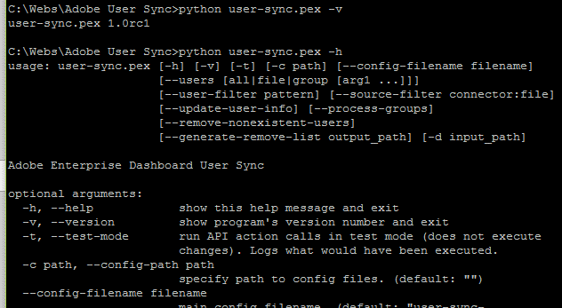

# Make a Test Run To Check Configuration

[Previous Section](setup_config_files.md) \| [Back to Contents](index.md) \| [Next Section](monitoring.md)

To invoke user sync:

Windows:      **python user-sync.pex ….**

Unix, OSX:     **./user-sync ….**

Give it a try:

	./user-sync –v            Report version
	./user-sync –h            Help on command line args

&#9744; Try the 2 commands above and verify that they are working. (On Windows, the command is slightly different.)

&#9744; Next, try a sync limited to a single user and run in test mode.  You need to know the name of some user in your directory.  For example, if the user is bart@example.com, try:

	./user-sync -t --users all --user-filter bart@example.com 

	./user-sync -t --users all --user-filter bart@example.com --process-groups

The first command above will sync only the one user (because of the user filter) which should result in an attempt to create the user.  Because of running in test mode (-t), the run of user-sync will only attempt to create the user and not actually do it.

The second command above (with the --process-groups option) will attempt to create the user and add them to any groups that are mapped from the their directory groups.  Again, this is in test mode so no actual action will be taken.  If there are already existing users and the groups have users already added to them, user-sync may attempt to remove them.  If this is the case, skip the next test.  Also, if you are not using directory groups to manage product access, skip the tests that involve --process-groups.

&#9744; Next, try a sync limited to a single user and don't run in test mode.  This should actually create the user and add to groups (if mapped). 

	./user-sync --users all --user-filter bart@example.com --process-groups

	./user-sync --users all --user-filter bart@example.com --process-groups

&#9744; Next, go check on the Adobe Admin Console if the user has appeared and the group memberships have been added.

&#9744; Next, rerun the same command.  User sync should not attempt to recreate and re-add the user to groups.  It should detect that the user already exists and is a member of the user group or PC and do nothing.

If these are all working as expected, you are ready to make a full run (without the user filter).  If you don't have too many users in your directory, you can try it now.  If you have more than a few hundred, it could take a long time so don't do the execution until you are ready to have a command running for many hours.  Also, go over the next few section before doing this in case there are other relevant command  line options.

[Previous Section](setup_config_files.md) \| [Back to Contents](index.md) \| [Next Section](monitoring.md)

