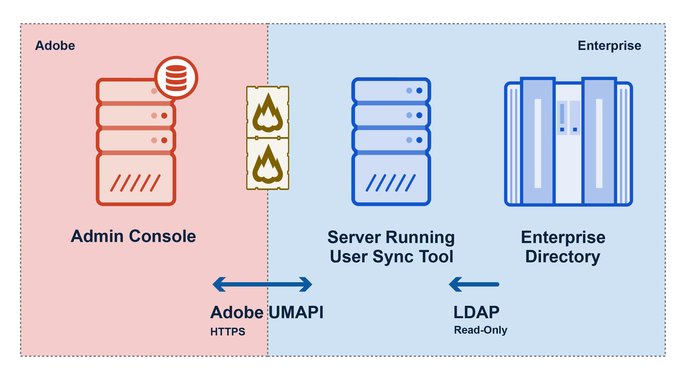
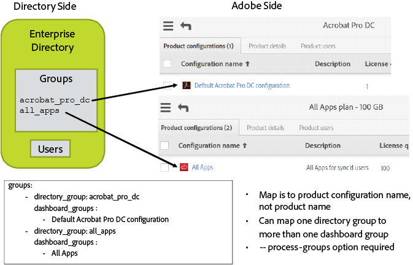

Version 1.1, released 2017-03-06

This document has all the information you need to get up and
running with User Sync. It presumes familiarity with the use of
command line tools on your local operating system, as well as a
general understanding of the operation of enterprise directory
systems.

### Table of Contents
{:."no_toc"}

* TOC Placeholder
{:toc}

## Introduction

User Sync, from Adobe, is a command-line tool that moves user and
group information from your organization's LDAP-compatible
enterprise directory system (such as Active Directory) to the
Adobe User Management system.

Each time you run User Sync it looks for differences between the
user information in the two systems, and updates the Adobe
directory to match your directory.

### Prerequisites

You run User Sync on the command line or from a script, from a
server that your enterprise operates, which must have Python
2.7.9 or higher installed. The server must have an internet
connection, and be able to access Adobe's User Management system
and your own enterprise directory system.

The User Sync tool is a client of the User Management API
(UMAPI). In order to use it, you must first register it as an API
client in the [Adobe I/O console](https://www.adobe.io/console/),
then install and configure the tool, as described below.

The operation of the tool is controlled by local configuration
files and command invocation parameters that provide support for
a variety of configurations. You can control, for example, which
users are to be synced, how directory groups are to be mapped to
Adobe groups and product configurations, and a variety of other
options.

The tool assumes that your enterprise has purchased Adobe product
licenses. You must use the
[Adobe Admin Console](https://www.adobe.io/console/) to define
User Groups and Product License Configurations. Membership in
these groups controls which users in your organization can access
which products.

### Operation overview

User Sync communicates with your enterprise directory through
LDAP protocols. It communicates with Adobe's Admin Console
through the Adobe User Management API (UMAPI) in order to update
the user account data for your organization. The following figure
illustrates the data flow between systems.



Each time you run the tool:

- User Sync requests employee records from an enterprise
directory system through LDAP.
- User Sync requests current users and associated product
configurations from the Adobe Admin Console through the User
Management API.
- User Sync determines which users need to be created, deleted,
or updated, and what user-group and product configuration
memberships they should have, based on rules you have defined in
the User Sync configuration files.
- User Sync makes the required changes to the Adobe Admin Console
through the User Management API.

### Usage models

The User Sync tool can fit into your business model in various
ways, to help you automate the process of tracking and
controlling which of your employees and associates have access to
your Adobe products.

Typically, an enterprise runs the tool as a scheduled task, in
order to periodically update both user information and group
memberships in the Adobe User Management system with the current
information in your enterprise LDAP directory.

The tool offers options for various other workflows as well. You
can choose to update only the user information, for example, and
handle group memberships for product access directly in the Adobe
Admin Console. You can choose to update all users, or only
specified subsets of your entire user population.
In addition, you can separate the tasks of adding and updating
information from the task of removing users or memberships. There
are a number of options for handling the removal task.

For more information about usage models and how to implement
them, see the [Usage Scenarios](#Usage-Scenarios) section below.

## Setup and Installation

The use of the User Sync tool depends on your enterprise having
set up Product License Configurations in the Adobe Admin
Console. For more information about how to do this, see the
[Configure Services](https://helpx.adobe.com/enterprise/help/configure-services.html#configure_services_for_group)
help page.

### Set up a User Management API integration on Adobe I/O

The User Sync tool is a client of the User Management API. Before
you install the tool, you must register it as a client of the API
by adding an *integration* in the Adobe I/O
[Developer Portal](https://www.adobe.io/console/). You will need
to add an Enterprise Key integration in order to obtain the
credentials the tool needs to access the Adobe User Management
system.

The steps required for creating an integration are described in
detail in the
[Setting up Access](https://www.adobe.io/apis/cloudplatform/usermanagement/docs/setup.html)
section of the Adobe I/O User Management API website.  The
process requires that you create an integration-specific
certificate, which may self-signed.  When the process is
complete, you will be assigned an **API key**, a **Technical
account ID**, an **Organization ID**, and a **client secret**
that the tool will use, along with your cerficate information, to
communicate securely with the Admin Console. When you install the
User Sync tool, you must provide these as initial configuration
values that the tool requires to access your organization's user
information store in Adobe.

### Set up product-access synchronization

If you plan to use the User Sync tool to update user access to
Adobe products, you must create groups in your own enterprise
LDAP directory that correspond to the User Groups and Product
License Configurations that you have defined in the
[Adobe Admin Console](https://www.adobe.io/console/). Membership
in a product configuration grants access to particular set of
Adobe products. You can grant or revoke access to users or to
defined User Groups by adding or removing them from a product
configuration.

The User Sync tool can grant product access to users by adding
users to user groups and product configurations based on their
enterprise directory memberships, as long as the group names are
correctly mapped and you run the tool with the option to process
group memberships.

If you plan to use the tool in this way, you must map your
enterprise directory groups to their corresponding Adobe groups
in the main configuration file. To do this, you must ensure that
the groups exist on both sides, and that you know the exact
corresponding names.

#### Check your products and product configurations

Before you start configuring User Sync, you must know what Adobe
products your enterprise uses, and what Product License
Configurations and User Groups are defined in the Adobe User
Management system. For more information, see the help page for
[configuring enterprise services](https://helpx.adobe.com/enterprise/help/configure-services.html#configure_services_for_group).

If you do not yet have any configurations, you can use the
Console to create them. You must have some, and they must have
corresponding groups in enterprise LDAP directory, in order to
configure User Sync to update your user entitlement information.

The names of Product License Configurations generally identify
the types of product access that users will need, such as All
Access or Individual Product Access. To check the exact names, go
to the Products section in the
[Adobe Admin Console](https://www.adobe.io/console/) to see the
products that are enabled for your enterprise. Click a product to
see the details of Product License Configurations that have been
defined for that product.

#### Create corresponding groups in your enterprise directory

Once you have defined user groups and product configurations in
the Adobe Admin Console, you must create and name corresponding
groups in your own enterprise directory. For example, a directory
group corresponding to a “All Apps” product configuration
might be called “all_apps”.

Make a note of the names you choose for these groups, and which
Adobe groups they correspond to. You will use this to set up a
mapping in the main User Sync configuration file. See details in
the [Configure group mapping](#Configure-group-mapping) section
below.



### Installing the User Sync tool

#### System requirements

The User Sync tool is implemented using Python, and requires
Python version 2.7.9 or higher. For each environment in which you
intend to install, configure and run the script, you must make
sure that Python has been installed on the operating system
before moving to the next step. For more information, see the
[Python web site](https://www.python.org/).

The tool is built using a Python LDAP package, `pyldap`, which in
turn is built on the OpenLDAP client library. Windows Server,
Apple OSX and many flavors of Linux have an OpenLDAP client
installed out of the box.  However, some UNIX operating systems,
such as OpenBSD and FreeBSD do not have this included in the base
installation.

Check your environment to be sure that an OpenLDAP client is
installed before running the script. If it is not present in your
system, you must install it before you install the User Sync
tool.

#### Installation

The User Sync Tool is available from the
[User Sync repository on GitHub](https://github.com/adobe-apiplatform/user-sync.py). To
install the tool:

1. Click the **Releases** link to locate the latest release,
which contains the release notes, this documentation, sample
configuration files, and all the built versions (as well as
source archives).

2. Select and download the compressed package for your platform
(the `.tar.gz` file). Builds for Windows, OSX, and Ubuntu are
available. (If you are building from source, you can download the
Source Code package that corresponds to the release, or use the
latest source off the master branch.)

3. Locate the Python executable file (`user-sync` or
`user-sync.pex` for Windows) and place it in your User Sync root
folder.

4. Download the `examples.tar.gz` archive of sample configuration
files.  Within the archive, there is a folder for “config files –
basic”.  The first 3 files in this folder are required. Other
files in the package are optional and/or alternate versions for
specific purposes. You can copy these to your root folder, then
rename and edit them to make your own configuration files. (See
the following section,
[Configuring the User Sync Tool](#Configuring-the-User-Sync-Tool).)

5. **In Windows only:**

    Before running the user-sync.pex executable in Windows, you might
need to work around a Windows-only Python execution issue:

	The Windows operating system enforces a file path length limit of
260 characters. When executing a Python PEX file, it creates a
temporary location to extract the contents of the package. If the
path to that location exceeds 260 characters, the script does not
execute properly.

	By default, the temporary cache is in your home folder, which may
cause pathnames to exceed the limit. To work around this issue,
create an environment variable in Windows called PEX\_ROOT, a set
the path to C:\\user-sync\\.pex. The OS uses this variable for
the cache location, which prevents the path from exceeding the
260 character limit.

6. To run the User Sync tool, run the Python executable file,
`user-sync` (or execute `python user-sync.pex` on Windows).

#### Security Considerations

Because the User Sync application accesses sensitive information
on both the customer and Adobe sides, its use involves a number
of different files that contain sensitive information. Great care
should be take to keep these files save from unauthorized access.

##### Configuration files

Configuration files must include sensitive information, such as
your Adobe User Management API key, the path to your certificate
private key, and the credentials for your enterprise directory
(if you have one). You must take necessary steps to protect all
configuration files and ensure that only authorized users are
able to access them. In particular: do not allow read access to
any file containing sensitive information except from the user
account that runs the sync process.

If you are having User Sync access your corporate directory, it
must be configured to read from the directory server using a
service account. This service account only needs read access and
it is recommended that it _not_ be given write access (so that
unauthorized disclousre of the credential does not allow write
access to whomever receives it).

##### Certificate files

The files that contains the public and private keys, but
especially the private key, contain sensitive information. You
must retain the private key securely. It cannot be recovered or
replaced. If you lose it or it is compromised, you must delete
the corresponding certificate from your account. If necessary,
you must create and upload a new certificate. You must protect
these files at least as well as you would protect an account name
and password. The best practice is to store the key files in a
credential management system or use file system protection so
that it can only be accessed by authorized users.

##### Log files

Logging is enabled by default, and outputs all transactions
against the User Management API to the console. You can configure
the tool to write to a log file as well. The files created during
execution are date stamped and written to the file system.

The User Management API treats a user’s email address as the
unique identifier. Every action, along with the email address
associated with the user, is written to the log. If you choose to
log data to files, those files contain this sensitive
information.

The utility does not provide any log retention control or
management. If you choose to log data to files, take necessary
precautions to manage the lifetime and access to these files.

If your company’s security policy does not allow any personally
identifiable information to be persisted on disk, configure the
tool to disable logging to file. The tool continues to output the
log transactions to the console, where the data is stored
temporarily in memory during execution.

### Support for the User Sync tool

For additional support for this utility, please open an issue in
GitHub.  To help with the debugging process, include any log
files that are generated during the application execution in your
support request (as long as they contain no confidential
information).

Note that Adobe Customer Support is currently unable to provide
support for the User Sync tool.

## Configuring the User Sync Tool

The operation of the User Sync tool is controlled by a set of
configuration files with these file names, located in the same
folder as the command-line executable.

| Configuration File | Purpose |
|:------|:---------|
| dashboard&#x2011;config.yml&nbsp;&nbsp; | Required. Contains credentials and access information for calling the Adobe User Management API. |
| connector-ldap.yml | Required. Contains credentials and access information for accessing the enterprise LDAP directory. |
| user-sync-config.yml | Required. Contains configuration options that define the mapping of directory groups to Adobe product configurations and user groups, and that control the update behavior. |

If you need to set up access to users in other organizations that
have granted you access, you can include additional configuration
files. For details, see the
[advanced configuration instructions](#Accessing-Groups-in-Other-Organizations)
below.

### Setting up configuration files

Examples of the three required files are provided in the `config
files - basic` folder in the release artifact
`example.config.files.tar.gz`:

```text
1 user-sync-config.yml
2 dashboard-config.yml
3 connector-ldap.yml
```

To create your own configuration, copy the example files to your
User Sync root folder and rename them (to get rid of the leading
number). Use a plain-text editor to customize the your copied
configuration files for your environment and usage model. The
examples contain comments showing all possible configuration
items. You can uncomment items that you need to use.

Configurations files are in [YAML format](http://yaml.org/spec/)
and use the `yml` suffix. When editing YAML, remember some
important rules:

- Sections and hierarchy in the file are based on
indentation. You must use SPACE characters for indentation. Do
not use TAB characters.
- The dash character (-) is used to form a list of values. For
example, the following defines a list named “dashboard\_groups”
with two items in it.

```YAML
dashboard_groups:
  - Photoshop Users
  - Lightroom Users
```

Note that this can look confusing if the list has only one item
in it.  For example:

```YAML
dashboard_groups:
  - Photoshop Users
```

### Create and secure connection configuration files

The two connection configuration files store the credentials that
give User Sync access to the Adobe Admin Console and to your
enterprise LDAP directory. In order to isolate the sensitive
information needed to connect to the two systems, all actual
credential details are confined to these two files. **Be sure to
secure them properly**, as described in the
[Security Considerations](#Security-Considerations) section of
this document.

#### Configure connection to the Adobe Admin Console

When you have obtained access and set up an integration with User
Management in the Adobe I/O
[Developer Portal](https://www.adobe.io/console/), make note of
the following configuration items that you have created or that
have been assigned to your organization:

- Organization ID
- API Key
- Client Secret
- Technical Account ID
- Private Certificate

Open your copy of the dashboard-config.yml file in a plain-text
editor, and enter these values in the “enterprise” section:

```YAML
enterprise:
  org_id: "Organization ID goes here"
  api_key: "API key goes here"
  client_secret: "Client Secret goes here"
  tech_acct: "Tech Account ID goes here"
  priv_key_path: "Path to Private Certificate goes here"
```

**Note:** Make sure you put the private key file at the location
specified in `priv_key_path`, and that it is readable only to the
user account that runs the tool.

#### Configure connection to your enterprise directory

Open your copy of the connector-ldap.yml file in a plain-text
editor, and set these values to enable access to your enterprise
directory system:

```
username: "username-goes-here"
password: "password-goes-here"
host: "FQDN.of.host"
base_dn: "base_dn.of.directory"
```

### Configuration options

The main configuration file, user-sync-config.yml, is divided
into several main sections: **dashboard**, **directory**,
**limits**, and **logging**.

- The **dashboard** section specifies how the User Sync tool
connects to the Adobe Admin Console through the User Management
API. It should point to the separate, secure configuration file
that
stores the access credentials.
	- The **directory** subsection contains two subsections,
connectors and groups:
	- The **connectors** subsection points to the separate,
secure configuration file that stores the access credentials for
your enterprise directory.
- The **groups** section defines the mapping between your
directory groups and Adobe product configurations and user
groups.
- The **limits** section sets values that limit the number of
user accounts that can be deleted from the dashboard in a single
run, and the minimum number of users that must be in the
directory for user-sync to proceed with account deletion. These
limits prevent accidental deletion of a large number of accounts
in case of misconfiguration or other errors.
- The **logging** section specifies an audit trail path and
controls how much information is written to the log.

#### Configure connection files

The main User Sync configuration file contains only the names of
the connection configuration files that actually contain the
connection credentials. This isolates the sensitive information,
allowing you to secure the files and limit access to them.

Provide pointers to the connection configuration files in the
**dashboard** and **directory** sections:

```
dashboard:
  owning: dashboard-config.yml

directory:
  connectors:
    ldap: connector-ldap.yml
```

#### Configure group mapping

Before you can synchronize user groups and entitlements, you must
create User Groups and Product License Configurations in the
Adobe Admin Console, and corresponding groups in your enterprise
directory, as described above in
[Set up product-access synchronization](#Set-up-product-access-synchronization).

**NOTE:** All groups must exist and have the specified names on
both sides. The tool does not create any groups on either side;
if a named group is not found, the tool logs an error.

The **groups** section under **directory** must have an entry for
each enterprise directory group that represents access to an
Adobe product or products. For each group entry, list the product
configurations to which users in that group are granted
access. For example:

```YAML
groups:
  - directory_group: Acrobat
    dashboard_groups:
      - "Default Acrobat Pro DC configuration"
  - directory_group: Photoshop
    dashboard_groups:
      - "Default Photoshop CC - 100 GB configuration"
      - "Default All Apps plan - 100 GB configuration"
```

Directory groups can be mapped to either *product configurations*
or *user groups*. A `dashboard_groups` entry can name either kind
of group.

For example:

```YAML
groups:
  - directory_group: Acrobat
    dashboard_groups:
	  - Default Acrobat Pro DC configuration
  - directory_group: Acrobat_Accounting
	dashboard_groups:
	  - Accounting_Department
```

#### Configure limits

User accounts are removed from the Adobe dashboard when
corresponding users are not present in the directory and the tool
is invoked with the `--remove-nonexistent-users` option. The
`max_deletions_per_run` and `max_missing_users` values in
the `limits` section of the configuration file set limits on
how many users can be deleted at any one time. These limits
prevent accidental deletion of a large number of accounts in case
of misconfiguration or other errors:

- The value of `max_deletions_per_run` sets a limit on the number
of account deletions in a single run. If more users are flagged
for deletion, they are left for the next run.

	If you routinely remove a larger number of accounts, you can
raise this value.

- If your organization has a large number of users in the
enterprise directory and the number of users read during a sync
is suddenly small, this could indicate a misconfiguration or
error situation.  The value of `max_missing_users` is a threshold
which causes the run to exit and report an error if there are
this many fewer users in the enterprise directory than in the
Adobe admin console.

	Raise this value if you expect the number of users to drop by
more than the value specified.

For example:

```YAML
limits:
  max_deletions_per_run: 10
  max_missing_users: 200
```

This configuration causes User Sync to remove no more than 10
users in one run. Others are left for a later run. If more than
200 user accounts are not found in the enterprise directory, the
run halts with an error.

####  Configure logging

Log entries are written to the console from which the tool was
invoked, and optionally to a log file that you specify. A new
entry with a date-time stamp is written to the log each time the
tool runs.

The **logging** section under **directory** lets you enable and
disable logging to a file, and controls how much information is
written to the log.

```YAML
logging:
  log_to_file: True | False
  file_log_directory: "path to log folder"
  file_log_level: debug | info | warning | error | critical
  console_log_level: debug | info | warning | error | critical
```

The log_to_file value turns file-logging on or off. When it is
off, log messages are still written to the console.

When file-logging is enabled, the file_log_directory value is
required. It specifies the folder where the log entries are to be
written. If logging is enabled and a path is not provided, the
tool throws an exception.

- Provide an absolute path or a path relative to the folder
containing this configuration file.
- Ensure that the file and folder have appropriate read/write
permissions.

Log-level values determine how much information is written to the
log file or console.

- The lowest level, debug, writes the most information, and the
highest level, critical, writes the least.
- You can define different log-level values for the file and
console.

Log entries that contain WARNING, ERROR or CRITICAL include a
description that accompanies the status. For example:

> `2017-01-19 12:54:04 7516 WARNING
dashboard.trustee.org1.action - Error requestID: action_5 code:
"error.user.not_found" message: "No valid users were found in the
request"`

In this example, a warning was logged on 2017-01-19 at 12:54:04
during execution. An action caused an error with the code
“error.user.not_found”. The description associated with that
error code is included.

You can use the requestID value to search for the exact request
associated with a reported error. For the example, searching for
“action_5” returns the following detail:

> `2017-01-19 12:54:04 7516 INFO dashboard.trustee.org1.action -
Added action: {"do":
\[{"add": {"product": \["default adobe enterprise support program configuration"\]}}\],
"requestID": "action_5", "user": "cceuser2@ensemble.ca"}`

This gives you more information about the action that resulted in
the warning message. In this case, User Sync attempted to add the
“default adobe enterprise support program configuration” to the
user "cceuser2@ensemble.ca". The add action failed because the
user was not found.

### Example configurations

These examples show the configuration file structures and
illustrate possible configuration values.

##### user-sync-config.yml

```YAML
dashboard:
  owning: dashboard-config.yml
  user_identity_type: federatedID
directory:
  connectors:
    ldap: connector-ldap.yml
  groups:
    - directory_group: Acrobat
      dashboard_groups:
	    - Default Acrobat Pro DC configuration
	- directory_group: Photoshop
	  dashboard_groups:
	    - "Default Photoshop CC - 100 GB configuration"
		- "Default All Apps plan - 100 GB configuration"
		- "Default Adobe Document Cloud for enterprise configuration"
		- "Default Adobe Enterprise Support Program configuration"
limits:
  max_deletions_per_run: 10
  max_missing_users: 200
logging:
  log_to_file: True
  file_log_directory: userSyncLog
  file_log_level: debug
  console_log_level: debug
```

##### connector-ldap.yml

```YAML
username: "LDAP_username"
password: "LDAP_password"
host: "ldap://LDAP_ host"
base_dn: "base_DN"

group_filter_format: "(&(objectClass=posixGroup)(cn={group}))"
all_users_filter: "(&(objectClass=person)(objectClass=top))"
```

##### dashboard-config.yml

```YAML
server:
  # This section describes the location of the servers used for the dashboard. Default is:
  # host: usermanagement.adobe.io
  # endpoint: /v2/usermanagement
  # ims_host: ims-na1.adobelogin.com
  # ims_endpoint_jwt: /ims/exchange/jwt

enterprise:
  org_id: "Org ID goes here"
  api_key: "API key goes here"
  client_secret: "Client secret goes here"
  tech_acct: "Tech account ID goes here"
  priv_key_path: "Path to private.key goes here"
```

### Testing your configuration

Use these test cases to ensure that your configuration is working
correctly, and that the product configurations are correctly
mapped to your enterprise directory security groups . Run the
tool in test mode first (by supplying the -t parameter), so that
you can see the result before running live.

#####  User Creation

1. Create one or more test users in enterprise directory.

2. Add users to one or more configured directory/security groups.

3. Run User Sync.

4. Check that test users were created in Adobe Admin Console.

##### User Update

1. Modify product group membership of one or more test user.

1. Run User Sync.

2. Check that test users in Adobe Admin Console were updated to
reflect new product configuration membership.

#####  User Disable

1. Remove or disable one or more existing test users in your
enterprise directory.

2. Run User Sync.

3. Check that users were removed from configured product
configurations in the Adobe Admin Console.

## Command Parameters

Once the configuration files are set up, you can run the User
Sync tool on the command line or in a script. To run the tool,
execute the following command in a command shell or from a
script:

`user-sync` \[_optional parameters_\]

The tool accepts optional control arguments that determine its
specific behavior in various situations.


| Parameters&nbsp;and&nbsp;argument&nbsp;specifications | Description |
|------------------------------|------------------|
| `-h`<br />`--help` | Show this help message and exit.  |
| `-v`<br />`--version` | Show program's version number and exit.  |
| `-t`<br />`--test-mode` | Run API action calls in test mode (does not execute changes). Logs what would have been executed.  |
| `-c` _filename_<br />`--config-filename` _filename_ | The complete path to the main configuration file, absolute or relative to the working folder. Default filename is "user-sync-config.yml" |
| `--users` `all`<br />`--users` `file` _input_path_<br />`--users` `group` _grp1,grp2_ | Specify the users to be selected for sync. The default is `all` meaning all users found in the directory. Specifying `file` means to take input user specifications from the CSV file named by the argument.  Specifying `group` interprets the argument as a comma-separated list of groups in the enterprise directory, and only users in those groups are selected. |
| `--user-filter` _regex\_pattern_ | Limit the set of users that are examined for syncing to those matching a pattern specified with a regular expression. See the [Python regular expression documentation](https://docs.python.org/2/library/re.html) for information on constructing regular expressions in Python. |
| `--source-filter` _connector_:_file_ | Names a file containing LDAP filter settings. The filter is an LDAP query string that is passed directly to the LDAP server.  See the [sample above](#connector_ldap.yml) and others in the archive of examples. |
| `--update-user-info` | When supplied, synchronizes user information. If the information differs between the customer side and the Adobe side, the Adobe side is updated to match. This includes the firstname and lastname fields. |
| `--process-groups` | When supplied, synchronizes group membership information. If the membership in mapped groups differs between the customer side and the Adobe side, the group membership is updated on the Adobe side to match. |
| `--remove-nonexistent-users` | When supplied, if Federated users are found on the Adobe side that are not in the customer-side directory, removes those user accounts from the organization. |
| `--generate-remove-list` _output\_path_ | When supplied, if Federated users are found on the Adobe side that are not in the enterprise directory, lists those users to the given file. You can then pass this file to the `remove-list` argument in a subsequent run. |
| `-d` _input\_path_<br>`--remove-list` _input\_path_ | Removes a list of users contained in the given file from the Adobe organization. |
{: .bordertablestyle }


## Usage Scenarios

There are various ways to integrate the User Sync tool into
your enterprise processes, such as:

* **Update users and group memberships.** Sync users and group
memberships by adding, updating, and deleting users in Adobe User
Management system.  This is the most general and common use case.
* **Sync only user information.** Use this approach if product
access is to be handled using the Admin Console.
* **Filter users to sync.** You can choose to limit user-information
sync to users in given groups, or limit sync to users that match
a given pattern. You can also sync against a CSV file rather than
a directory system.
* **Update users and group memberships, but handle deletions
separately.** Sync users and group memberships by adding and
updating users, but do not delete users in the initial
call. Instead keep a list of users to be deleted, then perform
the deletions in a separate call.

This section provides detailed instructions for each of these scenarios.

### Update users and group memberships

This is the most typical and common type of invocation. The tool
finds all changes to user information and to user-group and
product configuration membership information on the enterprise
side. It syncs the Adobe side by adding, updating, and deleting
users and memberships.

For users that have a Federated identity type, this action
deletes users that exist on the Adobe side, but no longer exist
in the enterprise directory.

This example assumes that the configuration file,
user-sync-config.yml, contains a mapping from a directory group
to an Adobe product configuration named **Default Acrobat Pro DC
configuration**.

#### Command

This invocation supplies both the users and process-groups
parameters, and allows deletion with the remove-nonexistent-users
parameter.

```sh
./user-sync –c user-sync-config.yml --users all --process-groups --remove-nonexistent-users
```

#### Log output during operation

```text
2017-01-20 16:51:02 6840 INFO main - ========== Start Run ==========
2017-01-20 16:51:04 6840 INFO processor - ---------- Start Load from Directory -----------------------
2017-01-20 16:51:04 6840 INFO connector.ldap - Loading users...
2017-01-20 16:51:04 6840 INFO connector.ldap - Total users loaded: 4
2017-01-20 16:51:04 6840 INFO processor - ---------- End Load from Directory (Total time: 0:00:00) ---
2017-01-20 16:51:04 6840 INFO processor - ---------- Start Sync Dashboard ----------------------------
2017-01-20 16:51:05 6840 INFO processor - Adding user with user key: fed_ccewin4@ensemble-systems.com 2017-01-20 16:51:05 6840 INFO dashboard.owning.action - Added action: {"do": \[{"createFederatedID": {"lastname": "004", "country": "CA", "email": "fed_ccewin4@ensemble-systems.com", "firstname": "!Fed_CCE_win", "option": "ignoreIfAlreadyExists"}}, {"add": {"product": \["default acrobat pro dc configuration"\]}}\], "requestID": "action_5", "user": "fed_ccewin4@ensemble-systems.com"}
2017-01-20 16:51:05 6840 INFO processor - Syncing trustee org1... /v2/usermanagement/action/82654BDB41957F45E43BA308@AdobeOrg HTTP/1.1" 200 77
2017-01-20 16:51:07 6840 INFO processor - ---------- End Sync Dashboard (Total time: 0:00:03) --------
2017-01-20 16:51:07 6840 INFO main - ========== End Run (Total time: 0:00:05) ==========
```

#### View result

When the synchronization succeeds, the Adobe Admin Console is
updated.  After this command is executed, your dashboard in the
Admin Console shows that a user with a Federated identity has
been added to the “Default Acrobat Pro DC configuration.”


### Sync only users

If you supply only the users parameter to the command, the action
finds changes to user information in the enterprise directory and
updates the Adobe side with those changes. You can supply
arguments to the users parameter that control which users to look
at on the enterprise side.

This invocation does not look for or update any changes in group
membership. If you use the tool in this way, it is expected you
will control access to Adobe products by updating user-group and
product configuration memberships in the Adobe Admin Console.

#### Sync all users

This action finds changes in user information for all the users
from the enterprise side, and updates that information on the
Adobe side. It ignores users that are on the Adobe side but no
longer on the customer side, and does not perform any product
configuration or user group management.

```sh
./user-sync –c user-sync-config.yml --users all
```

### Filter users to sync

Whether or not you choose to sync group membership information,
you can supply arguments to the users parameter that filter which
users are considered on the enterprise directory side, or that
get user information from a CSV file instead of directly from the
enterprise LDAP directory.

#### Sync only users in given groups

This action only looks for changes to user information for users
in the specified groups from. It does not look at any other users
in the enterprise directory, and does not perform any product
configuration or user group management.

```sh
./user-sync –c user-sync-config.yml --users groups "group1, group2, group3"
```

#### Sync only matching users

This action only looks for changes to user information for users
whose user ID matches a pattern. The pattern is specified with a
Python regular expression.

```sh
user-sync --users all --user-filter 'bill@forxampl.com' --process-groups
user-sync --users all --user-filter 'b.*@forxampl.com' --process-groups
```

#### Sync from a file

This action syncs to user information supplied from a CSV file,
instead of looking at the enterprise directory. An example of
such a file, example.users-file.csv, is provided with the tool.

```sh
./user-sync –c user-sync-config.yml --users file user_list.csv
```

#### Update users and group memberships, but handle deletions separately

If you do not supply the remove-nonexistent-users parameter,
you can sync user and group memberships without removing any
users from the Adobe side.

If you want to handle deletions separately, you can instruct
the tool to flag users that no longer exist in the enterprise
directory but still exist on the Adobe side. The
generate-remove-list parameter writes out the list of user who
are flagged for deletion to a CSV file.

To perform the deletions in a separate call, you can pass the
file generated by the generate-remove-list parameter, or you
can pass a CSV file of users that you have generated by some
other means An example of such a file, example.users-file.csv,
is provided with the tool.

#### Add users and generate a list of users to delete

This action synchronizes all users from the customer side with
the Adobe side and also generates a list of users that no longer
exist in the enterprise directory but still exist on the Adobe
side.

```sh
./user-sync –c user-sync-config.yml --users all --generate-remove-list users-to-remove.csv
```

#### Delete users from separate list

This action takes a CSV file containing a list of users that have
been flagged for deletion, and removes those users from the Adobe
side. The CSV file is typically the one generated by a previous
call that used the generate-remove-list parameter.

You can create a CSV file of users to delete by some other means.
However, if your list includes any users that still exist in your
enterprise directory, those users will be added back in on the
Adobe side by the next sync action that adds users.

```sh
./user-sync –c user-sync-config.yml --remove-list users-to-remove.csv
```

## Advanced Configuration

User Sync requires additional configuration to synchronize user
data in environments with more complex data structuring.

- When your enterprise includes several Adobe organizations, you
can configure the tool to add users in your organization to
groups defined in other organizations.
- When your enterprise user data includes customized attributes
and mappings, you must configure the tool to be able to recognize
those customizations.

### Accessing Groups in Other Organizations

A large enterprise can include multiple Adobe organizations. For
example, suppose a company, Geometrixx, has multiple departments,
each of which has its own unique organization ID and its own
Admin Console dashboard.

If an organization uses either Enterprise or Federated user IDs,
it must claim a domain. In a smaller enterprise, the single
organization would claim the domain **geometrixx.com**. However,
a domain can be claimed by only one organization. If multiple
organizations belong to the same enterprise, some or all of them
will want to include users that belong to the enterprise domain.

In this case, the system administrator for each of these
departments would want to claim this domain for identity use. The
Enterprise Dashboard prevents multiple departments from claiming
the same domain.  However, once claimed by a single department,
other departments can request access to another department's
domain. The first department to claim the domain is the *owner*
of that domain. That department is responsible for approving
any requests for access by other departments, who are then able
to access users in the domain without any special configuration
requirements.

No special configuration is required to access users in a domain
that you have been granted access to. However, if you want to add
users to user groups or product configurations that are defined
in other organizations, you must configure User Sync so that it
can access those organizations. The tool must be able to find the
credentials of the organization that defines the groups, and be
able to identify groups as belonging to an external organization.

To configure for access to groups in other organizations, you
must:

- Include additional connection configuration files in your User
Sync root folder.
- Tell the tool how to access these files.
- Identify groups that are defined in an external organization.

##### 1. Include additional configuration files

For each external organization to which you require access, you
must add a configuration file that provides the access
credentials for that organization's dashboard. The file has the
same format as the dashboard-config.yml file, and must be named
according to the following convention:

`dashboard-`_OrgName_`-config.yml`

For the _OrgName_ element, use a short identifier that you choose
to represent the organization.

##### 2. Configure the tool to access the additional files

Your main configuration file must define the filename format of
these additional configuration file names.

```YAML
accessor_config_filename_format: "dashboard-{organization_name}-config.yml"
```

In this specifier, `{organization_name}` is a literal value that
indicates a placeholder in the file names.

The dashboards section of the main configuration file must
include an accessors section that references these files, and
associates each one with the short organization name. For
example:

```YAML
accessors:
  org1: dashboard-org1-config.yml
  org2: dashboard-org2-config.yml
```

These referenced configuration files must exist in your
configuration folder, and contain access credentials for the
external organization.  Note that, like your own connection
configuration file, they contain sensitive information that must
be protected.

##### 3. Identify groups defined externally

When you specify your group mappings, you can map an enterprise
directory group to a dashboard group defined in an external
organization.

To do this, use the organization identifier as a prefix to the
group name. For example:

```YAML
- directory_group: CCE Trustee Group
  dashboard_groups:
    - "org1::Default Adobe Enterprise Support Program configuration"
```

### Custom Attributes and Mappings

You must configure User Sync to recognize any non-standard
mappings between your enterprise-directory user data and Adobe
user data.  Non-standard mappings include:

- Values for user name, groups, country, or email that are in or
are based on any non-standard attribute in the directory.
- Values for user name, groups, country, or email must be
computed from directory information.
- Additional user groups or products that must be added to or
removed from the list for some or all users.

Your configuration file must specify any custom attributes to be
fetched from the directory. In addition, you must specify any
custom mapping for those attributes, and any computation or
action to be taken to sync the values. The custom action is
specified using a small block of Python code. Examples and
standard blocks are provided.

Custom attribute handling is performed for each user, so the
customizations are configured in the per-user subsection of the
extensions section of the main User Sync configuration file.

```
extensions:
  - context: per_user
    extended_attributes:
	  - my-attribute-1
	  - my-attribute-2
    extended_dashboard_groups:
      - my-dashboard-group-1
	  - my-dashboard-group-2
    after_mapping_hook: |
		pass # custom python code goes here
```

#### Adding custom attributes

By default, User Sync captures these standard attributes for each
user from the enterprise directory system:

* `givenName` - used for Adobe-side first name in profile
* `sn` - used for Adobe-side last name in profile
* `c` - used for Adobe-side country (two-letter country code)
* `mail` - used for Adobe-side email
* `user` - used for Adobe-side username only if doing Federated ID via username

In addition, the tool captures any attribute names that appear in
customer-defined filters in the LDAP connector configuration.

You can add attributes to this set by specifying them in an
`extended_attributes` key in the main configuration file, as shown above. The
value of the `extended_attributes` key is a YAML list of strings, with
each string giving the name of a user attribute to be
captured. For example:

```YAML
extensions:
  - context: per-user
    extended_attributes:
    - bc
    - subco
```

This example directs User Sync to capture the `bc` and `subco`
attributes for every user loaded.

If one or more of the specified attributes is missing from the
directory information for a user, those attributes are
ignored. Code references to such attributes will return the
Python `None` value, which is normal and not an error.

#### Adding custom mappings

Custom mapping code is configured using an extensions section in
the main (user sync) config file. Within extensions, a per-user
section will govern custom code that's invoked once per user.

The specified code would be executed once for each user, after
attributes and group memberships have been retrieved from the
directory system, but before actions to Adobe have been
generated.

```YAML
extensions:
  - context: per-user
	extended_attributes:
	  - bc
	  - subco
	extended_dashboard_groups:
	  - Acrobat_Sunday_Special
	  - Group for Test 011 TCP
	after_mapping_hook: |
	  bc = source_attributes['bc']
	  subco = source_attributes['subco']
	  if bc is not None:
		  target_attributes['country'] = bc[0:2]
		  target_groups.add(bc)
	  if subco is not None:
		  target_groups.add(subco)
	  else:
		  target_groups.add('Undefined subco')
```

In this example, two custom attributes, bc, and subco, are
fetched for each user that is read from the directory. The custom
code processes the data for each user:

- The country code is taken from the first 2 characters in the bc
attribute.

	This shows how you can use custom directory attributes to provide
values for standard fields being sent to Adobe.

- The user is added to groups that come from subco attribute and
the bc attribute (in addition to any mapped groups from the group
map in the configuration file).

	This shows how to customize the group or product configuration
list to get users synced into additional groups.

If the hook code references Adobe groups or product
configurations that do not already appear in the **groups**
section of the main configuration file, they are listed under
**extended_dashboard_groups**. This list effectively extends the
set of dashboard groups that are considered on the Adobe
side. See
[Advanced Group and Product Management](#Advanced-Group-and-Product-Management)
for more information.

#### Hook code variables

The code in the `after_mapping_hook` is isolated from the rest of
the User Sync program except for the following variables.

##### Input values

The following variables can be read in the custom code.  They
should not be written, and writes tot them have no effect; they
exist to express the source directory data about the user.

* `source_attributes`: A per-user dictionary of user attributes
  retrieved from the directory system. As a Python dictionary,
  technically, this value is mutable, but changing it from custom
  code has no effect.

* `source_groups`: A frozen set of directory groups found for a
specific user while traversing configured directory groups.

##### Input/output values

The following variables can be read and written by the custom
code. They come in carrying data set by the default attribute and
group mapping operations on the current directory user, and can
be written so as to change the actions performed on the
corresponding Adobe user.

* `target_attributes`: A per-user Python dictionary whose keys
are the Adobe-side attributes that are to be set. Changing a
value in this dictionary will change the value written on the
Adobe side. Because Adobe pre-defines a fixed set of attributes,
adding a key to this dictionary has no effect.  The keys in this
dictionary are:
	* `firstName` - ignored for AdobeID, used elsewhere
	* `lastName` - ignored for AdobeID, used elsewhere
	* `email` - used everywhere
	* `country` - ignored for AdobeID, used elsewhere
	* `username` - ignored for all but Federated ID
      [configured with username-based login](https://helpx.adobe.com/enterprise/help/configure-sso.html)
	* `domain` - ignored for all but Federated ID [configured with username-based login](https://helpx.adobe.com/enterprise/help/configure-sso.html)
* `target_groups`: A per-user Python set that collects the
Adobe-side user groups and product configurations to which the
user is added when `process-groups` is specified for the sync
run.  Each value is a set of names. The set is initialized by
applying the group mappings in the main configurations file, and
changes made to this set (additions or removals) will change the
set of groups that are applied to the user on the Adobe side.
* `hook_storage`: A per-user Python dictionary that is empty the
first time it is passed to custom code, and persists across
calls.  Custom code can store any private data in this
dictionary. If you use external script files, this is a suitable
place to store the code objects created by compiling these files.
* `logger`: An object of type `logging.logger` which outputs to
the console and/or file log (as per the logging configuration).

### Advanced Group and Product Management

The **group** section of the main configuration file defines a
mapping of directory groups to Adobe user groups and product
configurations.

- On the enterprise directory side, User Sync selects a set of
users from your enterprise directory, based on the LDAP query,
the `users` command line parameter, and the user filter, and
examines these users to see if they are in any of the mapped
directory groups. If they are, User Sync uses the group map to
determine which Adobe groups those users should be added to.
- On the Adobe side, User Sync examines the membership of mapped
groups and product configurations. If any user in those groups is
_not_ in the set of selected directory users, User Sync removes
that user from the group. This is usually the desired behavior
because, for example, if a user is in the Adobe Photoshop product
configuration and they are removed from the enterprise directory,
you would expect them to be removed from the group so that they
are no longer allocated a license.


This workflow can present difficulties if you want to divide the
sync process into multiple runs in order to reduce the number of
directory users queried at once. For example, you could do a run
for users beginning with A-M and another with users N-Z. When you
do this, each run must target different Adobe user groups and
product configurations.  Otherwise, the run for A-M would remove
users from mapped groups who are in the N-Z set.

To configure for this case, use the Admin Console to create user
groups for each user subset (for example, **photoshop_A_M** and
**photoshop_N_Z**), and add each of the user groups separately to
the product configuration (for example, **photoshop_config**). In
your User Sync configuration, you then map only the user groups,
not the product configurations. Each sync job targets one user
group in its group map.  It updates membership in the user group,
which indirectly updates the membership in the product
configuration.

## Deployment Best Practices

The User Sync tool is designed to run with limited or no human
interaction, once it is properly configured. You can use a
scheduler in your environment to run the tool with whatever
frequency you need.

- The first few executions of the User Sync Tool can take a long
time, depending on how many users need to be added into the Adobe
Admin Console. We recommend that you run these initial executions
manually, before setting it up to run as a scheduled task, in
order to avoid having multiple instances running.
- Subsequent executions are typically faster, as they only need
to update user data as needed. The frequency with which you
choose to execute the application depends on how often your
enterprise directory changes.

### Security recommendations

Given the nature of the data in the configuration and log files,
a server should be dedicated for this task and locked down with
industry best practices. It is recommended that a server that
sits behind the enterprise firewall be provisioned for this
application. Only privileged users should be able to connect to
this machine. A system service account with restricted privileges
should be created that is specifically intended for running the
application and writing log files to the system.

The application makes GET and POST requests of the User
Management API against a HTTPS endpoint. It constructs JSON data
to represent the changes that need to be written to the Admin
console, and attaches the data in the body of a POST request to
the User Management API.

To protect the availability of the Adobe back-end user identity
systems, the User Management API imposes limits on client access
to the data.  Limits apply to the number of calls that an
individual client can make within a time interval, and global
limits apply to access by all clients within the time period. The
User Sync tool implements back off and retry logic to prevent the
script from continuously hitting the User Management API when it
reaches the rate limit. It is normal to see messages in the
console indicating that the script has paused for a short amount
of time before trying to execute again.

### Scheduled task examples

You can use a scheduler provided by your operating system to run
the User Sync tool periodically, as required by your
enterprise. These examples illustrate how you might configure the
Unix and Windows schedulers.

You may want to set up a command file that runs UserSync with
specific parameters and then extracts a log summary and emails it
to those responsible for monitoring the sync process. These
examples work best with console log level set to INFO

```YAML
logging:
  console_log_level: info
```

#### Run with log analysis in Windows

The following example shows how to set up a batch file `run_sync.bat` in
Windows.

```sh
python C:\\...\\user-sync.pex --users file example.users-file.csv --process-groups | findstr "WARNING ERROR CRITICAL ---- ====" > temp.file.txt
rem email the contents of temp.file.txt to the user sync administration
sendmail -s “Adobe User Sync Report for today” UserSyncAdmins@example.com < temp.file.txt
```

*NOTE*: Although we show use of `sendmail` in this example, there
is no standard email command-line tool in Windows.  Several are
available commercially.

#### Run with log analysis on Unix platforms

The following example shows how to set up a shell file
`run_sync.sh` on Linux or Mac OS X:

```sh
user-sync --users file example.users-file.csv --process-groups | grep "CRITICAL\|WARNING\|ERROR\|=====\|-----" | mail -s “Adobe User Sync Report for `date +%F-%a`” UserSyncAdmins@example.com
```

#### Schedule a UserSync task

##### Cron

This entry in the Unix crontab will run the User Sync tool at 4
AM each day:

```text
0 4 * * * /path/to/run_sync.sh
```

Cron can also be setup to email results to a specified user or
mailing list. Check the documentation on cron for your system
for more details.

##### Windows Task Scheduler

This code uses the Windows task scheduler to run the User Sync
tool every day starting at 4:00 PM:

```text
schtasks /create /tn "Adobe User Sync" /tr C:\path\to\run_sync.bat /sc DAILY /st 16:00
```

Check the documentation on the windows task scheduler (`help
schtasks`) for more details.

There is also a GUI for managing windows scheduled tasks. You can
find the Task Scheduler in the Windows administrative control
panel.
