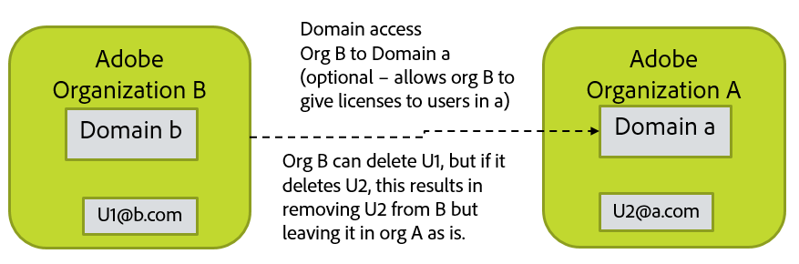

# Decide How You Will Handle Account Deletion

[Previous Section](layout_products.md) \| [Back to Contents](index.md) \|  [Next Section](setup_adobeio.md)

When accounts are disabled or deleted from the directory you often want the corresponding Adobe account removed, but removing the Adobe account may delete assets, settings, etc. that are later needed.  Also, Adobe Id accounts that may be in your organization cannot be deleted because the account belongs to the end user.  However, licenses you granted to the Adobe Id user can be recovered when you want to remove that user from your organization.

Choices available for handling Adobe account deletion via User Sync:

  - Take no action.  Account cleanup must be handled manually.

  - Generate list of accounts to be deleted, but no action is taken now.  The list can be edited and later used to drive account deletion through User Sync.

  - Recover all licenses given by your org to the account, but leave the account active. (remove-adobe-groups)

  - Recover all licenses and remove from your org, but leave account in existence.  (remove)

  - Recover all licenses and delete the account.  (delete)

Some things to know about account deletion:

  - Removing the Adobe account may delete assets, settings, etc. that are later needed
 
  - You can only “delete” accounts if they are in a domain that your org owns.
  - You may have users in your org that are in domains owned by other orgs.  This happens by way of requesting access to another domain owned by a different org which then allows you to add users from that domain to your own org and grant those users licenses that you own.
    - You can recover licenses you granted such users
    - You can remove them from your org, but you cannot delete such accounts because they are owned by a different org.
    - If you try to delete such an account, it has the same effect as removing the user from your org

&#9744; Decide what your policy and process will be for deleting users on the Adobe side when they are removed from the directory.  This decision will drive how you invoke user sync in a later step.

Note that Federated Id users cannot login once they have been removed from the directory because login and access are controlled by the company-run identity provider rather than Adobe.  Enterprise Id users can still login unless the account is actually deleted even though they  may not have licenses granted for any products.  Adobe Id users can always login since the user owns the account.  If they have been removed from your organization, they will no longer have any licenses that you may have granted them.

[Previous Section](layout_products.md) \| [Back to Contents](index.md) \|  [Next Section](setup_adobeio.md)

