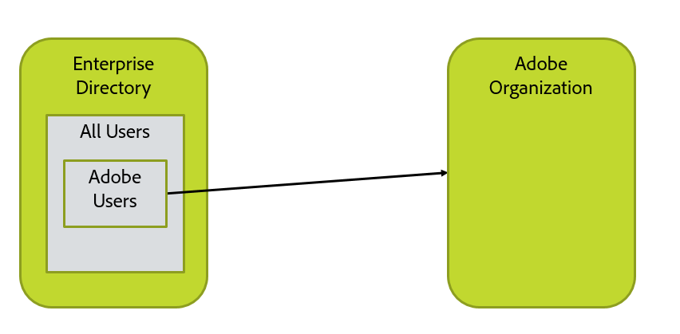
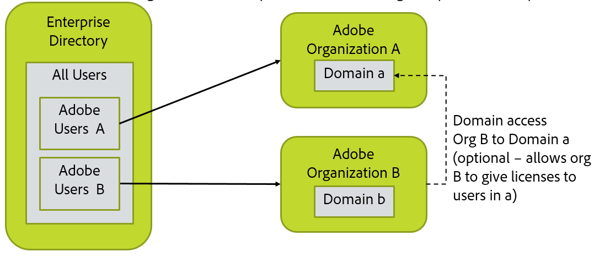
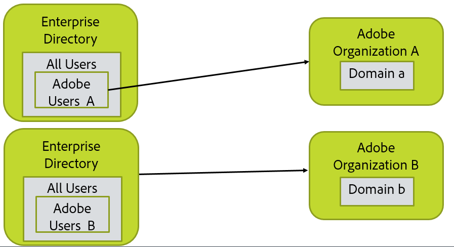
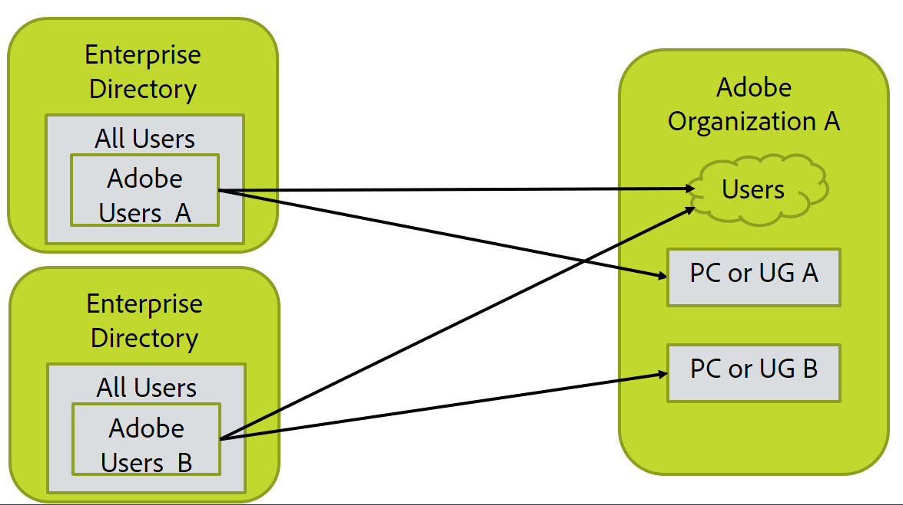

# Map Organization, Groups, and Directory Layout

[Previous Section](before_you_start.html) \| [Back to Contents](index.html) \| [Next Section](layout_products.html)

In this step, you will need to create a picture of your directory, Adobe organization, and user configuration.  This should include the LDAP query for selecting the users, and list of domains where the users are based.  (If a user has email n@d.com, d.com is the domain of the user.)

&#9744; In this section, there are several alternate configurations shown.  You'll be doing the steps for only one of them.

## Simplest and Most Common Case

Most configurations look like this.  There is a single directory and a single Adobe organization. All user might be selected as users to go into Adobe, or only a subset such as members of a particular directory group.  You will have to decide how this should be set up for your organization and have the LDAP query that selected the right users.

&#9744; You’ll need the LDAP query that selects the set of users to be sync’d with Adobe.  This will go into one of the user sync configuration files in a later step.

&#9744; You need to claim each domain on the Adobe Admin Console for the Adobe Organization in which it will be managed.

&#9744; Gather the credential information you need to access the directory.  We recommend creating a read-only directory access account and using that to access the AD or LDAP, or other directory system.

## Multiple Adobe Organizations

You’ll need to run two sync instances, one for each organization.  This basically involves installing user sync twice with each install in a different file directory.

If licenses in one org are to be used by users in the other org, setup is more complex.  You'll need to get Adobe organization access credentials for each organization from which licenses will be assigned to users.

You'll need:

- &#9744; Admin access to each of the Adobe organizations

- &#9744; The LDAP query for each set of users

-  Be prepared to set up multiple user sync installs in later steps.

-  &#9744; Gather the credential information you need to access the directory.  We recommend creating a read-only directory access account and using that to access the AD or LDAP, or other directory system.

## Multi-Directory and Multi-Organization

This are basically two instances of everything; You’ll need to run two sync configurations; one for each directory and organization

If licenses in one org are to be used by users in the other org, setup is more complex.

You'll need:

- &#9744; Admin access to each of the Adobe organizations

- &#9744; The LDAP query for each set of users

-  Be prepared to set up multiple user sync installs in later steps.

-  &#9744; Gather the credential information you need to access the directory.  We recommend creating a read-only directory access account and using that to access the AD or LDAP, or other directory system.
 Note that you may need different credentials to access each directory instance.

## Multi-Directory and Single Organization

You’ll need to run two sync configurations; one for each directory.

User Groups (UG) and Product Configurations (PC) mapped and managed by the two User Sync jobs must not overlap.  That is, each user group and PC and be managed by only a single instance of user sync.

You cannot have User Sync delete users when it is configured in this way.  This is because the two sync instances would try to delete each others' users.

You'll need:

- &#9744; Admin access to the Adobe organization

- &#9744; The LDAP query for each set of users

-  Be prepared to set up multiple user sync installs in later steps.

-  &#9744; Gather the credential information you need to access the directory.  We recommend creating a read-only directory access account and using that to access the AD or LDAP, or other directory system.
 Note that you may need different credentials to access each directory instance.

[Previous Section](before_you_start.html) \| [Back to Contents](index.html) \| [Next Section](layout_products.html)
