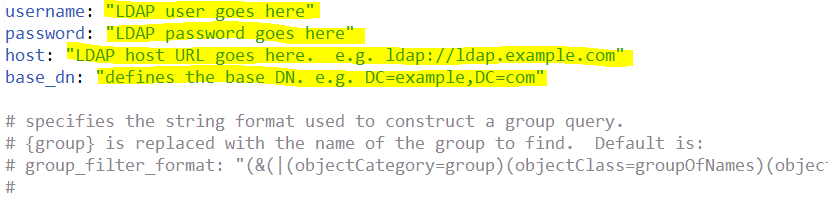

[Previous Section](install_sync.md) \| [Next Section](test_run.md)

# Set Up Configuration Files
{:."no_toc"}

<details open markdown="block">
  <summary>
    Table of contents
  </summary>
  {: .text-delta }
1. TOC
{:toc}
</details>

# Overview

Now to put things together in the User Sync Tool configuration files. Ensure
that you have the following:

- UMAPI credentials from the [Adobe Developer
  Console](https://developer.adobe.com/console)
  - See [this
    guide](https://developer.adobe.com/developer-console/docs/guides/authentication/ServerToServerAuthentication/implementation/)
    to create them if needed
- Plan to map user groups
- Credentials to LDAP system or other identity source (Admin Console, Okta, etc)

Be sure to use a plain text editor, not a word processor or rich text editor.

Be sure to use spaces, not tab characters for indentation in `.yml` files.

# Configuration File Setup

In previous steps, you set up a file system directory for the User Sync Tool and
configuration files. There are three configuration files to set up now. One is
for accessing the directory system, one is for accessing your Adobe
organization, and one defines the group mapping and configures other User Sync
features.

# Directory Access Configuration File

If you are driving User Sync from a file, you can skip setting up
connector-ldap.yml and instead create a csv file with your entire user list
following the "csv inputs - user and remove lists/users-file.csv" file example.
This file is in the example-configurations.tar.gz download from the release.

- Edit the file connector-ldap.yml. This file has access information to the
  directory system. Put in username, password, host, and base_dn values.

- Read through the rest of the file to see what else could be specified which
  might apply in your installation. Usually, nothing else is required.



If you need a non-default LDAP query to select the desired set of users, it is
setup in this file as part of the all\_users\_filter config parameter.

## Connecting to Microsoft Azure AD

Microsoft Azure AD is relatively straightforward to setup. However, some
prerequisite work must be done to enable LDAPS on the Azure tennant. You will
need to add Azure Domain Services, and setup password hash synchronization
before the tool will be able to bind to the domain. The following Microsoft
guides can walk you through the process for getting LDAPS enabled:

- [Setup Azure Domain
  Services](https://docs.microsoft.com/en-us/azure/active-directory-domain-services/active-directory-ds-getting-started)<br/>
- [Configure LDAPS on Azure
  AD](https://docs.microsoft.com/en-us/azure/active-directory-domain-services/active-directory-ds-admin-guide-configure-secure-ldap)

Once that is done, you will be able to connect to the Azure AD using normal LDAP
credentials with the UST. Please note, there is **no** requirement for using TLS
or an SSL cert on the UST side - you should be able to connect by binding to
port 636 with your Azure AD service account. In other words, the following key
in connector-ldap.yml can be set to False (the default):

- `require_tls_cert`: False

# Adobe UMAPI Credentials 

Open `connector-umapi.yml` in a text editor. Under the `server` key, set these
values according to your UMAPI credentials.

- `org_id`
- `client_id`
- `client_secret`

Next, ensure that the key `authentication_method` is present at the top level of
the file (i.e. with no indentation in front of it) and that it is set to
`oauth`.

Your UMAPI configuration should look like this:

```yaml
authentication_method: oauth
enterprise:
  org_id: "1234abc@AdobeOrg"
  client_id: "12345-12313-abcdef"
  client_secret: "97765-12313-abcdef"
```

# Main User Sync config file 

Edit the user-sync-config.yml file.

## Default Country Code

```yaml
directory:
# (optional) Default country code to use if directory doesn't provide one for a
# user [Must be two-letter ISO-3166 code - see
#       https://en.wikipedia.org/wiki/ISO_3166-1]
#
# example:
  # default_country_code: US
```

If your directory does not list a country for each user, you can set a default
country here. Remove the "# " from the default country code line so it looks
like this

```yaml
  default_country_code: US
```

and set the code to the appropriate country. Don't change the indentation of the
line.

A country code is **REQUIRED** for Federated Ids and recommended for Enterprise
Ids. If not supplied for Enterprise Ids, the user will be prompted to choose a
country when they first log in.

# Connectors

```yaml
  connectors:
    # specifies the configurations for the difference directory connectors
    # The format is name : value, where value can be:
    # a dictionary for the actual configuration, or 
    # a string for the file containing the configuration, or
    # a list containing a mixture of dictionaries and strings
    #
    # examples:   
    # ldap: example.connector-ldap.yml
    # ldap: 
    #   - host: LDAP_host_URL_goes_here
    #     base_dn: base_DN_goes_here
    #   - connector-ldap-credentials.yml
```

You shouldn't need to make any changes here. The ldap line is used if you are
using a non-default name for the ldap directory access config file.

## Group Map

If you are not managing licenses via User Sync, you can skip this section where
we set the group mapping.

You can provision user accounts by adding them to an enterprise directory group
using LDAP/AD tools rather than the Adobe Admin Console. Then, the config file
defines a mapping from directory groups to Adobe PCs. If a user is a member of a
directory group, user-sync will add them to the corresponding PC. Same for
removal.


Edit the group mapping part of the file. For each directory groups D that should
map to an Adobe PC or user group P, add an entry after "groups:" of the form

```yaml
    - directory_group: D
      adobe_groups: 
        - P
```

A more realistic example is:

```yaml
  groups:
    - directory_group: acrobat_pro_dc
      adobe_groups: 
        - Default Acrobat_Users
    - directory_group: all_apps
      adobe_groups:
        - All Apps
```


# Unmatched User Limits 

Limits on deletion prevent accidental account deletion in the event of
misconfiguration or some other problem that results in User Sync not getting
proper data from the directory system.

If you expect the number of directory users to drop by more than 200 between
User Sync runs, then you will need to raise the `max_adobe_only_users` value.
This config file entry prevents runaway deletion in case of misconfiguration or
other problems.

```yaml
limits:
  # do not process any Adobe-only users if there are more than 200
  max_adobe_only_users: 200
```

# Delete Protection

If you want to drive account creation and removal through User Sync, and want to
manually create a few accounts then you may need this feature to keep User Sync
from deleting your manually created accounts.

If you need to use this feature, add lines such as below to the config file
under adobe_users. To protect users on the Admin Console from updates, create a
user group and put the protected users into that group, then list that group as
excluded from User Sync processing. You can also list specific users and/or a
pattern that matches specific user names to protect those users. You can protect
users based on their identity type as well. For example, often User Sync is used
only to manage federatedID or enterpriseID user types and you can exclude
adobeID type users from management by User Sync. You only need to include
configuration items for exclusions that you wish to use.

```yaml
adobe_users:
  exclude_adobe_groups: 
    - administrators   # Names an Adobe user group or product configuration whose members are not to be altered or removed by User Sync
    - contractors      # You can have more than one group in a list
  exclude_users:
    - ".*@example.com"
    - important_user@gmail.com
  exclude_identity_types:
    - adobeID          # adobeID, enterpriseID, and/or federatedID
```

In the above, administrators, contractors, and the user names are example
values. You would use the names of Adobe user groups, product configurations, or
users that you have created.

`exclude_groups` defines a list of Adobe user groups, product configurations, or
both. Adobe users who are members of listed groups are neither removed, updated,
nor have their group membership changed.

`exclude_users` gives a list of patterns. Adobe users with usernames that match
(default case-insensitive, unless the pattern specifies case-sensitive) any of
the specified patterns are neither removed, updated, nor have their group
membership changed.

`exclude_identity_types` gives a list of identity types. Adobe users who have
one of these identity types are neither removed, updated, nor have their group
membership changed.

Note that:

- You generally wouldn't use all three exclude options.

- Directory side users are still created on the Adobe side even if one of the
  exclude parameters would then exclude the user on the Adobe side from updates
  in successive runs. That is, these parameters apply only to Adobe users who
  exist when the Adobe directory is being matched against the customer
  directory.

- Accounts that would have been removed or updated but were not because of this
  feature are listed as `debug` level log entries.

- Federated accounts that are not in the directory or are disabled in the
  directory cannot log in anyway (because login is handled by the ID provider
  and the user is no longer listed there) even if the account still exists in
  Adobe.
- You will likely want to exclude identities of type adobeID because they are
  usually not listed in the enterprise directory.

# Logging

User Sync produces log entries that are printed to standard output and also
written to a log file. The logging set of configuration settings control details
of where and how much log information is output.

log\_to\_file turns the file log on or off.

Messages can be on one of 5 level of importance and you can choose the lowest
importance that will be included for either the file log or standard output log
to the console. The defaults are to produce the file log and to include messages
of level "info" or higher. This is the recommended setting.

Review the settings for logs and make any desired changes. The
recommended log level is info (which is the default).

```yaml
logging:
  # specifies whether you wish to generate a log file
  # 'True' or 'False'
  log_to_file: True
  # output path for logs
  file_log_directory: logs
  # File Logging Level: Can be "debug", "info", "warning", "error", or "critical".  
  # This is in ascending order, meaning "debug" < "critical".
  file_log_level: debug
  # Console Logging Level: Can be "debug", "info", "warning", "error", or "critical".  
  # This is in ascending order, meaning "debug" < "critical".  Default is:
  # console_log_level: debug
```

[Previous Section](install_sync.md) \| [Next Section](test_run.md)
