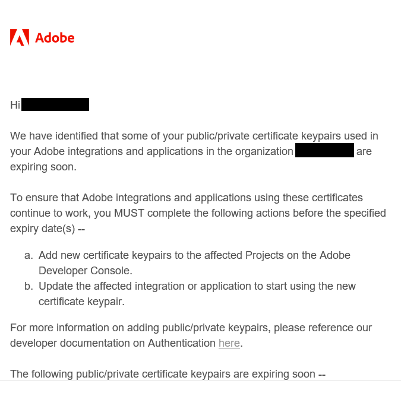
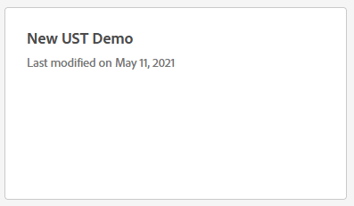
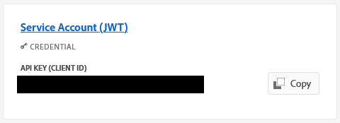
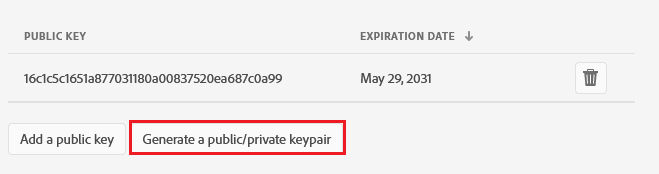
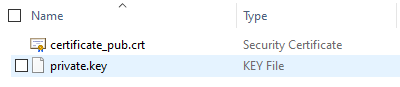
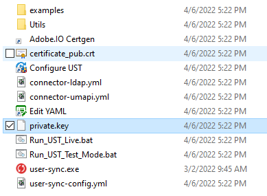
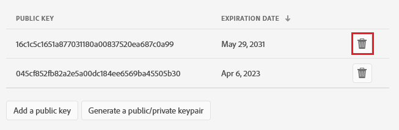

# Updating Public/Private Certificates

[Previous Section](scheduling.md) \| [Next Section](upgrading.md) 

The [Adobe Developer Console certificates](setup_adobeio.md) you created during initial setup will eventually expire and
need replacement. Adobe will notify all system admins for an organization when one or more certificates are set to expire.
If this happens, you may receive an email like this:



This document outlines the process for replacing the certificate pair and updating the User Sync Tool to use a new private
certificate.

## Generate New Key Pair

You can generate a new public/private keypair in the Adobe Developer console. **NOTE**: You must have system admin
privileges in the Admin Console organization associated with your keys.

1. Log into [Adobe Developer Console](https://developer.adobe.com/console)
2. Make sure you select the correct organization in the dropdown menu in the upper-right-hand corner of the page
3. Click the "Projects" tab in the top navigation menu
4. Click the card for the project associated with the credentials you wish to update

   
5. Click `Service Account (JWT)`

   
6. Click `Generate a public/private keypair` button

   

   This generates a new private/public keypair. The public key will automatically be installed for the service account.
   A zip file containing the private any public key will automatically be downloaded by your browser.

   

   `certificate_pub.crt` is the public certificate. `private.key` is the private key.

## Update Private Key

The private key must now be updated on the server running the User Sync Tool.

1. Transfer the private key file (`private.key`) to the server on which the UST is running
2. Copy `private.key` to the folder containing the User Sync Tool. Replace the current file if prompted.

   

   **NOTE**: Depending on how you've configured your UST, the private key file may not be located in the UST folder.
   Replace the key according to your UMAPI configuration.

## Test New Key

Be sure to run the sync tool in test mode to ensure your keys are set up correctly.

```
> ./user-sync -t
```

If the tool runs with no errors, then the keys are in place and you can now delete the old public key.
Return to the [Adobe Developer Console](https://developer.adobe.com/console), open the project, open the
Service Account details, and click the trash icon next to the old public key.



[Previous Section](scheduling.md) \| [Next Section](upgrading.md) 
