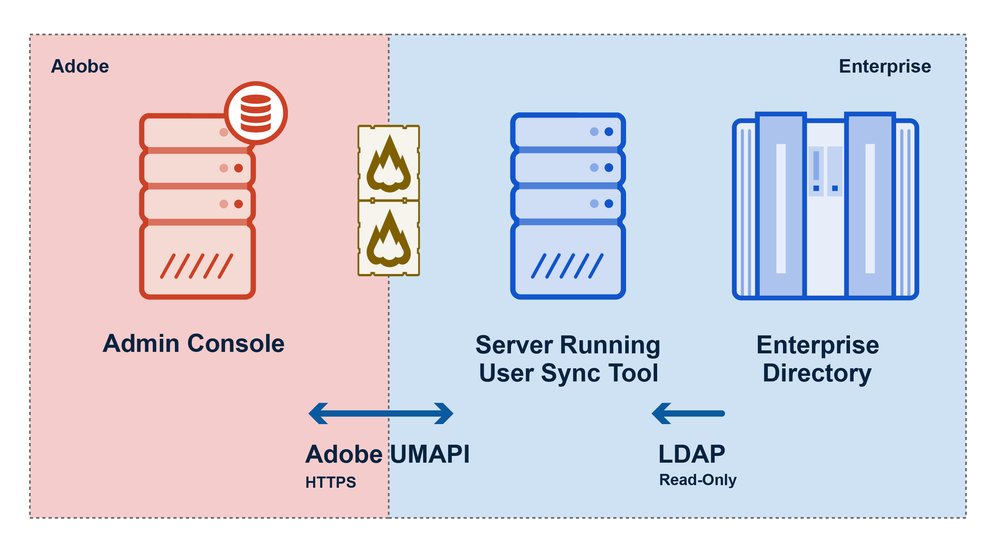

[Next Section](setup_and_installation.md)

# Adobe User Sync Tool
{:."no_toc"}

> Version 2.9.0, released 2023-07-26

  

    Table of contents
  

  {: .text-delta }
1. TOC
{:toc}

# Introduction

The User Sync Tool automates the provisioning of user identity and product
access in the Adobe Admin Console. It operates by reading user information from
an identity source and using configured rules, it creates accounts for users who
need Adobe product access, and assigns the needed products to these users. It
also manages the full lifecycle of Adobe users. If configured, it can update
user information, group memberships and offboard users who no longer require
access to Adobe products and services.

Users can be synced from an LDAP system (e.g. Active Directory), another Admin
Console, an Okta system or a CSV file. The tool also supports an optional mode
that manages users directly in Adobe Acrobat Sign.

The tool functions from the command line and is designed to be automated by a
scheduling system. Its behavior is governed by a series of configuration files.
These files define general sync behavior and provide the tool information on how
to connect to external systems (Admin Console, LDAP systems, Okta, etc).

## Setup Overview

1. Download [the latest
   release](https://github.com/adobe-apiplatform/user-sync.py/releases/latest)
2. Unzip and copy the executable to the server or VM on which the sync tool will
   run.
3. Generate template files (run `./user-sync init` in terminal)

# Prerequisites

The User Sync Tool is a command-line application. Run it in a shell terminal or
in a shell script. It is self contained and does not require any additional
tools to be installed to the system.

The User Sync tool is a client of the User Management API (UMAPI). In order to
use it, you must first register it as an API client in the [Adobe I/O
console](https://www.adobe.io/console/), then install and configure the tool, as
described below.

The operation of the tool is controlled by local configuration files and command
invocation parameters that provide support for a variety of configurations. You
can control, for example, which users are to be synced, how directory groups are
to be mapped to Adobe groups and product configurations, and a variety of other
options.

The tool assumes that your enterprise has purchased Adobe product licenses. You
must use the [Adobe Admin Console](https://adminconsole.adobe.com/enterprise/)
to define user groups and product configurations. Membership in these groups
controls which users in your organization can access which products.

# Operation overview

User Sync communicates with your enterprise directory through LDAP protocols. It
communicates with Adobe's Admin Console through the Adobe User Management API
(UMAPI) in order to update the user account data for your organization. The
following figure illustrates the data flow between systems.

Each time you run the tool:

- User Sync requests employee records from an enterprise directory system
  through LDAP.
- User Sync requests current users and associated product configurations from
  the Adobe Admin Console through the User Management API.
- User Sync determines which users need to be created, removed, or updated, and
  what user group and product configuration memberships they should have, based
  on rules you have defined in the User Sync configuration files.
- User Sync makes the required changes to the Adobe Admin Console through the
  User Management API.

# Usage models

The User Sync tool can fit into your business model in various ways, to help you
automate the process of tracking and controlling which of your employees and
associates have access to your Adobe products.

Typically, an enterprise runs the tool as a scheduled task, in order to
periodically update both user information and group memberships in the Adobe
User Management system with the current information in your enterprise LDAP
directory.

The tool offers options for various other workflows as well. You can choose to
update only the user information, for example, and handle group memberships for
product access directly in the Adobe Admin Console. You can choose to update all
users, or only specified subsets of your entire user population. In addition,
you can separate the tasks of adding and updating information from the task of
removing users or memberships. There are a number of options for handling the
removal task.

For more information about usage models and how to implement them, see the
[Usage Scenarios](usage_scenarios.md#usage-scenarios) section below.

---

[Next Section](setup_and_installation.md)
