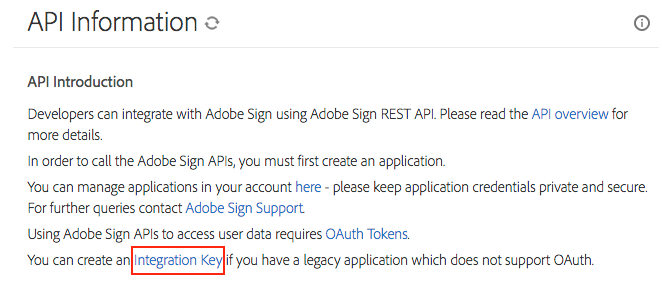
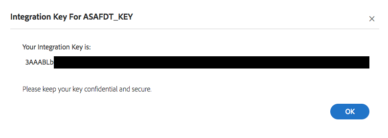

[Previous Section](advanced_configuration.html)  \| [Next Section](additional_tools.html)

# Synchronizing Users to Adobe Sign
{:."no_toc"}

<details open markdown="block">
  <summary>
    Table of contents
  </summary>
  {: .text-delta }
1. TOC
{:toc}
</details>

# Overview

The **Sign Sync Connector** is an optional component of the User Sync Tool used to manage Adobe Sign users.

It is capable of synchronizing users from any identity source directly to Sign. It can manage the full user
lifecycle of users belonging to standalone Sign account and can also manage Sign Enterprise users.

# Capabilities

* Manage users directly from identity source (`ldap`, `csv`, `adobe_console` or `okta`)
* Target multiple Sign accounts
* Manage full lifecycle for users in standalone accounts
  * User creation
  * Manage primary user groups
  * Manage group admin status
  * Manage account admin status
  * User deactivation
* Manage groups and admin role status of Sign Enterprise users
  * Manage primary user groups
  * Manage account admin status
  * Manage group admin status
* Sign-only user management (similar to Adobe-only user management)

# Using Sign Sync

Sign Sync is started with the `sign-sync` command.

```
$ ./user-sync sign-sync
```

When the User Sync Tool is run with the `sign-sync` command, it uses a different sync engine than a sync with the Admin Console.
It uses a different main config file (`sign-sync-config.yml`) and Sign connector config file `connector-sign.yml`.

## Moving From Post-Sync

The post-sync connector is no longer implemented or supported. Any attempt to run the Sync Tool with `post_sync` configured in
`user-sync-config.yml` will produce an error.

This impacts Sign Sync because in prior UST releases, Sign Sync was facilitated with the post-sync connector.

You can use the `migrate-post-sync` command to migrate your post-sync config. This will create a `sign-sync-config.yml` file
and one or more connector config files (e.g. `connector-sign.yml`).

Usage example:

```
$ ./user-sync migrate-post-sync
```

After you provide required input, the command will perform migration actions, generate new config files, and provide a summary
of actions taken and new files generated.

The command takes three optional parameters. You will be prompted to provide input if any option is omitted.

* `--config-filename` path to post-sync config file (e.g. `connector-sign-sync.yml`)
* `--connector-type` type of identity connector to use (`ldap`, `csv`, `okta`, or `adobe_console`)
* `--connector-filename` path to identity connector filename (e.g. `connector-ldap.yml`)

**IMPORTANT** - after the new config is generated, be sure to review `sign-sync-config.yml` and make any necessary manual adjustments
to ensure accuracy. Take a close look at the group mappings defined in `user_management` as they may not be optimally defined
by the migration tool.

One the new config files are created, be sure to remove the `post_sync` definition from `user-sync-config.yml`. You 
can also delete `connector-sign-sync.yml` (the Sign post-sync config file) if desired.

Finally, run the Sign Sync process in test mode to ensure that the new config works as desired.

```
$ ./user-sync sign-sync -t
```

## Sign Sync Configuration File

The Sight Sync process depends on a primary config file, which defines Sign sync behavior. Like the User Sync config, it defines
API connections, sync behavior and logging options.

`sign-sync-config.yml` serves as the main configuration file for Sign Sync. If the User Sync Tool is invoked with the `sign-sync` command,
it will look for `sign-sync-config.yml` in the current working directory. If the config file exists in a different directory, use the `-c/--config-filename`
option to specify the path to the config file.

```
./user-sync sign-sync -c /path/to/sign-sync-config.yml
```

### Example

```yaml
# Sign API Connections
sign_orgs:
  primary: connector-sign.yml
  
# Similar to "directory_users.connectors" in user-sync-config.yml
identity_source:
  type: ldap
  connector: connector-ldap.yml
  
# Options that govern the synchronization of users
user_sync:
  sign_only_limit: 100
  sign_only_user_action: reset

# Storage location of Sign data cache. This contains cached users, groups and user assignent info
# The cache will refresh after 24 hours
cache:
  path: cache/sign
 
# User management group/role mappings
user_management:
  - directory_group: Sign Users 1
    sign_group: Group 1
    group_admin: False
    account_admin: False
  - directory_group: Sign Users 1 Admins
    sign_group: Group 1
    group_admin: True
    account_admin: False
  - directory_group: Sign Admins
    sign_group:
    group_admin: False
    account_admin: True

# Logging options
logging:
  log_to_file: True
  file_log_directory: sign_logs
  file_log_name_format: '{:%Y-%m-%d}-sign.log'
  file_log_level: info
  console_log_level: debug
  
# Defaults for options that can be passed as CLI options
invocation_defaults:
  users: mapped
  test_mode: False

```

### A Closer Look

**`sign_orgs`**

Specify one or more config files that contain Sign API credentials and other information about the Sign connection. This option
consists of one or more keys that each identify a Sign API connection. Each key should point to a unique Sign connector config.
[More information](#sign-connector-config).

One connection must be labeled `primary` to identify the primary connection. Any target group in the group mapping not using the
`org::` prefix will be targeted to the primary connector.

```yaml
sign_orgs:
  primary: connector-sign.yml
```

Additional targets can be defined with any label other than `primary`.

```yaml
sign_orgs:
  primary: connector-sign.yml
  org2: connector-sign-org2.yml
```

**`identity_source`**

Define the connection to an identity source. Any type supported by Admin Console Sync is supported by Sign Sync - 
`ldap`, `csv`, `adobe_console` and `okta`. **NOTE**: Unlike Admin Console Sync, Sign Sync requires a config file be
specified for `csv`.

```yaml
identity_source:
  type: ldap
  connector: connector-ldap.yml
```

**`user_sync`**

Define general sync behavior.

```yaml
user_sync:
  sign_only_limit: 100
  sign_only_user_action: reset
```

* `sign_only_limit` - similar to `max_adobe_only_users` in `user-sync-config.yml`. Defines the maximum number of Adobe-only
  users allowed for `sign_only_user_action` to execute. Can also be defined as a percentage of total users.
* `sign_only_user_action` - define what to do with users found in Sign but not in the identity source.
  
  | Action | Description |
  | --- | --- |
  | `reset` | Reset the user to a "default" state. Reset primary group to Default Group and remove group/account admin status if needed. |
  | `deactivate` | Deactivate the user. **Note**: This will only work for users on standalone Sign accounts. Sign Enterprise users cannot be deactivated directly in Sign |
  | `exclude` | Take no action on Sign-only users |
  | `remove_groups` | Reset user to Default Group, but do not modify admin roles |
  | `remove_roles` | Remove admin roles, but do not change group membership |
  {: .bordertablestyle}

**`cache`**

User, Group and Group Assignment data retrieved from the Sign API is cached locally on the filesystem. This ensures the sync tool can manage
users and groups more quickly while the cache is fresh.

The cache will refresh after 24 hours. In some cases, individual users may be refreshed more often than once every 24 hours.

Example:

```yaml
cache:
  path: cache/sign
```

The cache path is defined by `cache.path`. The path will be checked relative to the directory of `sign-sync-config.yml`. If `cache.path` does not
exist, the sync tool will create the directory and initialize the cache. The sync tool will also initialize a new cache if the directory exists,
but the cache database files do not The cache will refresh if more than 24 hours have elapsed since the last time it was refreshed.

**`user_management`**

Define rules for management of group and admin role status for Sign users. Consists of a list of one or more key/value sets
that each define a rule for which group and/or admin roles to manage for a given directory group.

Note that mutiple group assignment is not currently supported. Users are assigned to a single group. If `user_management` rules
resolve such that a user is targeted to multiple Sign groups, then precedence is assigned according to the order in which
the management rules are specified.

```yaml
user_management:
  - directory_group: Sign Users 1
    sign_group: Group 1
    group_admin: False
    account_admin: False
  - directory_group: Sign Users 1 Admins
    sign_group: Group 1
    group_admin: True
    account_admin: False
  - directory_group: Sign Admins
    sign_group:
    group_admin: False
    account_admin: True
```

* `directory_group` - name of group from identity source. Users belonging to this group are subject to management according to the rule settings.
* `sign_group` - assign `directory_group` users to this group. This can be blank if no group is to be assigned for a given rule.
* `group_admin` - enable group admin privileges for a user's primary group. Note that this applies even if a user isn't targeted
  to a group assignment in any given rule. In that case, the user will get group admin status on their current primary group.
* `account_admin` - enable account admin privileges for users.

**`logging`**

The logging options in `sign-sync-config.yml` are identical to the logging options in `user-sync-config.yml`.

```yaml
logging:
  log_to_file: True
  file_log_directory: sign_logs
  file_log_name_format: '{:%Y-%m-%d}-sign.log'
  file_log_level: info
  console_log_level: debug
```

* `log_to_file` - if `True`, then the tool will write logs to a file in `file_log_directory` with the filename defined in `file_log_name_format`
* `file_log_directory` - directory that contains the log files if `log_to_file` is `True`. Path is relative to config file location.
* `file_log_name_format` - format of log filename.
* `file_log_level` - verbosity level of file log. `info` logs common messages. `debug` logs additional information.
* `console_log_level` - verbosity level of log to console/stdout.

**`invocation_defaults`**

Invocation defaults in Sign Sync work the way they do in Admin Console Sync. Each option provides a default value for a corresponding command-line
option. When Sign Sync is run, it will use the defaults defined in `invocation_defaults` so the tool can be run without additional command-line
options.

* `test_mode` - if `True`, Sign Sync will run in test mode by default
* `users` - define scope of users to query from identity source

  | Option | Description |
  | --- | --- |
  | `all` | Query all users from identity source |
  | `group` | Query users for given comma-delimited group list |
  | `mapped` | Query users for directory groups specified in `user_management` rules |
  {: .bordertablestyle}

## Sign Connector Config

Details around the Sign API connection are defined in `connector-sign.yml`.

```yaml
host: api.echosign.com
integration_key: xzy12345
admin_email: user@example.com
create_users: False
deactivate_users: False
```

* `host`: Hostname of Sign API
* `integration_key`: Required for API authentication. [See below](#api-key-setup) for information on creating a key.
* `admin_email`: Email address of admin user that owns the integration key. Prevents Sign Sync from operating on that user.
* `create_users`: If `True`, Sign Sync will create new users. This should be set to `False` for Sign Enterprise accounts because
  users linked to an Admin Console are automatically provisioned by the platform when they are added to a Sign Enterprise profile.
* `deactivate`: If `True` and `sign_only_user_action` is `deactivate`, then Sign-only users are deactivated. This should be set
  to `False` for Sign Enterprise accounts because users removed from a Sign Enterprise profile in the Admin Console are automatically
  deactivated in Sign.

### Securing the API Key

The `integration_key` can be stored in an OS keychain or other secret storage backend. Instead of storing the key itself, the
connector config can be set up to contain a reference to the key in the keychain.

See [this documentation](deployment_best_practices.html#storing-credentials-in-os-level-storage) for more information.

For the Sign connector, the user or account in the OS keychain should be the admin email as specified in the connector config.
The `integration_key` config key should not be specified. The reference to the OS keychain credential is specified in
`secure_integration_key_key`.

# Use Cases

## Sign Enterprise

Admin Consoles with a Sign Enterprise plan do not need to use the Sync Tool for basic Sign user provisioning. Users
assigned to a Sign Enterprise product profile will be automatically provisioned to the Default Group with
normal user privileges.

The Admin Console UI can manage account admin status, but cannot manage Sign groups or group admin status. However,
the User Management API does not allow management of admin account status via the Admin Console. The Sign Sync Connector
can manage group assignments, group admin status and account admin status directly in Sign.

### Upstream User Sync

The Sign Sync Connector will not sync users to the Admin Console. Users can be provisioned to the Admin Console in a
variety of ways.

* Manually in the Admin Console UI
* User Sync Tool in Admin Console Sync mode (`./user-sync` or `./user-sync sync`)
* Azure AD Sync
* Google Sync
* CSV Bulk Upload
* Using the User Management API directly

In any case, to manage Sign Enterprise users, you should use the `adobe_console` [identity connector](advanced_configuration.html#the-admin-console-connector).

### Using Sign Sync with Admin Console Sync

If you already use the User Sync Tool to synchronize users to the Adobe Admin Console, all you need to do is ensure
that you have a group mapping to entitle Sign Enterprise users. Then, when your Sign Sync config is set up, just invoke
Sign Sync after the main Admin Console Sync completes. We recommend using a batch file or shell script to run
the two sync processes in sequence.

Windows batch example:

```
mode 155,50
cd /D "%~dp0"

REM Run main sync to Admin Console
user-sync.exe

REM Run Sign Sync
user-sync.exe sign-sync
```

Bash example:

```sh
#!/bin/sh

# Run main sync to Admin Console
./user-sync

# Run Sign Sync
./user-sync sign-sync
```

## Standalone Sign

To manage Sign users for standalone Sign accounts, it is generally recommended to enable the `create_users` and `deactivate_users`
options in `connector-sign.yml`. This ensures the sync tool can manage the full user lifecycle.

And while any Sign-only-user option is valid, `deactivate` is generally the best choice for standalone Sign user management.

# API Key Setup

Any Sign connection defined in `connector-sign.yml` must specify an integration key for authenticating Sign API calls. New keys
can be created by an Admin user for a given Sign account.

1. Log into Adobe Sign
2. Click "Accout" on the top navigation bar
3. On the left-hand menu, click "Adobe Sign API"
4. On the "API Information" page, find the "Integration Key" link

   

   If you don't see this link, please contact Sign support
5. On the "Create Integration Key" page, give the integration a name and select the `user_read` and `user_write` scopes
6. Save the integration
7. On the "Access Tokens" list, select the integration you just created
8. Click "Integration Key" to display the integration key.  This is used in the Sign Sync connector config file.

   

---

[Previous Section](advanced_configuration.html)  \| [Next Section](additional_tools.html)
