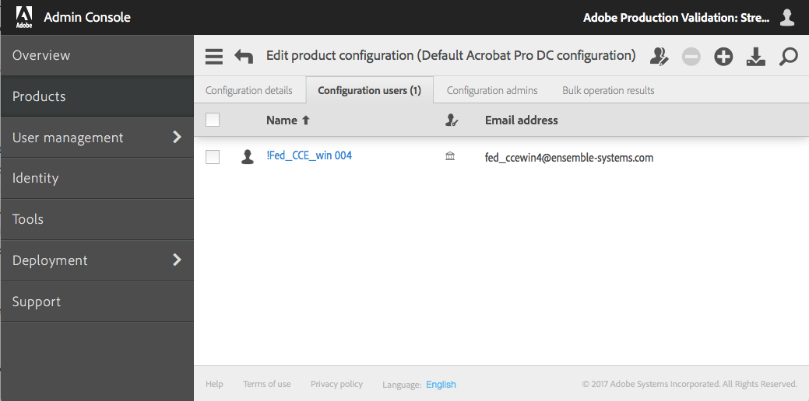

[Previous Section](sync_from_csv.html)  \| [Next Section](advanced_configuration.html)

# Usage Scenarios
{:."no_toc"}

<details open markdown="block">
  <summary>
    Table of contents
  </summary>
  {: .text-delta }
1. TOC
{:toc}
</details>

There are various ways to integrate the User Sync tool into
your enterprise processes, such as:

* **Update users and group memberships.** Sync users and group
memberships by adding, updating, and removing users in Adobe User
Management system.  This is the most general and common use case.
* **Sync only user information.** Use this approach if product
access is to be handled using the Admin Console.
* **Filter users to sync.** You can choose to limit user-information
sync to users in given groups, or limit sync to users that match
a given pattern. You can also sync against a CSV file rather than
a directory system.
* **Update users and group memberships, but handle removals
separately.** Sync users and group memberships by adding and
updating users, but do not remove users in the initial
call. Instead keep a list of users to be removed, then perform
the removals in a separate call.

This section provides detailed instructions for each of these scenarios.

# Update users and group memberships

This is the most typical and common type of invocation. User Sync
finds all changes to user information and to group membership information
on the enterprise
side. It syncs the Adobe side by adding, updating, and removing
users and user group and product configuration memberships.

By default, only users whose identity type is Enterprise ID or
Federated ID will be created, removed, or have their group
memberships managed by User Sync, because generally Adobe ID
users are not managed in the directory. See the
[description below](advanced_configuration.html#managing-users-with-adobe-ids) under
[Advanced Configuration](advanced_configuration.html#advanced-configuration) if this is how
your organization works.

This example assumes that the configuration file,
user-sync-config.yml, contains a mapping from a directory group
to an Adobe product configuration named **Default Acrobat Pro DC
configuration**.

## Command

This invocation supplies both the users and process-groups
parameters, and allows user removal with the `adobe-only-user-action remove`
parameter.

```sh
./user-sync –c user-sync-config.yml --users all --process-groups --adobe-only-user-action remove
```

## Log output during operation

```text
2017-01-20 16:51:02 6840 INFO main - ========== Start Run ==========
2017-01-20 16:51:04 6840 INFO processor - ---------- Start Load from Directory -----------------------
2017-01-20 16:51:04 6840 INFO connector.ldap - Loading users...
2017-01-20 16:51:04 6840 INFO connector.ldap - Total users loaded: 4
2017-01-20 16:51:04 6840 INFO processor - ---------- End Load from Directory (Total time: 0:00:00) ---
2017-01-20 16:51:04 6840 INFO processor - ---------- Start Sync Dashboard ----------------------------
2017-01-20 16:51:05 6840 INFO processor - Adding user with user key: fed_ccewin4@ensemble-systems.com 2017-01-20 16:51:05 6840 INFO dashboard.owning.action - Added action: {"do": \[{"createFederatedID": {"lastname": "004", "country": "CA", "email": "fed_ccewin4@ensemble-systems.com", "firstname": "!Fed_CCE_win", "option": "ignoreIfAlreadyExists"}}, {"add": {"product": \["default acrobat pro dc configuration"\]}}\], "requestID": "action_5", "user": "fed_ccewin4@ensemble-systems.com"}
2017-01-20 16:51:05 6840 INFO processor - Syncing trustee org1... /v2/usermanagement/action/82C654BDB41957F64243BA308@AdobeOrg HTTP/1.1" 200 77
2017-01-20 16:51:07 6840 INFO processor - ---------- End Sync Dashboard (Total time: 0:00:03) --------
2017-01-20 16:51:07 6840 INFO main - ========== End Run (Total time: 0:00:05) ==========
```

## View result

When the synchronization succeeds, the Adobe Admin Console is
updated.  After this command is executed, your user list and
product configuration user list in the
Admin Console shows that a user with a Federated identity has
been added to the “Default Acrobat Pro DC configuration.”



## Sync only users

If you supply only the `users` parameter to the command, the action
finds changes to user information in the enterprise directory and
updates the Adobe side with those changes. You can supply
arguments to the `users` parameter that control which users to look
at on the enterprise side.

This invocation does not look for or update any changes in group
membership. If you use the tool in this way, it is expected you
will control access to Adobe products by updating user group and
product configuration memberships in the Adobe Admin Console.

It also ignores users that are on the Adobe side but no
longer on the directory side, and does not perform any product
configuration or user group management.

```sh
./user-sync –c user-sync-config.yml --users all
```

## Filter users to sync

Whether or not you choose to sync group membership information,
you can supply arguments to the users parameter that filter which
users are considered on the enterprise directory side, or that
get user information from a CSV file instead of directly from the
enterprise LDAP directory.

## Sync only users in given groups

This action only looks for changes to user information for users
in the specified groups from. It does not look at any other users
in the enterprise directory, and does not perform any product
configuration or user group management.

```sh
./user-sync –c user-sync-config.yml --users groups "group1, group2, group3"
```

## Sync only users in mapped groups

This action is the same as specifying `--users groups "..."`, where `...` is all
the groups in the group mapping in the configuration file.

```sh
./user-sync –c user-sync-config.yml --users mapped
```

## Sync only matching users

This action only looks for changes to user information for users
whose user ID matches a pattern. The pattern is specified with a
Python regular expression.  In this example, we also update group
memberships.

```sh
user-sync --users all --user-filter 'bill@forxampl.com' --process-groups
user-sync --users all --user-filter 'b.*@forxampl.com' --process-groups
```

## Sync from a file

This action syncs to user information supplied from a CSV file,
instead of looking at the enterprise directory. An example of
such a file, users-file.csv, is provided in the example configuration files
download in `examples/csv inputs - user and remove lists/`.

```sh
./user-sync --users file user_list.csv
```

Syncing from a file can be used in two situations.  First, Adobe users can be managed
using a spreadsheet.  The spreadsheet lists users, the groups they are in, and
information about them.  Second, if the enterprise directory can provide push notifications
for updates, these notifications can be placed in a csv file and used to drive
User Sync updates.  See the section below for more about this usage scenario.

## Update users and group memberships, but handle removals separately

If you do not supply the `--adobe-only-user-action` parameter,
you can sync user and group memberships without removing any
users from the Adobe side.

If you want to handle removals separately, you can instruct
the tool to flag users that no longer exist in the enterprise
directory but still exist on the Adobe side. The
`--adobe-only-user-action write-file exiting-users.csv` parameter
writes out the list of user who
are flagged for removal to a CSV file.

To perform the removals in a separate call, you can pass the
file generated by the `--adobe-only-user-action write-file` parameter, or you
can pass a CSV file of users that you have generated by some
other means. An example of such a file, `remove-list.csv`,
is provided in the example-configurations.tar.gz file in the `csv inputs - user and remove lists` folder.

### Add users and generate a list of users to remove

This action synchronizes all users and also generates a list of users that no longer
exist in the directory but still exist on the Adobe
side.

```sh
./user-sync --users all --adobe-only-user-action write-file users-to-remove.csv
```

### Remove users from separate list

This action takes a CSV file containing a list of users that have
been flagged for removal, and removes those users from the organization
on the Adobe side. The CSV file is typically the one generated by a
previous call that used the `--adobe-only-user-action write-file` parameter.

You can create a CSV file of users to remove by some other means.
However, if your list includes any users that still exist in your
directory, those users will be added back in on the
Adobe side by the next sync action that adds users.

```sh
./user-sync --adobe-only-user-list users-to-remove.csv --adobe-only-user-action remove
```

## Delete users that exist on the Adobe side but not in the directory

This invocation supplies both the users and process-groups
parameters, and allows user account deletion with the
adobe-only-user-action delete parameter.

```sh
./user-sync --users all --process-groups --adobe-only-user-action delete
```

## Delete users from separate list

Similar to the remove users example above, this one deletes users who only exist on the Adobe side, based
on the list generated in a prior run of User Sync.

```sh
./user-sync --adobe-only-user-list users-to-delete.csv --adobe-only-user-action delete
```

## Limit Adobe users scope for syncing

By supplying `adobe-users ...` argument you have an ability to control which Adobe users to be pull into User Sync Tool to be process for sync.
With this argument you can specify limit by group name (`--adobe-users groups "..."`) or limit by adobe groups in group mapping in the configuration file (`--adobe-users mapped`)

When not specifying `adobe-users groups | mapped` User Sync Tool will automatically default to all:
```sh
./user-sync –c user-sync-config.yml --adobe-users all
```

## Limit Adobe users to Adobe groups.

This action limited Adobe users scope to specified group. Group can be either product profile or user-group in the Adobe Admin Console.

```sh
./user-sync –c user-sync-config.yml --adobe-users groups "group1, group2, group3"
```

## Limit Adobe users to mapped Adobe groups

This action is the same as specifying `--adobe-users groups "..."`, where `...` is all the Adobe groups in the group mapping in the configuration file.

```sh
./user-sync –c user-sync-config.yml --adobe-users mapped
```

# Handling Push Notifications

If your directory system can generate notifications of updates you can use User Sync to
process those updates incrementally.  The technique shown in this section can also be
used to process immediate updates where an administrator has updated a user or group of
users and wants to push just those updates immediately into Adobe's user management
system.  Some scripting may be required to transform the information coming from the
push notification to a csv format suitable for input to User Sync, and to separate
deletions from other updates, which mush be handled separately in User Sync.

Create a file, say, `updated_users.csv` with the user update format illustrated in
the `users-file.csv` example file in the folder `csv inputs - user and remove lists`.
This is a basic csv file with columns for firstname, lastname, and so on.

    firstname,lastname,email,country,groups,type,username,domain
    John,Smith,jsmith@example.com,US,"AdobeCC-All",enterpriseID
    Jane,Doe,jdoe@example.com,US,"AdobeCC-All",federatedID

This file is then provided to User Sync:

```sh
./user-sync --users file updated-users.csv --process-groups --update-users --adobe-only-user-action exclude
```

The --adobe-only-user-action exclude causes User Sync to update only users that are in the updated-users.csv file and to ignore all others.

Deletions are handled similarly.  Create a file `deleted-users.csv` based on the format of `remove-list.csv` in the same example folder and run User Sync:

```sh
./user-sync --adobe-only-user-list deleted-users.csv --adobe-only-user-action remove
```

This will handle deletions based on the notification and no other actions will be taken.  Note that `remove` could be replaced with one of the other actions based on how you want to handle deleted users.

# Action Summary

At the end of the invocation, an action summary will be printed to the log (if the level is INFO or DEBUG).
The summary provides statistics accumulated during the run.
The statistics collected include:

- **Total number of Adobe users:** The total number of Adobe users in your admin console
- **Number of Adobe users excluded:** Number of Adobe users that were excluded from operations via the exclude_parameters
- **Total number of directory users:** The total number of users read from LDAP or CSV file
- **Number of directory users selected:** Number of directory users selected via user-filter parameter
- **Number of Adobe users created:** Number of Adobe users created during this run
- **Number of Adobe users updated:** Number of Adobe users updated during this run
- **Number of Adobe users removed:** Number of Adobe users removed from the organization on the Adobe side
- **Number of Adobe users deleted:** Number of Adobe users removed from the organization and Enterprise/Federated user accounts deleted on Adobe side
- **Number of Adobe users with updated groups:** Number of Adobe users that are added to one or more user groups
- **Number of Adobe users removed from mapped groups:** Number of Adobe users that are removed from one or more user groups
- **Number of Adobe users with no changes:** Number of Adobe users that were unchanged during this run

## Sample action summary output to the log

```text
2017-03-22 21:37:44 21787 INFO processor - ------------- Action Summary -------------
2017-03-22 21:37:44 21787 INFO processor -   Total number of Adobe users: 50
2017-03-22 21:37:44 21787 INFO processor -   Number of Adobe users excluded: 0
2017-03-22 21:37:44 21787 INFO processor -   Total number of directory users: 10
2017-03-22 21:37:44 21787 INFO processor -   Number of directory users selected: 10
2017-03-22 21:37:44 21787 INFO processor -   Number of Adobe users created: 7
2017-03-22 21:37:44 21787 INFO processor -   Number of Adobe users updated: 1
2017-03-22 21:37:44 21787 INFO processor -   Number of Adobe users removed: 1
2017-03-22 21:37:44 21787 INFO processor -   Number of Adobe users deleted: 0
2017-03-22 21:37:44 21787 INFO processor -   Number of Adobe users with updated groups: 2
2017-03-22 21:37:44 21787 INFO processor -   Number of Adobe users removed from mapped groups: 5
2017-03-22 21:37:44 21787 INFO processor -   Number of Adobe users with no changes: 48
2017-03-22 21:37:44 21787 INFO processor - ------------------------------------------
```

---

[Previous Section](sync_from_csv.html)  \| [Next Section](advanced_configuration.html)
