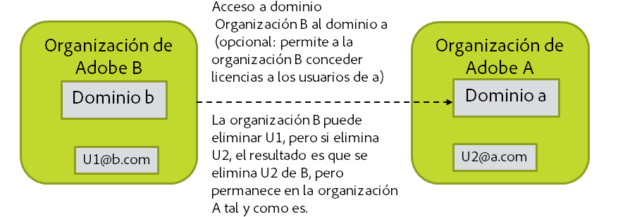

# Decida cómo gestionará la supresión de las cuentas

[Sección anterior](layout_products.md) \| [Regresar al contenido](index.md) \|  [Sección siguiente](setup_adobeio.md)

Cuando se desactivan o se eliminan las cuentas desde el directorio a menudo desea que la cuenta de Adobe correspondiente desaparezca, pero si se quita la cuenta de Adobe se pueden eliminar activos, ajustes, etc., que posteriormente se necesitarán. Además, las cuentas de Adobe ID que pueden encontrarse en su organización no se pueden eliminar porque la cuenta pertenece al usuario final. Sin embargo, se pueden recuperar las licencias que le otorga al usuario de Adobe ID cuando desee eliminar ese usuario de su organización.

Opciones disponibles para la gestión de la eliminación de cuentas de Adobe a través de User Sync:

  - No realice ninguna acción. La limpieza de la cuenta se debe realizar manualmente.

  - Genere la lista de cuentas que deben eliminarse, pero no se lleva a cabo ninguna acción en este momento. La lista se puede editar y posteriormente utilizar para la eliminación de cuentas a través de User Sync.

  - Recupere todas las licencias proporcionadas por la organización a la cuenta, pero deje la cuenta activa. (quitar grupos de Adobe)

  - Recupere todas las licencias y quítelas de su organización, pero deje la cuenta en existencia. (quitar)

  - Recupere todas las licencias y elimine la cuenta. (eliminar)

Algunas cosas que hay que saber sobre la eliminación de la cuenta:

  - Eliminar la cuenta de Adobe puede eliminar activos, ajustes, etc., que pueden resultar necesarios posteriormente.
 
  - Solo puede “eliminar” cuentas si se encuentran en un dominio del que la organización es propietaria.
  - Es posible que tenga usuarios en su organización que se encuentran en dominios propiedad de otras organizaciones. Esto sucede a través de la solicitud de acceso a otro dominio propiedad de una organización diferente que, a continuación, le permite añadir los usuarios de ese dominio a su propia organización y otorgar a dichos usuarios las licencias que posee.
    - Puede recuperar las licencias que ha otorgado a dichos usuarios
    - Puede eliminarlas de su organización, pero no puede eliminar esas cuentas porque son propiedad de una organización diferente
    - Si intenta eliminar una cuenta de este tipo, tiene el mismo efecto que eliminar al usuario de la organización

&#9744; Solo tiene que decidir cómo será su política y su proceso después de eliminar a los usuarios de Adobe cuando se eliminen del directorio. Esta decisión le indicará cómo invoca User Sync en un paso posterior.

Tenga en cuenta que los usuarios de Federated ID no pueden iniciar sesión una vez que se han eliminado del directorio porque el inicio de sesión y el acceso los controla el proveedor de identidades de la ejecución de la empresa en lugar de Adobe. Los usuarios de Enterprise ID todavía pueden iniciar sesión a menos que la cuenta se haya eliminado realmente a pesar de que no tengan licencias otorgadas para los productos. Los usuarios de Adobe ID siempre pueden iniciar sesión, ya que el usuario posee la cuenta. Si se han eliminado de su organización, ya no tendrán las licencias que les puede haber otorgado.

[Sección anterior](layout_products.md) \| [Regresar al contenido](index.md) \|  [Sección siguiente](setup_adobeio.md)

