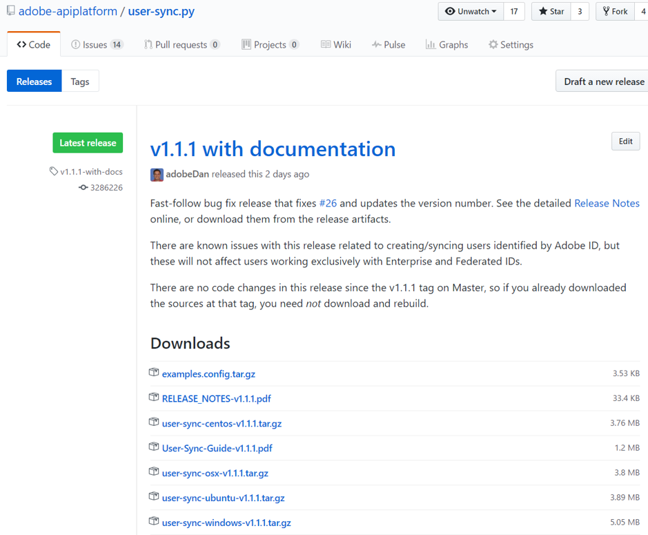
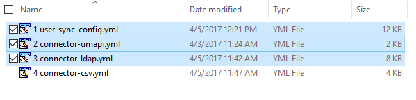

# Instalación de User Sync

[Sección anterior](identify_server.md) \| [Regresar al contenido](index.md) \| [Sección siguiente](setup_config_files.md)

Una vez que tenga acceso al servidor donde se ejecutará User Sync, elija un directorio donde se instalará y operará User Sync.

En Windows, deberá instalar Python.  A partir de este documento, se recomienda la versión 2.7.13.  Windows y Python deben ser versiones de 64 bits.

En Windows, también es muy probable que necesite definir una variable de entorno PEX_ROOT en C:\user_sync\.pex.  Esto es necesario para evitar límites de longitud de nombres de ruta de Windows.

Primeros pasos:

&#9744; Configure un directorio de usuarios y archivos para instalar y ejecutar la sincronización.  Por ejemplo, vamos a crear una carpeta /home/user_sync/user_sync_tool y una sincronización de usuarios.  En Windows, un ejemplo sería C:\Users\user_sync\user_sync_tool.

&#9744; Solo para Windows: defina la variable de entorno **PEX\_ROOT** en **C:\user_sync\.pex**.

&#9744; Solo para Windows: instale Python 2.7.13 (o una versión posterior de la 2.7 serie), de 64 bits. 

Las siguientes secciones muestran el proceso de instalación.

Para encontrar la versión más reciente, empiece aquí: 
[https://github.com/adobe-apiplatform/user-sync.py](https://github.com/adobe-apiplatform/user-sync.py "https://github.com/adobe-apiplatform/user-sync.py")

Seleccione “versión”

&#9744; Descargue el archivo example-configurations.tar.gz, la guía de User Sync y la compilación para su plataforma, OS X, Ubuntu, Windows o Cent OS.

&#9744; Extraiga el fichero user-sync (o user-sync.pex) del archivo y colóquelo para su sistema operativo en la carpeta.  En nuestro ejemplo, sería /home/user_sync/user_sync_tool/user-sync o C:\Users\user_sync\user_sync_tool\user-sync.pex.

&#9744; En el archivo example-configurations.tar.gz hay un directorio **config files - basic**.  De esta carpeta, extraiga los primeros 3 archivos y colóquelos en la carpeta user_sync_tool.  

&#9744; A continuación, cambie el nombre de los 3 archivos de ejemplo de configuración quitando el “1”, “2” y “3” que hay delante de los nombres.  Editaremos estos archivos para crear los archivos de configuración reales de User Sync.

[Sección anterior](identify_server.md) \| [Regresar al contenido](index.md) \| [Sección siguiente](setup_config_files.md)
