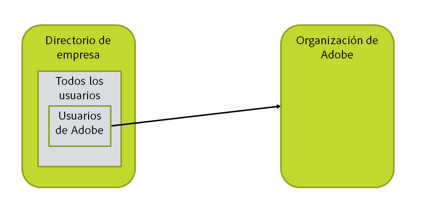
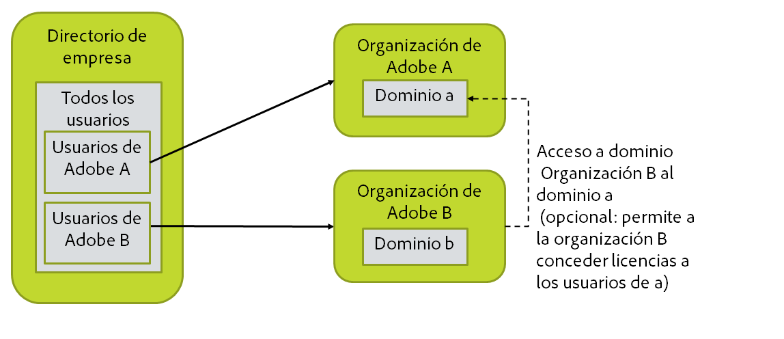
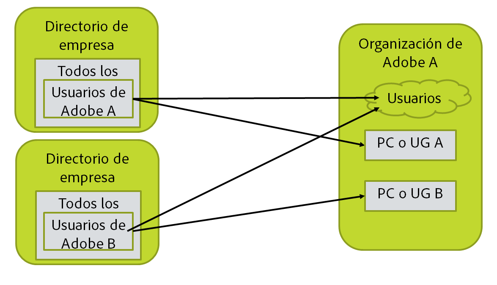

# Diseño de la organización, los grupos y los directorios

[Sección anterior](before_you_start.md) \| [Regresar al contenido](index.md) \| [Sección siguiente](layout_products.md)

En este paso, deberá crear una imagen de su directorio, la organización de Adobe y la configuración de usuario. Esto debe incluir la consulta LDAP para la selección de los usuarios y una lista de los dominios en los que se basan los usuarios. (Si un usuario tiene correo electrónico n@d.com, d.com es el dominio del usuario).

&#9744; En esta sección, se muestran varias configuraciones alternativas. Realizará los pasos solo para una de ellas.

## El caso más sencillo y más habitual

La mayoría de las configuraciones tienen este aspecto. Hay un solo directorio y una sola organización de Adobe. Todos los usuarios se deben poder seleccionar como usuarios para ir a Adobe o solo un subconjunto como miembros de un grupo del directorio determinado. Tendrá que decidir cómo debe configurarlo para su organización y tener la consulta LDAP que ha seleccionado los usuarios adecuados.

&#9744; Necesitará la consulta LDAP que selecciona el conjunto de los usuarios que se sincronizarán con Adobe. Esto afectará a uno de los archivos de configuración de User Sync en un paso posterior.

&#9744; Deberá reivindicar cada dominio en la Admin Console de Adobe para la organización de Adobe en la que se administrará.

&#9744; Reúna la información de credenciales que necesita para acceder al directorio. Se recomienda crear una cuenta de acceso al directorio de solo lectura y utilizarla para acceder a AD o LDAP y a otro sistema del directorio.

## Varias organizaciones de Adobe

Tendrá que ejecutar dos instancias de sincronización, una para cada organización. Esto implica básicamente la instalación de User Sync dos veces con cada instalación en un directorio de archivos diferente.

Si las licencias de una organización se utilizan por los usuarios en la otra organización, la configuración será más compleja. Tendrá que conseguir las credenciales de acceso de la organización de Adobe para cada organización, cuyas licencias se asignarán a los usuarios.

Necesitará:

- &#9744; Acceso de administrador a cada una de las organizaciones de Adobe.

- &#9744; La consulta LDAP para cada conjunto de usuarios.

-  Estar preparado para configurar varias instalaciones de User Sync más adelante.

-  &#9744; Reúna la información de credenciales que necesita para acceder al directorio. Se recomienda crear una cuenta de acceso al directorio de solo lectura y utilizarla para acceder a AD o LDAP y a otro sistema del directorio.

## Directorio y organización múltiples

Esto son, básicamente, dos instancias de todo. Tendrá que ejecutar dos configuraciones de sincronización, una para cada directorio y organización.

Si las licencias de una organización se utilizan por los usuarios en la otra organización, la configuración será más compleja.

Necesitará:

- &#9744; Acceso de administrador a cada una de las organizaciones de Adobe.

- &#9744; La consulta LDAP para cada conjunto de usuarios.

-  Estar preparado para configurar varias instalaciones de User Sync más adelante.

-  &#9744; Reúna la información de credenciales que necesita para acceder al directorio. Se recomienda crear una cuenta de acceso al directorio de solo lectura y utilizarla para acceder a AD o LDAP y a otro sistema del directorio.
 Tenga en cuenta que es posible que disponga de diferentes credenciales para acceder a cada instancia del directorio.

## Directorio múltiple y una única organización

Tendrá que ejecutar dos configuraciones de sincronización, una para cada directorio.

Los grupos de usuario (UG) y las configuraciones de producto (PC) asignados y administrados por los dos trabajos de User Sync no deben solaparse. Es decir, cada grupo de usuarios y configuración de producto debe estar gestionado por una única instancia de User Sync.

Cuando se configura de esta manera, User Sync no puede eliminar los usuarios. Esto es así porque las dos instancias de sincronización intentarían eliminar los usuarios de los demás.

Necesitará:

- &#9744; Acceso de administrador a la organización de Adobe.

- &#9744; La consulta LDAP para cada conjunto de usuarios.

-  Estar preparado para configurar varias instalaciones de User Sync más adelante.

-  &#9744; Reúna la información de credenciales que necesita para acceder al directorio. Se recomienda crear una cuenta de acceso al directorio de solo lectura y utilizarla para acceder a AD o LDAP y a otro sistema del directorio.
 Tenga en cuenta que es posible que disponga de diferentes credenciales para acceder a cada instancia del directorio.

[Sección anterior](before_you_start.md) \| [Regresar al contenido](index.md) \| [Sección siguiente](layout_products.md)
