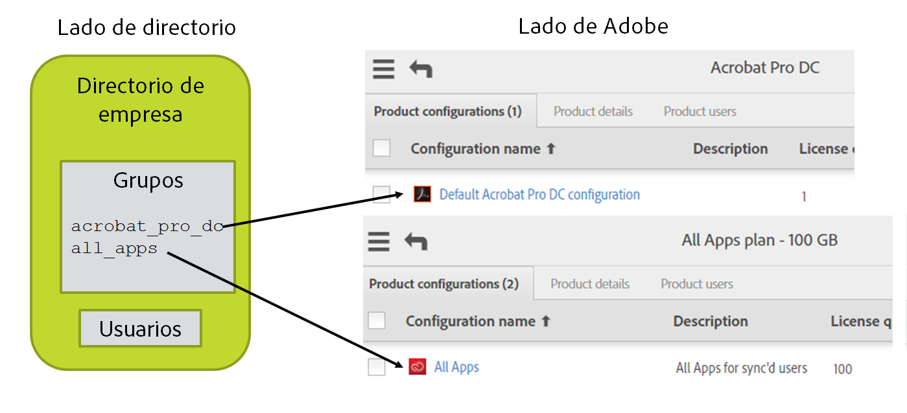

# Diseño de sus productos de Adobe, configuraciones de productos y grupos de usuarios

[Sección anterior](layout_orgs.md) \| [Regresar al contenido](index.md) \| [Sección siguiente](decide_deletion_policy.md)

Las configuraciones de producto (PC) son estructuras similares a un grupo en el sistema de administración de usuarios de Adobe. Cada PC está asociada a un producto que haya adquirido. A los usuarios asignados a una PC se les concede acceso y obtienen una licencia para utilizar el producto correspondiente. (El usuario no recibe nada en este proceso que no sea una notificación opcional de que se le ha concedido acceso. La gestión de todas las licencias se controla por sistemas internos.)

Al crear una PC (que se realiza en la Admin Console de Adobe), puede añadir opciones personalizadas que determinen cómo los usuarios utilizarán el producto de Adobe específico.

Puede agregar usuarios directamente a las PC para otorgarles acceso a los productos. Esta es la forma más común de gestionar las licencias de producto de Adobe.

Los grupos de usuarios de Adobe pueden utilizarse para agrupar los usuarios de una forma lógica que coincida con su conocimiento de cómo se organizan. El uso de los grupos de usuarios es opcional. Los grupos de usuarios se pueden añadir a las PC para conceder licencias a los usuarios. La adición de usuarios a grupos de usuarios no otorga licencias a menos que el grupo de usuarios se haya añadido a una PC, lo que convierte a los miembros del grupo de usuarios en miembros implícitos de la PC.

Los grupos de usuarios y las PC solo se pueden administrar con una instancia de User Sync. Si hay varios directorios o departamentos distribuidos que alimentan la información de usuarios a Adobe a través de User Sync, cada uno debe coincidir con un grupo de usuarios o PC individual. De lo contrario, User Sync no puede distinguir entre los usuarios que deben eliminarse y los usuarios que se hayan añadido por otra instancia de User Sync.

Puede utilizar User Sync para gestionar la asignación de abono y licencia de la PC. Sin embargo, este parámetro es opcional. También puede hacer esta gestión manualmente en la Admin Console de Adobe o mediante otra aplicación.

User Sync le ayuda a gestionar licencias de producto de Adobe permitiéndole colocar los usuarios en grupos de directorio mediante la interfaz de sistemas de directorio u otras herramientas. Esos grupos se asignan a grupos de usuarios de Adobe o PC. La asignación es parte del archivo de configuración de User Sync. Cuando User Sync detecta que los usuarios de directorio están en uno de estos grupos asignados, el usuario se añade al grupo de usuarios de Adobe o PC correspondiente. Del mismo modo, se eliminan los usuarios del grupo de usuarios o PC pero no del grupo de directorio correspondiente.

&#9744; Solo tiene que decidir si administrará la asignación de la licencia con User Sync. Si no, puede omitir los pasos restantes; sin embargo, antes de que los usuarios que ha creado puedan acceder a los productos de Adobe, deberá añadirlos manualmente a las configuraciones de producto con la Admin Console de Adobe. 

&#9744; Cree las PC en la Admin Console de Adobe para las configuraciones de producto y los grupos de usuarios que administrará. Añada el comentario “Gestionado por User Sync - no editar” en el campo de descripción de la PC.

&#9744; Si va a usar grupos de usuarios para administrar el acceso a los productos, deberá crear primero los grupos de usuarios y las configuraciones de producto; a continuación, puede administrar el acceso a los productos mediante la adición de un grupo de usuarios a las configuraciones de producto correspondientes. Añada el comentario “Gestionado por User Sync - no editar” en el campo de descripción del grupo de usuarios.

&#9744; Dibuje un esquema de su organización de Adobe y los productos y las PC que hay en cada uno. Añada el directorio y los grupos de directorio a la imagen y muestre la asignación. Por ejemplo:

[Sección anterior](layout_orgs.md) \| [Regresar al contenido](index.md) \| [Sección siguiente](decide_deletion_policy.md)

