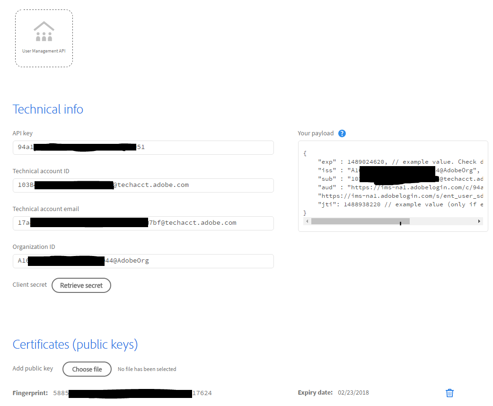

# Configuración de una integración Adobe.io

[Sección anterior](decide_deletion_policy.md) \| [Regresar al contenido](index.md) \| [Sección siguiente](identify_server.md)

Adobe ha diseñado un protocolo seguro para las aplicaciones que se pueden integrar en las API de Adobe y en User Sync como aplicación.

Se han documentado los pasos de la configuración. Para obtener la información completa sobre los requisitos del certificado y del proceso de configuración de integración, consulte [aquí](https://www.adobe.io/apis/cloudplatform/console/authentication.html).

- Deberá crear u obtener un certificado digital para indicar las llamadas de API iniciales.
  - El certificado no se utiliza para SSL o cualquier otro propósito, de modo que puede confiar en que no habrá cadenas ni problemas con el navegador.
  - Puede crear el certificado usted mismo utilizando las herramientas gratuitas o adquirir una (u obtenerla de su departamento de TI).
  - Necesitará un archivo de certificado de clave pública y un archivo de clave privada.
  - Deseará proteger el archivo de clave privada como lo haría una contraseña de raíz.
- Una vez configurada, la consola de Adobe.io muestra todos los valores necesarios. Los copiará en el archivo de configuración de User Sync.
- También deberá añadir el archivo de clave privada a la configuración de User Sync.

&#9744; Obtenga o cree un certificado de firma digital. Consulte las [instrucciones para la creación de certificados](https://www.adobe.io/apis/cloudplatform/console/authentication/createcert.html).

&#9744; Utilice [Adobe I/O Console](https://console.adobe.io) para añadir el servicio de gestión de usuarios a una nueva integración de adobe.io nueva o existente para cada organización a la que necesite acceder (normalmente una).

&#9744; Tenga en cuenta los parámetros de configuración para su integración (a continuación, se muestra un ejemplo redactado). Estos se utilizan en un paso posterior.

[Sección anterior](decide_deletion_policy.md) \| [Regresar al contenido](index.md) \| [Sección siguiente](identify_server.md)
