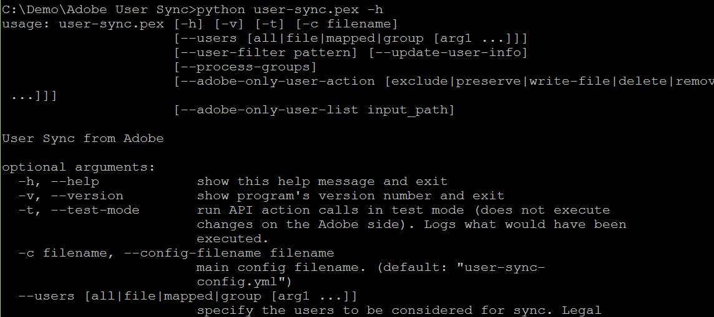

# Realizar una prueba de ejecución para comprobar la configuración

[Sección anterior](setup_config_files.md) \| [Regresar al contenido](index.md) \| [Sección siguiente](monitoring.md)

Invocar User Sync

Windows:      **python user-sync.pex ….**

Unix, OS X:     **./user-sync ….**

Pruébelo:

	./user-sync –v            Versión de informe
	./user-sync –h            Ayuda sobre los argumentos de la línea de comandos

&#9744; Pruebe los dos comandos anteriores y compruebe que funcionen. (En Windows, el comando es ligeramente diferente).

&#9744; A continuación, pruebe una sincronización limitada a un único usuario y ejecútela en modo de prueba. Deberá saber el nombre de algún usuario del directorio. Por ejemplo, si el usuario es bart@example.com, pruebe:

	./user-sync -t --users all --user-filter bart@example.com --adobe-only-user-action exclude

	./user-sync -t --users all --user-filter bart@example.com --process-groups --adobe-only-user-action exclude

El primer comando anterior sincronizará solo el único usuario (debido a los filtros de usuario) que debería dar lugar a un intento creación del usuario. Debido a la ejecución en modo de prueba (-t), la ejecución de User Sync solo tratará de crear el usuario, pero no lo hará en realidad. La opción `--adobe-only-user-action exclude` evitará las actualizaciones a las cuentas de usuario que ya existen en la organización de Adobe.

El segundo comando anterior (con la opción --process-groups) tratará de crear el usuario y añadirlo a los grupos a los que se asignan desde sus grupos de directorio. De nuevo, esto es en modo de prueba por lo que no se realizará ninguna acción real. Si ya existen los usuarios y los grupos tienen los usuarios ya asignados, User Sync puede intentar eliminarlos. Si esto sucede, omita la prueba siguiente. Asimismo, si no está utilizando los grupos de directorio para administrar el acceso a los productos, omita las pruebas que incluyan --process-groups.

&#9744; A continuación, pruebe una sincronización limitada a un único usuario y no la ejecute en modo de prueba. En realidad esto debe crear el usuario y añadirlo a los grupos (si se han asignado). 

	./user-sync --users all --user-filter bart@example.com --process-groups --adobe-only-user-action exclude

	./user-sync --users all --user-filter bart@example.com --process-groups --adobe-only-user-action exclude

&#9744; A continuación, compruebe en la Admin Console de Adobe si el usuario ha aparecido y si se han añadido los abonos del grupo.

&#9744; A continuación, vuelva a ejecutar el mismo comando. User Sync no debe intentar volver a crear y añadir el usuario a los grupos. Debe detectar que el usuario ya existe y que es un abonado del grupo de usuarios o PC y no hacer nada.

Si estos funcionan como se esperaba, usted está listo para realizar una ejecución completa (sin el filtro de usuario). Si no tiene demasiados usuarios en el directorio, puede probarlo ahora. Si tiene más de unos pocos centenares, es posible que tarde mucho tiempo, de modo que no realice la ejecución hasta que esté listo para tener un comando ejecutándose durante muchas horas. Además, pase a la siguiente sección antes de hacerlo, en caso de que haya otras opciones de la línea de comandos correspondiente.

[Sección anterior](setup_config_files.md) \| [Regresar al contenido](index.md) \| [Sección siguiente](monitoring.md)

