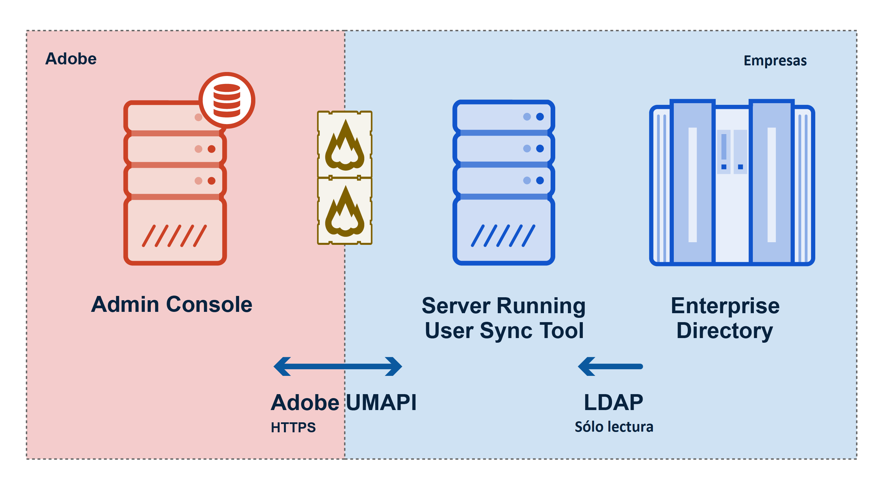

Versión 2.1.1, publicada el 09/06/2017

Este documento contiene toda la información que necesita para comenzar a utilizar User Sync. Se da por supuesto que el usuario está familiarizado con el uso de herramientas de línea de comandos en el sistema operativo local y que posee una comprensión general del funcionamiento de los sistemas de directorio de empresas.

# Introducción

## En esta sección
{:."no_toc"}

* TOC Placeholder
{:toc}

---

[Sección siguiente](setup_and_installation.md)

---

User Sync de Adobe es una herramienta de línea de comandos que mueve la información de usuarios y de grupos del sistema de directorio de empresas de su organización (por ejemplo, Active Directory) al sistema de gestión de usuarios de Adobe.

Cada vez que se ejecuta User Sync, busca las diferencias entre la información de usuarios en los dos sistemas y actualiza el directorio de Adobe para que coincida con la de su directorio.

## Requisitos previos

Ejecute User Sync en la línea de comandos o desde un script, desde un servidor que utilice su empresa, que debe tener instalado Python 2.7.9 o una versión posterior. El servidor debe tener conexión a Internet y poder acceder al sistema de gestión de usuarios de Adobe y a su propio sistema de directorio de empresa.

La herramienta User Sync es un cliente de la API de gestión de usuarios (UMAPI). Para su uso, primero se debe registrar como cliente de la API de la [consola Adobe I/O](https://www.adobe.io/console/) y, a continuación, instalar y configurar la herramienta, como se describe a continuación.

El funcionamiento de la herramienta se controla mediante archivos de configuración locales y parámetros de invocación de comandos que proporcionan soporte para una variedad de configuraciones. Puede controlar, por ejemplo, los usuarios que van a sincronizarse, la forma de asignar los grupos de directorio a los grupos de Adobe y configuraciones de productos, así como otras opciones.

La herramienta presupone que la empresa ha adquirido licencias de producto de Adobe. Debe utilizar [Adobe Admin Console](https://adminconsole.adobe.com/enterprise/) para definir grupos de usuarios y configuraciones de productos. La suscripción a estos grupos permite controlar el acceso a los productos por parte de los usuarios.

## Descripción general del funcionamiento

User Sync se comunica con el directorio de la empresa a través de protocolos LDAP. Se comunica con Adobe Admin Console a través de la API de gestión de usuarios de Adobe (UMAPI) con el fin de actualizar los datos de cuentas de usuario de la organización. La figura siguiente muestra el flujo de datos entre los sistemas.

Cada vez que ejecuta la herramienta:

- User Sync solicita registros de empleados a un sistema de directorio de empresa a través de LDAP.
- User Sync solicita los usuarios y configuraciones de productos actuales a Adobe Admin Console a través de la API de gestión de usuarios.
- User Sync determina los usuarios que se deben crear, eliminar o actualizar, así como los grupos de usuarios y la configuración de producto a los que deben pertenecer, en función de las reglas que ha definido en los archivos de configuración de User Sync.
- User Sync realiza los cambios necesarios en Adobe Admin Console a través de la API de gestión de usuarios.

## Modelos de uso

La herramienta User Sync puede adaptarse a su modelo de negocio de varias maneras, para ayudarle a automatizar el proceso de seguimiento y control de los empleados y asociados que tienen acceso a los productos de Adobe.

Normalmente, una empresa ejecuta la herramienta como una tarea programada, con el fin de actualizar periódicamente la información de los usuarios y los miembros de los grupos en el sistema de gestión de usuarios de Adobe con la información actualizada del directorio LDAP de la empresa.

La herramienta también ofrece opciones para varios otros flujos de trabajo. Puede optar por actualizar solo la información de usuario, por ejemplo, y gestionar los miembros de los grupos para el acceso a los productos directamente en Adobe Admin Console. Puede optar por actualizar todos los usuarios o solo un subconjunto específico de la población de todos los usuarios. Además, puede separar las tareas de agregar y actualizar la información de la tarea de eliminar usuarios o miembros. Hay una serie de opciones para la gestión de la tarea de eliminación.

Para obtener más información acerca de los modelos de uso y cómo implementarlos, consulte la sección [Escenarios de uso](usage_scenarios.md#escenarios-de-uso) a continuación.

---

[Sección siguiente](setup_and_installation.md)
