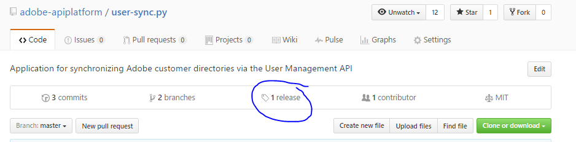

# Installation de l’outil User Sync

[Section précédente](identify_server.md) \| [Revenir au sommaire](index.md) \| [Section suivante](setup_config_files.md)

Une fois que vous avez accès au serveur sur lequel s’exécutera User Sync, choisissez le répertoire dans lequel vous allez installer l’outil et l’exécuter.

Sous Windows, vous devez installer Python.  Au moment de la rédaction de ce guide, la version 2.7.13 est recommandée.  Windows et Python doivent être des versions 64 bits.

Sous Windows, vous devrez aussi sûrement définir une variable d’environnement PEX_ROOT sur C:\user_sync\.pex.  Cela est nécessaire pour contourner les limites de taille du chemin d’accès sous Windows.

Premières étapes :

&#9744; Configurez un utilisateur et un répertoire pour l’installation et l’exécution de l’outil User Sync.  Par exemple, nous allons créer un dossier /home/user_sync/user_sync_tool et un utilisateur user_sync.  Ainsi, sous Windows, il pourrait s’agir de C:\Utilisateurs\user_sync\user_sync_tool.

&#9744; Windows uniquement : définissez la variable d’environnement **PEX\_ROOT** sur **C:\user_sync\.pex**.

&#9744; Windows uniquement : installez Python 2.7.13 (ou une version ultérieure dans la série 2.7) 64 bits. 

Les sections suivantes expliquent le processus d’installation.

Pour obtenir la dernière version, cliquez ici : 
[https://github.com/adobe-apiplatform/user-sync.py](https://github.com/adobe-apiplatform/user-sync.py "https://github.com/adobe-apiplatform/user-sync.py")

Sélectionnez « release ».

&#9744; Téléchargez le fichier example-configurations.tar.gz, le guide User Sync et la version correspondant à votre plate-forme (OS X, Ubuntu, Windows ou CentOS).

&#9744; Extrayez le fichier user-sync (ou user-sync.pex) de l’archive et, dans le dossier, placez le fichier correspondant à votre système d’exploitation.  Dans notre exemple, il s’agirait de /home/user_sync/user_sync_tool/user-sync ou C:\Utilisateurs\user_sync\user_sync_tool\user-sync.pex.

&#9744; Le fichier example-configurations.tar.gz contient un répertoire nommé **config files - basic**.  Dans ce dossier, extrayez les trois premiers fichiers et placez-les dans le dossier user_sync_tool.  

&#9744; Ensuite, renommez les trois fichiers d’exemples en retirant les chiffres « 1 », « 2 » et « 3 » en début de nom.  Nous allons modifier ces fichiers pour créer les véritables fichiers de configuration de User Sync.

[Section précédente](identify_server.md) \| [Revenir au sommaire](index.md) \| [Section suivante](setup_config_files.md)
