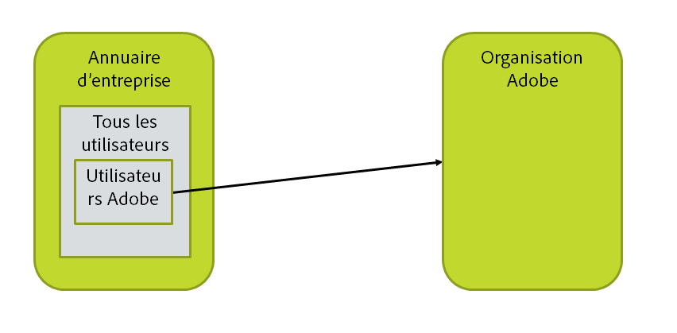
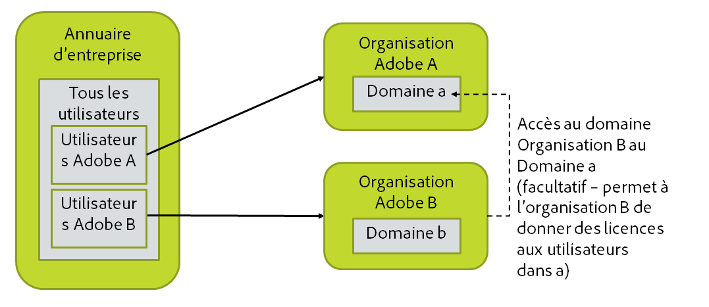
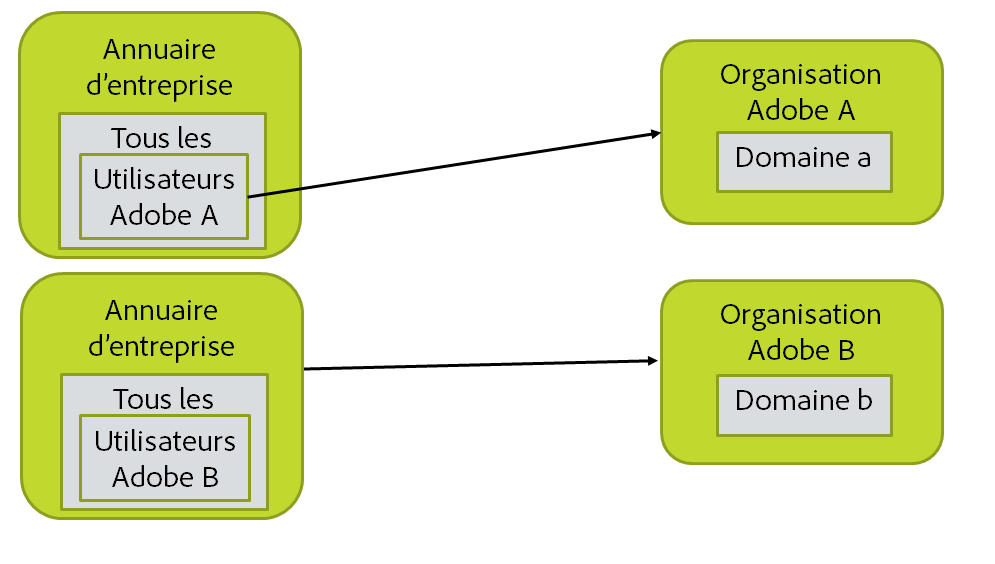
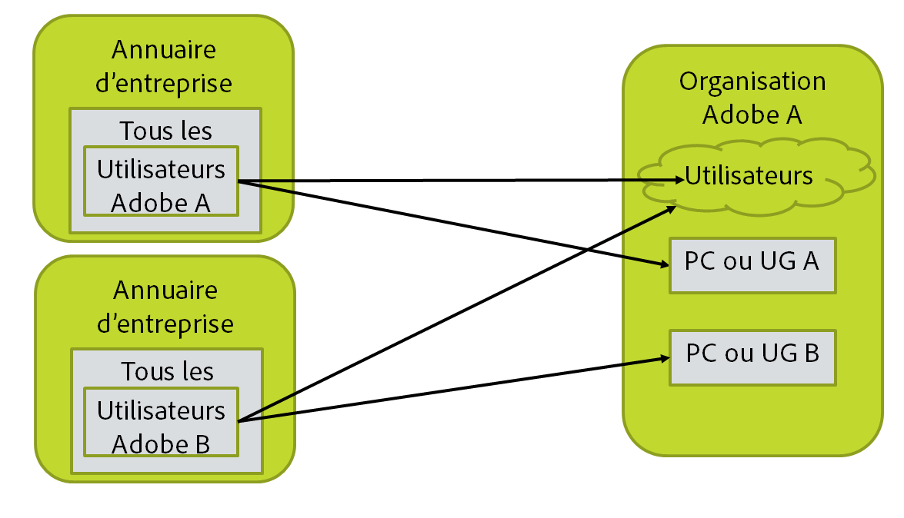

# Description de votre organisation, des groupes et des annuaires

[Section précédente](before_you_start.md) \| [Revenir au sommaire](index.md) \| [Section suivante](layout_products.md)

Dans cette étape, vous devez représenter votre annuaire, votre organisation Adobe et votre configuration d’utilisateurs. L’image ainsi créée doit inclure la requête LDAP pour sélectionner les utilisateurs, ainsi que la liste des domaines dans lesquels ils se trouvent. (Si un utilisateur possède l’adresse électronique n@d.com, d.com est son domaine.)

&#9744; Dans cette section, plusieurs options de configuration sont illustrées. Vous n’effectuerez les étapes que pour une seule d’entre elles.

## Cas le plus simple et le plus fréquent

La plupart des configurations seront de ce type. Il existe un annuaire unique et une seule organisation Adobe. Tous les utilisateurs peuvent être sélectionnés comme utilisateurs Adobe, ou seulement un sous-ensemble, tels que les membres d’un groupe d’annuaire spécifique. Vous devez déterminer la mise en place pour votre entreprise et écrire la requête LDAP qui sélectionne les utilisateurs souhaités.

&#9744; Vous avez besoin de la requête LDAP qui sélectionne l’ensemble d’utilisateurs à synchroniser avec Adobe. Elle sera incluse dans l’un des fichiers de configuration User Sync lors d’une étape ultérieure.

&#9744; Vous devez déposer chaque domaine sur le portail Adobe Admin Console de l’organisation Adobe dans laquelle il sera géré.

&#9744; Procurez-vous les identifiants dont vous avez besoin pour accéder à l’annuaire. Nous vous conseillons de créer un compte d’accès à l’annuaire en lecture seule et de l’utiliser pour accéder au système Active Directory, LDAP ou à un autre système d’annuaire.

## Plusieurs organisations Adobe

Vous devez exécuter deux instances de l’outil User Sync, une pour chaque organisation. Cela implique d’installer deux fois User Sync en plaçant chaque installation dans un répertoire différent.

Si les licences d’une organisation doivent être utilisées par des membres de l’autre organisation, la configuration est plus complexe. Vous devez obtenir les identifiants d’accès pour chaque organisation Adobe dont les licences seront attribuées aux utilisateurs.

Vous aurez besoin des éléments suivants :

- &#9744; Un accès administrateur à chacune des organisations Adobe

- &#9744; La requête LDAP pour chaque ensemble d’utilisateurs

-  Soyez prêt à configurer plusieurs installations de l’outil User Sync lors d’étapes ultérieures.

-  &#9744; Procurez-vous les identifiants dont vous avez besoin pour accéder à l’annuaire. Nous vous conseillons de créer un compte d’accès à l’annuaire en lecture seule et de l’utiliser pour accéder au système Active Directory, LDAP ou à un autre système d’annuaire.

## Annuaires et organisations multiples

Tous les éléments sont en double. Vous devez exécuter deux configurations User Sync, une par annuaire et organisation.

Si les licences d’une organisation doivent être utilisées par des membres de l’autre organisation, la configuration est plus complexe.

Vous aurez besoin des éléments suivants :

- &#9744; Un accès administrateur à chacune des organisations Adobe

- &#9744; La requête LDAP pour chaque ensemble d’utilisateurs

-  Soyez prêt à configurer plusieurs installations de l’outil User Sync lors d’étapes ultérieures.

-  &#9744; Procurez-vous les identifiants dont vous avez besoin pour accéder à l’annuaire. Nous vous conseillons de créer un compte d’accès à l’annuaire en lecture seule et de l’utiliser pour accéder au système Active Directory, LDAP ou à un autre système d’annuaire.
 Sachez qu’il est possible que vous ayez besoin de différents identifiants pour accéder à chaque instance d’annuaire.

## Annuaires multiples et organisation unique

Vous devez exécuter deux configurations de l’outil User Sync, une pour chaque annuaire.

Les groupes d’utilisateurs (GU) et les configurations de produits (CP) mappés et gérés par les deux tâches User Sync ne doivent pas se chevaucher. En d’autres termes, chaque groupe d’utilisateurs et chaque configuration de produit doivent être gérés par une seule instance de l’outil User Sync.

Vous ne pouvez pas demander à User Sync de supprimer des utilisateurs lorsqu’il est configuré de cette façon. En effet, les deux instances de User Sync essaieraient chacune de supprimer les utilisateurs de l’autre.

Vous aurez besoin des éléments suivants :

- &#9744; Un accès administrateur à l’organisation Adobe

- &#9744; La requête LDAP pour chaque ensemble d’utilisateurs

-  Soyez prêt à configurer plusieurs installations de l’outil User Sync lors d’étapes ultérieures.

-  &#9744; Procurez-vous les identifiants dont vous avez besoin pour accéder à l’annuaire. Nous vous conseillons de créer un compte d’accès à l’annuaire en lecture seule et de l’utiliser pour accéder au système Active Directory, LDAP ou à un autre système d’annuaire.
 Sachez qu’il est possible que vous ayez besoin de différents identifiants pour accéder à chaque instance d’annuaire.

[Section précédente](before_you_start.md) \| [Revenir au sommaire](index.md) \| [Section suivante](layout_products.md)
