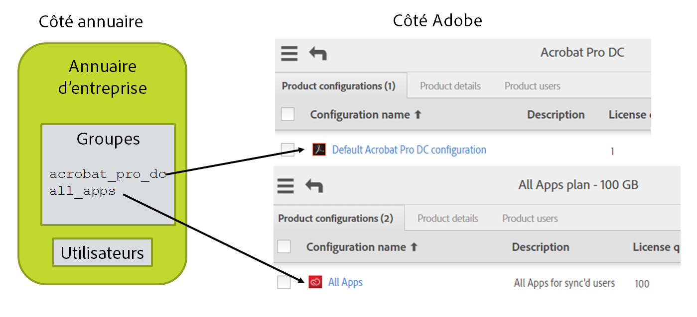

# Description de vos produits, configurations de produits et groupes d’utilisateurs Adobe

[Section précédente](layout_orgs.md) \| [Revenir au sommaire](index.md) \| [Section suivante](decide_deletion_policy.md)

Les configurations de produits (CP) sont des structures semblables à des groupes au sein du système Adobe de gestion des utilisateurs. Chaque CP est associée à un produit que vous avez acheté. Les utilisateurs ajoutés à une CP ont accès au produit correspondant, ainsi qu’une licence pour l’utiliser. (L’utilisateur ne reçoit rien au cours de ce processus sinon une notification facultative lui indiquant que des droits d’accès lui ont été accordés. Les licences sont entièrement gérées par les systèmes back-end.)

Lorsque vous créez une CP (ce qui s’effectue dans Adobe Admin Console), vous pouvez ajouter des options personnalisées afin de déterminer comment les utilisateurs pourront se servir du produit Adobe concerné.

Vous pouvez ajouter des utilisateurs directement aux CP afin de leur accorder l’accès aux produits associés. Il s’agit de la manière la plus courante de gérer les licences de produits Adobe.

Les groupes d’utilisateurs Adobe peuvent servir à regrouper les utilisateurs selon une logique qui correspond à la manière dont ils sont, selon vous, organisés. Le recours aux groupes d’utilisateurs est facultatif. Les groupes d’utilisateurs peuvent ensuite être ajoutés aux CP pour accorder des licences aux utilisateurs. L’ajout d’un utilisateur à un groupe ne lui accorde pas de licence, sauf si le groupe d’utilisateurs est lui-même ajouté à une configuration de produit ; dans ce cas, les membres du groupe sont implicitement membres de la CP.

Les groupes d’utilisateurs et les configurations de produits ne peuvent être gérés que par une seule instance User Sync. S’il existe plusieurs annuaires ou services distribués fournissant des informations utilisateur à Adobe par le biais de l’outil User Sync, chacun doit correspondre à un seul groupe d’utilisateurs ou à une seule configuration de produit. Dans le cas contraire, User Sync ne peut pas faire la distinction entre les utilisateurs qui doivent être retirés et ceux qui ont été ajoutés par une autre instance de l’outil.

Vous pouvez utiliser User Sync pour gérer l’appartenance aux configurations de produits et l’attribution de licences. Cela est toutefois facultatif. Vous pouvez également effectuer cette gestion manuellement sur le portail Adobe Admin Console ou à l’aide d’une autre application.

Avec User Sync, vous pouvez gérer les licences de produits Adobe en plaçant les utilisateurs dans des groupes d’annuaire à l’aide de l’interface du système d’annuaire ou d’autres outils. Ces groupes sont ensuite mappés à des groupes d’utilisateurs ou à des configurations de produits Adobe. Le mappage fait partie du fichier de configuration User Sync. Lorsque l’outil User Sync détecte que des utilisateurs de l’annuaire figurent dans l’un de ces groupes mappés, il les ajoute au groupe d’utilisateurs ou à la configuration de produit Adobe correspondant(e). De même, les utilisateurs présents dans le groupe d’utilisateurs ou la configuration de produit, mais absents du groupe d’annuaire correspondant, sont retirés du groupe d’utilisateurs ou de la configuration de produit.

&#9744; Décidez si vous allez gérer l’attribution des licences à l’aide de l’outil User Sync. Si tel n’est pas le cas, vous pouvez ignorer les étapes restantes. Toutefois, pour que les utilisateurs que vous créez puissent accéder aux produits Adobe, vous devrez les ajouter manuellement aux configurations de produits dans Adobe Admin Console. 

&#9744; Créez les CP dans Adobe Admin Console pour les configurations de produits et les groupes d’utilisateurs que vous allez gérer. Ajoutez le commentaire « Géré par User Sync – ne pas modifier » dans le champ de description de la configuration de produit.

&#9744; Si vous souhaitez utiliser des groupes d’utilisateurs pour gérer l’accès aux produits, vous devez d’abord créer les groupes d’utilisateurs et les configurations de produits. Vous pourrez ensuite gérer l’accès aux produits en ajoutant chaque groupe d’utilisateurs aux configurations de produits appropriées. Ajoutez le commentaire « Géré par User Sync – ne pas modifier » dans le champ de description du groupe d’utilisateurs.

&#9744; Tracez un schéma de vos organisations Adobe, et des produits et CP de chacune. Ajoutez l’annuaire et les groupes d’annuaire au schéma, puis indiquez le mappage. Par exemple :

[Section précédente](layout_orgs.md) \| [Revenir au sommaire](index.md) \| [Section suivante](decide_deletion_policy.md)

