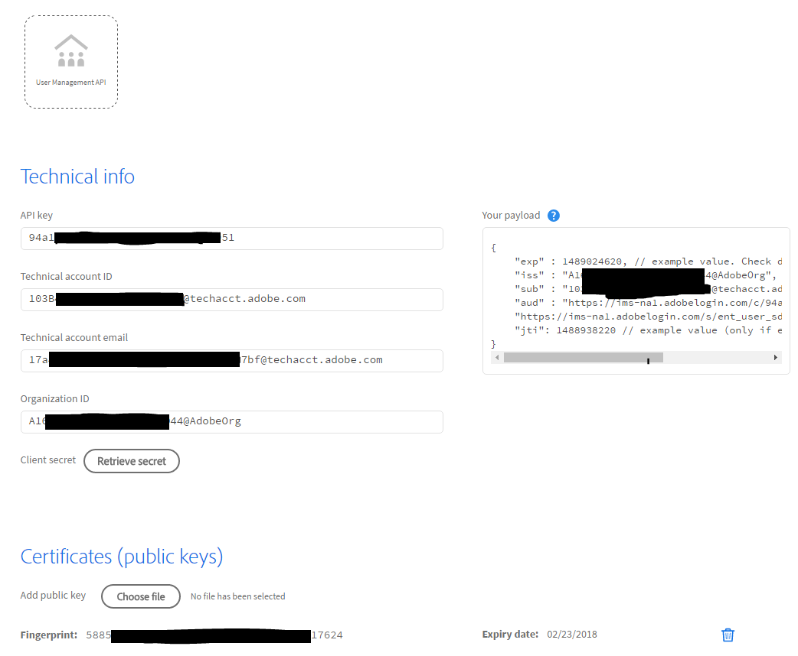

# Configuration d’une intégration Adobe.io

[Section précédente](decide_deletion_policy.md) \| [Revenir au sommaire](index.md) \| [Section suivante](identify_server.md)

Adobe a mis au point un protocole sécurisé pour les applications destiné à intégrer les API Adobe. L’outil User Sync fait partie de ces applications.

Nous allons vous présenter les étapes de configuration. Pour obtenir des informations complètes sur le processus de configuration de l’intégration et connaître les certificats requis, cliquez [ici](https://www.adobe.io/apis/cloudplatform/console/authentication.html)

- Vous devez créer ou obtenir un certificat numérique pour signer les appels d’API initiaux.
  - Le certificat n’étant pas utilisé pour SSL ou à d’autres fins, il n’y a pas de problème de chaîne de confiance ou de navigateur.
  - Vous pouvez créer le certificat vous-même à l’aide d’outils gratuits, en acheter un ou en obtenir un auprès de votre service informatique.
  - Vous avez besoin d’un fichier de certificat de clé publique et d’un fichier de clé privée.
  - Nous vous recommandons de protéger le fichier de clé privée de la même manière qu’un mot de passe racine.
- Une fois configurée, la console Adobe.io affiche toutes les valeurs. Vous allez les copier dans le fichier de configuration User Sync.
- Vous devez également ajouter le fichier de clé privée à la configuration User Sync.

&#9744; Procurez-vous ou créez un certificat de signature numérique. Reportez-vous aux [instructions pour créer un certificat](https://www.adobe.io/apis/cloudplatform/console/authentication/createcert.html).

&#9744; Utilisez la [console Adobe I/O](https://console.adobe.io) pour ajouter le service User Management à une intégration Adobe.io, nouvelle ou existante, pour chaque organisation à laquelle vous devez accéder (il y en a généralement une seule). 

&#9744; Notez les paramètres de configuration associés à votre intégration (comme dans l’exemple ci-dessous). Vous en aurez besoin dans une prochaine étape.

[Section précédente](decide_deletion_policy.md) \| [Revenir au sommaire](index.md) \| [Section suivante](identify_server.md)
