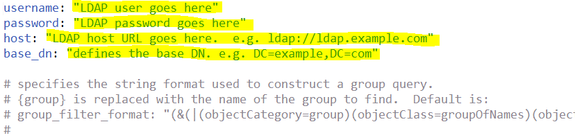
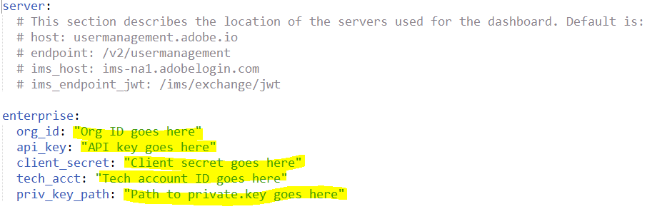
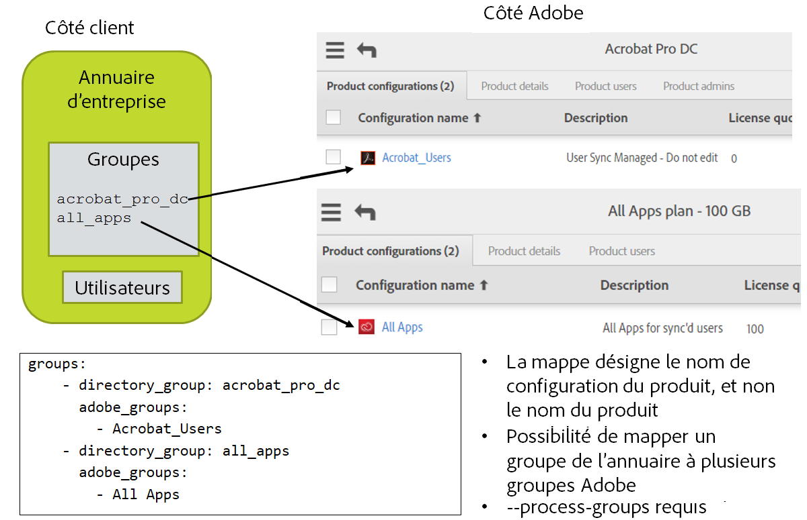

# Paramétrage des fichiers de configuration


[Section précédente](install_sync.md) \| [Revenir au sommaire](index.md) \| [Section suivante](test_run.md)


Nous allons maintenant tout mettre en place. Vous aurez besoin des éléments suivants :

- Valeurs d’accès à l’intégration Adobe.io de la console Adobe.io
- Fichier de clé privée
- Identifiants pour accéder au système d’annuaire et informations sur la façon dont les utilisateurs sont organisés
- Décision quant à la gestion de l’accès aux produits via User Sync
  - Noms des configurations de produits et des groupes d’utilisateurs en fonction de la façon dont vous voulez que les licences soient organisées dans les systèmes Adobe
  - Les configurations de produits et les groupes d’utilisateurs doivent déjà avoir été créés dans Adobe Admin Console.

Veillez à utiliser un éditeur de texte, et non un logiciel de traitement de texte.

Veillez à utiliser des espaces, et non des tabulations dans les fichiers .yml.


## Comment paramétrer les fichiers de configuration

Dans les étapes précédentes, vous avez configuré un répertoire de système de fichiers pour le code Python et les fichiers de configuration User Sync. Trois fichiers de configuration doivent maintenant être paramétrés. Un fichier pour accéder au système d’annuaire, un pour accéder à votre organisation Adobe et un autre pour définir le mappage de groupe et configurer d’autres fonctionnalités de l’outil User Sync. 

### Fichier de configuration d’accès à l’annuaire

Si vous pilotez User Sync à partir d’un fichier, vous pouvez ignorer le paramétrage du fichier connector-ldap.yml et créer à la place un fichier CSV avec votre liste complète d’utilisateurs, comme dans l’exemple de fichier « csv inputs - user and remove lists/users-file.csv ». Ce fichier se trouve dans le téléchargement example-configurations.tar.gz.

&#9744; Modifiez le fichier connector-ldap.yml. Celui-ci contient les informations d’accès au système d’annuaire. Indiquez les valeurs username (nom d’utilisateur), password (mot de passe), host (hôte) et base_dn (nom de domaine de base).

&#9744; Passez en revue le reste du fichier pour voir ce qui peut également être spécifié et qui pourrait s’appliquer à votre installation. Généralement, il n’y a rien d’autre à faire.



Si vous avez besoin d’une requête LDAP différente de celle par défaut pour sélectionner l’ensemble d’utilisateurs souhaité, celle-ci est définie dans ce fichier au niveau du paramètre de configuration all\_users\_filter.


### Identifiants Adobe UMAPI 

&#9744; Modifiez le fichier connector-umapi.yml. Indiquez les informations relatives à l’intégration Adobe.io créée antérieurement. Il s’agit des valeurs org\_id, api\_key, client\_secret et tech\_acct.

&#9744; Placez le fichier de clé privée dans le dossier user_sync_tool. L’élément de fichier de configuration priv\_key\_path est alors défini sur le nom de ce fichier.



### Fichier de configuration User Sync principal 

Modifiez le fichier user-sync-config.yml.

#### Code de pays par défaut

	directory:
	  # (facultatif) Code de pays par défaut à utiliser si l’annuaire n’en fournit pas un pour un utilisateur [il doit s’agir d’un code ISO-3166 à deux lettres ; voir https://en.wikipedia.org/wiki/ISO_3166-1]
	  #
	  # Exemple :
	  # default_country_code: US


&#9744; Si votre annuaire ne répertorie pas un pays pour chaque utilisateur, vous pouvez définir un pays par défaut ici. Supprimez les « # » de la ligne de code de pays par défaut afin qu’elle se présente comme ceci :

	  default_country_code: US

Définissez ensuite le code sur le pays approprié. Ne modifiez pas le niveau de retrait de la ligne.

Un code de pays est **OBLIGATOIRE** pour les Federated ID et recommandé pour les Enterprise ID. S’il n’est pas fourni pour un Enterprise ID, l’utilisateur sera invité à choisir un pays lors de sa première connexion.

### Connecteurs

	  connectors:
	    # Spécifie les configurations pour les différents connecteurs d’annuaire
	    # Le format est nom : valeur, où la valeur peut être :
	    # Un dictionnaire pour la configuration 
	    # Une chaîne pour le fichier contenant la configuration
	    # Une liste contenant un mélange de dictionnaires et de chaînes
	    #
	    # Exemples :   
	    # ldap: example.connector-ldap.yml
	    # ldap: 
	    #   - host: Indiquez_ici_l’URL_de_l’hôte_LDAP
	    #     base_dn: Indiquez_ici_le_nom_de_domaine_de_base
	    #   - connector-ldap-credentials.yml

Vous ne devriez pas avoir besoin d’apporter des modifications ici. La ligne ldap est utilisée si vous donnez un nom différent de celui par défaut au fichier de configuration d’accès à l’annuaire ldap.

#### Mappage de groupe

Si vous ne gérez pas les licences avec l’outil User Sync, vous pouvez ignorer cette section où nous définissons le mappage de groupe.

Vous pouvez provisionner les comptes d’utilisateurs en les ajoutant à un groupe d’annuaire d’entreprise à l’aide des outils LDAP/AD plutôt que du portail Adobe Admin Console. Ensuite, le fichier de configuration définit un mappage entre les groupes d’annuaire et les configurations de produits Adobe. Si un utilisateur est membre d’un groupe d’annuaire, User Sync l’ajoute à la configuration de produit correspondante. Il en va de même pour le retrait.


&#9744; Modifiez la section de mappage de groupe du fichier. Pour chaque groupe d’annuaire D qui doit être mappé à une configuration de produit Adobe ou à un groupe d’utilisateurs P, ajoutez une entrée après « groups: » comme ci-dessous :

	    - directory_group: D
	      adobe_groups: 
	        - P

Voici un exemple plus réaliste :

	  groups:
	    - directory_group: acrobat_pro_dc
	      adobe_groups: 
	        - Default Acrobat_Users
	    - directory_group: all_apps
	      adobe_groups:
	        - All Apps




#### Limites relatives aux non-correspondances d’utilisateurs 

Les limites de suppression empêchent la suppression accidentelle de comptes en cas de configuration incorrecte ou de tout autre problème ayant pour effet que l’outil User Sync n’obtienne pas les bonnes données du système d’annuaire.

&#9744; Si vous pensez que le nombre d’utilisateurs de l’annuaire peut baisser de plus de 200 entre deux exécutions de User Sync, il vous faudra augmenter la valeur `max_adobe_only_users`. Cette entrée du fichier de configuration empêche les suppressions incontrôlées en cas de configuration incorrecte ou d’autres problèmes.

	limits:
	    max_adobe_only_users: 200      # Interrompre les mises à jour si un tel nombre d’utilisateurs disparaît de l’annuaire


#### Protection contre la suppression

Si vous souhaitez piloter la création et le retrait des comptes via User Sync et voulez créer manuellement quelques comptes, vous pourrez avoir besoin de cette fonctionnalité pour empêcher l’outil de supprimer les comptes créés manuellement.

&#9744; Si vous souhaitez utiliser cette fonctionnalité, ajoutez des lignes comme celles ci-dessous au fichier de configuration sous adobe_users. Pour protéger les utilisateurs contre les mises à jour dans Admin Console, créez un groupe d’utilisateurs, puis placez-y les utilisateurs protégés et répertoriez ce groupe comme exclu du traitement par User Sync. Vous pouvez également dresser une liste d’utilisateurs spécifiques et/ou indiquer un motif correspondant à des noms d’utilisateurs spécifiques, de manière à protéger ces utilisateurs. Vous pouvez aussi protéger les utilisateurs en fonction de leur type d’identité. Par exemple, User Sync est souvent utilisé uniquement pour gérer les types d’utilisateurs Federated ID ou Enterprise ID, et vous pouvez exclure du processus les utilisateurs de type Adobe ID. Il vous suffit d’inclure des éléments de configuration pour les exclusions souhaitées.

```YAML
adobe_users:
  exclude_adobe_groups: 
    - administrators   # Nomme un groupe d’utilisateurs ou une configuration de produit Adobe dont les membres ne doivent pas être modifiés ni supprimés par User Sync
    - contractors      # Une liste peut comprendre plusieurs groupes
  exclude_users:
    - ".*@example.com"
    - important_user@gmail.com
  exclude_identity_types:
    - adobeID          # adobeID, enterpriseID et/ou federatedID
```


Dans ce qui précède, les administrateurs, les sous-traitants et les noms d’utilisateurs sont des exemples de valeurs. Vous devez utiliser les noms des groupes d’utilisateurs, des configurations de produits ou des utilisateurs Adobe que vous avez créés.

`exclude_groups` définit la liste des groupes d’utilisateurs, des configurations de produits Adobe ou des deux. Les utilisateurs Adobe qui font partie des groupes répertoriés ne sont ni retirés, ni mis à jour, et leur appartenance au groupe ne peut pas être modifiée.

`exclude_users` donne une liste de motifs. Les utilisateurs Adobe dont les noms d’utilisateurs correspondent à l’un des motifs spécifiés (par défaut non sensible à la casse, sauf si le motif spécifie le contraire) ne sont pas non plus retirés ni mis à jour, et leur appartenance au groupe ne peut pas être modifiée.

`exclude_identity_types` donne une liste de types d’identités. Les utilisateurs Adobe possédant l’un de ces types d’identités ne sont ni retirés, ni mis à jour, et leur appartenance au groupe ne peut pas être modifiée.

Remarques :

- En règle générale, vous n’utiliserez pas les trois options d’exclusion à la fois.

- Les utilisateurs de l’annuaire sont toujours créés dans les systèmes Adobe, même si l’un des paramètres d’exclusion exclurait ensuite ces utilisateurs des mises à jour dans les systèmes Adobe lors des exécutions ultérieures. Autrement dit, ces paramètres s’appliquent uniquement aux utilisateurs Adobe qui existent lorsque l’annuaire Adobe est comparé à l’annuaire du client.

- Les comptes qui auraient été retirés ou mis à jour, mais ne l’ont pas été en raison de cette fonctionnalité, sont répertoriés en tant qu’entrées du journal au niveau « debug ».

- Les comptes fédérés qui ne figurent pas dans l’annuaire, ou y sont désactivés, ne peuvent de toute façon pas se connecter (car la connexion est gérée par le fournisseur d’ID, et l’utilisateur n’y est plus répertorié), même si les comptes existent toujours dans les systèmes Adobe.
- En général, il vaut mieux exclure les identités de type Adobe ID parce qu’elles ne sont généralement pas répertoriées dans l’annuaire d’entreprise.


#### Consignation

User Sync produit des entrées de journal qui sont imprimées dans un format standard et écrites dans un fichier journal. L’ensemble de consignation des paramètres de configuration contrôle l’emplacement et la quantité des informations générées en sortie.

log\_to\_file active/désactive la consignation dans un fichier. 

Les messages peuvent avoir 5 niveaux d’importance différents, et vous pouvez choisir le niveau minimal d’importance à inclure dans le fichier journal ou la sortie standard de la console. Les valeurs par défaut sont de produire le fichier journal et d’inclure les messages de niveau « info » ou plus. Il s’agit du paramètre recommandé.

&#9744; Vérifiez les paramètres des journaux et apportez les modifications souhaitées. Le niveau de consignation recommandé est info (il s’agit de la valeur par défaut).

	logging:
	  # Permet d’indiquer si vous souhaitez générer un fichier journal
	  # 'True' ou 'False'
	  log_to_file: True
	  # Chemin de sortie des journaux
	  file_log_directory: logs
	  # Niveau de consignation dans les fichiers : il peut s’agir de "debug", "info", "warning", "error" ou "critical". 
	  # L’ordre est croissant, ainsi "debug" &lt; "critical".
	  file_log_level: debug
	  # Niveau de consignation dans la console : il peut s’agir de "debug", "info", "warning", "error" ou "critical". 
	  # L’ordre est croissant, ainsi "debug" &lt; "critical". Valeur par défaut :
	  # console_log_level: debug


[Section précédente](install_sync.md) \| [Revenir au sommaire](index.md) \| [Section suivante](test_run.md)
