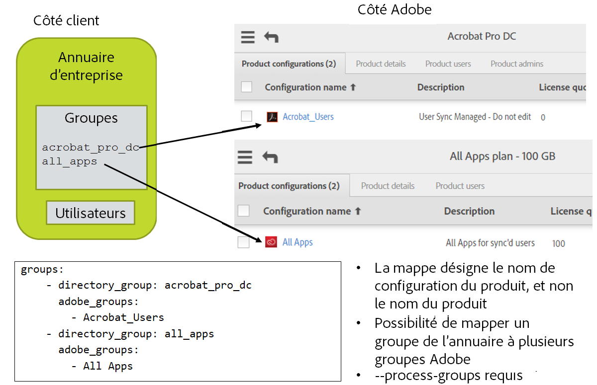

# Configuration avancée

## Dans cette section
{:."no_toc"}

* TOC Placeholder
{:toc}

---

[Section précédente](usage_scenarios.md)  \| [Section suivante](deployment_best_practices.md)

---

User Sync nécessite une configuration supplémentaire pour synchroniser les données des utilisateurs dans des environnements aux structures de données plus complexes.

- Si vous gérez vos utilisateurs disposant d’Adobe ID dans des feuilles de calcul ou dans votre annuaire d’entreprise, vous pouvez configurer l’outil pour qu’il ne les ignore pas.
- Si votre entreprise inclut plusieurs organisations Adobe, vous pouvez configurer l’outil de manière à ajouter des utilisateurs de votre organisation à des groupes définis dans d’autres organisations.
- Lorsque vos données d’utilisateurs Enterprise incluent des mappages et des attributs personnalisés, vous devez configurer l’outil pour qu’il soit en mesure de reconnaître ces personnalisations.
- Si vous souhaitez utiliser des connexions basées sur le nom d’utilisateur (plutôt que sur l’adresse électronique).
- Lorsque vous souhaitez gérer des comptes d’utilisateurs manuellement depuis Adobe Admin Console, en parallèle de l’utilisation de l’outil User Sync.

## Gestion des utilisateurs disposant d’un Adobe ID

Il existe une option de configuration `exclude_identity_types` (dans la section `adobe_users` du fichier de configuration principal) qui est définie par défaut de manière à ignorer les utilisateurs disposant d’un Adobe ID. Si vous voulez que User Sync gère certains utilisateurs de type Adobe ID, vous devez désactiver cette option dans le fichier de configuration en enlevant l’entrée `adobeID` sous `exclude_identity_types`.

Vous voudrez probablement mettre en place une tâche de synchronisation distincte spécifique à ces utilisateurs, éventuellement à l’aide d’entrées au format CSV plutôt que d’utiliser des entrées provenant de votre annuaire d’entreprise. Si vous faites cela, veillez à configurer cette tâche de synchronisation de façon à ce qu’elle ignore les utilisateurs Enterprise ID et Federated ID. À défaut, ceux-ci risquent d’être retirés de l’annuaire !

Le retrait des utilisateurs disposant d’un Adobe ID par le biais de l’outil User Sync peut ne pas produire l’effet escompté :

* Si vous spécifiez que les utilisateurs disposant d’un Adobe ID doivent être retirés de votre organisation, vous devrez leur renvoyer une invitation
(et leur demander de l’accepter à nouveau) si vous voulez les réintégrer.
* Les administrateurs système utilisant souvent les Adobe ID, le retrait des utilisateurs disposant d’un Adobe ID peut donc retirer par inadvertance des administrateurs système (y compris vous-même).

Pour gérer les utilisateurs disposant d’un Adobe ID, il est préférable de les ajouter simplement et de gérer leurs appartenances aux groupes, sans jamais les retirer totalement. En gérant leurs appartenances aux groupes, vous pouvez désactiver leurs droits sans avoir besoin d’une nouvelle invitation si vous souhaitez les réactiver par la suite.

N’oubliez pas que les comptes Adobe ID sont la propriété de l’utilisateur final et ne peuvent pas être supprimés. Si vous appliquez une action de suppression (delete), User Sync la remplace automatiquement par une action de retrait (remove).

Vous pouvez également protéger des utilisateurs Adobe ID spécifiques contre le retrait par User Sync en utilisant les autres éléments de configuration d’exclusion (exclude). Pour en savoir plus, reportez-vous à la section [Protection de comptes spécifiques contre la suppression par User Sync](#protection-de-comptes-spécifiques-contre-la-suppression-par-user-sync).

## Accès aux utilisateurs dans d’autres organisations

Une grande entreprise peut inclure plusieurs organisations Adobe. Prenons l’exemple d’une entreprise, Geometrixx, qui comporte plusieurs services, chacun ayant son propre ID d’organisation et son propre portail Admin Console.

Si une organisation utilise des Enterprise ID ou des Federated ID, elle doit déposer un domaine. Dans une entreprise plus petite, la seule organisation déposerait le domaine **geometrixx.com**. Toutefois, un domaine ne peut être déposé que par une seule organisation. Si plusieurs organisations appartiennent à la même entreprise, elles seront plusieurs à vouloir inclure les utilisateurs qui appartiennent au domaine de l’entreprise.

Dans ce cas, l’administrateur système de chacun de ces services devra déposer ce domaine pour utiliser les identités. Adobe Admin Console interdit à plusieurs services de déposer le même domaine. Cependant, une fois un domaine déposé par un service, d’autres services peuvent demander à y avoir accès. Le premier service à déposer le domaine devient son *propriétaire*. Ce service est chargé d’approuver toute demande d’accès par d’autres services, qui sont ensuite en mesure d’accéder aux utilisateurs du domaine sans configuration spécifique.

Aucune configuration spécifique n’est requise pour accéder aux utilisateurs d’un domaine auquel l’accès vous a été accordé. Cependant, si vous souhaitez ajouter des utilisateurs aux groupes d’utilisateurs ou aux configurations de produits définis dans d’autres organisations, vous devez configurer User Sync de sorte qu’il puisse accéder à ces organisations. L’outil doit être en mesure de trouver les identifiants de connexion de l’organisation qui définit les groupes, ainsi que d’identifier les groupes comme appartenant à une organisation externe.


## Accès aux groupes dans d’autres organisations

Pour configurer l’accès à des groupes dans d’autres organisations, vous devez :

- Inclure des fichiers de configuration de connexion umapi supplémentaires.
- Indiquer à User Sync comment accéder à ces fichiers.
- Identifier les groupes qui sont définis dans une autre organisation.

### 1. Inclusion de fichiers de configuration supplémentaires

Pour chaque organisation supplémentaire à laquelle vous avez besoin d’accéder, vous devez ajouter un fichier de configuration qui fournit les identifiants d’accès à cette organisation. Le fichier présente le même format que le fichier connector-umapi.yml. Chaque organisation supplémentaire sera désignée par un nom court (que vous définissez). Vous pouvez donner le nom que vous souhaitez au fichier de configuration comprenant les identifiants pour accéder à cette organisation. 

Par exemple, imaginons que l’organisation supplémentaire se nomme « department 37 ». Le fichier de configuration correspondant pourrait être nommé ainsi : 

`department37-config.yml`

### 2. Configuration de User Sync pour accéder aux fichiers supplémentaires


La section `adobe-users` du fichier de configuration principal doit inclure des entrées qui font référence à ces fichiers et associer chacun d’eux au nom court de l’organisation. Par exemple :

```YAML
adobe-users:
  connectors:
    umapi:
      - connector-umapi.yml
      - org1: org1-config.yml
      - org2: org2-config.yml
      - d37: department37-config.yml  # d37 est le nom court de l’exemple ci-dessus
```

Si des noms de fichiers non qualifiés sont utilisés, les fichiers de configuration doivent se trouver dans le même dossier que le fichier de configuration principal qui leur fait référence.

Notez qu’ils contiennent des informations sensibles qui doivent être protégées, comme votre propre fichier de configuration de connexion.

### 3. Identification des groupes définis à l’extérieur

Lorsque vous spécifiez vos mappages de groupes, vous pouvez mapper un groupe d’annuaire d’entreprise à un groupe d’utilisateurs ou à une configuration de produits Adobe défini(e) dans une autre organisation.

Pour ce faire, utilisez l’identificateur de l’organisation comme préfixe ajouté au nom du groupe. Joignez-les à l’aide des caractères « :: ». Par exemple :

```YAML
- directory_group: CCE Trustee Group
  adobe_groups:
    - "org1::Default Adobe Enterprise Support Program configuration"
    - "d37::Special Ops Group"
```

## Attributs et mappages personnalisés

Il est possible de définir des mappages personnalisés d’attribut d’annuaire ou d’autres valeurs avec les champs utilisés pour définir et mettre à jour les utilisateurs : prénom, nom, adresse électronique, nom d’utilisateur, pays et appartenance à un groupe. Normalement, les attributs standard de l’annuaire sont utilisés pour obtenir ces valeurs. Vous pouvez définir d’autres attributs à utiliser et indiquer comment les valeurs des champs doivent être calculées.

Pour cela, vous devez configurer User Sync de manière à ce qu’il reconnaisse tout mappage non standard entre vos données utilisateur de l’annuaire d’entreprise et les données utilisateur d’Adobe. Les mappages non standard comprennent :

- Les valeurs de nom d’utilisateur, de groupe, de pays ou d’adresse électronique qui figurent dans l’annuaire ou sont basés sur n’importe quel attribut non standard de l’annuaire.
- Les valeurs de nom d’utilisateur, de groupe, de pays ou d’adresse électronique doivent être calculées à partir des informations de l’annuaire.
- Les groupes d’utilisateurs ou les produits supplémentaires qui doivent être ajoutés ou retirés de la liste pour certains utilisateurs ou l’ensemble d’entre eux.

Votre fichier de configuration doit spécifier tous les attributs personnalisés à récupérer à partir de l’annuaire. En outre, vous devez spécifier tout mappage personnalisé pour ces attributs ainsi que tout calcul ou toute action à réaliser afin de synchroniser les valeurs. L’action personnalisée est définie à l’aide d’un petit bloc de code Python. Des exemples et blocs standard sont disponibles.

La configuration des attributs et des mappages personnalisés figure dans un fichier de configuration distinct. Ce fichier est référencé à partir du fichier de configuration principal dans la section `directory_users` :

```
directory_users:
  extension: extenstions_config.yml  # Référence au fichier contenant les informations sur le mappage personnalisé
```

Le traitement des attributs personnalisés étant effectué pour chaque utilisateur, les personnalisations sont configurées dans la sous-section per_user de la section extensions du fichier de configuration principal de User Sync.

```
extensions:
  - context: per_user
    extended_attributes:
      - my-attribute-1
      - my-attribute-2
    extended_adobe_groups:
      - my-adobe-group-1
      - my-adobe-group-2
    after_mapping_hook: |
        pass # Insérer ici le code Python personnalisé
```

### Ajout d’attributs personnalisés

Par défaut, User Sync capture ces attributs standard pour chaque utilisateur du système d’annuaire de l’entreprise :

* `givenName` - utilisé pour le prénom dans le profil des systèmes Adobe
* `sn` - utilisé pour le nom dans le profil des systèmes Adobe
* `c` - utilisé pour le pays (code de pays à deux lettres) dans les systèmes Adobe
* `mail` - utilisé pour l’adresse électronique des systèmes Adobe
* `user` - utilisé pour le nom d’utilisateur dans les systèmes Adobe uniquement si le Federated ID correspond au nom d’utilisateur

En outre, User Sync capture tout nom d’attribut qui apparaît dans les filtres au sein de la configuration du connecteur LDAP.

Vous pouvez ajouter des attributs à cet ensemble en les spécifiant dans une clé `extended_attributes` dans le fichier de configuration principal, comme indiqué ci-dessus. La valeur de la clé `extended_attributes` est une liste YAML de chaînes, où chaque chaîne indique le nom d’un attribut d’utilisateur à capturer. Par exemple :

```YAML
extensions:
  - context: per-user
    extended_attributes:
    - bc
    - subco
```

Cet exemple indique à User Sync de capturer les attributs `bc` et `subco` pour chaque utilisateur chargé.

Si un ou plusieurs des attributs spécifiés manquent dans les informations d’annuaire relatives à un utilisateur, ces attributs sont ignorés. Les références du code à ces attributs renvoient la valeur Python `None`, ce qui est normal et ne constitue pas une erreur.

### Ajout de mappages personnalisés

Le code de mappage personnalisé est configuré à l’aide d’une section extensions dans le fichier de configuration principal (user sync). Dans « extensions », une section per-user régit le code personnalisé qui est appelé une fois par utilisateur.

Le code spécifié serait exécuté une fois pour chaque utilisateur, une fois que les attributs et les appartenances aux groupes ont été récupérés à partir du système d’annuaire, mais avant que des actions aient été générées pour les systèmes Adobe.

```YAML
extensions:
  - context: per-user
    extended_attributes:
      - bc
      - subco
    extended_adobe_groups:
      - Acrobat_Sunday_Special
      - Group for Test 011 TCP
    after_mapping_hook: |
      bc = source_attributes['bc']
      subco = source_attributes['subco']
      if bc is not None:
          target_attributes['country'] = bc[0:2]
          target_groups.add(bc)
      if subco is not None:
          target_groups.add(subco)
      else:
          target_groups.add('Undefined subco')
```

Dans cet exemple, deux attributs personnalisés, bc et subco, sont récupérés pour chaque utilisateur lu dans l’annuaire. Le code personnalisé traite les données correspondant à chaque utilisateur :

- Le code de pays est tiré des deux premiers caractères de l’attribut bc.

    Cela montre comment utiliser des attributs d’annuaire personnalisés afin de fournir des valeurs pour les champs standard envoyés à Adobe.

- L’utilisateur est ajouté aux groupes provenant des attributs subco et bc (ainsi que de tout groupe mappé dans le mappage de groupes du fichier de configuration).

    Cela montre comment personnaliser la liste des groupes ou des configurations de produits pour synchroniser les utilisateurs dans des groupes supplémentaires.

Si le hook fait référence à des groupes Adobe ou des configurations de produits qui n’apparaissent pas déjà dans la section **groups** du fichier de configuration principal, ils sont répertoriés sous **extended_adobe_groups**. Cette liste étend l’ensemble des groupes Adobe pris en compte. Pour en savoir plus, reportez-vous à la section [Gestion avancée des groupes et des produits](#gestion-avancée-des-groupes-et-des-produits).

### Variables du code de hook

Le code dans `after_mapping_hook` est isolé du reste du programme User Sync à l’exception des variables suivantes.

#### Valeurs d’entrée

Les variables suivantes peuvent être lues dans le code personnalisé. Elles ne doivent pas être écrites, et écrire sur elles est sans effet ; elles existent pour exprimer les données de l’annuaire source concernant l’utilisateur.

* `source_attributes` : dictionnaire par utilisateur des attributs d’utilisateurs récupérés à partir du système d’annuaire. En tant que dictionnaire Python, techniquement, cette valeur est modifiable, mais la modification du code personnalisé n’a aucun effet.

* `source_groups` : ensemble figé de groupes d’annuaire trouvé pour un utilisateur donné lors du balayage des groupes d’annuaire configurés.

#### Valeurs d’entrée/de sortie

Les variables suivantes peuvent être lues et écrites par le code personnalisé. Elles sont accompagnées de données définies par l’attribut par défaut et d’opérations de mappage de groupe de l’utilisateur d’annuaire actif, et peuvent être écrites afin de modifier les actions exécutées sur l’utilisateur Adobe correspondant.

* `target_attributes` : dictionnaire Python par utilisateur dont les clés sont les attributs des systèmes Adobe qui sont à définir. La modification d’une valeur dans ce dictionnaire modifie la valeur écrite dans les systèmes Adobe. Étant donné qu’Adobe prédéfinit un ensemble fixe d’attributs, l’ajout d’une clé à ce dictionnaire n’a aucun effet. Les clés de ce dictionnaire sont :
    * `firstName` - ignoré pour les Adobe ID, utilisé dans les autres cas
    * `lastName` - ignoré pour les Adobe ID, utilisé dans les autres cas
    * `email` - utilisé dans tous les cas
    * `country` - ignoré pour les Adobe ID, utilisé dans les autres cas
    * `username` - ignoré sauf pour les Federated ID
      [configurés avec un identifiant de type nom d’utilisateur](https://helpx.adobe.com/fr/enterprise/help/configure-sso.html)
    * `domain` - ignoré sauf pour les Federated ID [configurés avec un identifiant de type nom d’utilisateur](https://helpx.adobe.com/fr/enterprise/help/configure-sso.html)
* `target_groups` : ensemble Python par utilisateur qui recueille les groupes d’utilisateurs et les configurations de produits des systèmes Adobe auxquels l’utilisateur est ajouté lorsque `process-groups` est défini pour l’exécution de synchronisation. Chaque valeur est un ensemble de noms. Cet ensemble est initialisé en appliquant les mappages de groupes dans le fichier de configuration principal, et les modifications apportées à cet ensemble (ajouts ou retraits) changent l’ensemble de groupes appliqués à l’utilisateur dans les systèmes Adobe.
* `hook_storage` : dictionnaire Python par utilisateur qui est vide la première fois qu’il est transmis au code personnalisé, puis persiste d’un appel à l’autre. Le code personnalisé peut stocker des données privées dans ce dictionnaire. Si vous utilisez des fichiers de script externes, c’est un endroit approprié pour stocker les objets de code créés en compilant ces fichiers.
* `logger` : objet de type `logging.logger` dont la sortie est dirigée vers la console et/ou un fichier journal (en fonction des paramètres de consignation définis).

## Gestion avancée des groupes et des produits

La section **group** du fichier de configuration principal définit un mappage de groupes d’annuaire avec les groupes d’utilisateurs et les configurations de produits Adobe.

- Au niveau de l’annuaire d’entreprise, User Sync sélectionne un ensemble d’utilisateurs dans votre annuaire d’entreprise, d’après la requête LDAP, le paramètre de ligne de commande `users` et le filtre d’utilisateur, puis examine ces utilisateurs afin de voir s’ils figurent dans l’un des groupes d’annuaire mappés. Si tel est le cas, User Sync utilise le mappage de groupes pour déterminer les groupes Adobe auxquels ajouter ces utilisateurs.
- Au niveau des systèmes Adobe, User Sync examine les appartenances des groupes et des configurations de produits mappés. Si un utilisateur de ces groupes ne figure PAS
dans l’ensemble d’utilisateurs d’annuaire sélectionné, User Sync le retire du groupe. Il s’agit généralement du comportement désiré car, par exemple, si un utilisateur figure dans la configuration de produit Adobe Photoshop et qu’il est retiré de l’annuaire d’entreprise, vous vous attendriez également à ce qu’il soit retiré du groupe de sorte qu’il n’obtienne plus de licence.



Ce workflow peut présenter des difficultés si vous souhaitez diviser le processus de synchronisation en plusieurs exécutions afin de réduire le nombre d’utilisateurs de l’annuaire interrogés en même temps. Par exemple, vous pouvez faire une exécution pour les utilisateurs dont les noms commencent par les lettres A à M, et une autre pour les lettres N à Z. Si vous optez pour cette méthode, chaque exécution doit cibler différents groupes d’utilisateurs et configurations de produits Adobe. Dans le cas contraire, l’exécution pour les lettres A à M aurait pour effet de retirer les utilisateurs des groupes mappés qui se trouvent dans l’ensemble N à Z.

Pour définir les paramètres dans ce cas, utilisez Admin Console afin de créer des groupes d’utilisateurs pour chaque sous-ensemble d’utilisateurs (par exemple, **photoshop_A_M** et
**photoshop_N_Z**), et ajoutez chaque groupe d’utilisateurs séparément à la configuration de produit (par exemple,  **photoshop_config**). Dans la configuration User Sync, vous mappez ensuite uniquement les groupes d’utilisateurs, et non les configurations de produits. Chaque tâche de synchronisation cible un groupe d’utilisateurs dans son mappage de groupes. Elle met à jour les appartenances liées au groupe d’utilisateurs, ce qui met à jour indirectement les appartenances dans la configuration de produit.

## Retrait de mappages de groupes

Il existe un risque de confusion lors du retrait d’un groupe mappé. Supposons qu’un groupe d’annuaire `acrobat_users` soit mappé au groupe Adobe `Acrobat` et que vous supprimiez l’entrée car vous n’avez plus besoin de mapper le groupe à `Acrobat`. Il en résulte que tous les utilisateurs restent dans le groupe `Acrobat`, car `Acrobat` n’est plus un groupe mappé et User Sync ne s’y intéresse donc pas. Tous les utilisateurs ne sont pas retirés du groupe `Acrobat`, comme vous auriez pu vous y attendre.

Si vous souhaitez également que les utilisateurs soient retirés du groupe `Acrobat`, vous pouvez le faire manuellement depuis Admin Console, ou vous pouvez laisser (du moins temporairement) l’entrée dans le mappage de groupes au sein du fichier de configuration, mais donner au groupe d’annuaire un nom qui n’existe pas dans l’annuaire, tel que `no_directory_group`. La prochaine exécution de synchronisation détectera que des utilisateurs qui sont dans le groupe Adobe ne figurent pas dans le groupe d’annuaire, et ils seront tous déplacés. Vous pourrez ensuite retirer le mappage entier du fichier de configuration.

## Utilisation d’identifiants de type nom d’utilisateur

Dans Adobe Admin Console, vous pouvez configurer un domaine fédéré pour utiliser des identifiants de connexion basés sur l’adresse électronique ou sur le nom d’utilisateur (c’est-à-dire non basés sur l’adresse électronique). L’identifiant de type nom d’utilisateur peut être utilisé lorsque les adresses électroniques risquent de changer souvent ou dans le cas où votre organisation n’autorise pas l’utilisation des adresses électroniques pour se connecter. Enfin, le choix entre l’identifiant basé sur le nom d’utilisateur ou sur l’adresse électronique dépend de la stratégie d’identité globale de l’entreprise.

Pour configurer User Sync de façon à ce qu’il utilise les identifiants de type nom d’utilisateur, vous devez définir plusieurs éléments de configuration supplémentaires.

Dans le fichier `connector-ldap.yml` :

- Définissez `user_username_format` sur une valeur telle que {attrname}, où attrname nomme l’attribut d’annuaire dont la valeur doit être utilisée comme nom d’utilisateur.
- Définissez `user_domain_format` sur une valeur telle que {attrname} si le nom de domaine provient de l’attribut d’annuaire nommé, ou sur une valeur de chaîne fixe telle que « example.com ».

Lors du traitement de l’annuaire, User Sync renseigne les valeurs de nom d’utilisateur et de domaine à partir de ces champs (ou valeurs).

Les valeurs indiquées pour ces éléments de configuration peuvent être une combinaison de caractères de chaîne et d’un ou plusieurs noms d’attributs entre accolades « {} ». Les caractères fixes sont combinés avec la valeur d’attribut afin de former la chaîne utilisée dans le traitement de l’utilisateur.

Pour les domaines qui utilisent un identifiant de type nom d’utilisateur, l’élément de configuration `user_username_format` ne doit pas produire une adresse électronique ; le caractère « @ » n’est pas autorisé dans les noms d’utilisateurs utilisés comme identifiants.

Si vous utilisez un identifiant de type nom d’utilisateur, vous devez tout de même fournir une adresse électronique unique pour chaque utilisateur, et celle-ci doit être dans un domaine que l’organisation a déposé et dont elle est propriétaire. User Sync n’ajoute pas d’utilisateur à l’organisation Adobe sans adresse électronique.

## Protection de comptes spécifiques contre la suppression par User Sync

Si vous pilotez la création et le retrait des comptes via User Sync et voulez créer manuellement quelques comptes, vous pourrez avoir besoin de cette fonctionnalité pour empêcher l’outil de supprimer les comptes créés manuellement.

Vous pouvez inclure les entrées suivantes dans la section `adobe_users` du fichier de configuration principal :

```YAML
adobe_users:
  exclude_adobe_groups: 
      - special_users       # Les comptes Adobe figurant dans le groupe nommé ne seront pas retirés ni modifiés par User Sync.
  exclude_users:
      - ".*@example.com"    # Les utilisateurs dont le nom correspond au motif seront conservés par User Sync 
      - another@example.com # Peut comprendre plusieurs motifs
  exclude_identity_types:
      - adobeID             # Indique à User Sync de ne pas retirer les comptes Adobe ID
      - enterpriseID
      - federatedID         # Impossible d’avoir toutes ces entrées en même temps, car cela reviendrait à exclure tout le monde  
```

Ces éléments de configuration sont facultatifs. Ils identifient des comptes individuels ou des groupes de comptes qui sont protégés contre la suppression par User Sync. Ces comptes peuvent toujours être ajoutés aux groupes d’utilisateurs ou aux configurations de produits, ou retirés de ceux-ci, en fonction des entrées de mappage de groupe et de l’option de ligne de commande `--process-groups`. 

Si vous souhaitez empêcher User Sync de retirer ces comptes des groupes, placez-les uniquement dans des groupes qui ne sont pas contrôlés par User Sync, c’est-à-dire des groupes qui ne sont pas nommés au niveau du mappage de groupes dans le fichier de configuration.

- `exclude_adobe_groups` : les valeurs de cet élément de configuration constituent une liste de chaînes qui nomme les groupes d’utilisateurs ou les configurations de produits Adobe. Tout utilisateur figurant dans l’un de ces groupes est préservé et ne sera jamais supprimé en tant qu’utilisateur Adobe uniquement.
- `exclude_users` : les valeurs de cet élément de configuration constituent une liste de chaînes qui sont des motifs auxquels les noms d’utilisateurs Adobe peuvent correspondre. Tout utilisateur correspondant aux motifs est préservé et ne sera jamais supprimé en tant qu’utilisateur Adobe uniquement.
- `exclude_identity_types` : les valeurs de cet élément de configuration constituent une liste de chaînes qui peut être « adobeID », « enterpriseID » ou « federatedID ». Cela permet de préserver tout compte du ou des types répertoriés et de s’assurer qu’il ne sera jamais supprimé en tant qu’utilisateur Adobe uniquement.


## Utilisation de groupes d’annuaire imbriqués dans Active Directory

Remarque : avant la version 2.2, les groupes imbriqués n’étaient pas pris en charge par User Sync.

À partir de la version 2.2, User Sync peut être configuré pour reconnaître tous les utilisateurs dans des groupes d’annuaires imbriqués, et l’exemple de fichiers de configuration décrit comment procéder. Plus précisément, dans le fichier de configuration `connector-ldap.yml`, définissez le filtre `group_member_filter` de la manière suivante :

    group_member_filter_format: "(memberOf:1.2.840.113556.1.4.1941:={group_dn})"

Cela trouve les membres de groupe qui sont soit directement dans un groupe nommé, soit indirectement dans le groupe.

Votre structure de groupes imbriqués peut se présenter comme ceci :

    All_Divisions
      Blue_Division
             User1@example.com
             User2@example.com
      Green_Division
             User3@example.com
             User4@example.com

Vous pouvez mapper All_Divisions sur une configuration de produit ou un groupe d’utilisateurs Adobe dans la section `groups:` du fichier de configuration principal, et définir group_member_filter comme illustré ci-dessus. L’effet de ceci est de traiter tous les utilisateurs contenus directement dans All_Divisions ou dans tout groupe contenu directement ou indirectement dans All_Divisions en tant que membre du groupe d’annuaires All_Divisions.

## Utilisation de techniques push pour piloter User Sync

À partir de User Sync version 2.2, il est possible de piloter des notifications push directement vers le système de gestion des utilisateurs d’Adobe sans avoir à lire toutes les informations depuis Adobe et votre annuaire d’entreprise. L’utilisation de notifications push a l’avantage de minimiser le temps de traitement et le trafic de communication, mais l’inconvénient de ne pas se corriger automatiquement pour les modifications effectuées d’une autre manière ou en cas d’erreurs. Une gestion plus minutieuse des modifications à apporter est également nécessaire.

Vous devriez envisager d’utiliser une stratégie push si :

- Vous avez un très grand nombre d’utilisateurs Adobe.
- Vous effectuez quelques ajouts/modifications/suppressions par rapport au nombre total d’utilisateurs.
- Vous avez un processus ou des outils qui peuvent identifier les utilisateurs qui ont été modifiés (ajoutés, supprimés, modifications d’attribut ou changements de groupe) de manière automatisée.
- Vous avez un processus qui supprime tout d’abord les droits de produits des utilisateurs sortants, puis (après une période d’attente) supprime complètement leurs comptes.

La stratégie push évite tous les frais généraux de lecture d’un grand nombre d’utilisateurs de chaque côté, et vous ne pouvez le faire que si vous pouvez isoler les utilisateurs spécifiques qui doivent être mis à jour (par exemple, en les plaçant dans un groupe spécial).

Pour utiliser la notification push, vous devez pouvoir rassembler des mises à jour à effectuer inconditionnellement dans un groupe d’annuaires ou de fichiers distinct. Les suppressions d’utilisateurs doivent également être séparées des ajouts et des mises à jour d’utilisateurs. Les mises à jour et suppressions sont ensuite exécutées dans des appels distincts de l’outil User Sync.

De nombreuses approches sont possibles en utilisant des techniques push avec l’outil User Sync. Les sections suivantes décrivent une approche recommandée. Supposons que vous avez acheté deux produits Adobe à gérer à l’aide de l’outil User Sync : Creative Cloud et Acrobat Pro. Pour accorder l’accès, vous avez créé deux configurations de produit nommées Creative_Cloud et Acrobat_Pro, et deux groupes d’annuaires nommés cc_users et acrobat_users.
La carte dans le fichier de configuration de l’outil User Sync aurait l’aspect suivant :

    groups:
      - directory_group: acrobat_users
        adobe_groups:
          - "Acrobat_Pro"
      - directory_group: cc_users
        adobe_groups:
          - "Creative_Cloud"


### Utilisation d’un groupe spécial d’annuaires pour piloter l’instruction push de l’outil User Sync

Un groupe d’annuaires supplémentaire est créé pour collecter les utilisateurs à mettre à jour. Par exemple, utilisez un groupe d’annuaires `updated_adobe_users` pour les utilisateurs nouveaux ou mis à jour (ceux dont l’abonnement au groupe a été modifié). La suppression d’utilisateurs des deux groupes mappés révoque tout accès au produit et libère les licences détenues par les utilisateurs.

La ligne de commande à utiliser pour traiter les ajouts et mises à jour est :

    user-sync –t --strategy push --process-groups --users group updated_adobe_users

Notez l’instruction `--strategy push` sur la ligne de commande : elle provoque le fait que l’outil User Sync NE TENTE PAS de lire en premier l’annuaire côté Adobe et, au lieu de cela, d’envoyer simplement les mises à jour à Adobe.

Notez également le `-t` sur la ligne de commande pour l’exécution en « mode test ». Si les actions semblent être celles prévues, supprimez le -t pour que l’outil User Sync apporte réellement les modifications.

Lorsque `--strategy push` est spécifié, les utilisateurs sont envoyés vers Adobe avec tous leurs groupes mappés *ajoutés* et tous les groupes mappés qui ne sont pas censés l’être dans *supprimés*. De cette façon, le déplacement d’un utilisateur d’un groupe d’annuaires vers un autre, lorsqu’ils disposent de mappages différents, entraînera le basculement de cet utilisateur sur le côté Adobe à la prochaine action push.

Cette approche ne supprime pas ou ne retire pas de comptes, mais révoque l’accès à l’ensemble des produits et licences gratuites. Pour supprimer des comptes, une approche différente est nécessaire, telle que décrite dans la section suivante.

Le processus de prise en charge de cette approche consiste en les étapes suivantes :

- Chaque fois que vous ajoutez un nouvel utilisateur ou que vous modifiez des groupes d’utilisateurs dans l’annuaire (y compris le retrait de tous les groupes, ce qui désactive essentiellement tous les droits sur le produit), vous ajoutez également cet utilisateur au groupe updated_adobe_users.
- Une fois par jour (ou à une fréquence que vous choisissez), vous exécutez un travail de synchronisation avec les paramètres indiqués ci-dessus.
- Ce travail entraîne la création de tous les utilisateurs mis à jour, si nécessaire, et la mise à jour de leurs groupes mappés du côté Adobe.
- Une fois le travail exécuté, vous supprimez les utilisateurs du groupe updated_adobe_users (parce que leurs changements ont été envoyés).

À tout moment, vous pouvez également exécuter un travail User Sync en mode normal (sans envoi) pour obtenir la fonctionnalité complète de l’outil User Sync. Cela détectera toute modification qui pourrait avoir été omise, corrigera les modifications apportées sans l’utilisation de l’outil User Sync et/ou réalisera des suppressions de compte réelles. La ligne de commande aurait l’aspect suivant :

    user-sync --process-groups --users mapped --adobe-only-user-action remove


### Utilisation d’un fichier pour piloter l’instruction push de l’outil User Sync

Vous pouvez utiliser un fichier comme entrée de l’outil User Sync. Dans ce cas, l’annuaire lui-même n’est pas accessible par User Sync. Vous pouvez créer les fichiers (l’un pour les ajouts et mises à jour et l’autre pour les suppressions) manuellement ou à l’aide d’un script qui obtient des informations d’une autre source.

Créez un fichier users-file.csv à partir des informations sur les utilisateurs à ajouter ou mettre à jour. Un exemple du fichier est :

    firstname,lastname,email,country,groups,type,username,domain
    Jane 1,Doe,jdoe1+1@example.com,US,acrobat_users
    Jane 2,Doe,jdoe2+2@example.com,US,"cc_users,acrobat_users"

La ligne de commande pour envoyer les mises à jour à partir du fichier est :

    user-sync –t --strategy push --process-groups --users file users-file.csv

Lorsque vous êtes prêt à valider les actions, exécutez la commande sans l’argument `-t`.

Pour supprimer des utilisateurs, un fichier distinct est créé avec un format différent. Un exemple de contenu peut être :

    type,username,domain
    adobeID,jimbo@gmail.com,
    enterpriseID,jsmith1@ent-domain-example.com,
    federatedID,jsmith2,user-login-fed-domain.com
    federatedID,jsmith3@email-login-fed-domain.com,

Chaque entrée doit inclure le type d’identité, le nom d’utilisateur ou son e-mail et, pour un type Federated ID qui est défini pour une connexion via nom d’utilisateur, le domaine.

La ligne de commande pour traiter les suppressions basées sur un fichier comme celui-ci (par exemple, remove-list.csv) est :

    user-sync -t --adobe-only-user-list remove-list.csv --adobe-only-user-action remove

L’action remove peut être remove-adobe-groups ou delete pour conserver le compte dans l’organisation ou pour le supprimer, respectivement. Notez également l’argument `-t` pour le mode test.

Le processus de prise en charge de cette approche consiste en les étapes suivantes :

- Chaque fois que vous ajoutez un nouvel utilisateur ou que vous modifiez les groupes d’un utilisateur dans l’annuaire (y compris la suppression de tous les groupes, ce qui désactive essentiellement tous les droits sur le produit), vous ajoutez également une entrée au fichier users-file.csv qui comprend les groupes dans lesquels devrait être l’utilisateur. Il peut s’agir d’un nombre supérieur ou inférieur de groupes dans lesquels il se trouve actuellement.
- Chaque fois qu’un utilisateur doit être supprimé, ajoutez une entrée au fichier remove-list.csv.
- Une fois par jour (ou à une fréquence que vous choisissez), vous exécutez les deux travaux de synchronisation avec les paramètres indiqués ci-dessus (l’un pour les ajouts et mises à jour et l’autre pour les suppressions).
- Ces travaux permettent à tous les utilisateurs mis à jour d’avoir leurs groupes mappés mis à jour du côté Adobe, et les utilisateurs supprimés d’être supprimés du côté Adobe.
- Une fois le travail exécuté, effacez les fichiers (car les changements ont été envoyés) afin de préparer le système en vue du prochain lot.


---

[Section précédente](usage_scenarios.md)  \| [Section suivante](deployment_best_practices.md)

