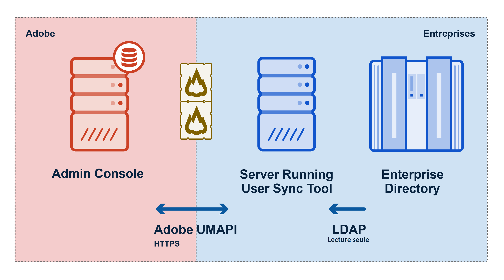

Version 2.1.1, publiée le 09/06/2017

Ce document comporte toutes les informations dont vous avez besoin pour être opérationnel et autonome sur User Sync. Il suppose une certaine connaissance de l’utilisation des outils de ligne de commande sur votre système d’exploitation, ainsi qu’une compréhension générale du fonctionnement des systèmes d’annuaire d’entreprise.

# Introduction

## Dans cette section
{:."no_toc"}

* TOC Placeholder
{:toc}

---

[Section suivante](setup_and_installation.md)

---

User Sync est un outil de ligne de commande qui transfère les informations relatives aux utilisateurs et aux groupes du système d’annuaire de votre entreprise compatible LDAP (tel qu’Active Directory) vers le système Adobe de gestion des utilisateurs.

Chaque fois que vous exécutez User Sync, il recherche les différences entre les données utilisateur dans les deux systèmes, puis met à jour l’annuaire Adobe afin que ses informations correspondent à celles de votre annuaire.

## Conditions requises

Vous devez exécuter User Sync sur la ligne de commande ou à partir d’un script, depuis un serveur géré par votre entreprise et sur lequel est installé Python 2.7.9 ou une version plus récente. Le serveur doit disposer d’une connexion Internet et être en mesure d’accéder au système Adobe de gestion des utilisateurs ainsi qu’à votre propre système d’annuaire d’entreprise.

L’outil User Sync est un client de l’API User Management (UMAPI). Pour pouvoir l’utiliser, vous devez tout d’abord l’enregistrer en tant que client API dans la [console Adobe I/O](https://www.adobe.io/console/), puis installer et configurer l’outil, comme décrit ci-après.

Le fonctionnement de l’outil est contrôlé par des fichiers de configuration locaux et des paramètres d’appel de commande qui prennent en charge une multitude de configurations. Vous pouvez contrôler, par exemple, les utilisateurs qui doivent être synchronisés, comment les groupes de l’annuaire doivent être mappés aux groupes et aux configurations de produits Adobe, ainsi que diverses autres options.

L’outil suppose que votre entreprise a acheté des licences de produits Adobe. Vous devez utiliser le portail [Adobe Admin Console](https://adminconsole.adobe.com/enterprise/) pour définir les configurations de produits et les groupes d’utilisateurs. L’appartenance à ces groupes permet de contrôler quels utilisateurs de votre organisation ont accès aux différents produits.

## Présentation du fonctionnement

User Sync communique avec votre annuaire d’entreprise via des protocoles LDAP. Il communique avec le portail Adobe Admin Console par le biais de l’API Adobe User Management (UMAPI) afin de mettre à jour les données de comptes d’utilisateurs de votre organisation. La figure suivante illustre le flux de données entre les systèmes.

Chaque fois que vous exécutez l’outil :

- User Sync demande au système d’annuaire d’entreprise les enregistrements des employés via LDAP.
- User Sync demande à Adobe Admin Console les utilisateurs actuels et les configurations de produits associées par le biais de l’API User Management.
- User Sync détermine quels utilisateurs doivent être créés, retirés ou mis à jour, et de quelles appartenances à des groupes d’utilisateurs et des configurations de produits ils doivent disposer, en fonction des règles que vous avez définies dans les fichiers de configuration de l’outil.
- User Sync effectue les modifications requises dans le portail Adobe Admin Console par le biais de l’API User Management.

## Modèles d’utilisation

User Sync peut s’intégrer à votre modèle économique de diverses manières, pour vous aider à automatiser le processus de suivi et de contrôle des employés et associés qui ont accès à vos produits Adobe.

En règle générale, une entreprise exécute l’outil en tant que tâche planifiée, afin d’actualiser régulièrement les informations utilisateur et les appartenances aux groupes dans le système Adobe de gestion des utilisateurs, en fonction des informations actuelles de son annuaire d’entreprise LDAP.

L’outil offre également des options pour d’autres workflows. Vous pouvez choisir de mettre à jour uniquement les informations utilisateur, par exemple, et de gérer les appartenances aux groupes pour l’accès aux produits directement dans Adobe Admin Console. Vous pouvez décider de mettre à jour tous les utilisateurs, ou uniquement des sous-ensembles spécifiques d’utilisateurs. En outre, vous pouvez séparer les tâches d’ajout et de mise à jour des informations de la tâche de retrait des utilisateurs ou des appartenances. Il existe plusieurs options pour gérer la tâche de retrait.

Pour plus d’informations sur les modèles d’utilisation et la façon de les appliquer, reportez-vous à la section [Scénarios d’utilisation](usage_scenarios.md#scénarios-d-utilisation) ci-après.

---

[Section suivante](setup_and_installation.md)
