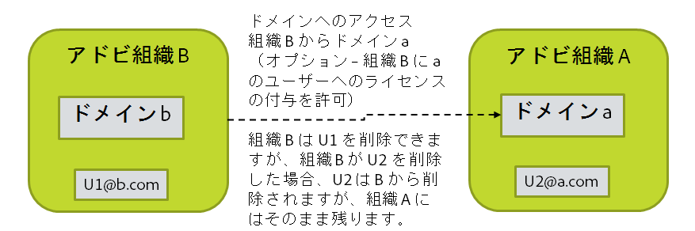

# アカウントの削除の処理方法の決定

[前の節](layout_products.md) \| [目次に戻る](index.md) \|  [次の節](setup_adobeio.md)

アカウントが無効になったり、ディレクトリから削除した時に、対応するAdobe アカウントを取り除きたい場合があります。しかし、Adobe アカウントを取り除くことで必要なアセットや設定が削除される可能性があります。また、ユーザー組織に存在する Adobe ID アカウントは、エンドユーザーに属するアカウントになるため削除できません。ただし、Adobe ID ユーザーに付与したライセンスについては、そのユーザーを組織から削除すると回復できます。

User Sync を使用して Adobe アカウントの削除を処理するために利用可能な選択肢：

  - 何もしません。アカウントのクリーンアップを手動で処理する必要があります。

  - 削除するアカウントのリストを生成しますが、アクションは今すぐ実行しません。リストを編集し、後で User Sync を使用してアカウントの削除を実行します。

  - ユーザー組織によってアカウントに付与されたすべてのライセンスを復元しますが、アカウントはアクティブなままにします。（remove-adobe-groups）

  - すべてのライセンスを復元し、ユーザー組織から除去しますが、アカウントは引き続き存在します。（remove）

  - すべてのライセンスを復元し、アカウントを削除します。（delete）

アカウントの削除について知っておくべきこと：

  - Adobe アカウントを除去すると、後で必要になるアセットや設定などが削除されることがあります。
 
  - ユーザー組織が所有するドメイン内のアカウントのみ「削除」可能です。
  - ユーザー組織内のユーザーが、他の組織が所有するドメイン内にいる場合があります。この状況は、別の組織が所有する別のドメインへのアクセスを要求し、そのドメインからユーザー組織にユーザーを追加したり、所有するライセンスをそれらのユーザーに付与したりすることが許可された場合に発生します。
    - このようなユーザーに付与したライセンスは復元することができます。
    - それらのユーザーをユーザー組織から除去することはできますが、そのアカウントは別の組織が所有するので削除できません。
    - そのようなアカウントを削除しようとすると、ユーザー組織からユーザーを除去する場合と同じ効果があります。

&#9744; Adobe 側のユーザーがディレクトリから除去される場合に、そのユーザーの削除に使用するポリシーとプロセスを決定します。この決定により、後の手順で User Sync を起動する方法が左右されます。

ログインとアクセスは Adobe ではなく企業が実行しているアイデンティティプロバイダーによって制御されるので、Federated ID ユーザーはディレクトリから除去されるとログインできなくなります。Enterprise ID ユーザーは、どの製品のライセンスも付与されていない場合でも、アカウントが実際に削除されない限り引き続きログインできます。Adobe ID ユーザーは、アカウントを所有しているので常にログインできます。ユーザー組織から除去された場合は、付与されたライセンスを持たなくなります。

[前の節](layout_products.md) \| [目次に戻る](index.md) \|  [次の節](setup_adobeio.md)

