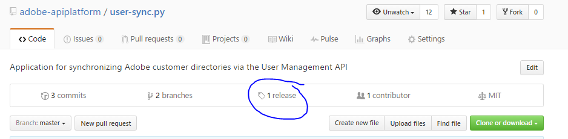

# User Sync のインストール

[前の節](identify_server.md) \| [目次に戻る](index.md) \| [次の節](setup_config_files.md)

User Sync が実行されるサーバーにアクセスしたら、User Sync をインストールして操作するディレクトリを選択します。

Windows では、Python をインストールする必要があります。この記事の執筆時点では、バージョン 2.7.13 をお勧めします。Windows と Python は 64 ビットバージョンにする必要があります。

Windows では、環境変数 PEX_ROOT を C:\user_sync\.pex に設定することが必要な可能性も非常に高くなります。これは Windows のパス名の長さ制限を回避するために必要です。

最初の手順：

&#9744; 同期をインストールして実行するためのユーザーおよびファイルディレクトリを設定します。例えば、フォルダー /home/user_sync/user_sync_tool とユーザー user_sync を作成します。Windowsでは、C:\Users\user_sync\user_sync_tool のようになります。

&#9744; Windows のみ：環境変数 **PEX\_ROOT** を **C:\user_sync\.pex** に設定します。

&#9744; Windowsのみ：python 2.7.13（または 2.7 シリーズではそれ以降）、64 ビットをインストールします。

次のいくつかの節で、インストールプロセスを示します。

最新のリリースを入手するには：ここから開始します：
[https://github.com/adobe-apiplatform/user-sync.py](https://github.com/adobe-apiplatform/user-sync.py "https://github.com/adobe-apiplatform/user-sync.py")

「release」を選択します。

&#9744; example-configurations.tar.gz、User Sync ガイドおよびプラットフォーム、osx、ubuntu、Windows または centos 用のビルドをダウンロードします。

&#9744; アーカイブから user-sync（または user-sync.pex）ファイルを抽出し、使用している OS 用のファイルをフォルダーに配置します。この例では、これは /home/user_sync/user_sync_tool/user-sync または C:\Users\user_sync\user_sync_tool\user-sync.pex になります。

&#9744; example-configurations.tar.gz ファイルには、ディレクトリ **config files - basic** があります。このフォルダーから最初の 3 ファイルを抽出し、user_sync_tool フォルダーに配置します。

&#9744; 次に、名前の先頭の「1」、「2」、「3」を削除して、3 つの構成例ファイルの名前を変更します。これらのファイルを編集して、実際の User Sync 構成ファイルを作成します。

[前の節](identify_server.md) \| [目次に戻る](index.md) \| [次の節](setup_config_files.md)
